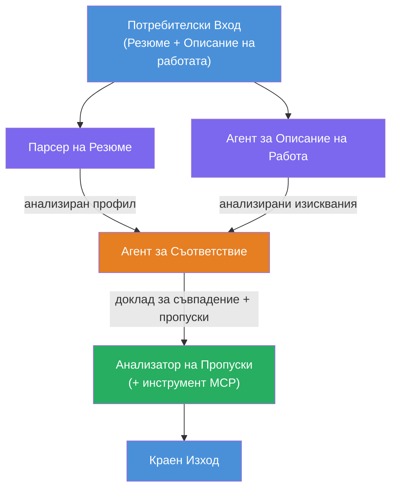
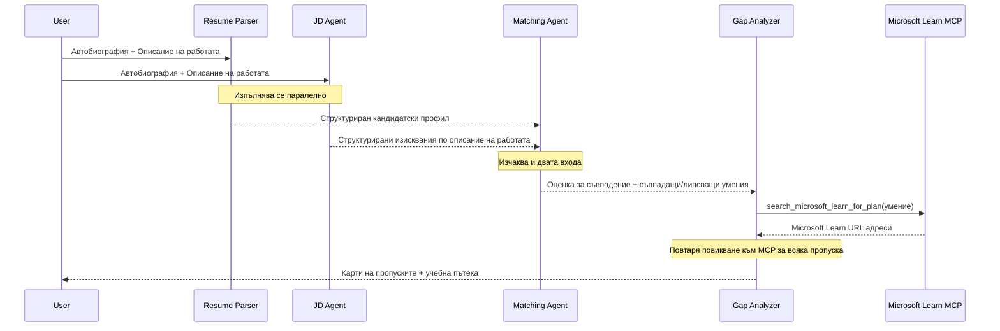
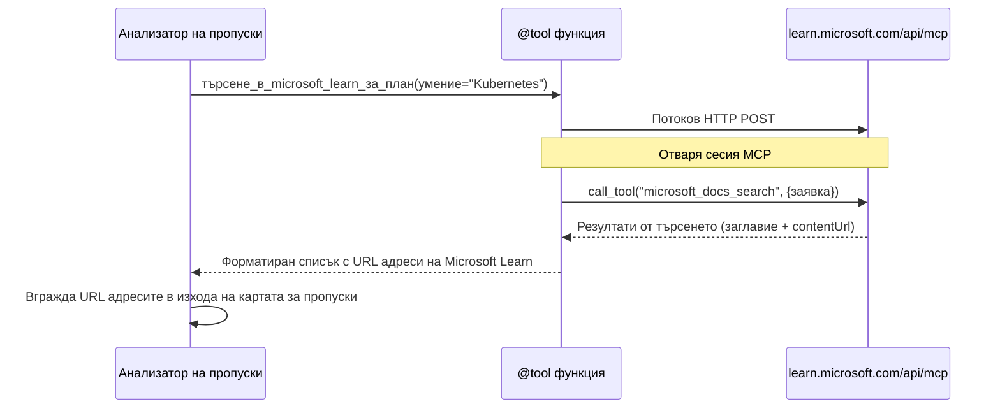

# Модул 1 - Разбиране на мултиагентната архитектура

В този модул ще се запознаете с архитектурата на Оценител за съвместимост на автобиография → работа, преди да напишете какъвто и да е код. Разбирането на графа на оркестрация, ролите на агентите и потока на данни е критично за отстраняване на проблеми и разширяване на [мултиагентни работни процеси](https://learn.microsoft.com/azure/architecture/ai-ml/idea/multiple-agent-workflow-automation).

---

## Проблемът, който се решава

Съвместяването на автобиография с описание на работна позиция включва множество различни умения:

1. **Парсиране** – Извличане на структурирани данни от неструктуриран текст (автобиография)
2. **Анализ** – Извличане на изискванията от описание на работна позиция
3. **Сравнение** – Оценка на съвместимостта между двете
4. **Планиране** – Изграждане на учебна пътна карта за покриване на пропуските

Един агент, който изпълнява четирите задачи наведнъж в един прозорец, често произвежда:
- Непълно извличане (бърза през парсирането, за да стигне до оценката)
- Повърхностно оценяване (без разпадане, базирано на доказателства)
- Общи пътни карти (неперсонализирани спрямо конкретните пропуски)

Чрез разделяне на **четири специализирани агенти**, всеки се фокусира върху своята задача с посветени инструкции, което води до по-високо качество на резултатите на всяка стъпка.

---

## Четирите агенти

Всеки агент е пълен [Microsoft Foundry](https://learn.microsoft.com/azure/foundry/agents/concepts/hosted-agents) агент, създаден чрез `AzureAIAgentClient.as_agent()`. Те споделят една и съща моделна инсталация, но имат различни инструкции и (по избор) различни инструменти.

| # | Име на агента | Роля | Вход | Изход |
|---|---------------|------|-------|--------|
| 1 | **ResumeParser** | Извлича структурирания профил от текста на автобиографията | Суров текст на автобиографията (от потребителя) | Профил на кандидата, Технически умения, Меки умения, Сертификати, Опит в областта, Постижения |
| 2 | **JobDescriptionAgent** | Извлича структурирани изисквания от описание на работната позиция | Суров текст на описание на работна позиция (от потребителя, препратен чрез ResumeParser) | Обзор на ролята, Задължителни умения, Предпочитани умения, Опит, Сертификати, Образование, Отговорности |
| 3 | **MatchingAgent** | Изчислява оценка за съвместимост, базирана на доказателства | Изходи от ResumeParser + JobDescriptionAgent | Оценка за съвместимост (0-100 с разбивка), Съвпадащи умения, Липсващи умения, Пропуски |
| 4 | **GapAnalyzer** | Създава персонализирана учебна пътна карта | Изход от MatchingAgent | Карти с пропуски (по умение), Подредба на ученето, График, Ресурси от Microsoft Learn |

---

## Граф на оркестрацията

Работният процес използва **паралелен разклонител** със следваща **последователна агрегация**:


> **Легенда:** Лилаво = паралелни агенти, Оранжево = точка на агрегация, Зелено = краен агент с инструменти

### Как тече информацията


1. **Потребителят изпраща** съобщение, съдържащо автобиография и описание на работа.
2. **ResumeParser** получава целия вход от потребителя и извлича структуриран профил на кандидата.
3. **JobDescriptionAgent** получава входа паралелно и извлича структурирани изисквания.
4. **MatchingAgent** получава изходи от **и ResumeParser, и JobDescriptionAgent** (фреймуъркът чака и двата да приключат преди да стартира MatchingAgent).
5. **GapAnalyzer** получава изхода на MatchingAgent и извиква **инструмента Microsoft Learn MCP**, за да намери реални учебни ресурси за всеки пропуск.
6. **Крайният изход** е отговорът на GapAnalyzer, който включва оценката за съвместимост, картите с пропуски и пълна учебна пътна карта.

### Защо паралелният разклонител е важен

ResumeParser и JobDescriptionAgent се изпълняват **паралелно**, тъй като нито един от тях не зависи от другия. Това:
- Намалява общата латентност (двата работят едновременно, а не последователно)
- Е естествено разделяне (парсиране на автобиография и парсиране на JD са независими задачи)
- Демонстрира често срещан мултиагентен модел: **разклонител → агрегиране → действие**

---

## WorkflowBuilder в кода

Ето как горепосоченият граф съответства на извиквания API на [`WorkflowBuilder`](https://learn.microsoft.com/agent-framework/workflows/agents-in-workflows) в `main.py`:

```python
from agent_framework import WorkflowBuilder

workflow = (
    WorkflowBuilder(
        name="ResumeJobFitEvaluator",
        start_executor=resume_parser,       # Първият агент, който получава потребителски вход
        output_executors=[gap_analyzer],     # Финалният агент, чиито резултати се връщат
    )
    .add_edge(resume_parser, jd_agent)      # ResumeParser → Агент за описание на работа
    .add_edge(resume_parser, matching_agent) # ResumeParser → Агент за съвпадения
    .add_edge(jd_agent, matching_agent)      # Агент за описание на работа → Агент за съвпадения
    .add_edge(matching_agent, gap_analyzer)  # Агент за съвпадения → Анализатор на пропуски
    .build()
)
```

**Разбиране на ръбовете:**

| Ръб | Какво означава |
|------|--------------|
| `resume_parser → jd_agent` | JD Agent получава изход от ResumeParser |
| `resume_parser → matching_agent` | MatchingAgent получава изход от ResumeParser |
| `jd_agent → matching_agent` | MatchingAgent също получава изход от JD Agent (чака и двата) |
| `matching_agent → gap_analyzer` | GapAnalyzer получава изход от MatchingAgent |

Тъй като `matching_agent` има **два входящи ръба** (`resume_parser` и `jd_agent`), фреймуъркът автоматично чака да приключат и двата преди да стартира Matching Agent.

---

## MCP инструментът

Агентът GapAnalyzer има един инструмент: `search_microsoft_learn_for_plan`. Това е **[MCP инструмент](https://learn.microsoft.com/agent-framework/agents/tools/hosted-mcp-tools)**, който извиква Microsoft Learn API, за да извлече курирани учебни ресурси.

### Как работи

```python
@tool
async def search_microsoft_learn_for_plan(
    skill: str, role: str = "", max_results: int = 5
) -> str:
    """Search Microsoft Learn MCP and return curated official links."""
    # Свързва се с https://learn.microsoft.com/api/mcp чрез Streamable HTTP
    # Извиква инструмента 'microsoft_docs_search' на MCP сървъра
    # Връща форматиран списък с URL адреси на Microsoft Learn
```

### Поток на MCP извикване


1. GapAnalyzer решава, че има нужда от учебни ресурси за умение (напр. "Kubernetes")
2. Фреймуъркът извиква `search_microsoft_learn_for_plan(skill="Kubernetes")`
3. Функцията отваря [струйна HTTP](https://learn.microsoft.com/agent-framework/agents/tools/hosted-mcp-tools) връзка към `https://learn.microsoft.com/api/mcp`
4. Извиква се инструментът `microsoft_docs_search` на [MCP сървъра](https://learn.microsoft.com/azure/foundry/agents/how-to/tools/model-context-protocol)
5. MCP сървърът връща резултати от търсенето (заглавие + URL)
6. Функцията форматира резултатите и ги връща като низ
7. GapAnalyzer използва върнатите URL адреси в изхода на картите с пропуски

### Очаквани MCP логове

Когато инструментът се изпълнява, ще видите записи в лог като:

```
GET https://learn.microsoft.com/api/mcp → 405 (Method Not Allowed)
POST https://learn.microsoft.com/api/mcp → 200
DELETE https://learn.microsoft.com/api/mcp → 405 (Method Not Allowed)
```

**Това е нормално.** MCP клиентът прави GET и DELETE заявки по време на инициализация – връщането на 405 е очаквано поведение. Фактическото извикване на инструмента използва POST и връща 200. Трябва да се притеснявате само ако не успяват POST заявките.

---

## Модел за създаване на агент

Всеки агент се създава чрез **асинхронния контекстен мениджър [`AzureAIAgentClient.as_agent()`](https://learn.microsoft.com/python/api/overview/azure/ai-agents-readme)**. Това е моделът в Foundry SDK за създаване на агенти, които се почистват автоматично:

```python
async with (
    get_credential() as credential,
    AzureAIAgentClient(
        project_endpoint=PROJECT_ENDPOINT,
        model_deployment_name=MODEL_DEPLOYMENT_NAME,
        credential=credential,
    ).as_agent(
        name="ResumeParser",
        instructions=RESUME_PARSER_INSTRUCTIONS,
    ) as resume_parser,
    # ... повторете за всеки агент ...
):
    # Всички 4 агенти съществуват тук
    workflow = create_workflow(resume_parser, jd_agent, matching_agent, gap_analyzer)
```

**Ключови моменти:**
- Всеки агент получава собствен `AzureAIAgentClient` инстанс (SDK изисква името на агента да е в граници на клиента)
- Всички агенти споделят един и същ `credential`, `PROJECT_ENDPOINT` и `MODEL_DEPLOYMENT_NAME`
- Блокът `async with` гарантира, че всички агенти се почистват когато сървърът се изключва
- GapAnalyzer допълнително получава `tools=[search_microsoft_learn_for_plan]`

---

## Стартиране на сървъра

След създаването на агентите и построяването на работния процес сървърът стартира:

```python
from azure.ai.agentserver.agentframework import from_agent_framework

agent = create_workflow(resume_parser, jd_agent, matching_agent, gap_analyzer)
await from_agent_framework(agent).run_async()
```

`from_agent_framework()` опакова работния процес като HTTP сървър, който експонира `/responses` крайна точка на порт 8088. Това е същият модел като в Лаб 01, но „агентът“ сега е цял [граф на работен процес](https://learn.microsoft.com/agent-framework/workflows/as-agents).

---

### Контролна точка

- [ ] Разбирате архитектурата с 4 агента и ролята на всеки агент
- [ ] Можете да проследите потока на данните: Потребител → ResumeParser → (паралелно) JD Agent + MatchingAgent → GapAnalyzer → Изход
- [ ] Разбирате защо MatchingAgent чака и ResumeParser и JD Agent (два входящи ръба)
- [ ] Разбирате MCP инструмента: какво прави, как се извиква и че GET 405 логове са нормални
- [ ] Разбирате модела `AzureAIAgentClient.as_agent()` и защо всеки агент има собствен клиент
- [ ] Можете да прочетете кода на `WorkflowBuilder` и да го свържете с визуалния граф

---

**Предишен:** [00 - Предварителни изисквания](00-prerequisites.md) · **Следващ:** [02 - Създаване на мултиагентния проект →](02-scaffold-multi-agent.md)

---

<!-- CO-OP TRANSLATOR DISCLAIMER START -->
**Отказ от отговорност**:  
Този документ е преведен с помощта на AI преводаческа услуга [Co-op Translator](https://github.com/Azure/co-op-translator). Въпреки че се стремим към точност, моля, имайте предвид, че автоматичните преводи може да съдържат грешки или неточности. Оригиналният документ на неговия роден език трябва да се счита за авторитетен източник. За критична информация се препоръчва професионален човешки превод. Ние не носим отговорност за каквито и да е недоразумения или неправилни тълкувания, произтичащи от използването на този превод.
<!-- CO-OP TRANSLATOR DISCLAIMER END -->