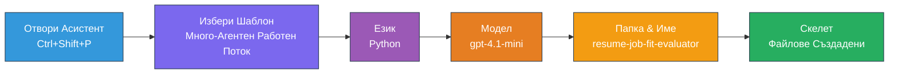
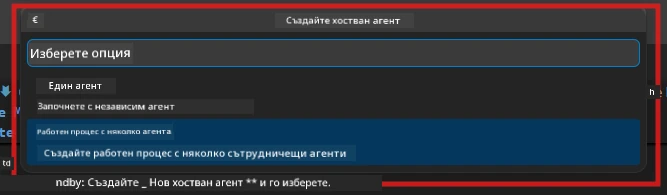

# Module 2 - Създаване на проекта с множество агенти

В този модул използвате [разширението Microsoft Foundry](https://marketplace.visualstudio.com/items?itemName=TeamsDevApp.vscode-ai-foundry), за да **създадете проект с работен процес с множество агенти**. Разширението генерира цялата структура на проекта - `agent.yaml`, `main.py`, `Dockerfile`, `requirements.txt`, `.env` и конфигурация за отстраняване на грешки. След това персонализирате тези файлове в Модули 3 и 4.

> **Забележка:** Папката `PersonalCareerCopilot/` в тази лаборатория е пълен, работещ пример за персонализиран проект с множество агенти. Можете или да създадете нов проект (препоръчително за учене), или директно да изучите съществуващия код.

---

## Стъпка 1: Отворете съветника Create Hosted Agent


1. Натиснете `Ctrl+Shift+P`, за да отворите **командния палитра**.
2. Въведете: **Microsoft Foundry: Create a New Hosted Agent** и го изберете.
3. Отваря се съветникът за създаване на хостван агент.

> **Алтернатива:** Кликнете върху иконата **Microsoft Foundry** в лентата с дейности → кликнете върху иконата **+** до **Agents** → **Create New Hosted Agent**.

---

## Стъпка 2: Изберете шаблон Multi-Agent Workflow

Съветникът ще ви помоли да изберете шаблон:

| Шаблон | Описание | Кога да използвате |
|----------|-------------|-------------|
| Един агент | Един агент с инструкции и опционални инструменти | Лаборатория 01 |
| **Работен процес с множество агенти** | Няколко агенти, които си сътрудничат чрез WorkflowBuilder | **Тази лаборатория (Лаб 02)** |

1. Изберете **Работен процес с множество агенти**.
2. Кликнете **Next**.



---

## Стъпка 3: Изберете програмен език

1. Изберете **Python**.
2. Кликнете **Next**.

---

## Стъпка 4: Изберете вашия модел

1. Съветникът показва модели, разположени във вашия проект Foundry.
2. Изберете същия модел, който използвахте в Лаборатория 01 (например **gpt-4.1-mini**).
3. Кликнете **Next**.

> **Съвет:** [`gpt-4.1-mini`](https://learn.microsoft.com/azure/foundry/foundry-models/concepts/models-sold-directly-by-azure#gpt-41-series) е препоръчителен за разработка - бърз, евтин и обработва добре работни процеси с множество агенти. За окончателно внедряване в продукция използвайте `gpt-4.1`, ако искате по-високо качество на изхода.

---

## Стъпка 5: Изберете папка за местоположение и име на агента

1. Отваря се диалогов прозорец за избор на файл. Изберете целева папка:
   - Ако следвате с репото за семинара: навигирайте до `workshop/lab02-multi-agent/` и създайте нова подпапка
   - Ако започвате отначало: изберете произволна папка
2. Въведете **име** за хоствания агент (например `resume-job-fit-evaluator`).
3. Кликнете **Create**.

---

## Стъпка 6: Изчакайте да приключи създаването на структурата

1. VS Code отваря нов прозорец (или актуализира текущия) със създадения проект.
2. Трябва да видите тази файлова структура:

```
resume-job-fit-evaluator/
├── .env                ← Environment variables (placeholders)
├── .vscode/
│   └── launch.json     ← Debug configuration
├── agent.yaml          ← Agent definition (kind: hosted)
├── Dockerfile          ← Container configuration
├── main.py             ← Multi-agent workflow code (scaffold)
└── requirements.txt    ← Python dependencies
```

> **Забележка към семинара:** В репото на семинара папката `.vscode/` е в **корена на работната среда** с общи `launch.json` и `tasks.json`. Конфигурациите за отстраняване на грешки за Лаб 01 и Лаб 02 са включени. Когато натиснете F5, изберете **"Lab02 - Multi-Agent"** от падащото меню.

---

## Стъпка 7: Разберете създадените файлове (специфично за множество агенти)

Структурата за множество агенти се различава от тази за един агент по няколко важни начина:

### 7.1 `agent.yaml` - Дефиниция на агента

```yaml
kind: hosted
name: resume-job-fit-evaluator
description: >
  A multi-agent workflow that evaluates resume-to-job fit.
metadata:
  authors:
    - Microsoft
  tags:
    - Multi-Agent Workflow
    - Resume Evaluator
protocols:
  - protocol: responses
    version: v1
environment_variables:
  - name: PROJECT_ENDPOINT
    value: ${PROJECT_ENDPOINT}
  - name: MODEL_DEPLOYMENT_NAME
    value: ${MODEL_DEPLOYMENT_NAME}
```

**Ключова разлика от Лаб 01:** Разделът `environment_variables` може да включва допълнителни променливи за крайни точки на MCP или друга конфигурация на инструменти. `name` и `description` отразяват използването в многoагентен случай.

### 7.2 `main.py` - Код за работния процес с множество агенти

Структурата включва:
- **Няколко низa с инструкции за агенти** (по една константа за всеки агент)
- **Няколко контекстни мениджъра [`AzureAIAgentClient.as_agent()`](https://learn.microsoft.com/python/api/overview/azure/ai-agents-readme)** (по един за всеки агент)
- **[`WorkflowBuilder`](https://learn.microsoft.com/agent-framework/workflows/agents-in-workflows)** за свързване на агентите
- **`from_agent_framework()`** за обслужване на работния процес като HTTP крайна точка

```python
from agent_framework import WorkflowBuilder, tool
from agent_framework.azure import AzureAIAgentClient
from azure.ai.agentserver.agentframework import from_agent_framework
```

Допълнителният импорт [`WorkflowBuilder`](https://learn.microsoft.com/agent-framework/workflows/agents-in-workflows) е нов спрямо Лаб 01.

### 7.3 `requirements.txt` - Допълнителни зависимости

Проектът с множество агенти използва същите базови пакети като Лаб 01, плюс всички свързани с MCP пакети:

```
agent-framework-azure-ai==1.0.0rc3
agent-framework-core==1.0.0rc3
azure-ai-agentserver-agentframework==1.0.0b16
azure-ai-agentserver-core==1.0.0b16
debugpy
agent-dev-cli --pre
```

> **Важно за версиите:** Пакетът `agent-dev-cli` изисква флага `--pre` в `requirements.txt`, за да се инсталира последната версия за преглед. Това е необходимо за съвместимост на Agent Inspector с `agent-framework-core==1.0.0rc3`. Вижте [Модул 8 - Отстраняване на проблеми](08-troubleshooting.md) за подробности за версиите.

| Пакет | Версия | Цел |
|---------|---------|---------|
| [`agent-framework-azure-ai`](https://learn.microsoft.com/agent-framework/overview/) | `1.0.0rc3` | Интеграция Azure AI за [Microsoft Agent Framework](https://github.com/microsoft/agent-framework) |
| [`agent-framework-core`](https://learn.microsoft.com/agent-framework/overview/) | `1.0.0rc3` | Основен изпълним код (включва WorkflowBuilder) |
| `azure-ai-agentserver-agentframework` | `1.0.0b16` | Изпълнителна среда на хостван агент сървър |
| `azure-ai-agentserver-core` | `1.0.0b16` | Основни абстракции за сървър на агенти |
| `debugpy` | последна | Отстраняване на грешки с Python (F5 в VS Code) |
| `agent-dev-cli` | `--pre` | Локален CLI за разработка + бекенд за Agent Inspector |

### 7.4 `Dockerfile` - Същият като Лаб 01

Dockerfile е идентичен с този от Лаб 01 - копира файлове, инсталира зависимости от `requirements.txt`, отваря порт 8088 и стартира `python main.py`.

```dockerfile
FROM python:3.14-slim
WORKDIR /app
COPY ./ .
RUN pip install --upgrade pip && \
    if [ -f requirements.txt ]; then \
        pip install -r requirements.txt; \
    else \
      echo "No requirements.txt found" >&2; exit 1; \
    fi
EXPOSE 8088
CMD ["python", "main.py"]
```

---

### Контролна точка

- [ ] Завършен съветник за създаване → видима е новата структура на проекта
- [ ] Виждате всички файлове: `agent.yaml`, `main.py`, `Dockerfile`, `requirements.txt`, `.env`
- [ ] В `main.py` има импортиране на `WorkflowBuilder` (потвърждава се избор на шаблон с множество агенти)
- [ ] В `requirements.txt` има и `agent-framework-core`, и `agent-framework-azure-ai`
- [ ] Разбирате как се различава създадената структура за множество агенти от тази за един агент (няколко агенти, WorkflowBuilder, MCP инструменти)

---

**Предишен:** [01 - Разбиране на архитектурата с множество агенти](01-understand-multi-agent.md) · **Следващ:** [03 - Конфигуриране на агенти и средата →](03-configure-agents.md)

---

<!-- CO-OP TRANSLATOR DISCLAIMER START -->
**Отказ от отговорност**:  
Този документ е преведен с помощта на AI преводаческа услуга [Co-op Translator](https://github.com/Azure/co-op-translator). Въпреки че се стремим към точност, моля, имайте предвид, че автоматизираните преводи може да съдържат грешки или неточности. Оригиналният документ на родния му език трябва да се счита за авторитетен източник. За критична информация се препоръчва професионален човешки превод. Ние не носим отговорност за никакви недоразумения или погрешни тълкувания, възникнали от използването на този превод.
<!-- CO-OP TRANSLATOR DISCLAIMER END -->