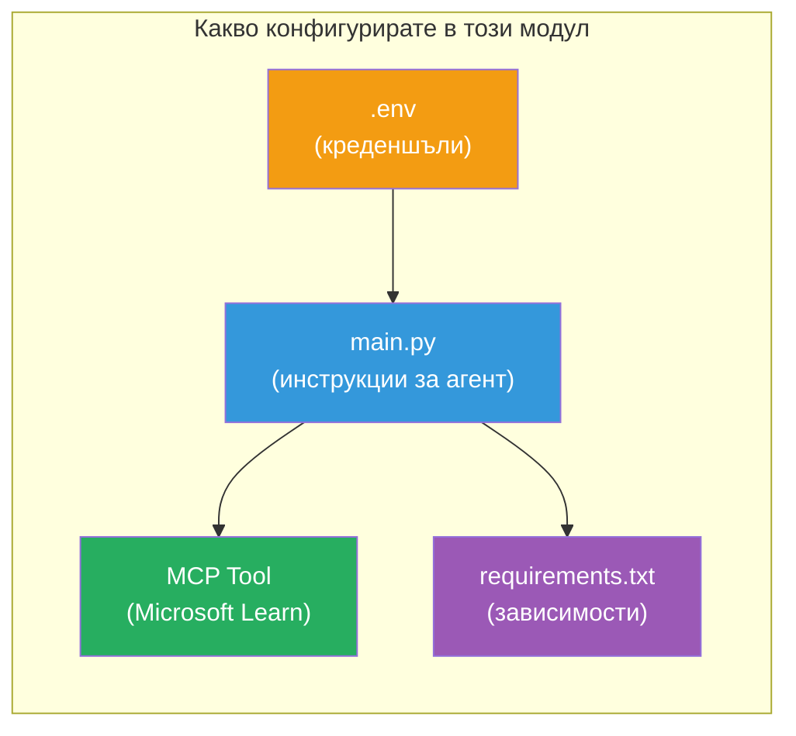

# Модул 3 - Конфигуриране на Агентите, MCP Инструмента и Околната среда

В този модул ще персонализирате основния мулти-агент проект. Ще напишете инструкции за всичките четири агента, ще настроите MCP инструмента за Microsoft Learn, ще конфигурирате променливите на средата и ще инсталирате зависимостите.


> **Референция:** Пълният работещ код е в [`PersonalCareerCopilot/main.py`](../../../../../workshop/lab02-multi-agent/PersonalCareerCopilot/main.py). Използвайте го като референция при изграждането на вашия собствен проект.

---

## Стъпка 1: Конфигуриране на променливите на средата

1. Отворете файла **`.env`** в корена на проекта.
2. Попълнете детайлите за проекта си във Foundry:

   ```env
   PROJECT_ENDPOINT=https://<your-account>.services.ai.azure.com/api/projects/<your-project>
   MODEL_DEPLOYMENT_NAME=gpt-4.1-mini
   ```

3. Запазете файла.

### Къде да намерите тези стойности

| Стойност | Как да я намерите |
|----------|-------------------|
| **Project endpoint** | Страничната лента на Microsoft Foundry → кликнете върху вашия проект → URL на endpoint в детайлния изглед |
| **Model deployment name** | Страничната лента на Foundry → разгънете проекта → **Models + endpoints** → име до разположения модел |

> **Сигурност:** Никога не комитвайте `.env` във версия контрол. Добавете го в `.gitignore`, ако още не е там.

### Съпоставка на променливите на средата

Мулти-агента `main.py` чете както стандартни, така и специфични за обучението имена на променливи на средата:

```python
PROJECT_ENDPOINT = os.getenv("AZURE_AI_PROJECT_ENDPOINT") or os.getenv("PROJECT_ENDPOINT")
MODEL_DEPLOYMENT_NAME = os.getenv(
    "AZURE_AI_MODEL_DEPLOYMENT_NAME",
    os.getenv("MODEL_DEPLOYMENT_NAME", "gpt-4.1-mini"),
)
MICROSOFT_LEARN_MCP_ENDPOINT = os.getenv(
    "MICROSOFT_LEARN_MCP_ENDPOINT", "https://learn.microsoft.com/api/mcp"
)
```

MCP endpoint има разумен подразбиращ се адрес – не е нужно да го задавате в `.env`, освен ако не искате да го промените.

---

## Стъпка 2: Напишете инструкции за агентите

Това е най-критичната стъпка. Всеки агент се нуждае от внимателно изработени инструкции, които определят ролята му, формата на изхода и правилата. Отворете `main.py` и създайте (или модифицирайте) константите с инструкции.

### 2.1 Агент за анализ на автобиографии (Resume Parser Agent)

```python
RESUME_PARSER_INSTRUCTIONS = """\
You are the Resume Parser.
Extract resume text into a compact, structured profile for downstream matching.

Output exactly these sections:
1) Candidate Profile
2) Technical Skills (grouped categories)
3) Soft Skills
4) Certifications & Awards
5) Domain Experience
6) Notable Achievements

Rules:
- Use only explicit or strongly implied evidence.
- Do not invent skills, titles, or experience.
- Keep concise bullets; no long paragraphs.
- If input is not a resume, return a short warning and request resume text.
"""
```

**Защо тези секции?** MatchingAgent се нуждае от структурирани данни, за да оцени съвпаденията. Последователните секции правят предаването между агентите надеждно.

### 2.2 Агент за описание на работата (Job Description Agent)

```python
JOB_DESCRIPTION_INSTRUCTIONS = """\
You are the Job Description Analyst.
Extract a structured requirement profile from a JD.

Output exactly these sections:
1) Role Overview
2) Required Skills
3) Preferred Skills
4) Experience Required
5) Certifications Required
6) Education
7) Domain / Industry
8) Key Responsibilities

Rules:
- Keep required vs preferred clearly separated.
- Only use what the JD states; do not invent hidden requirements.
- Flag vague requirements briefly.
- If input is not a JD, return a short warning and request JD text.
"""
```

**Защо се разделят изискваните и предпочитаните умения?** MatchingAgent използва различни тежести за всяка категория (Required Skills = 40 точки, Preferred Skills = 10 точки).

### 2.3 Агент за съвпадение (Matching Agent)

```python
MATCHING_AGENT_INSTRUCTIONS = """\
You are the Matching Agent.
Compare parsed resume output vs JD output and produce an evidence-based fit report.

Scoring (100 total):
- Required Skills 40
- Experience 25
- Certifications 15
- Preferred Skills 10
- Domain Alignment 10

Output exactly these sections:
1) Fit Score (with breakdown math)
2) Matched Skills
3) Missing Skills
4) Partially Matched
5) Experience Alignment
6) Certification Gaps
7) Overall Assessment

Rules:
- Be objective and evidence-only.
- Keep partial vs missing separate.
- Keep Missing Skills precise; it feeds roadmap planning.
"""
```

**Защо явна оценка?** Репродуктивното оценяване позволява сравняване на изпълненията и отстраняване на проблеми. Скала от 100 точки е лесна за разбиране от крайните потребители.

### 2.4 Агент анализатор на пропуски (Gap Analyzer Agent)

```python
GAP_ANALYZER_INSTRUCTIONS = """\
You are the Gap Analyzer and Roadmap Planner.
Create a practical upskilling plan from the matching report.

Microsoft Learn MCP usage (required):
- For EVERY High and Medium priority gap, call tool `search_microsoft_learn_for_plan`.
- Use returned Learn links in Suggested Resources.
- Prefer Microsoft Learn for free resources.

CRITICAL: You MUST produce a SEPARATE detailed gap card for EVERY skill listed in
the Missing Skills and Certification Gaps sections of the matching report. Do NOT
skip or combine gaps. Do NOT summarize multiple gaps into one card.

Output format:
1) Personalized Learning Roadmap for [Role Title]
2) One DETAILED card per gap (produce ALL cards, not just the first):
   - Skill
   - Priority (High/Medium/Low)
   - Current Level
   - Target Level
   - Suggested Resources (include Learn URL from tool results)
   - Estimated Time
   - Quick Win Project
3) Recommended Learning Order (numbered list)
4) Timeline Summary (week-by-week)
5) Motivational Note

Rules:
- Produce every gap card before writing the summary sections.
- Keep it specific, realistic, and actionable.
- Tailor to candidate's existing stack.
- If fit >= 80, focus on polish/interview readiness.
- If fit < 40, be honest and provide a staged path.
"""
```

**Защо акцент на "CRITICAL"?** Без изрични инструкции да се произведат ВСИЧКИ карти за пропуски, моделът има склонност да генерира само 1-2 карти и да обобщава останалите. Блокът "CRITICAL" предотвратява това съкращаване.

---

## Стъпка 3: Дефиниране на MCP инструмента

GapAnalyzer използва инструмент, който извиква [Microsoft Learn MCP сървъра](https://learn.microsoft.com/azure/foundry/agents/how-to/tools/model-context-protocol). Добавете го в `main.py`:

```python
import json
from agent_framework import tool
from mcp.client.session import ClientSession
from mcp.client.streamable_http import streamable_http_client

@tool
async def search_microsoft_learn_for_plan(
    skill: str, role: str = "", max_results: int = 5
) -> str:
    """Search Microsoft Learn MCP and return curated official links for roadmap planning."""
    query = " ".join(part for part in [skill, role, "learning path module"] if part).strip()
    query = query or "job skills learning path"

    try:
        async with streamable_http_client(MICROSOFT_LEARN_MCP_ENDPOINT) as (
            read_stream, write_stream, _,
        ):
            async with ClientSession(read_stream, write_stream) as session:
                await session.initialize()
                result = await session.call_tool(
                    "microsoft_docs_search", {"query": query}
                )

        if not result.content:
            return (
                "No results returned from Microsoft Learn MCP. "
                "Fallback: https://learn.microsoft.com/training/support/catalog-api"
            )

        payload_text = getattr(result.content[0], "text", "")
        data = json.loads(payload_text) if payload_text else {}
        items = data.get("results", [])[:max(1, min(max_results, 10))]

        if not items:
            return f"No direct Microsoft Learn results found for '{skill}'."

        lines = [f"Microsoft Learn resources for '{skill}':"]
        for i, item in enumerate(items, start=1):
            title = item.get("title") or item.get("url") or "Microsoft Learn Resource"
            url = item.get("url") or item.get("link") or ""
            lines.append(f"{i}. {title} - {url}".rstrip(" -"))
        return "\n".join(lines)
    except Exception as ex:
        return (
            f"Microsoft Learn MCP lookup unavailable. Reason: {ex}. "
            "Fallbacks: https://learn.microsoft.com/api/mcp"
        )
```

### Как работи инструментът

| Стъпка | Какво се случва |
|--------|-----------------|
| 1 | GapAnalyzer решава, че се нуждае от ресурси за дадено умение (напр. „Kubernetes“) |
| 2 | Framework извиква `search_microsoft_learn_for_plan(skill="Kubernetes")` |
| 3 | Функцията отваря [Streamable HTTP](https://learn.microsoft.com/agent-framework/agents/tools/hosted-mcp-tools) връзка към `https://learn.microsoft.com/api/mcp` |
| 4 | Извиква се `microsoft_docs_search` на [MCP сървъра](https://learn.microsoft.com/azure/foundry/agents/how-to/tools/model-context-protocol) |
| 5 | MCP сървърът връща резултати от търсенето (заглавие + URL) |
| 6 | Функцията форматира резултатите като номериран списък |
| 7 | GapAnalyzer включва URL адресите в картата за пропуските |

### Зависимости на MCP

MCP клиентските библиотеки са включени транситивно чрез [`agent-framework-core`](https://learn.microsoft.com/agent-framework/overview/). Не е нужно да ги добавяте отделно в `requirements.txt`. Ако получите грешки при импорта, проверете:

```powershell
pip list | Select-String "mcp"
```

Очаквано: пакетът `mcp` е инсталиран (версия 1.x или по-нова).

---

## Стъпка 4: Свържете агентите и работния поток

### 4.1 Създайте агентите с контекстни мениджъри

```python
from contextlib import asynccontextmanager

@asynccontextmanager
async def create_agents():
    async with (
        get_credential() as credential,
        AzureAIAgentClient(
            project_endpoint=PROJECT_ENDPOINT,
            model_deployment_name=MODEL_DEPLOYMENT_NAME,
            credential=credential,
        ).as_agent(
            name="ResumeParser",
            instructions=RESUME_PARSER_INSTRUCTIONS,
        ) as resume_parser,
        AzureAIAgentClient(
            project_endpoint=PROJECT_ENDPOINT,
            model_deployment_name=MODEL_DEPLOYMENT_NAME,
            credential=credential,
        ).as_agent(
            name="JobDescriptionAgent",
            instructions=JOB_DESCRIPTION_INSTRUCTIONS,
        ) as jd_agent,
        AzureAIAgentClient(
            project_endpoint=PROJECT_ENDPOINT,
            model_deployment_name=MODEL_DEPLOYMENT_NAME,
            credential=credential,
        ).as_agent(
            name="MatchingAgent",
            instructions=MATCHING_AGENT_INSTRUCTIONS,
        ) as matching_agent,
        AzureAIAgentClient(
            project_endpoint=PROJECT_ENDPOINT,
            model_deployment_name=MODEL_DEPLOYMENT_NAME,
            credential=credential,
        ).as_agent(
            name="GapAnalyzer",
            instructions=GAP_ANALYZER_INSTRUCTIONS,
            tools=[search_microsoft_learn_for_plan],
        ) as gap_analyzer,
    ):
        yield resume_parser, jd_agent, matching_agent, gap_analyzer
```

**Основни точки:**
- Всеки агент има собствена инстанция на `AzureAIAgentClient`
- Само GapAnalyzer получава `tools=[search_microsoft_learn_for_plan]`
- `get_credential()` връща [`ManagedIdentityCredential`](https://learn.microsoft.com/python/api/overview/azure/identity-readme#managed-identity-support) в Azure, [`DefaultAzureCredential`](https://learn.microsoft.com/azure/developer/python/sdk/authentication/credential-chains#defaultazurecredential-overview) локално

### 4.2 Изградете графа на работния поток

```python
def create_workflow(resume_parser, jd_agent, matching_agent, gap_analyzer):
    workflow = (
        WorkflowBuilder(
            name="ResumeJobFitEvaluator",
            start_executor=resume_parser,
            output_executors=[gap_analyzer],
        )
        .add_edge(resume_parser, jd_agent)
        .add_edge(resume_parser, matching_agent)
        .add_edge(jd_agent, matching_agent)
        .add_edge(matching_agent, gap_analyzer)
        .build()
    )
    return workflow.as_agent()
```

> Вижте [Workflows as Agents](https://learn.microsoft.com/agent-framework/workflows/as-agents), за да разберете патърна `.as_agent()`.

### 4.3 Стартирайте сървъра

```python
async def main() -> None:
    validate_configuration()
    async with create_agents() as (resume_parser, jd_agent, matching_agent, gap_analyzer):
        agent = create_workflow(resume_parser, jd_agent, matching_agent, gap_analyzer)
        from azure.ai.agentserver.agentframework import from_agent_framework
        await from_agent_framework(agent).run_async()

if __name__ == "__main__":
    asyncio.run(main())
```

---

## Стъпка 5: Създайте и активирайте виртуалната среда

### 5.1 Създаване на средата

```powershell
cd workshop\lab02-multi-agent\PersonalCareerCopilot
python -m venv .venv
```

### 5.2 Активирайте я

**PowerShell (Windows):**
```powershell
.\.venv\Scripts\Activate.ps1
```

**macOS/Linux:**
```bash
source .venv/bin/activate
```

### 5.3 Инсталирайте зависимостите

```powershell
pip install -r requirements.txt
```

> **Бележка:** Редът с `agent-dev-cli --pre` в `requirements.txt` гарантира, че се инсталира най-новата preview версия. Това е необходимо за съвместимост с `agent-framework-core==1.0.0rc3`.

### 5.4 Проверкa на инсталацията

```powershell
pip list | Select-String "agent-framework|agentserver|agent-dev"
```

Очакван изход:
```
agent-dev-cli                  0.0.1b260316
agent-framework-azure-ai       1.0.0rc3
agent-framework-core            1.0.0rc3
azure-ai-agentserver-agentframework 1.0.0b16
azure-ai-agentserver-core      1.0.0b16
```

> **Ако `agent-dev-cli` показва по-стара версия** (напр. `0.0.1b260119`), Agent Inspector ще се провали със 403/404 грешки. Актуализирайте с: `pip install agent-dev-cli --pre --upgrade`

---

## Стъпка 6: Потвърдете удостоверяването

Изпълнете същата проверка за аутентикация от Лаборатория 01:

```powershell
az account show --query "{name:name, id:id}" --output table
```

Ако това не успее, изпълнете [`az login`](https://learn.microsoft.com/cli/azure/authenticate-azure-cli-interactively).

За мулти-агентни работни потоци всички четири агента споделят същите идентификационни данни. Ако аутентикацията работи за един, работи и за всички.

---

### Контролен списък

- [ ] `.env` съдържа валидни стойности за `PROJECT_ENDPOINT` и `MODEL_DEPLOYMENT_NAME`
- [ ] Всички 4 константи с инструкции за агенти са дефинирани в `main.py` (ResumeParser, JD Agent, MatchingAgent, GapAnalyzer)
- [ ] MCP инструментът `search_microsoft_learn_for_plan` е дефиниран и регистриран в GapAnalyzer
- [ ] `create_agents()` създава всички 4 агента с индивидуални инстанции на `AzureAIAgentClient`
- [ ] `create_workflow()` изгражда правилния граф с `WorkflowBuilder`
- [ ] Виртуалната среда е създадена и активирана (`(.venv)` видимо)
- [ ] `pip install -r requirements.txt` завършва без грешки
- [ ] `pip list` показва всички очаквани пакети на правилните версии (rc3 / b16)
- [ ] `az account show` връща вашия абонамент

---

**Предишен:** [02 - Scaffold Multi-Agent Project](02-scaffold-multi-agent.md) · **Следващ:** [04 - Orchestration Patterns →](04-orchestration-patterns.md)

---

<!-- CO-OP TRANSLATOR DISCLAIMER START -->
**Отказ от отговорност**:  
Този документ е преведен с помощта на AI преводаческа услуга [Co-op Translator](https://github.com/Azure/co-op-translator). Въпреки че се стремим към точност, моля, имайте предвид, че автоматизираните преводи могат да съдържат грешки или неточности. Оригиналният документ на неговия език трябва да се счита за авторитетния източник. За критична информация се препоръчва професионален човешки превод. Ние не носим отговорност за каквито и да е недоразумения или погрешни тълкувания, произтичащи от използването на този превод.
<!-- CO-OP TRANSLATOR DISCLAIMER END -->