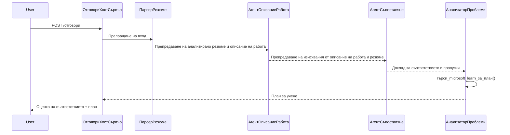

# Модул 3 - Конфигуриране на инструкции, среда и инсталиране на зависимости

⏱️ ~15 мин

В този модул превръщате предварително създадения шаблон в **вашия** мулти-агентен работен процес - като задавате променливи на средата, пишете инструкции за агентите, добавяте MCP инструмента, свързвате графа на работния процес и инсталирате зависимости.

> **Референция:** Пълният работещ код е в [`PersonalCareerCopilot/main.py`](../../../../../workshop/lab02-multi-agent/PersonalCareerCopilot/main.py). Използвайте го като справка при създаването на ваш собствен граф на работния процес и блокове с подкана.

---

## Как четиримата агенти се свързват помежду си


```mermaid
sequenceDiagram
    participant User
    participant Server as ОтговориХостСървър
    participant RP as ПарсерРезюме
    participant JD as АгентОписаниеРабота
    participant MA as АгентСъпоставяне
    participant GA as АнализаторПроблеми

    User->>Server: POST /отговори
    Server->>RP: Препращане на вход
    RP-->>JD: Препредаване на анализирано резюме и описание на работа
    JD-->>MA: Препредаване на изисквания от описание на работа и резюме
    MA-->>GA: Доклад за съответствието и пропуски
    GA->>GA: търси_microsoft_learn_за_план()
    GA-->>Server: План за учене
    Server-->>User: Оценка на съответствието + план
```

---

## Стъпка 1: Конфигуриране на променливи на средата

1. Отворете файла **`.env`** в корена на проекта (създаден от съветника за шаблони).
2. Заменете заместителите с действителните ви стойности от Лаборатория 01.

<details open>
<summary><strong>🅰️ Път А - Абонамент в Foundry</strong></summary>

```env
FOUNDRY_PROJECT_ENDPOINT=https://<your-account>.services.ai.azure.com/api/projects/<your-project>
AZURE_AI_MODEL_DEPLOYMENT_NAME=gpt-4.1-mini
```

> **Къде да намерите стойности:** Вижте [Лаб 01, Модул 1](../../lab01-single-agent/docs/01-setup.md#deploy-a-model--assign-rbac).

</details>

<details open>
<summary><strong>🅱️ Път Б - Foundry Local</strong></summary>

```env
FOUNDRY_PROJECT_ENDPOINT=http://localhost:5273/v1
AZURE_AI_MODEL_DEPLOYMENT_NAME=phi-4-mini
```

> Всички изчисления се изпълняват на вашата машина - никакви данни не напускат устройството ви. Стартирайте `foundry model list`, за да потвърдите точния псевдоним на модела. Единствената външна заявка е повикването на MCP инструмента към `https://learn.microsoft.com/api/mcp`.

> **Къде да намерите стойности:** Вижте [Лаб 01, Модул 1 - локален път](../../lab01-single-agent/docs/01-setup.md#step-2-set-up-based-on-your-access).

</details>

> **Сигурност:** Никога не качвайте `.env` към контрол на версиите. Той вече би трябвало да е в `.gitignore`.

---

## Стъпка 2: Напишете инструкции за агентите

Инструкциите дефинират ролята на всеки агент, формата на изхода и правилата. Отворете `main.py` и дефинирайте (или заменете) четирите константи за инструкции - пълните низове са в [`PersonalCareerCopilot/main.py`](../../../../../workshop/lab02-multi-agent/PersonalCareerCopilot/main.py).

### 2.1 `RESUME_PARSER_INSTRUCTIONS`
Парсира автобиографията в структурирана кандидатска профилна информация **и** копира описанието на работа дословно в `[JOB DESCRIPTION PASS-THROUGH]`. И двете означени секции трябва да се появят в изхода.

> **Защо е нужно pass-through?** С `context_mode="last_agent"`, ResumeParser е **единственият** агент, който вижда оригиналното съобщение на потребителя. Ако не препрати описанието на работа напред, следващите агенти никога няма да го видят.

### 2.2 `JOB_DESCRIPTION_INSTRUCTIONS`
Чете `[PARSED RESUME]` и `[JOB DESCRIPTION PASS-THROUGH]` от изхода на ResumeParser. Извежда `[JD REQUIREMENTS]` (структурирани изисквания) и `[PARSED RESUME PASS-THROUGH]` (дословно копие на автобиографията за MatchingAgent).

### 2.3 `MATCHING_AGENT_INSTRUCTIONS`
Чете `[JD REQUIREMENTS]` и `[PARSED RESUME PASS-THROUGH]`. Създава отчет за оценка на съвпадението (0–100) с математическо обяснение, съвпаднали умения, липсващи умения и съответствие на опита.

### 2.4 `GAP_ANALYZER_INSTRUCTIONS`
Чете отчета за съвпадението. За **всяко** липсващо умение извиква `search_microsoft_learn_for_plan`, за да намери ресурси от Microsoft Learn. Създава подробна карта за всяко умение плюс седмичен план за обучение.

---

## Стъпка 3: Добавете MCP инструмента

GapAnalyzer извиква [Microsoft Learn MCP сървъра](https://learn.microsoft.com/azure/foundry/agents/how-to/tools/model-context-protocol) за да получи реални учебни ресурси за всеки дефицит на умения. Пълната функция `search_microsoft_learn_for_plan` е в [`PersonalCareerCopilot/main.py`](../../../../../workshop/lab02-multi-agent/PersonalCareerCopilot/main.py).

Регистрирайте инструмента на GapAnalyzer при създаване на агента:

```python
gap_analyzer = Agent(
    client=client,
    instructions=GAP_ANALYZER_INSTRUCTIONS,
    name="GapAnalyzer",
    tools=[search_microsoft_learn_for_plan],
)
```

> Вижте [`PersonalCareerCopilot/main.py`](../../../../../workshop/lab02-multi-agent/PersonalCareerCopilot/main.py) за пълния `WorkflowBuilder` граф с `FoundryChatClient`, `AgentExecutor` и всички повиквания на `add_edge()`.

---

## Стъпка 4: Създайте виртуална среда и инсталирайте зависимости

> ⚠️ **Не пропускайте тази стъпка.** Без инсталирани зависимости, дебъгването с F5 ще се провали.

### 4.1 Създайте виртуалната среда

```powershell
python -m venv .venv
```

### 4.2 Активирайте я

| Операционна система | Команда |
|----|---------|
| **Windows (PowerShell)** | `.\.venv\Scripts\Activate.ps1` |
| **Windows (CMD)** | `.venv\Scripts\activate.bat` |
| **macOS / Linux** | `source .venv/bin/activate` |

Трябва да видите `(.venv)` в подсказката на терминала.

### 4.3 Инсталирайте зависимости

```powershell
pip install -r requirements.txt
```

### 4.4 Проверете

```powershell
pip list | Select-String "agent-framework|mcp|debugpy"
```

Очаквано: `agent-framework-foundry`, `agent-framework-foundry-hosting`, `mcp` и `debugpy` са изброени.

---

## Стъпка 5: Проверете удостоверяването

<details open>
<summary><strong>🅰️ Път А - Azure удостоверяване</strong></summary>

```powershell
az account show --query "{name:name, id:id}" --output table
```

Ако се провали, стартирайте [`az login`](https://learn.microsoft.com/cli/azure/authenticate-azure-cli-interactively).

Всички четири агенти споделят един `FoundryChatClient` и един `DefaultAzureCredential`. Ако удостоверяването работи за един, работи за всички.

</details>

<details open>
<summary><strong>🅱️ Път Б - Foundry Local</strong></summary>

Не се изисква удостоверяване за локално тестване.

</details>

---

### ✅ Контролна точка

> Не продължавайте към Модул 04 докато: **(1)** `(.venv)` е видимо в подсказката и **(2)** `pip install -r requirements.txt` се изпълни успешно.

- [ ] `.env` съдържа валиден ендпойнт и име на разгръщане на модел (не заместители)
- [ ] Всички 4 константи за инструкции за агентите са дефинирани в `main.py` (ResumeParser, JD Agent, MatchingAgent, GapAnalyzer)
- [ ] `search_microsoft_learn_for_plan` MCP инструмент е дефиниран и регистриран на GapAnalyzer
- [ ] Създадени са обекти `FoundryChatClient` + 4 `Agent` + 4 `AgentExecutor` в `main()`
- [ ] `WorkflowBuilder` изгражда правилния последователен граф с всички 3 повиквания на `add_edge()`
- [ ] Виртуалната среда е създадена и активирана (в пулса е видимо `(.venv)`)
- [ ] `pip install -r requirements.txt` е изпълнен без грешки
- [ ] **Път А:** `az account show` успешно се изпълнява ИЛИ иконата Accounts във VS Code показва влезлия акаунт

---

**Предишна:** [02 - Scaffold Multi-Agent Project](02-scaffold-multi-agent.md) · **Следваща:** [04 - Orchestration Patterns →](04-orchestration-patterns.md)

---

<!-- CO-OP TRANSLATOR DISCLAIMER START -->
**Отказ от отговорност**:
Този документ е преведен с помощта на AI преводачески услуга [Co-op Translator](https://github.com/Azure/co-op-translator). Въпреки че се стремим към точност, моля имайте предвид, че автоматизираните преводи могат да съдържат грешки или неточности. Оригиналният документ на неговия роден език трябва да се счита за авторитетен източник. За критична информация се препоръчва професионален човешки превод. Ние не носим отговорност за каквито и да е недоразумения или неправилни тълкувания, произтичащи от използването на този превод.
<!-- CO-OP TRANSLATOR DISCLAIMER END -->