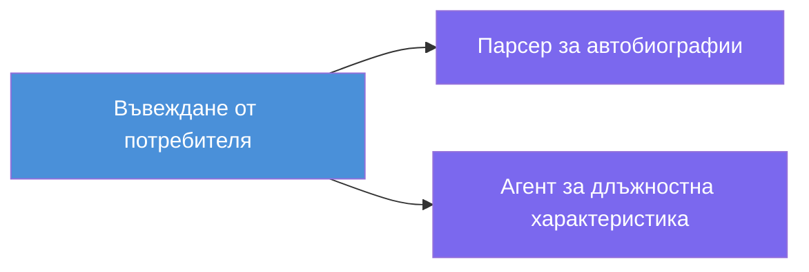
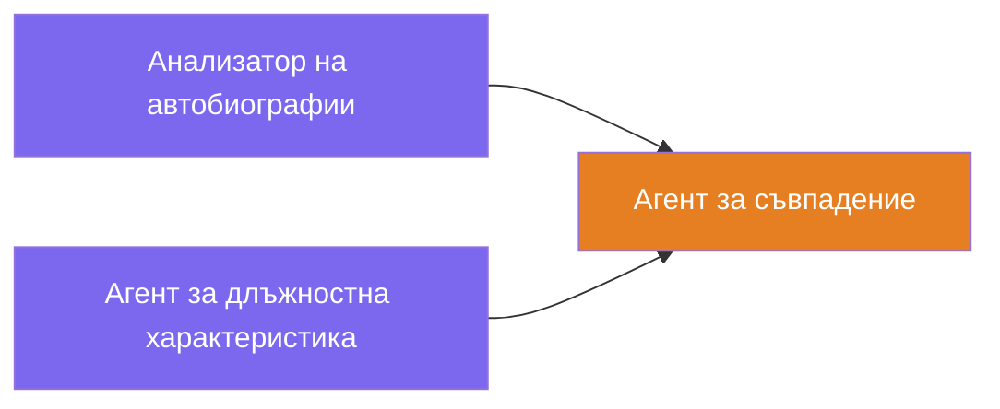
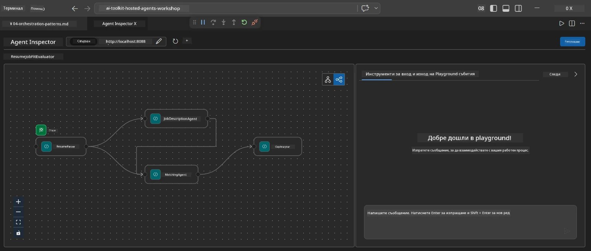
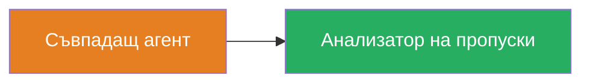
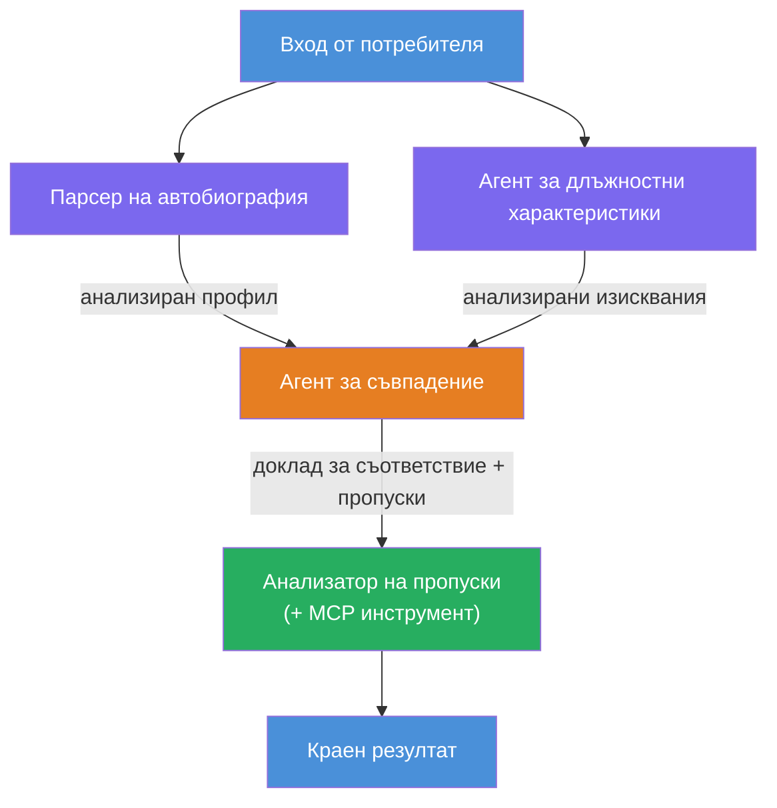
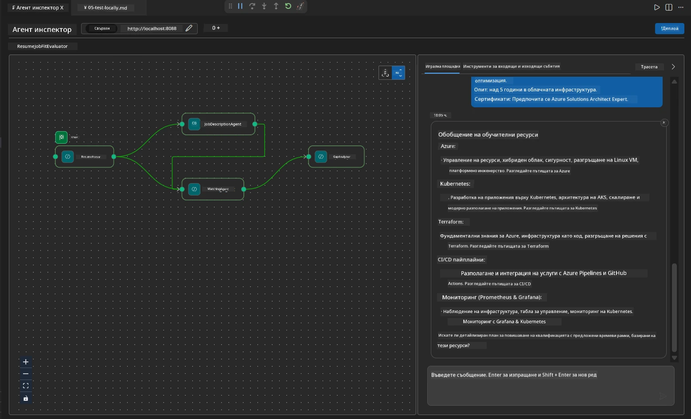

# Модул 4 - Шаблони за оркестрация

В този модул ще разгледате шаблоните за оркестрация, използвани в Resume Job Fit Evaluator, и ще научите как да четете, модифицирате и разширявате графа на работния процес. Разбирането на тези шаблони е от съществено значение за отстраняване на проблеми с потока на данните и за създаване на собствени [мултиагентни работни процеси](https://learn.microsoft.com/agent-framework/workflows/).

---

## Шаблон 1: Fan-out (паралелно разделяне)

Първият шаблон в работния процес е **fan-out** - един вход се изпраща едновременно към няколко агента.


В кода това се случва, защото `resume_parser` е `start_executor` - той първи приема съобщението от потребителя. След това, тъй като и `jd_agent`, и `matching_agent` имат връзки от `resume_parser`, рамката насочва изхода на `resume_parser` към двата агента:

```python
.add_edge(resume_parser, jd_agent)         # Резултат от ResumeParser → JD Agent
.add_edge(resume_parser, matching_agent)   # Резултат от ResumeParser → MatchingAgent
```

**Защо това работи:** ResumeParser и JD Agent обработват различни аспекти на един и същ вход. Пускането им паралелно намалява общото закъснение спрямо изпълнението им последователно.

### Кога да използвате fan-out

| Случай на употреба | Пример |
|-------------------|---------|
| Независими подзадачи | Парсване на резюме срещу парсване на JD |
| Излишък / гласуване | Два агента анализират същите данни, трети избира най-добрия отговор |
| Многоформатен изход | Един агент генерира текст, друг генерира структурирано JSON |

---

## Шаблон 2: Fan-in (агрегация)

Вторият шаблон е **fan-in** - множество изходи от агенти се събират и изпращат към един downstream агент.


В кода:

```python
.add_edge(resume_parser, matching_agent)   # Резултат от ResumeParser → MatchingAgent
.add_edge(jd_agent, matching_agent)        # Резултат от JD Agent → MatchingAgent
```

**Основно поведение:** Когато агент има **два или повече входящи ръба**, рамката автоматично изчаква **всички** upstream агенти да приключат, преди да стартира downstream агента. MatchingAgent не започва, докато и ResumeParser, и JD Agent не завършат.

### Какво получава MatchingAgent

Рамката конкатенира изходите от всички upstream агенти. Входът на MatchingAgent изглежда така:

```
[ResumeParser output]
---
Candidate Profile:
  Name: Jane Doe
  Technical Skills: Python, Azure, Kubernetes, ...
  ...

[JobDescriptionAgent output]
---
Role Overview: Senior Cloud Engineer
Required Skills: Python, Azure, Terraform, ...
...
```

> **Забележка:** Точният формат на конкатенация зависи от версията на рамката. Инструкциите за агента трябва да са написани така, че да могат да обработват както структурирани, така и неструктурирани upstream изходи.



---

## Шаблон 3: Последователна верига

Третият шаблон е **последователно свързване** - изходът на един агент директно се подава на следващия.


В кода:

```python
.add_edge(matching_agent, gap_analyzer)    # Изход на MatchingAgent → GapAnalyzer
```

Това е най-простият шаблон. GapAnalyzer получава оценката за подходящост от MatchingAgent, съвпадналите и липсващите умения и пропуските. След това извиква [инструмента MCP](https://learn.microsoft.com/azure/foundry/agents/how-to/tools/model-context-protocol) за всяка пропусната област, за да извлече ресурси от Microsoft Learn.

---

## Пълният граф

Комбинирането на трите шаблона създава пълния работен процес:


### Хронология на изпълнение

```mermaid
gantt
    title Времева линия за изпълнение на агент
    dateFormat X
    axisFormat %s

    section Паралелно
    Resume Parser       :rp, 0, 3
    JD Agent            :jd, 0, 2

    section Последователно
    Matching Agent      :ma, 3, 5
    Gap Analyzer        :ga, 5, 9
```


> Общото време на изпълнение е приблизително `max(ResumeParser, JD Agent) + MatchingAgent + GapAnalyzer`. GapAnalyzer обикновено е най-бавен, защото прави няколко извиквания към инструмента MCP (по едно за всяка пропусната точка).

---

## Четене на кода на WorkflowBuilder

Ето пълната функция `create_workflow()` от `main.py`, с анотации:

```python
def create_workflow(resume_parser, jd_agent, matching_agent, gap_analyzer):
    workflow = (
        WorkflowBuilder(
            name="ResumeJobFitEvaluator",

            # Първият агент, който получава потребителски вход
            start_executor=resume_parser,

            # Агентът(ите), чийто изход става крайният отговор
            output_executors=[gap_analyzer],
        )
        # Разклоняване: Изходът на ResumeParser отива както към JD Agent, така и към MatchingAgent
        .add_edge(resume_parser, jd_agent)
        .add_edge(resume_parser, matching_agent)

        # Сливане: MatchingAgent чака както ResumeParser, така и JD Agent
        .add_edge(jd_agent, matching_agent)

        # Последователно: Изходът на MatchingAgent се подава към GapAnalyzer
        .add_edge(matching_agent, gap_analyzer)

        .build()
    )
    return workflow.as_agent()
```

### Таблица с резюме на ръбовете

| # | Ръб | Шаблон | Ефект |
|---|------|---------|--------|
| 1 | `resume_parser → jd_agent` | Fan-out | JD Agent получава изхода на ResumeParser (плюс оригиналния вход от потребителя) |
| 2 | `resume_parser → matching_agent` | Fan-out | MatchingAgent получава изхода на ResumeParser |
| 3 | `jd_agent → matching_agent` | Fan-in | MatchingAgent получава и изхода на JD Agent (чака и двамата) |
| 4 | `matching_agent → gap_analyzer` | Последователен | GapAnalyzer получава доклад за съвместимост + списък с пропуски |

---

## Модифициране на графа

### Добавяне на нов агент

За да добавите пети агент (например **InterviewPrepAgent**, който генерира въпроси за интервю въз основа на анализа на пропуските):

```python
# 1. Дефиниране на инструкции
INTERVIEW_PREP_INSTRUCTIONS = """\
You are the Interview Prep Agent.
Given a gap analysis and fit report, generate 10 targeted interview questions
the candidate should prepare for.
"""

# 2. Създаване на агента (вътре в блока async with)
AzureAIAgentClient(
    project_endpoint=PROJECT_ENDPOINT,
    model_deployment_name=MODEL_DEPLOYMENT_NAME,
    credential=credential,
).as_agent(
    name="InterviewPrepAgent",
    instructions=INTERVIEW_PREP_INSTRUCTIONS,
) as interview_prep,

# 3. Добавяне на ръбове в create_workflow()
.add_edge(matching_agent, interview_prep)   # получава отчет за обучението
.add_edge(gap_analyzer, interview_prep)     # също получава gap карти

# 4. Актуализиране на output_executors
output_executors=[interview_prep],  # сега крайният агент
```

### Промяна на реда на изпълнение

За да накарате JD Agent да работи **след** ResumeParser (последователно вместо паралелно):

```python
# Премахнете: .add_edge(resume_parser, jd_agent)  ← вече съществува, оставете го
# Премахнете неявния паралелизъм, като НЕ позволявате на jd_agent директно да получава вход от потребителя
# start_executor изпраща първо към resume_parser, а jd_agent получава
# изхода от resume_parser чрез реброто. Това ги прави последователни.
```

> **Важно:** `start_executor` е единственият агент, който получава суровия вход от потребителя. Всички други агенти получават изхода от техните upstream ръбове. Ако искате агентът да получава също суровия вход от потребителя, той трябва да има ръб от `start_executor`.

---

## Често срещани грешки в графа

| Грешка | Симптом | Поправка |
|---------|---------|-----|
| Липсващ ръб към `output_executors` | Агентът се изпълнява, но изходът е празен | Уверете се, че има път от `start_executor` до всеки агент в `output_executors` |
| Циклична зависимост | Безкраен цикъл или таймаут | Проверете, че няма агент, който да се подава обратно към upstream агент |
| Агент в `output_executors` без входящ ръб | Празен изход | Добавете поне един `add_edge(source, that_agent)` |
| Множество `output_executors` без fan-in | Изходът съдържа отговор само от един агент | Използвайте един изходен агент, който агрегира, или приемете множество изходи |
| Липсващ `start_executor` | `ValueError` при създаване | Винаги специфицирайте `start_executor` в `WorkflowBuilder()` |

---

## Отстраняване на грешки в графа

### Използване на Agent Inspector

1. Стартирайте агента локално (F5 или терминала - вижте [Модул 5](05-test-locally.md)).
2. Отворете Agent Inspector (`Ctrl+Shift+P` → **Foundry Toolkit: Open Agent Inspector**).
3. Изпратете тестово съобщение.
4. В панела с отговори на инспектора потърсете **поточно изходно съдържание** - то показва приноса на всеки агент в последователност.



### Използване на логване

Добавете логване в `main.py`, за да проследите потока на данните:

```python
import logging
logger = logging.getLogger("resume-job-fit")

# В create_workflow(), след изграждането:
logger.info("Workflow graph built with edges: RP→JD, RP→MA, JD→MA, MA→GA")
```

Логовете на сървъра показват реда на изпълнение на агентите и повиквания към инструмента MCP:

```
INFO:resume-job-fit:Starting Resume -> Job Fit Evaluator HTTP server...
INFO:resume-job-fit:Server running on http://localhost:8088
INFO:agent_framework:Executing agent: ResumeParser
INFO:agent_framework:Executing agent: JobDescriptionAgent
INFO:agent_framework:Waiting for upstream agents: ResumeParser, JobDescriptionAgent
INFO:agent_framework:Executing agent: MatchingAgent
INFO:agent_framework:Executing agent: GapAnalyzer
INFO:agent_framework:Tool call: search_microsoft_learn_for_plan(skill="Kubernetes")
POST https://learn.microsoft.com/api/mcp → 200
INFO:agent_framework:Tool call: search_microsoft_learn_for_plan(skill="Terraform")
POST https://learn.microsoft.com/api/mcp → 200
```

---

### Контролен списък

- [ ] Можете да идентифицирате трите шаблона за оркестрация в работния процес: fan-out, fan-in и последователна верига
- [ ] Разбирате, че агентите с множество входящи ръбове чакат всички upstream агенти да приключат
- [ ] Можете да прочетете кода на `WorkflowBuilder` и да съпоставите всяко извикване на `add_edge()` с визуалния граф
- [ ] Разбирате хронологията на изпълнение: паралелните агенти се изпълняват първи, след това агрегацията, а накрая последователните
- [ ] Знаете как да добавите нов агент към графа (да дефинирате инструкции, да създадете агент, да добавите ръбове, да актуализирате изхода)
- [ ] Можете да идентифицирате често срещани грешки в графа и техните симптоми

---

**Предишна:** [03 - Конфигуриране на агенти и среда](03-configure-agents.md) · **Следваща:** [05 - Локално тестиране →](05-test-locally.md)

---

<!-- CO-OP TRANSLATOR DISCLAIMER START -->
**Отказ от отговорност**:  
Този документ е преведен с помощта на AI преводаческа услуга [Co-op Translator](https://github.com/Azure/co-op-translator). Въпреки че се стремим към точност, моля, имайте предвид, че автоматизираните преводи могат да съдържат грешки или неточности. Оригиналният документ на неговия роден език трябва да се счита за авторитетен източник. За критична информация се препоръчва професионален човешки превод. Ние не носим отговорност за каквито и да е недоразумения или погрешни тълкувания, произтичащи от използването на този превод.
<!-- CO-OP TRANSLATOR DISCLAIMER END -->