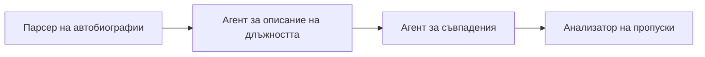
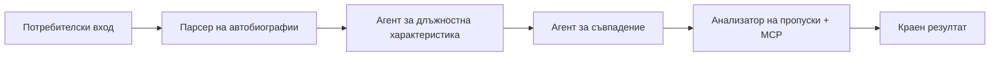

# Модул 4 - Модели за оркестрация

⏱️ ~10 мин

В този модул разглеждате моделите за оркестрация, използвани в Resume Job Fit Evaluator и се учите как да четете, променяте и разширявате графа на работния процес. Разбирането на тези модели е от съществено значение за отстраняване на проблеми с потока на данни и създаване на собствени [работни процеси с множество агенти](https://learn.microsoft.com/agent-framework/workflows/).

---

## Модел 1: Последователна верига

Основният модел в работния процес е **последователна верига** - изходът на всеки агент се подава директно към следващия.


```mermaid
flowchart LR
    RP[Парсер на автобиографии] --> JD[Агент за описание на длъжността]
    JD --> MA[Агент за съвпадения]
    MA --> GA[Анализатор на пропуски]
```

В кода всяко извикване на `add_edge()` създава една стъпка във веригата:

```python
.add_edge(resume_executor, jd_executor)       # Резултат от ResumeParser → JD Agent
.add_edge(jd_executor, matching_executor)     # Резултат от JD Agent → MatchingAgent
.add_edge(matching_executor, gap_executor)    # Резултат от MatchingAgent → GapAnalyzer
```

> **Защо последователна, а не фаново разклонение/сливане?** `WorkflowBuilder` използва **OR-семантика** за входящите ребра: downstream изпълнител се задейства веднага щом **някой** от предшествениците завърши. Ако `matching_executor` имаше две входящи ребра (от `resume_executor` и `jd_executor`), той щеше да се задейства два пъти - веднъж когато ResumeParser приключи и отново когато JD Agent приключи - което би довело до стартирането на GapAnalyzer два пъти и изходът да бъде показан два пъти. Последователната верига напълно избягва това.

## Модел 2: Препредаване на съдържание

Тъй като `context_mode="last_agent"` означава, че всеки изпълнител вижда само изхода на своя **директен предшественик**, агентите в последователна верига трябва експлицитно да препредават напред всички данни, които downstream агентите изискват.

В този работен процес:
- **ResumeParser** копира JD дума по дума в `[JOB DESCRIPTION PASS-THROUGH]` (така че JD Agent да го намери).
- **JD Agent** копира `[PARSED RESUME]` дума по дума в `[PARSED RESUME PASS-THROUGH]` (така MatchingAgent може да сравнява и двата профила).

```
ResumeParser output
└─ [PARSED RESUME]               ← extracted by JD Agent
└─ [JOB DESCRIPTION PASS-THROUGH] ← extracted by JD Agent

JD Agent output
└─ [JD REQUIREMENTS]             ← extracted by MatchingAgent
└─ [PARSED RESUME PASS-THROUGH]  ← extracted by MatchingAgent
```

Всеки раздел за препредаване трябва да се копира **думa по дума** - обобщаването или префразирането го нарушава за downstream агента, който зависи от него.

---

## Пълният граф

Комбинирането на моделите за последователна верига и препредаване на съдържание произвежда целия работен процес:


```mermaid
flowchart LR
    U[Потребителски вход] --> RP[Парсер на автобиографии]
    RP --> JD[Агент за длъжностна характеристика]
    JD --> MA[Агент за съвпадение]
    MA --> GA[Анализатор на пропуски + MCP]
    GA --> O[Краен резултат]
```

Agent Inspector показва същата структура на графа, когато агентът работи локално. Вижте [Модул 5 - Тествай локално](05-test-locally.md) за скрийншотове.

---

## Четене на кода на WorkflowBuilder

Цялата функция `create_workflow()` се намира в [`PersonalCareerCopilot/main.py`](../../../../../workshop/lab02-multi-agent/PersonalCareerCopilot/main.py). Трите извиквания на `add_edge()` изграждат последователния pipeline:

| # | Ребро | Ефект |
|---|-------|--------|
| 1 | `resume_executor → jd_executor` | JD Agent получава `[PARSED RESUME]` + `[JOB DESCRIPTION PASS-THROUGH]` |
| 2 | `jd_executor → matching_executor` | MatchingAgent получава `[JD REQUIREMENTS]` + `[PARSED RESUME PASS-THROUGH]` |
| 3 | `matching_executor → gap_executor` | GapAnalyzer получава доклад за съвпадение + списък с пропуски |

---

## Промяна на графа

### Добавяне на нов агент

За да добавите пети агент (например **InterviewPrepAgent** след GapAnalyzer):

1. Дефинирайте константа `INTERVIEW_PREP_INSTRUCTIONS`.
2. Създайте обекти `Agent` + `AgentExecutor` (по същия модел като съществуващите четири).
3. Добавете `.add_edge(gap_executor, interview_exec)` в `WorkflowBuilder`.
4. Обновете `output_executors=[interview_exec]`.

> **Важно:** `start_executor` е единственият агент, който получава първоначалния потребителски вход. Всички останали агенти получават изход от техните upstream ребра.

---

## Чести грешки в графа

| Грешка | Проявление | Поправка |
|---------|------------|---------|
| Липсващо ребро към `output_executors` | Агентът се изпълнява, но изходът е празен | Уверете се, че има път от `start_executor` до всеки агент в `output_executors` |
| Кръгова зависимост | Безкраен цикъл или изтичане на време | Проверете дали няма агент, който подава обратно към upstream агент |
| Агент в `output_executors` без входящо ребро | Празен изход | Добавете поне един `add_edge(source, that_agent)` |
| Множество `output_executors` без fan-in | Изходът съдържа само отговора на един агент | Използвайте един изходен агент, който агрегира, или приемете множество изходи |
| Липсва `start_executor` | `ValueError` при време на изграждане | Винаги посочвайте `start_executor` в `WorkflowBuilder()` |

---

## Отстраняване на грешки в графа

### Използване на Agent Inspector

1. Стартирайте агента локално с F5.
2. Отворете Agent Inspector (`Ctrl+Shift+P` → **Foundry Toolkit: Отвори Agent Inspector**).
3. Изпратете тестово съобщение.
4. В панела с отговорите на Inspector, потърсете **потоцово изход** – той показва приноса на всеки агент по последователност.


### Използване на логване

Добавете логване в `main.py` за проследяване на потока на данни:

```python
import logging
logger = logging.getLogger("resume-job-fit")

# В main(), след изграждане на работния процес:
logger.info("Workflow graph built with edges: RP→JD, JD→MA, MA→GA")
```

Логовете от сървъра показват реда на изпълнение на агентите и повикванията на инструмента MCP:

```
INFO:agent_framework:Executing agent: ResumeParser
INFO:agent_framework:Executing agent: JobDescriptionAgent
INFO:agent_framework:Executing agent: MatchingAgent
INFO:agent_framework:Executing agent: GapAnalyzer
INFO:agent_framework:Tool call: search_microsoft_learn_for_plan(skill="Kubernetes")
POST https://learn.microsoft.com/api/mcp → 200
INFO:agent_framework:Tool call: search_microsoft_learn_for_plan(skill="Terraform")
POST https://learn.microsoft.com/api/mcp → 200
```

---

### Контролна точка

- [ ] Вие можете да идентифицирате двата модела за оркестрация в работния процес: последователна верига и препредаване на съдържание
- [ ] Разбирате защо `context_mode="last_agent"` изисква експлицитно препредаване на данни между агентите
- [ ] Можете да четете кода на `WorkflowBuilder` и да свържете всяко извикване на `add_edge()` с визуалния граф
- [ ] Знаете как да добавите нов агент в края на pipeline-а
- [ ] Можете да идентифицирате чести грешки в графа и техните проявления

---

**Предишен:** [03 - Конфигуриране на агенти и среда](03-configure-agents.md) · **Следващ:** [05 - Тествай локално →](05-test-locally.md)

---

<!-- CO-OP TRANSLATOR DISCLAIMER START -->
**Отказ от отговорност**:
Този документ е преведен с помощта на AI преводачески услуга [Co-op Translator](https://github.com/Azure/co-op-translator). Въпреки че се стремим към точност, моля имайте предвид, че автоматизираните преводи могат да съдържат грешки или неточности. Оригиналният документ на неговия роден език трябва да се счита за авторитетен източник. За критична информация се препоръчва професионален човешки превод. Ние не носим отговорност за каквито и да е недоразумения или неправилни тълкувания, произтичащи от използването на този превод.
<!-- CO-OP TRANSLATOR DISCLAIMER END -->