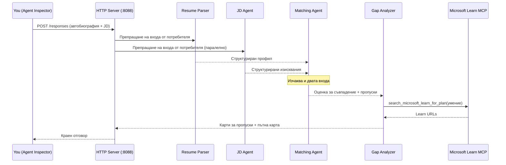
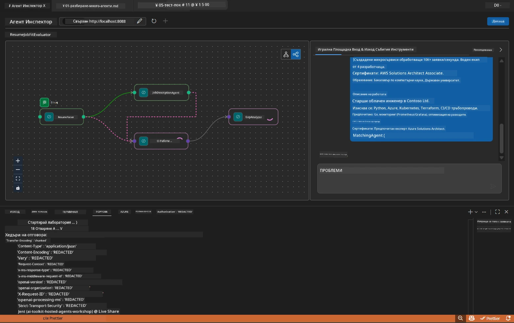

# Модул 5 - Тестване локално (Мултиагент)

В този модул стартирате мултиагентския работен процес локално, тествате го с Agent Inspector и проверявате дали всички четири агента и MCP инструментът работят правилно преди разгръщане в Foundry.

### Какво се случва по време на локален тест


---

## Стъпка 1: Стартирайте агентния сървър

### Опция A: Използване на VS Code задача (препоръчително)

1. Натиснете `Ctrl+Shift+P` → въведете **Tasks: Run Task** → изберете **Run Lab02 HTTP Server**.
2. Задачата стартира сървъра с debugpy, закачен на порт `5679`, и агента на порт `8088`.
3. Изчакайте да се покаже изход:

```
INFO:resume-job-fit:Starting Resume -> Job Fit Evaluator HTTP server...
INFO:resume-job-fit:Server running on http://localhost:8088
```

### Опция B: Стартиране ръчно от терминала

```powershell
cd workshop\lab02-multi-agent\PersonalCareerCopilot
```

Активирайте виртуалната среда:

**PowerShell (Windows):**
```powershell
.\.venv\Scripts\Activate.ps1
```

**macOS/Linux:**
```bash
source .venv/bin/activate
```

Стартирайте сървъра:

```powershell
python -m debugpy --listen 127.0.0.1:5679 -m agentdev run main.py --verbose --port 8088
```

### Опция C: Използване на F5 (debug режим)

1. Натиснете `F5` или отидете на **Run and Debug** (`Ctrl+Shift+D`).
2. Изберете конфигурацията за стартиране **Lab02 - Multi-Agent** от падащото меню.
3. Сървърът стартира с пълна поддръжка на прекъсвания.

> **Подсказка:** Debug режимът ви позволява да задавате прекъсвания вътре в `search_microsoft_learn_for_plan()`, за да инспектирате отговорите на MCP, или вътре в низа с инструкции за агента, за да видите какво получава всеки агент.

---

## Стъпка 2: Отворете Agent Inspector

1. Натиснете `Ctrl+Shift+P` → въведете **Foundry Toolkit: Open Agent Inspector**.
2. Agent Inspector се отваря в браузър на адрес `http://localhost:5679`.
3. Трябва да видите интерфейса на агента готов за приемане на съобщения.

> **Ако Agent Inspector не се отвори:** Уверете се, че сървърът е напълно стартиран (виждате лог "Server running"). Ако порт 5679 е зает, вижте [Модул 8 - Отстраняване на проблеми](08-troubleshooting.md).

---

## Стъпка 3: Стартирайте основните тестове

Изпълнете тези три теста по ред. Всеки тества постепенно повече от работния процес.

### Тест 1: Основно резюме + описание на работата

Поставете следното в Agent Inspector:

```
Resume:
Jane Doe
Senior Software Engineer with 5 years of experience in Python, Django, and AWS.
Built microservices handling 10K+ requests/second. Led a team of 4 developers.
Certifications: AWS Solutions Architect Associate.
Education: B.S. Computer Science, State University.

Job Description:
Senior Cloud Engineer at Contoso Ltd.
Required: Python, Azure, Kubernetes, Terraform, CI/CD pipelines.
Preferred: Go, monitoring (Prometheus/Grafana), cost optimization.
Experience: 5+ years in cloud infrastructure.
Certifications: Azure Solutions Architect Expert preferred.
```

**Очаквана структура на изхода:**

Отговорът трябва да съдържа изход от всички четири агента последователно:

1. **Изход на Resume Parser** - Структуриран профил на кандидат с умения, групирани по категории
2. **Изход на JD Agent** - Структурирани изисквания с разделение на задължителни и предпочитани умения
3. **Изход на Matching Agent** - Оценка за съвместимост (0-100) с разбивка, съвпаднали умения, липсващи умения, пропуски
4. **Изход на Gap Analyzer** - Индивидуални карти за всеки пропуск, всяка с URL адреси към Microsoft Learn



### Какво да проверите в Тест 1

| Проверка | Очаквано | Успех? |
|-------|----------|-------|
| Отговорът съдържа оценка за съвместимост | Число между 0-100 с разбивка | |
| Списък с единодушни умения | Python, CI/CD (частично), и др. | |
| Списък с липсващи умения | Azure, Kubernetes, Terraform, и др. | |
| Карти за пропуски за всяко липсващо умение | По една карта на умение | |
| Присъстват URL адреси към Microsoft Learn | Реални връзки `learn.microsoft.com` | |
| Без съобщения за грешки в отговора | Чист структурирания изход | |

### Тест 2: Проверка на изпълнението на MCP инструмента

Докато Тест 1 работи, проверете **терминала на сървъра** за записи в лог на MCP:

```
GET https://learn.microsoft.com/api/mcp → 405 (Method Not Allowed)
POST https://learn.microsoft.com/api/mcp → 200
DELETE https://learn.microsoft.com/api/mcp → 405 (Method Not Allowed)
```

| Запис в лога | Значение | Очаквано? |
|-----------|---------|-----------|
| `GET ... → 405` | MCP клиент проверява с GET по време на инициализация | Да - нормално |
| `POST ... → 200` | Реално повикване към Microsoft Learn MCP сървъра | Да - това е реалното повикване |
| `DELETE ... → 405` | MCP клиент проверява с DELETE по време на почистване | Да - нормално |
| `POST ... → 4xx/5xx` | Повикването към инструмента е неуспешно | Не - вижте [Отстраняване на проблеми](08-troubleshooting.md) |

> **Ключов момент:** Линиите `GET 405` и `DELETE 405` са **очаквано поведение**. Притеснявайте се само ако повикванията с `POST` връщат статус код различен от 200.

### Тест 3: Крайни случаи - кандидат с висока съвместимост

Поставете резюме, което много добре съвпада с описанието на работата, за да проверите как GapAnalyzer обработва случаи с висока съвместимост:

```
Resume:
Alex Chen
Senior Cloud Engineer with 7 years of experience.
Skills: Python, Azure (AKS, Functions, DevOps), Kubernetes, Terraform, CI/CD (GitHub Actions, Azure Pipelines), Go, Prometheus, Grafana, cost optimization.
Certifications: Azure Solutions Architect Expert, Azure DevOps Engineer Expert.
Led infrastructure migration to Azure for 3 enterprise clients.
Education: M.S. Computer Science, Tech University.

Job Description:
Senior Cloud Engineer at Contoso Ltd.
Required: Python, Azure, Kubernetes, Terraform, CI/CD pipelines.
Preferred: Go, monitoring (Prometheus/Grafana), cost optimization.
Experience: 5+ years in cloud infrastructure.
Certifications: Azure Solutions Architect Expert preferred.
```

**Очаквано поведение:**
- Оценката за съвместимост трябва да е **80+** (повечето умения съвпадат)
- Картите за пропуски трябва да се фокусират върху полиране/готовност за интервю, а не върху основно обучение
- Инструкциите на GapAnalyzer казват: "Ако съвместимост >= 80, фокус върху полиране/готовност за интервю"

---

## Стъпка 4: Проверете пълнотата на изхода

След като тестовете приключат, проверете дали изходът отговаря на тези критерии:

### Контролен списък за структура на изхода

| Секция | Агент | Присъства ли? |
|---------|-------|----------|
| Профил на кандидат | Resume Parser | |
| Технически умения (групирани) | Resume Parser | |
| Обзор на ролята | JD Agent | |
| Задължителни срещу предпочитани умения | JD Agent | |
| Оценка за съвместимост с разбивка | Matching Agent | |
| Съвпаднали / липсващи / частични умения | Matching Agent | |
| Карта за пропуск за всяко липсващо умение | Gap Analyzer | |
| URL адреси към Microsoft Learn в картите | Gap Analyzer (MCP) | |
| Подредба на ученето (номерирана) | Gap Analyzer | |
| Обобщение на времевата линия | Gap Analyzer | |

### Чести проблеми на този етап

| Проблем | Причина | Решение |
|-------|-------|-----|
| Само 1 карта за пропуск (другите съкратени) | В инструкциите на GapAnalyzer липсва ключов блок `CRITICAL` | Добавете параграфа `CRITICAL:` към `GAP_ANALYZER_INSTRUCTIONS` - виж [Модул 3](03-configure-agents.md) |
| Липсват URL адреси към Microsoft Learn | MCP крайната точка не е достъпна | Проверете интернет връзката. Уверете се, че `MICROSOFT_LEARN_MCP_ENDPOINT` в `.env` е `https://learn.microsoft.com/api/mcp` |
| Празен отговор | Не са зададени `PROJECT_ENDPOINT` или `MODEL_DEPLOYMENT_NAME` | Проверете стойностите в `.env` файла. Изпълнете `echo $env:PROJECT_ENDPOINT` в терминала |
| Оценката за съвместимост е 0 или липсва | MatchingAgent не е получил входни данни | Проверете дали съществуват `add_edge(resume_parser, matching_agent)` и `add_edge(jd_agent, matching_agent)` в `create_workflow()` |
| Агентът стартира, но веднага затваря | Грешка при импортиране или липсваща зависимост | Изпълнете отново `pip install -r requirements.txt`. Проверете терминала за стек трейсове |
| Грешка `validate_configuration` | Липсващи променливи на средата | Създайте `.env` с `PROJECT_ENDPOINT=<your-endpoint>` и `MODEL_DEPLOYMENT_NAME=<your-model>` |

---

## Стъпка 5: Тествайте с ваши данни (по избор)

Опитайте да поставите собствено резюме и реално описание на работата. Това помага за проверка:

- Агентирайтe как се справят с различни формати на резюмета (хронологично, функционално, хибридно)
- JD Agent работи с различни стилове на описания на длъжности (текст с булети, параграфи, структурирани)
- MCP инструментът връща релевантни ресурси за реални умения
- Картите за пропуски са персонализирани спрямо вашия конкретен опит

> **Забележка за поверителност:** При локално тестване данните остават на вашия компютър и се изпращат само до вашето Azure OpenAI разгръщане. Те не се записват или съхраняват от инфраструктурата на лабораторията. Можете да използвате фиктивни имена, ако желаете (напр. "Яна Иванова" вместо реалното ви име).

---

### Контролен списък

- [ ] Сървърът е успешно стартиран на порт `8088` (в лога се вижда "Server running")
- [ ] Agent Inspector е отворен и свързан с агента
- [ ] Тест 1: Пълен отговор с оценка за съвместимост, съвпаднали/липсващи умения, карти за пропуски и URL адреси към Microsoft Learn
- [ ] Тест 2: Логовете на MCP показват `POST ... → 200` (повикванията към инструмента са успешни)
- [ ] Тест 3: Кандидат с висока съвместимост получава оценка 80+ с препоръки за полиране
- [ ] Всички карти за пропуски са налични (по една на всяко липсващо умение, без съкращения)
- [ ] Няма грешки или стек трейсове в терминала на сървъра

---

**Предишен:** [04 - Оркестрационни патерни](04-orchestration-patterns.md) · **Следващ:** [06 - Разгръщане във Foundry →](06-deploy-to-foundry.md)

---

<!-- CO-OP TRANSLATOR DISCLAIMER START -->
**Отказ от отговорност**:
Този документ е преведен с помощта на AI преводаческа услуга [Co-op Translator](https://github.com/Azure/co-op-translator). Въпреки че се стремим към точност, моля, имайте предвид, че автоматизираните преводи могат да съдържат грешки или неточности. Оригиналният документ на неговия роден език трябва да се счита за авторитетен източник. За критична информация се препоръчва професионален човешки превод. Ние не носим отговорност за каквито и да е недоразумения или неправилни тълкувания, произтичащи от използването на този превод.
<!-- CO-OP TRANSLATOR DISCLAIMER END -->