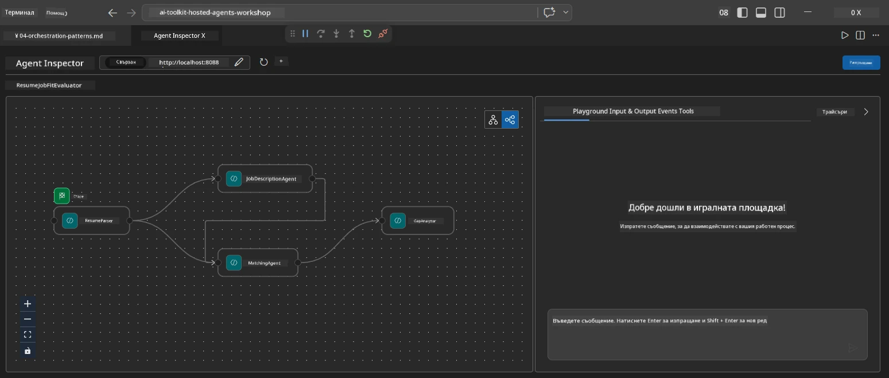
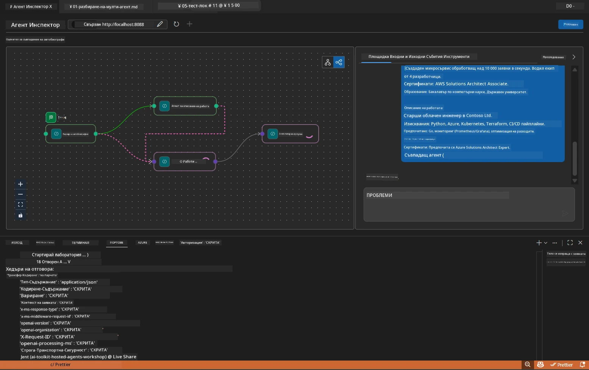
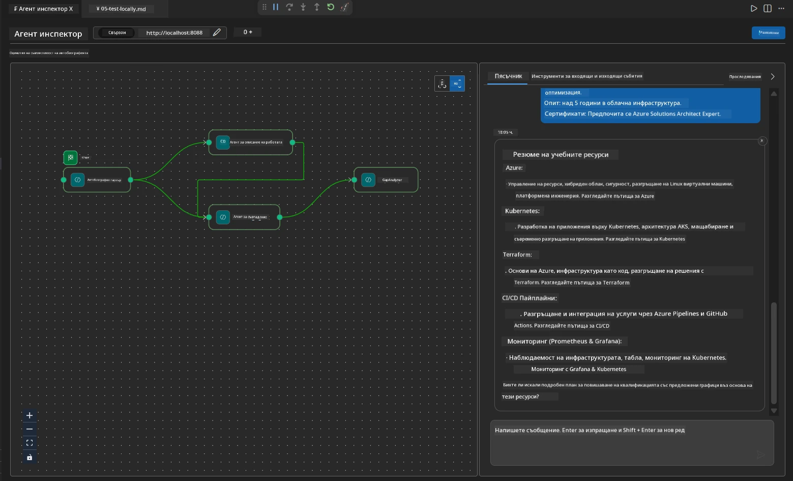

# Модул 5 - Тест на локално ниво

⏱️ ~15 мин

В този модул пускате мултиагентния работен процес локално, тествате го с Agent Inspector и проверявате дали всичките четири агенти и инструментът MCP работят правилно преди разгръщане.

---

## Стъпка 1: Стартирайте сървъра на агента

### Вариант A: Използване на задачата във VS Code (препоръчително)

1. Отворете `workshop/lab02-multi-agent/PersonalCareerCopilot/` като папката си във VS Code.
2. Натиснете `Ctrl+Shift+P` → напишете **Tasks: Run Task** → изберете **Run Agent HTTP Server**.
3. Задачата стартира сървъра с debugpy, прикрепен на порт `5679` и агента на порт `8088`.
4. Изчакайте изходът да покаже:

```
INFO:resume-job-fit:Starting Resume -> Job Fit Evaluator HTTP server...
INFO:resume-job-fit:Server running on http://localhost:8088
```

### Вариант B: Използване на F5 (режим на отстраняване на грешки)

1. Натиснете `F5` → изберете **Debug Local Agent HTTP Server**.
2. Сървърът се стартира с пълна поддръжка на прекъсвания - полезно за инспектиране на отговорите на MCP или изходите на агента.

---

## Стъпка 2: Отворете Agent Inspector

1. Натиснете `Ctrl+Shift+P` → напишете **Foundry Toolkit: Open Agent Inspector**.
2. Agent Inspector се отваря като панел във VS Code, свързан с `http://localhost:8088`.
3. Трябва да видите интерфейса на агента, готов да приема съобщения.



> **Ако Agent Inspector не се отвори:** Уверете се, че сървърът е напълно стартиран (виждате лог "Server running"). Ако порт 5679 е зает, вижте [Модул 8 - Отстраняване на неизправности](08-troubleshooting.md).

---

## Стъпка 2б: (По избор) Отворете Workflow Visualizer

Foundry Toolkit включва реално време **Workflow Visualizer**, който показва как агентите взаимодействат докато графикът се изпълнява. Това е особено полезно за отстраняване на грешки в мултиагентна среда.

1. Натиснете `Ctrl+Shift+P` → напишете **Foundry Toolkit: Open Visualizer for Hosted Agents**.
2. Отваря се нов таб във VS Code, който показва живата изпълнителна графика.
3. Докато изпращате съобщения в Agent Inspector, визуализаторът се обновява автоматично – зелените възли показват завършени агенти, а анимираните ръбове показват поток на данни между тях.

> **Конфликт на порт:** Ако портът на визуализатора вече е зает, сменете го във VS Code Settings → **Extensions** → **Microsoft Foundry Configuration** → **Hosted Agents: Visualizer Port**.

---

## Стъпка 3: Стартирайте смоук тестове

Стартирайте тези три теста по ред. Всеки тест проверява постепенно повече от работния процес.

### Тест 1: Основно резюме + описание на работата

Поставете следното в Agent Inspector:

```
Resume:
Jane Doe
Senior Software Engineer with 5 years of experience in Python, Django, and AWS.
Built microservices handling 10K+ requests/second. Led a team of 4 developers.
Certifications: AWS Solutions Architect Associate.
Education: B.S. Computer Science, State University.

Job Description:
Senior Cloud Engineer at Contoso Ltd.
Required: Python, Azure, Kubernetes, Terraform, CI/CD pipelines.
Preferred: Go, monitoring (Prometheus/Grafana), cost optimization.
Experience: 5+ years in cloud infrastructure.
Certifications: Azure Solutions Architect Expert preferred.
```

**Очаквана структура на изхода:**

Отговорът трябва да съдържа изход от всичките четири агенти последователно:

1. **Изход на Resume Parser** - Два етикетирани раздела: `[PARSED RESUME]` (профил на кандидат с групирани умения) и `[JOB DESCRIPTION PASS-THROUGH]` (буквален текст от JD, който подава информация на JD Agent)
2. **Изход на JD Agent** - Структурирани изисквания с разделени задължителни и предпочитани умения
3. **Изход на Matching Agent** - Оценка за съвпадение (0-100) с детайли, съвпаднали умения, липсващи умения, пропуски
4. **Изход на Gap Analyzer** - Отделни карти за всеки пропуск, всяка с URL адреси към Microsoft Learn





### Какво да проверите в Тест 1

| Проверка | Очаквано | Преминаване? |
|-------|----------|-------|
| Отговорът съдържа оценка за съвпадение | Число между 0-100 с детайли | |
| Изброени са съвпадналите умения | Python, CI/CD (частично), и др. | |
| Изброени са липсващите умения | Azure, Kubernetes, Terraform, и др. | |
| Съществуват карти за пропуски за всяко липсващо умение | По една карта за умение | |
| Присъстват URL адреси от Microsoft Learn | Реални линкове към `learn.microsoft.com` | |
| Няма съобщения за грешки в отговора | Чист структуриран изход | |

### Тест 2: Крайна ситуация - кандидат с високо съвпадение

Поставете резюме, което много точно съвпада с JD, за да проверите дали GapAnalyzer обработва сценарии с високо съвпадение:

```
Resume:
Alex Chen
Senior Cloud Engineer with 7 years of experience.
Skills: Python, Azure (AKS, Functions, DevOps), Kubernetes, Terraform, CI/CD (GitHub Actions, Azure Pipelines), Go, Prometheus, Grafana, cost optimization.
Certifications: Azure Solutions Architect Expert, Azure DevOps Engineer Expert.
Led infrastructure migration to Azure for 3 enterprise clients.
Education: M.S. Computer Science, Tech University.

Job Description:
Senior Cloud Engineer at Contoso Ltd.
Required: Python, Azure, Kubernetes, Terraform, CI/CD pipelines.
Preferred: Go, monitoring (Prometheus/Grafana), cost optimization.
Experience: 5+ years in cloud infrastructure.
Certifications: Azure Solutions Architect Expert preferred.
```

**Очаквано поведение:**
- Оценката за съвпадение трябва да бъде **80+** (повечето умения съвпадат)
- Картите за пропуски трябва да се фокусират върху усъвършенстване/готовност за интервю, а не върху основно обучение
- Инструкциите на GapAnalyzer казват: "Ако съвпадението е >= 80, фокусирайте се върху усъвършенстване/готовност за интервю"

---

## Стъпка 4: Тествайте с ваши данни (по избор)

Опитайте да поставите собственото си резюме и реално описание на работа. Това помага да се провери:

- Агентите обработват различни формати на резюме (хронологично, функционално, хибридно)
- JD Agent обработва различни стилове на JD (точки, параграфи, структуриран)
- Инструментът MCP връща релевантни ресурси за реални умения
- Картите за пропуски са персонализирани според вашия конкретен опит

> **Поверителност - Път A (Foundry cloud):** Текстът на резюмето и JD се изпраща до вашето разгръщане на Azure OpenAI за извличане на информация. Той не се записва или съхранява от инфраструктурата на workshop-а. Използвайте фиктивни имена (напр. "Jane Doe") ако желаете.
>
> **Поверителност - Път B (Foundry Local):** Цялата четири агентна обработка се изпълнява изцяло на вашето устройство. Текстът на резюмето и описанието на работа **никога не напуска вашата машина**. Единственият изходящ повик е инструментът MCP, който търси ресурси от `https://learn.microsoft.com/api/mcp`; този заявка съдържа само името на умението, не и вашите лични данни.

---

### Контролен списък

- [ ] Сървърът стартиран успешно на порт `8088` (в лога пише "Server running")
- [ ] Agent Inspector е отворен и свързан с агента
- [ ] Тест 1: Пълен отговор с оценка за съвпадение, съвпадащи/липсващи умения, карти за пропуски и URL адреси към Microsoft Learn
- [ ] Тест 2: Кандидат с високо съвпадение получава оценка 80+ с препоръки, фокусирани на усъвършенстване
- [ ] Всички карти за пропуски са налични (по една за всяко липсващо умение, без съкращения)
- [ ] Няма грешки или стектрейсове в терминала на сървъра

---

**Предишен:** [04 - Патерни на оркестрация](04-orchestration-patterns.md) · **Следващ:** [06 - Разгръщане във Foundry →](06-deploy-to-foundry.md)

---

<!-- CO-OP TRANSLATOR DISCLAIMER START -->
**Отказ от отговорност**:
Този документ е преведен с помощта на AI преводачески услуга [Co-op Translator](https://github.com/Azure/co-op-translator). Въпреки че се стремим към точност, моля имайте предвид, че автоматизираните преводи могат да съдържат грешки или неточности. Оригиналният документ на неговия роден език трябва да се счита за авторитетен източник. За критична информация се препоръчва професионален човешки превод. Ние не носим отговорност за каквито и да е недоразумения или неправилни тълкувания, произтичащи от използването на този превод.
<!-- CO-OP TRANSLATOR DISCLAIMER END -->