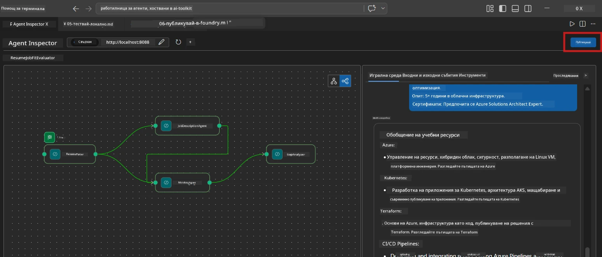
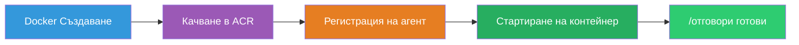
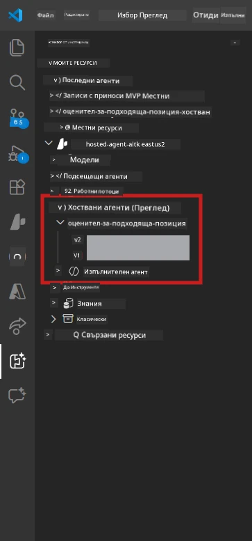

# Модул 6 - Разгръщане в Foundry Agent Service

В този модул разгърнете тествания локално многoагентен работен поток в [Microsoft Foundry](https://learn.microsoft.com/azure/foundry/agents/concepts/hosted-agents) като **Hosted Agent**. Процесът на разгръщане изгражда Docker контейнерно изображение, качва го в [Azure Container Registry (ACR)](https://learn.microsoft.com/azure/container-registry/container-registry-intro) и създава версия на хостван агент в [Foundry Agent Service](https://learn.microsoft.com/azure/foundry/agents/how-to/publish-agent).

> **Основна разлика спрямо Лаб 01:** Процесът на разгръщане е идентичен. Foundry третира многoагентния ви работен поток като един хостван агент - сложността е вътре в контейнера, но повърхността за разгръщане е същата `/responses` крайна точка.

---

## Проверка на предпоставките

Преди да разположите, проверете всеки от следните елементи:

1. **Агентът преминава локални проверъчни тестове:**
   - Изпълнили сте всички 3 теста в [Модул 5](05-test-locally.md) и работният поток е произвел пълен резултат с gap карти и Microsoft Learn URL адреси.

2. **Имате роля [Azure AI User](https://learn.microsoft.com/azure/foundry/concepts/rbac-foundry):**
   - Присвоена в [Лаб 01, Модул 2](../../lab01-single-agent/docs/02-create-foundry-project.md). Проверете:
   - [Azure Portal](https://portal.azure.com) → вашият Foundry **проект** ресурс → **Access control (IAM)** → **Role assignments** → потвърдете, че **[Azure AI User](https://aka.ms/foundry-ext-project-role)** е в списъка за вашия акаунт.

3. **Влезли сте в Azure във VS Code:**
   - Проверете иконата Accounts в долния ляв ъгъл на VS Code. Вашето потребителско име трябва да е видимо.

4. **`agent.yaml` има правилни стойности:**
   - Отворете `PersonalCareerCopilot/agent.yaml` и потвърдете:
     ```yaml
     environment_variables:
       - name: PROJECT_ENDPOINT
         value: ${PROJECT_ENDPOINT}
       - name: MODEL_DEPLOYMENT_NAME
         value: ${MODEL_DEPLOYMENT_NAME}
     ```
   - Те трябва да съвпадат с env променливите, които чете вашият `main.py`.

5. **`requirements.txt` има правилни версии:**
   ```
   agent-framework-azure-ai==1.0.0rc3
   agent-framework-core==1.0.0rc3
   azure-ai-agentserver-agentframework==1.0.0b16
   azure-ai-agentserver-core==1.0.0b16
   debugpy
   agent-dev-cli --pre
   ```

---

## Стъпка 1: Стартирайте разгръщането

### Вариант А: Разгърнете от Agent Inspector (препоръчително)

Ако агентът работи чрез F5 с отворен Agent Inspector:

1. Погледнете в **горния десен ъгъл** на панела Agent Inspector.
2. Натиснете бутона **Deploy** (икона облак със стрелка нагоре ↑).
3. Ще се отвори помощникът за разгръщане.



### Вариант Б: Разгръщане от Command Palette

1. Натиснете `Ctrl+Shift+P`, за да отворите **Command Palette**.
2. Въведете: **Microsoft Foundry: Deploy Hosted Agent** и го изберете.
3. Ще се отвори помощникът за разгръщане.

---

## Стъпка 2: Конфигурирайте разгръщането

### 2.1 Изберете целевия проект

1. Падащо меню показва вашите Foundry проекти.
2. Изберете проекта, който използвахте през целия семинар (например `workshop-agents`).

### 2.2 Изберете контейнерния агентен файл

1. Ще бъдете помолени да изберете входната точка на агента.
2. Отидете до `workshop/lab02-multi-agent/PersonalCareerCopilot/` и изберете **`main.py`**.

### 2.3 Конфигурирайте ресурсите

| Настройка | Препоръчителна стойност | Забележки |
|---------|------------------|-------|
| **CPU** | `0.25` | По подразбиране. Многoагентните работни потоци не изискват повече CPU, защото повикванията на модела са I/O-ограничени |
| **Памет** | `0.5Gi` | По подразбиране. Увеличете до `1Gi`, ако добавяте инструменти за обработка на големи данни |

---

## Стъпка 3: Потвърдете и разположете

1. Помощникът показва обобщение на разгръщането.
2. Прегледайте и натиснете **Confirm and Deploy**.
3. Наблюдавайте процеса във VS Code.

### Какво се случва по време на разгръщане

Наблюдавайте в панела **Output** на VS Code (изберете падащото меню "Microsoft Foundry"):


1. **Docker build** - Строи контейнера от вашия `Dockerfile`:
   ```
   Step 1/6 : FROM python:3.14-slim
   Step 2/6 : WORKDIR /app
   ...
   Successfully built abc123def456
   ```

2. **Docker push** - Качва изображението в ACR (1-3 минути при първо разгръщане).

3. **Регистрация на агента** - Foundry създава хостван агент, използвайки метаданните от `agent.yaml`. Името на агента е `resume-job-fit-evaluator`.

4. **Стартиране на контейнера** - Контейнерът се стартира в управляваната инфраструктура на Foundry със системно управлявана идентичност.

> **Първото разгръщане е по-бавно** (Docker качва всички слоеве). Следващите разгръщания използват кеширани слоеве и са по-бързи.

### Специфични бележки за многoагенти

- **Всички четири агента са в един контейнер.** Foundry вижда един хостван агент. Графът WorkflowBuilder работи вътрешно.
- **Повикванията към MCP са навън.** Контейнерът трябва да има интернет достъп за `https://learn.microsoft.com/api/mcp`. Управляваната инфраструктура на Foundry го осигурява по подразбиране.
- **[Managed Identity](https://learn.microsoft.com/python/api/overview/azure/identity-readme#managed-identity-support).** В хостваната среда, `get_credential()` в `main.py` връща `ManagedIdentityCredential()` (защото `MSI_ENDPOINT` е зададен). Това е автоматично.

---

## Стъпка 4: Проверете състоянието на разгръщането

1. Отворете страничната лента **Microsoft Foundry** (кликнете на иконата на Foundry в Activity Bar).
2. Разгънете **Hosted Agents (Preview)** под вашия проект.
3. Намерете **resume-job-fit-evaluator** (или името на вашия агент).
4. Кликнете на името на агента → разгънете версиите (например `v1`).
5. Кликнете върху версията → проверете **Container Details** → **Status**:



| Статус | Значение |
|--------|---------|
| **Started** / **Running** | Контейнерът работи, агентът е готов |
| **Pending** | Контейнерът се стартира (чакайте 30-60 секунди) |
| **Failed** | Контейнерът не успя да стартира (проверете логовете - вижте по-долу) |

> **Стартирането на многoагент отнема повече време** от едноагентен, защото контейнерът създава 4 агентни инстанции при стартиране. "Pending" за до 2 минути е нормално.

---

## Чести грешки при разгръщане и решения

### Грешка 1: Permission denied - `agents/write`

```
Error: lacks the required data action 
Microsoft.CognitiveServices/accounts/AIServices/agents/write
```

**Решение:** Присвоете роля **[Azure AI User](https://learn.microsoft.com/azure/foundry/concepts/rbac-foundry)** на **ниво проект**. Вижте [Модул 8 - Отстраняване на проблеми](08-troubleshooting.md) за подробни инструкции.

### Грешка 2: Docker не работи

```
Error: Docker build failed / Cannot connect to Docker daemon
```

**Решение:**
1. Стартирайте Docker Desktop.
2. Изчакайте съобщението "Docker Desktop is running".
3. Проверете: `docker info`
4. **Windows:** Уверете се, че задният план WSL 2 е активиран в настройките на Docker Desktop.
5. Опитайте отново.

### Грешка 3: pip install неуспех по време на Docker build

```
Error: Could not find a version that satisfies the requirement agent-dev-cli
```

**Решение:** Флагът `--pre` в `requirements.txt` се обработва по различен начин в Docker. Уверете се, че вашият `requirements.txt` съдържа:
```
agent-dev-cli --pre
```

Ако Docker продължи да не успява, създайте `pip.conf` или предайте `--pre` като аргумент при билд. Вижте [Модул 8](08-troubleshooting.md).

### Грешка 4: MCP инструментът не работи в хостван агент

Ако Gap Analyzer спре да произвежда Microsoft Learn URL след разгръщане:

**Основна причина:** Мрежовата политика може да блокира изходящ HTTPS трафик от контейнера.

**Решение:**
1. Обикновено това не е проблем с настройките по подразбиране на Foundry.
2. Ако се случи, проверете дали виртуалната мрежа на проекта Foundry има NSG, който блокира изходящ HTTPS.
3. MCP инструментът има вградени резервни URL адреси, така че агентът все пак ще произвежда резултат (без активни URL адреси).

---

### Контролен списък

- [ ] Командата за разгръщане приключи без грешки във VS Code
- [ ] Агентът се показва под **Hosted Agents (Preview)** в страничната лента на Foundry
- [ ] Името на агента е `resume-job-fit-evaluator` (или избраното от вас)
- [ ] Статусът на контейнера показва **Started** или **Running**
- [ ] (При грешки) Идентифицирахте грешката, приложихте решението и повторно разархивирахте успешно

---

**Предишен:** [05 - Тествайте локално](05-test-locally.md) · **Следващ:** [07 - Проверка в Playground →](07-verify-in-playground.md)

---

<!-- CO-OP TRANSLATOR DISCLAIMER START -->
**Отказ от отговорност**:
Този документ е преведен с помощта на AI преводаческа услуга [Co-op Translator](https://github.com/Azure/co-op-translator). Въпреки че се стремим към точност, моля, имайте предвид, че автоматизираните преводи може да съдържат грешки или неточности. Оригиналният документ на неговия роден език трябва да се счита за авторитетен източник. За критична информация се препоръчва професионален човешки превод. Ние не носим отговорност за каквито и да било недоразумения или неправилни тълкувания, възникнали от използването на този превод.
<!-- CO-OP TRANSLATOR DISCLAIMER END -->