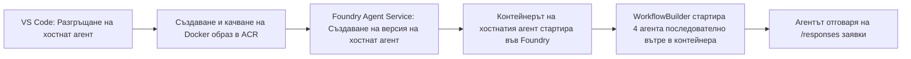
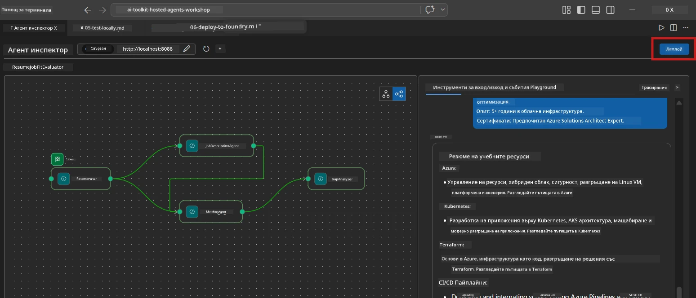

# Модул 6 - Деплой в Foundry Agent Service

⏱️ ~10 минути

В този модул, вие деплойвате локално тествания си мулти-агент работен процес към [Microsoft Foundry](https://learn.microsoft.com/azure/foundry/agents/concepts/hosted-agents) като **Хостван агент**. Процесът на деплой изгражда Docker контейнер образ, качва го в [Azure Container Registry (ACR)](https://learn.microsoft.com/azure/container-registry/container-registry-intro) и създава версия на хостван агент в [Foundry Agent Service](https://learn.microsoft.com/azure/foundry/agents/how-to/publish-agent).

> **Основна разлика от Лаб 01:** Процесът на деплой е идентичен. Foundry третира мулти-агент работния процес като единствен хостван агент - сложността е вътре в контейнера, но интерфейсът за деплой е същият `/responses` endpoint.

### Процес на деплой


```mermaid
flowchart LR
    A[VS Code: Разгръщане на хостнат агент] --> B[Създаване и качване на Docker образ в ACR]
    B --> C[Foundry Agent Service: Създаване на версия на хостнат агент]
    C --> D[Контейнерът на хостнатия агент стартира във Foundry]
    D --> E[WorkflowBuilder стартира 4 агента последователно вътре в контейнера]
    E --> F[Агентът отговаря на /responses заявки]
```

---

## Проверка на предварителните изисквания

Преди деплой, проверете всяко едно от долните условия:

1. **Агентът преминава локални смок тестове:**
   - Завършихте всички 3 теста в [Модул 5](05-test-locally.md) и работният процес генерира пълно изходно съдържание с gap cards и Microsoft Learn URL адреси.

2. **Имате ролята [Foundry User](https://learn.microsoft.com/azure/foundry/concepts/rbac-foundry)** (за деплой най-малко се изисква **Foundry Project Manager** на ниво проект):

   > **Забележка:** Ролите в Foundry наскоро бяха преименувани - **Foundry User**, **Foundry Owner** и **Foundry Project Manager** преди бяха Azure AI User, Azure AI Owner и Azure AI Project Manager. Идентификаторите на ролите и разрешенията остават непроменени.

   - Проверете в [Azure Portal](https://portal.azure.com) → вашия Foundry **проект** ресурс → **Access control (IAM)** → **Role assignments** → потвърдете, че **Foundry User** (или по-висока) е включена за вашия акаунт.

3. **Влезли сте в Azure във VS Code:**
   - Проверете иконата на акаунтите в долния ляв ъгъл на VS Code. Вашето име на акаунта трябва да е видимо.

4. **`agent.yaml` съдържа правилните стойности:**
   - Отворете `PersonalCareerCopilot/agent.yaml` и проверете:
     ```yaml
     environment_variables:
       - name: AZURE_AI_MODEL_DEPLOYMENT_NAME
         value: ${AZURE_AI_MODEL_DEPLOYMENT_NAME}
     ```
   - `FOUNDRY_PROJECT_ENDPOINT` **не** е включен тук - Foundry го инжектира при изпълнение. Само `AZURE_AI_MODEL_DEPLOYMENT_NAME` трябва да бъде деклариран.

5. **`requirements.txt` съдържа правилните версии:**
   ```
   agent-framework-foundry
   agent-framework-foundry-hosting
   mcp<2,>=1.24.0
   debugpy
   ```

---

## Стъпка 1: Стартиране на деплой

### Опция A: Деплой от Agent Inspector (препоръчително)

Ако агентът работи чрез F5 с отворен Agent Inspector:

1. Погледнете в **горния десен ъгъл** на панела Agent Inspector.
2. Кликнете върху бутона **Deploy** (икона облак със стрелка нагоре ↑).
3. Ще се отвори съветникът за деплой.



### Опция B: Деплой от Command Palette

1. Натиснете `Ctrl+Shift+P` за да отворите **Command Palette**.
2. Въведете: **Foundry Toolkit: Deploy Hosted Agent** и го изберете.
3. Ще се отвори съветникът за деплой.

---

## Стъпка 2: Конфигуриране на деплой

### 2.1 Изберете целевия проект

1. Появява се падащо меню с вашите Foundry проекти.
2. Изберете проекта, който използвахте в целия работен процес (напр. `workshop-agents`).

### 2.2 Изберете файла на контейнерния агент

1. Ще бъдете помолени да изберете входната точка на агента.
2. Навигирайте до `workshop/lab02-multi-agent/PersonalCareerCopilot/` и изберете **`main.py`**.

### 2.3 Конфигурирайте ресурсите

| Настройка | Препоръчителна стойност | Забележки |
|---------|----------------------|----------|
| **Метод на деплой** | **Container** (препоръчително) или **Code** | Контейнер изгражда Docker образ; Code качва изходния код като ZIP (preview) |
| **Container Registry** | **Default ACR** | Foundry създава и управлява такъв за вас |
| **CPU** | `0.25` | По подразбиране. Мулти-агент работните процеси не се нуждаят от повече CPU, защото повикванията към моделa са I/O-зависими |
| **Памет** | `0.5Gi` | По подразбиране. Увеличете на `1Gi`, ако добавяте инструменти за обработка на големи данни |

---

## Стъпка 3: Потвърдете и деплойвайте

1. Съветникът показва резюме на деплой.
2. Прегледайте и кликнете **Confirm and Deploy**.
3. Проследявайте напредъка във VS Code.

### Какво се случва по време на деплой

Следете панела **Output** във VS Code (изберете падащо меню „Microsoft Foundry“):

1. **Docker build** - Изгражда контейнера от вашия `Dockerfile`
   ```
   Step 1/6 : FROM python:3.12-slim
   Step 2/6 : WORKDIR /app
   ...
   Successfully built abc123def456
   ```

2. **Docker push** - Качва образа в ACR (1-3 минути при първо деплойване).

3. **Регистрация на агент** - Foundry създава хостван агент с метаданни от `agent.yaml`. Името на агента е `resume-job-fit-evaluator`.

4. **Стартиране на контейнер** - Контейнерът се стартира в управляваната от Foundry инфраструктура със системна управлявана идентичност.

> **Първото деплойване е по-бавно** (Docker качва всички слоеве). Следващите деплои използват кеширани слоеве и са по-бързи.

### Специфични бележки за мулти-агент

- **Всички четири агента са в един контейнер.** Foundry вижда един единствен хостван агент. Графът на WorkflowBuilder работи вътрешно.
- **Извикванията към MCP са изходящи.** Контейнерът се нуждае от интернет достъп до `https://learn.microsoft.com/api/mcp`. Управляваната инфраструктура на Foundry предоставя това по подразбиране.
- **[Управлявана идентичност](https://learn.microsoft.com/azure/foundry/agents/concepts/agent-identity).** Foundry автоматично създава **отделна per-agent Entra идентичност** за всеки Хостван агент при деплой. В хостваната среда, `DefaultAzureCredential` се разрешава автоматично към тази агент идентичност - не е необходима ръчна конфигурация на управлявана идентичност.

---

## Стъпка 4: Проверете статуса на деплой

1. Отворете страничната лента **Microsoft Foundry** (кликнете иконата на Foundry в Activity Bar).
2. Разгънете **Hosted Agents (Preview)** под вашия проект.
3. Намерете **resume-job-fit-evaluator** (или името на вашия агент).
4. Кликнете върху името на агента → разгънете версиите (напр. `v1`).
5. Кликнете върху версията → проверете **Container Details** → **Status**:


| Статус | Значение |
|--------|---------|
| **active** | Агентът работи и е готов да приема заявки |
| **creating** | Контейнерът се стартира (изчакайте 30–60 секунди) |
| **failed** | Контейнерът не успя да се стартира (проверете логове - виж по-долу) |

> **Забележка:** Страничната лента на VS Code може да показва етикети като „Running“ или „Started“, докато API статусът е `active`/`creating`. И двата показателя означават същото състояние.

> **Стартирането на мулти-агент отнема повече време** отколкото за единичен агент, защото контейнерът създава 4 инстанции на агент при стартиране. `creating` за до 2 минути е нормално.

---

## Чести грешки при деплой и решения

### Грешка 1: Permission denied - `agents/write`

```
Error: lacks the required data action 
Microsoft.CognitiveServices/accounts/AIServices/agents/write
```

**Решение:** Задайте ролята **[Foundry User](https://learn.microsoft.com/azure/foundry/concepts/rbac-foundry)** (преди **Azure AI User**) на ниво **проект**. Вижте [Модул 8 - Отстраняване на проблеми](08-troubleshooting.md) за стъпка по стъпка инструкции.

### Грешка 2: Docker не работи

```
Error: Docker build failed / Cannot connect to Docker daemon
```

**Решение:**
1. Стартирайте Docker Desktop.
2. Изчакайте съобщението "Docker Desktop is running".
3. Проверете с: `docker info`
4. **Windows:** Уверете се, че WSL 2 backend е активиран в настройките на Docker Desktop.
5. Опитайте отново.

### Грешка 3: pip install се проваля по време на Docker build

```
Error: Could not find a version that satisfies the requirement agent-framework-foundry
```

**Решение:** Проверете дали `requirements.txt` съвпада:
```
agent-framework-foundry
agent-framework-foundry-hosting
mcp<2,>=1.24.0
debugpy
```

Ако билдът все още се проваля, мрежата на Docker може да блокира PyPI. Проверете `docker info` за proxy настройки.

### Грешка 4: MCP инструментът се проваля при хостван агент

Ако Gap Analyzer спре да произвежда Microsoft Learn URL адреси след деплой:

**Основна причина:** Мрежова политика може да блокира изходящ HTTPS трафик от контейнера.

**Решение:**
1. Обикновено това не е проблем при стандартната конфигурация на Foundry.
2. Ако възникне, проверете дали виртуалната мрежа на Foundry проекта има NSG, който блокира изходящ HTTPS.
3. MCP инструментът има вградени резервни URL адреси, така че агентът ще продължи да произвежда изход (без живи URL).

---

### Контролен списък

- [ ] Деплой командата завърши без грешки във VS Code
- [ ] Агентът се появява под **Hosted Agents (Preview)** в Foundry страничната лента
- [ ] Името на агента е `resume-job-fit-evaluator` (или избраното от вас име)
- [ ] Статусът на контейнера показва **Started** или **Running**
- [ ] (Ако има грешки) Идентифицирахте грешката, приложихте решението и успешно деплойвахте отново

---

**Предишен:** [05 - Тествай локално](05-test-locally.md) · **Следващ:** [07 - Проверка в Playground →](07-verify-in-playground.md)

---

<!-- CO-OP TRANSLATOR DISCLAIMER START -->
**Отказ от отговорност**:
Този документ е преведен с помощта на AI преводачески услуга [Co-op Translator](https://github.com/Azure/co-op-translator). Въпреки че се стремим към точност, моля имайте предвид, че автоматизираните преводи могат да съдържат грешки или неточности. Оригиналният документ на неговия роден език трябва да се счита за авторитетен източник. За критична информация се препоръчва професионален човешки превод. Ние не носим отговорност за каквито и да е недоразумения или неправилни тълкувания, произтичащи от използването на този превод.
<!-- CO-OP TRANSLATOR DISCLAIMER END -->