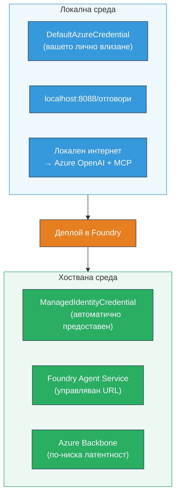

# Модул 7 - Проверка в Пясъчника

В този модул тестваш разположения мултиагентски работен поток както в **VS Code**, така и в **[Foundry Portal](https://ai.azure.com)**, като потвърждаваш, че агентът се държи идентично на локалното тестване.

---

## Защо да проверяваме след разполагането?

Твоят мултиагентски работен поток работеше перфектно локално, значи защо да тестваш отново? Хостваната среда се различава по няколко начина:


| Разлика | Локално | Хоствано |
|-----------|-------|--------|
| **Идентичност** | [`DefaultAzureCredential`](https://learn.microsoft.com/azure/developer/python/sdk/authentication/credential-chains#defaultazurecredential-overview) (твоето лично влизане) | [`ManagedIdentityCredential`](https://learn.microsoft.com/python/api/overview/azure/identity-readme#managed-identity-support) (автоматично предоставена) |
| **Крайна точка** | `http://localhost:8088/responses` | Крайна точка на [Foundry Agent Service](https://learn.microsoft.com/azure/foundry/agents/concepts/hosted-agents) (управляван URL) |
| **Мрежа** | Локален компютър → Azure OpenAI + MCP изходящ | Azure гръбнак (по-ниска латентност между услугите) |
| **MCP свързаност** | Локален интернет → `learn.microsoft.com/api/mcp` | Изходящ контейнер → `learn.microsoft.com/api/mcp` |

Ако някоя среда променлива е неверно конфигурирана, RBAC се различава или MCP изходящият трафик е блокиран, ще го засечеш тук.

---

## Опция А: Тест в VS Code Пясъчника (препоръчително първо)

Разширението [Foundry](https://marketplace.visualstudio.com/items?itemName=TeamsDevApp.vscode-ai-foundry) включва интегриран Пясъчник, който ти позволява да чатиш с разположения си агент без да напускаш VS Code.

### Стъпка 1: Навигирай до своя хостван агент

1. Кликни иконата **Microsoft Foundry** в **Activity Bar** на VS Code (ляв страничен панел), за да отвориш Foundry панела.
2. Разгърни свързания си проект (например `workshop-agents`).
3. Разгърни **Hosted Agents (Preview)**.
4. Трябва да видиш името на агента си (например `resume-job-fit-evaluator`).

### Стъпка 2: Избери версия

1. Кликни върху името на агента, за да разгърнеш версиите му.
2. Кликни версията, която си разположил (например `v1`).
3. Отваря се **панел с детайли**, показващ данни за контейнера.
4. Потвърди, че статусът е **Started** или **Running**.

### Стъпка 3: Отвори Пясъчника

1. В панела с детайли кликни бутона **Playground** (или десен клик върху версията → **Open in Playground**).
2. Отваря се чат интерфейс в таб във VS Code.

### Стъпка 4: Изпълни smoke тестовете си

Използвай същите 3 теста от [Модул 5](05-test-locally.md). Въвеждай всяко съобщение в полето за въвеждане в Пясъчника и натискай **Send** (или **Enter**).

#### Тест 1 - Пълно CV + JD (стандартен поток)

Постави пълния prompt с CV + JD от Модул 5, Тест 1 (Jane Doe + Старши Cloud инженер в Contoso Ltd).

**Очаквано:**
- Оценка за съвпадение с разбивка по математика (100-точкова скала)
- Секция Съвпадащи умения
- Секция Липсващи умения
- **По една карта за пропуск за всяко липсващо умение** с URL адреси към Microsoft Learn
- План за обучение с времева линия

#### Тест 2 - Бърз кратък тест (минимален вход)

```
RESUME: 3 years Python developer, knows Django and PostgreSQL, no cloud experience.

JOB: Cloud DevOps Engineer requiring AWS, Kubernetes, Terraform, CI/CD. 5 years needed.
```

**Очаквано:**
- По-ниска оценка за съвпадение (< 40)
- Честна оценка с фазово обучителен път
- Множество карти с пропуски (AWS, Kubernetes, Terraform, CI/CD, липса на опит)

#### Тест 3 - Кандидат с висока съвместимост

```
RESUME:
10 years Azure Cloud Architect. AZ-305 certified. Expert in AKS, Terraform, Azure DevOps, 
Azure Functions, Helm, Prometheus, Grafana, Python, Go. Led platform team of 8.

JOB:
Senior Cloud Engineer. Required: AKS, Terraform, Azure DevOps, Python. Preferred: Helm, Go.
5+ years experience. AZ-305 preferred.
```

**Очаквано:**
- Висока оценка за съвпадение (≥ 80)
- Фокус върху готовност за интервю и фина настройка
- Малко или никакви карти с пропуски
- Кратка времева линия фокусирана върху подготовка

### Стъпка 5: Сравни с локалните резултати

Отвори бележките си или браузър таба от Модул 5, където си записал локалните отговори. За всеки тест:

- Има ли отговорът **същата структура** (оценка за съвпадение, карти за пропуски, план)?
- Следва ли **същата система за оценяване** (100-точков разбор)?
- Присъстват ли все още **URL адреси към Microsoft Learn** в картите за пропуски?
- Има ли **по една карта за пропуск за всяко липсващо умение** (не са съкратени)?

> **Малки разлики в формулировката са нормални** – моделът не е детерминистичен. Концентрирай се върху структура, последователност на оценяването и използване на MCP инструмента.

---

## Опция Б: Тест в Foundry портала

[Foundry портала](https://ai.azure.com) предоставя уеб базиран пясъчник, полезен за споделяне с колеги или заинтересовани страни.

### Стъпка 1: Отвори Foundry портала

1. Отвори браузъра си и навигирай до [https://ai.azure.com](https://ai.azure.com).
2. Влез с същия Azure акаунт, който използваш през целия курс.

### Стъпка 2: Навигирай до своя проект

1. На началната страница погледни лявата странична лента за **Recent projects**.
2. Кликни името на проекта си (например `workshop-agents`).
3. Ако не го виждаш, кликни **All projects** и го потърси.

### Стъпка 3: Намери разположения агент

1. В лявата навигация на проекта кликни **Build** → **Agents** (или потърси секцията **Agents**).
2. Трябва да видиш списък с агенти. Намери своя разположен агент (например `resume-job-fit-evaluator`).
3. Кликни името на агента, за да отвориш неговата страница с детайли.

### Стъпка 4: Отвори Пясъчника

1. На страницата с детайли за агента гледай в горната лента с инструменти.
2. Кликни **Open in playground** (или **Try in playground**).
3. Отваря се чат интерфейс.

### Стъпка 5: Изпълни същите smoke тестове

Повтори и трите теста от секцията VS Code Пясъчник по-горе. Сравни всеки отговор както с локалните резултати (Модул 5), така и с резултатите от VS Code Пясъчника (Опция А).

---

## Специфична верификация за мултиагенти

Освен основната коректност, провери следните поведения специфични за мултиагенти:

### Изпълнение на MCP инструмента

| Проверка | Как да провериш | Условие за преминаване |
|-------|---------------|----------------|
| MCP извиквания успешни | Картите за пропуски съдържат `learn.microsoft.com` URL адреси | Истински URL, а не съобщения с резервен вариант |
| Множество MCP извиквания | Всеки висок/среден приоритетен пропуск има ресурси | Не само първата карта за пропуск |
| Резервен вариант на MCP работи | Ако URL липсват, провери за резервен текст | Агентът все още генерира карти за пропуски (с или без URL) |

### Координация на агентите

| Проверка | Как да провериш | Условие за преминаване |
|-------|---------------|----------------|
| Всички 4 агента са изпълнени | Изходът съдържа оценка за съвпадение И карти за пропуски | Оценка идва от MatchingAgent, картите от GapAnalyzer |
| Паралелно разклонение | Времето за отговор е разумно (< 2 мин) | Ако е > 3 мин, паралелното изпълнение може да не работи |
| Цялост на потока на данни | Картите за пропуски препращат към умения от доклада за съвпадение | Няма измислени умения, които не фигурират в JD |

---

## Рубрика за валидация

Използвай тази рубрика, за да оцениш поведението на мултиагентския работен поток в хостваната среда:

| # | Критерий | Условие за преминаване | Преминаване? |
|---|----------|---------------|-------|
| 1 | **Функционална коректност** | Агентът отговаря на CV + JD с оценка и анализ на пропуските | |
| 2 | **Последователност на оценяване** | Оценката използва 100-точкова скала с разбивка по точки | |
| 3 | **Пълнота на картите за пропуск** | По една карта за всяко липсващо умение (без съкращения или комбиниране) | |
| 4 | **Интеграция на MCP инструмента** | Картите включват реални URL адреси към Microsoft Learn | |
| 5 | **Структурна последователност** | Структурата на изхода съвпада между локалното и хостваното изпълнение | |
| 6 | **Време за отговор** | Хостваният агент отговаря в рамките на 2 минути за пълна оценка | |
| 7 | **Без грешки** | Без HTTP 500 грешки, изтичания на време или празни отговори | |

> „Преминаване“ означава, че всички 7 критерия са изпълнени за всичките 3 smoke теста поне в един пясъчник (VS Code или Портал).

---

## Отстраняване на проблеми с пясъчника

| Симптом | Вероятна причина | Решение |
|---------|-------------|-----|
| Пясъчникът не се зарежда | Статусът на контейнера не е "Started" | Върни се в [Модул 6](06-deploy-to-foundry.md), провери статуса на разполагане. Изчакай ако е в "Pending" |
| Агентът връща празен отговор | Името на модела за разполагане не съвпада | Провери `agent.yaml` → `environment_variables` → `MODEL_DEPLOYMENT_NAME` дали съвпада с разположения модел |
| Агентът връща съобщение за грешка | Липсва разрешение в [RBAC](https://learn.microsoft.com/azure/foundry/concepts/rbac-foundry) | Задай **[Azure AI User](https://aka.ms/foundry-ext-project-role)** на ниво проект |
| Няма URL адреси към Microsoft Learn в картите за пропуски | MCP изходящият трафик е блокиран или MCP сървърът е недостъпен | Провери дали контейнерът може да достигне `learn.microsoft.com`. Виж [Модул 8](08-troubleshooting.md) |
| Само 1 карта за пропуск (съкратена) | Инструкциите на GapAnalyzer липсват "CRITICAL" блок | Прегледай [Модул 3, Стъпка 2.4](03-configure-agents.md) |
| Оценката за съвпадение е много различна от локалната | Различен модел или инструкции са разположени | Сравни env променливите в `agent.yaml` с локалния `.env`. Ако трябва, разположи отново |
| „Agent not found“ в Портала | Разполагането още се разпространява или е неуспешно | Изчакай 2 минути, обнови. Ако още липсва, разположи отново от [Модул 6](06-deploy-to-foundry.md) |

---

### Контролен списък

- [ ] Тестван агент в VS Code Пясъчник - всички 3 smoke теста преминати
- [ ] Тестван агент в Пясъчника на [Foundry портала](https://ai.azure.com) - всички 3 smoke теста преминати
- [ ] Отговорите са структурно последователни с локалното тестване (оценка, карти за пропуски, план)
- [ ] Microsoft Learn URL адресите присъстват в картите за пропуски (MCP инструментът работи в хостваната среда)
- [ ] По една карта за пропуск за всяко умение (без съкращения)
- [ ] Няма грешки или изтичания на време по време на тестване
- [ ] Попълнена валидационна рубрика (всички 7 критерия преминати)

---

**Предишен:** [06 - Deploy to Foundry](06-deploy-to-foundry.md) · **Следващ:** [08 - Troubleshooting →](08-troubleshooting.md)

---

<!-- CO-OP TRANSLATOR DISCLAIMER START -->
**Отказ от отговорност**:  
Този документ е преведен с помощта на AI преводаческа услуга [Co-op Translator](https://github.com/Azure/co-op-translator). Въпреки че се стремим към точност, моля имайте предвид, че автоматизираните преводи могат да съдържат грешки или неточности. Оригиналният документ на неговия собствен език трябва да се счита за авторитетен източник. За критична информация се препоръчва професионален превод от човек. Не носим отговорност за каквито и да е недоразумения или погрешни тълкувания, произтичащи от използването на този превод.
<!-- CO-OP TRANSLATOR DISCLAIMER END -->