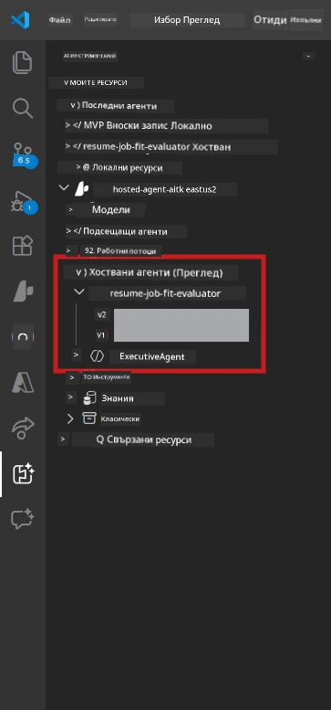

# Модул 7 - Проверка в Playground

⏱️ ~10 мин

В този модул тествате разположения многоагентен работен поток във VS Code и портала Foundry, като потвърждавате, че агентът се държи по същия начин като при локално тестване.

---

## Защо да се тества отново след разполагането?

Хостваната среда се различава от локалната по няколко важни начина:

| | Локална | Хоствана |
|--|-------|--------|
| **Идентичност** | Вашият личен вход (`DefaultAzureCredential`) | Посветена за агент Entra идентичност (създава се автоматично при разполагане) |
| **Крайна точка** | `http://localhost:8088/responses` | URL, управляван от услугата Foundry Agent |
| **Мрежа** | Вашето устройство → Azure OpenAI + MCP | Azure гръбнака (по-ниска латентност) |

Неправилно конфигуриран env var, проблем с RBAC или блокирано изходящо повикване към MCP ще се проявят първо тук.

---

## Опция A: Тествайте в VS Code Playground (препоръчително първо)

### Стъпка 1: Отидете до вашия хостван агент

1. Кликнете върху иконата **Foundry Toolkit** в лентата с активност.
2. Разгънете вашия проект → **Hosted Agents (Preview)** → намерете вашия агент.



### Стъпка 2: Изберете версия

1. Кликнете на агента, за да разгънете неговите версии.
2. Кликнете `v1` → проверете дали статусът е **активен** (в страничната лента може да се показва „Running“ или „Started“ – и двете означават готово състояние).

### Стъпка 3: Отворете Playground

1. Кликнете **Playground** (или с десен бутон върху версията → **Open in Playground**).
2. Отива прозорец за чат в раздел на VS Code.

### Стъпка 4: Стартирайте вашите тестове за работоспособност

Използвайте същите 3 теста от [Модул 5](05-test-locally.md). Въведете всяко съобщение в полето за въвеждане на Playground и натиснете **Send** (или **Enter**).

#### Тест 1 - Пълно CV + JD (стандартен поток)

Поставете пълния текст с CV + JD от Модул 5, Тест 1 (Jane Doe + Senior Cloud Engineer в Contoso Ltd).

**Очаквано:**
- Оценка за съответствие с изчисления (100-точкова скала)
- Раздел „Съвпадащи умения“
- Раздел „Липсващи умения“
- **По една карта за пропуск на умение** с URL-и към Microsoft Learn
- Пътна карта за обучение с времева линия

#### Тест 2 - Бърз кратък тест (минимален вход)

```
RESUME: 3 years Python developer, knows Django and PostgreSQL, no cloud experience.

JOB: Cloud DevOps Engineer requiring AWS, Kubernetes, Terraform, CI/CD. 5 years needed.
```

**Очаквано:**
- По-ниска оценка за съответствие (< 40)
- Честна оценка с етапна пътека за обучение
- Множество карти за пропуски (AWS, Kubernetes, Terraform, CI/CD, липса на опит)

#### Тест 3 - Кандидат с високо съответствие

```
RESUME:
10 years Azure Cloud Architect. AZ-305 certified. Expert in AKS, Terraform, Azure DevOps, 
Azure Functions, Helm, Prometheus, Grafana, Python, Go. Led platform team of 8.

JOB:
Senior Cloud Engineer. Required: AKS, Terraform, Azure DevOps, Python. Preferred: Helm, Go.
5+ years experience. AZ-305 preferred.
```

**Очаквано:**
- Висока оценка за съответствие (≥ 80)
- Фокус върху готовността за интервю и усъвършенстване
- Малко или никакви карти за пропуски
- Кратка времева линия, съсредоточена върху подготовката

### Стъпка 5: Сравнете с локалните резултати

Отворете вашите бележки или браузърен раздел от Модул 5, където сте запазили локалните отговори. За всеки тест:

- Дали отговорът има **същата структура** (оценка за съответствие, карти за пропуски, пътна карта)?
- Следва ли същата **схема за оценяване** (разбивка на 100 точки)?
- Все още ли има **URL адреси към Microsoft Learn** в картите за пропуски?
- Има ли **по една карта за пропуск на умение** (не е съкратена)?

> **Малки разлики в формулировката са нормални** – моделът не е детерминиран. Фокусирайте се върху структурата, консистентността на оценяването и използването на MCP инструментите.

---

## Опция B: Тест в портала Foundry

[Foundry Portal](https://ai.azure.com) предлага уеб-базиран playground, полезен за споделяне с колеги или заинтересовани страни.

### Стъпка 1: Отворете портала Foundry

1. Отворете браузъра си и отидете на [https://ai.azure.com](https://ai.azure.com).
2. Влезте със същия Azure акаунт, който използвате през целия уъркшоп.

### Стъпка 2: Намерете вашия проект

1. На началната страница потърсете **Recent projects** в лявата странична лента.
2. Кликнете името на проекта (например `workshop-agents`).
3. Ако не го виждате, кликнете **All projects** и го потърсете.

### Стъпка 3: Намерете вашия разположен агент

1. В лявата навигация на проекта кликнете **Build** → **Agents** (или потърсете секцията **Agents**).
2. Трябва да видите списък с агенти. Намерете вашия разположен агент (например `resume-job-fit-evaluator`).
3. Кликнете името на агента, за да отворите неговата страница с детайли.

### Стъпка 4: Отворете Playground

1. На страницата с детайли на агента погледнете горната лента с инструменти.
2. Кликнете **Open in playground** (или **Try in playground**).
3. Отваря се чат интерфейс.

### Стъпка 5: Стартирайте същите тестове за работоспособност

Повторете всичките 3 теста от секцията VS Code Playground по-горе. Сравнете всеки отговор както с локалните резултати (Модул 5), така и с резултатите от VS Code Playground (Опция A).

---

## Специфична проверка за многоагентна система

Освен базовата коректност, потвърдете тези специфични за многоагентна система поведения:

### Изпълнение на MCP инструмента

| Проверка | Как да се потвърди | Условие за успех |
|-------|---------------|----------------|
| Повикванията към MCP са успешни | Картите за пропуски съдържат `learn.microsoft.com` URL адреси | Истински URL-и, а не резервни съобщения |
| Множество MCP повиквания | Всяка приоритетна пропуснатост съсредоточена с ресурси | Не само първата карта за пропуск |
| Работи резервният механизъм на MCP | Ако URL адресите липсват, търсете резервен текст | Агентът все пак генерира карти за пропуск (с URL или без) |

### Координация на агенти

| Проверка | Как да се потвърди | Условие за успех |
|-------|---------------|----------------|
| Всички 4 агента са изпълнени | Изходът съдържа оценка за съответствие И карти за пропуски | Оценката идва от MatchingAgent, картите от GapAnalyzer |
| Последователно изпълнение | Времето за отговор е разумно (< 2 минути) | Ако > 3 мин, проверете за грешки в терминалния лог |
| Цялост на потока на данни | Картите за пропуски препращат към умения от анализа на съвпадението | Няма измислени умения, които не са в JD |

---

## Проверителен критерий

Използвайте тази рубрика, за да оцените поведението на многоагентната си система в хоствана среда:

| # | Критерии | Условие за успех | Пройдено? |
|---|----------|---------------|-------|
| 1 | **Функционална коректност** | Агентът отговаря на CV + JD със оценка за съответствие и анализ на пропуските | |
| 2 | **Консистентност на оценяването** | Оценката използва 100-точкова скала с разбивка | |
| 3 | **Пълнота на картите за пропуски** | По една карта за всяко липсващо умение (не са съкратени или комбинирани) | |
| 4 | **Интеграция на MCP инструмента** | Картите за пропуски включват истински Microsoft Learn URL-и | |
| 5 | **Структурна консистентност** | Структурата на изхода съвпада между локално и хоствано изпълнение | |
| 6 | **Време за отговор** | Хостваният агент отговаря в рамките на 2 минути за пълната оценка | |
| 7 | **Без грешки** | Няма HTTP 500 грешки, таймаути или празни отговори | |

> „Успешно“ означава, че всички 7 критерия са изпълнени за всички 3 теста за работоспособност поне в един playground (VS Code или Portal).

---

## Отстраняване на проблеми с playground

| Симптом | Вероятна причина | Решение |
|---------|-------------|-----|
| Playground не се зарежда | Контейнерът не е в състояние `active` | Върнете се към [Модул 6](06-deploy-to-foundry.md), проверете статуса на разполагането. Изчакайте, ако е `creating` |
| Агентът връща празен отговор | Име на разположен модел не съвпада | Проверете `agent.yaml` → `environment_variables` → `AZURE_AI_MODEL_DEPLOYMENT_NAME`, съвпада ли с разположения модел |
| Агентът връща съобщение за грешка | Липсва разрешение [RBAC](https://learn.microsoft.com/azure/foundry/concepts/rbac-foundry) | Назначете **[Foundry User](https://aka.ms/foundry-ext-project-role)** (предишно Azure AI User) на ниво проект |
| В картите за пропуски няма Microsoft Learn URL-и | Изходящ достъп до MCP блокиран или MCP сървърът недостъпен | Проверете дали контейнерът може да достигне `learn.microsoft.com`. Вижте [Модул 8](08-troubleshooting.md) |
| Само 1 карта за пропуск (съкратена) | В инструкциите на GapAnalyzer липсва „CRITICAL“ блок | Прегледайте [Модул 3, стъпка 2.4](03-configure-agents.md) |
| Оценката за съответствие е силно различна от локалната | Различен модел или инструкции са разположени | Сравнете env варовете в `agent.yaml` с локалния `.env`. Ако е нужно, разположете отново |
| „Агентът не е намерен“ в портала | Разполагането все още се разпространява или е неуспешно | Изчакайте 2 минути, обновете страницата. Ако все още липсва, разположете отново от [Модул 6](06-deploy-to-foundry.md) |

---

### Контролна точка

- [ ] Тествахте агента в VS Code Playground - всички 3 теста за работоспособност преминати
- [ ] Тествахте агента в [Foundry Portal](https://ai.azure.com) Playground - всички 3 теста за работоспособност преминати
- [ ] Отговорите са структурно съвместими с локалното тестване (оценка за съответствие, карти за пропуски, пътна карта)
- [ ] Microsoft Learn URL-ите присъстват в картите за пропуски (MCP инструментът работи в хостваната среда)
- [ ] По една карта за пропуск на умение (без съкращения)
- [ ] Няма грешки или таймаути по време на тестовете
- [ ] Попълнена проверителна рубрика (всички 7 критерия са преминати)

---

**Предишен:** [06 - Разполагане във Foundry](06-deploy-to-foundry.md) · **Следващ:** [08 - Отстраняване на проблеми →](08-troubleshooting.md)

---

<!-- CO-OP TRANSLATOR DISCLAIMER START -->
**Отказ от отговорност**:
Този документ е преведен с помощта на AI преводачески услуга [Co-op Translator](https://github.com/Azure/co-op-translator). Въпреки че се стремим към точност, моля имайте предвид, че автоматизираните преводи могат да съдържат грешки или неточности. Оригиналният документ на неговия роден език трябва да се счита за авторитетен източник. За критична информация се препоръчва професионален човешки превод. Ние не носим отговорност за каквито и да е недоразумения или неправилни тълкувания, произтичащи от използването на този превод.
<!-- CO-OP TRANSLATOR DISCLAIMER END -->