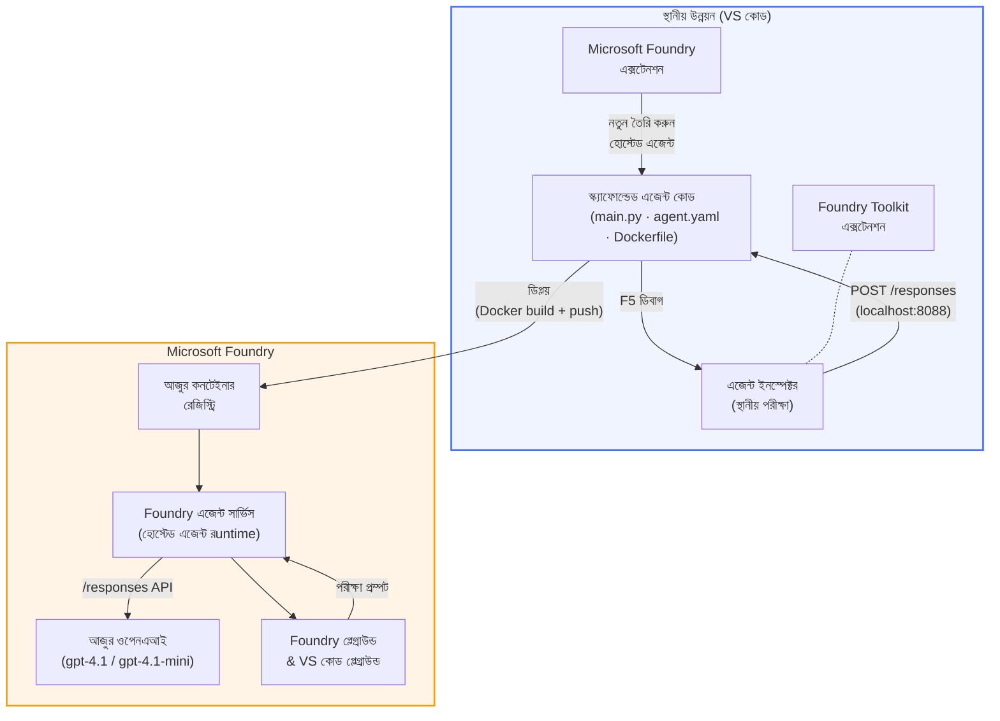

# Foundry Toolkit + Foundry Hosted Agents ওয়ার্কশপ

[](https://www.python.org/)
[](https://github.com/microsoft/agents)
[](https://learn.microsoft.com/azure/ai-foundry/agents/concepts/hosted-agents/)
[](https://ai.azure.com/)
[](https://learn.microsoft.com/azure/ai-services/openai/)
[](https://learn.microsoft.com/cli/azure/install-azure-cli)
[](https://learn.microsoft.com/azure/developer/azure-developer-cli/install-azd)
[](https://www.docker.com/)
[](https://marketplace.visualstudio.com/items?itemName=ms-windows-ai-studio.windows-ai-studio)
[](LICENSE)

ভাস কোড থেকে সম্পূর্ণরূপে **Microsoft Foundry extension** এবং **Foundry Toolkit** ব্যবহার করে **Microsoft Foundry Agent Service** এ **Hosted Agents** হিসাবে AI এজেন্ট তৈরি, টেস্ট এবং ডিপ্লয় করুন।

> **Hosted Agents বর্তমানে প্রিভিউ পর্যায়ে রয়েছে।** সমর্থিত অঞ্চলগুলি সীমিত - দেখুন [আঞ্চলিক প্রাপ্যতা](https://learn.microsoft.com/azure/foundry/agents/concepts/hosted-agents#region-availability)।

> প্রতিটি ল্যাবের ভিতরে `agent/` ফোল্ডারটি **Foundry extension দ্বারা স্বয়ংক্রিয়ভাবে স্ক্যাফোল্ড করা হয়** - তারপর আপনি কোড কাস্টমাইজ করেন, লোকালি টেস্ট করেন, এবং ডিপ্লয় করেন।

<!-- CO-OP TRANSLATOR LANGUAGES TABLE START -->
[Arabic](../ar/README.md) | [Bengali](./README.md) | [Bulgarian](../bg/README.md) | [Burmese (Myanmar)](../my/README.md) | [Chinese (Simplified)](../zh-CN/README.md) | [Chinese (Traditional, Hong Kong)](../zh-HK/README.md) | [Chinese (Traditional, Macau)](../zh-MO/README.md) | [Chinese (Traditional, Taiwan)](../zh-TW/README.md) | [Croatian](../hr/README.md) | [Czech](../cs/README.md) | [Danish](../da/README.md) | [Dutch](../nl/README.md) | [Estonian](../et/README.md) | [Finnish](../fi/README.md) | [French](../fr/README.md) | [German](../de/README.md) | [Greek](../el/README.md) | [Hebrew](../he/README.md) | [Hindi](../hi/README.md) | [Hungarian](../hu/README.md) | [Indonesian](../id/README.md) | [Italian](../it/README.md) | [Japanese](../ja/README.md) | [Kannada](../kn/README.md) | [Khmer](../km/README.md) | [Korean](../ko/README.md) | [Lithuanian](../lt/README.md) | [Malay](../ms/README.md) | [Malayalam](../ml/README.md) | [Marathi](../mr/README.md) | [Nepali](../ne/README.md) | [Nigerian Pidgin](../pcm/README.md) | [Norwegian](../no/README.md) | [Persian (Farsi)](../fa/README.md) | [Polish](../pl/README.md) | [Portuguese (Brazil)](../pt-BR/README.md) | [Portuguese (Portugal)](../pt-PT/README.md) | [Punjabi (Gurmukhi)](../pa/README.md) | [Romanian](../ro/README.md) | [Russian](../ru/README.md) | [Serbian (Cyrillic)](../sr/README.md) | [Slovak](../sk/README.md) | [Slovenian](../sl/README.md) | [Spanish](../es/README.md) | [Swahili](../sw/README.md) | [Swedish](../sv/README.md) | [Tagalog (Filipino)](../tl/README.md) | [Tamil](../ta/README.md) | [Telugu](../te/README.md) | [Thai](../th/README.md) | [Turkish](../tr/README.md) | [Ukrainian](../uk/README.md) | [Urdu](../ur/README.md) | [Vietnamese](../vi/README.md)

> **লোকালি ক্লোন করতে চান?**
>
> এই রিপোজিটরিতে ৫০+ ভাষার অনুবাদ রয়েছে যা ডাউনলোড সাইজ ব্যাপকভাবে বৃদ্ধি করে। অনুবাদ ছাড়া ক্লোন করতে স্পার্স চেকআউট ব্যবহার করুন:
>
> **Bash / macOS / Linux:**
> ```bash
> git clone --filter=blob:none --sparse https://github.com/microsoft-foundry/Foundry_Toolkit_for_VSCode_Lab.git
> cd Foundry_Toolkit_for_VSCode_Lab
> git sparse-checkout set --no-cone '/*' '!translations' '!translated_images'
> ```
>
> **CMD (Windows):**
> ```cmd
> git clone --filter=blob:none --sparse https://github.com/microsoft-foundry/Foundry_Toolkit_for_VSCode_Lab.git
> cd Foundry_Toolkit_for_VSCode_Lab
> git sparse-checkout set --no-cone "/*" "!translations" "!translated_images"
> ```
>
> এটি আপনাকে খুব দ্রুত ডাউনলোডের মাধ্যমে কোর্স সম্পূর্ণ করার জন্য প্রয়োজনীয় সবকিছু সরবরাহ করবে।
<!-- CO-OP TRANSLATOR LANGUAGES TABLE END -->

---

## স্থাপত্য


**ফ্লো:** Foundry এক্সটেনশন এজেন্ট স্ক্যাফোল্ড করে → আপনি কোড ও নির্দেশ কাস্টমাইজ করবেন → Agent Inspector দিয়ে লোকালি টেস্ট করবেন → Foundry তে ডিপ্লয় করবেন (Docker ইমেজ ACR এ পুশ হবে) → প্লে গ্রাউন্ডে যাচাই করবেন।

---

## আপনি যা তৈরি করবেন

| ল্যাব | বর্ণনা | স্থিতি |
|-----|-------------|--------|
| **ল্যাব ০১ - একক এজেন্ট** | **"Explain Like I'm an Executive" এজেন্ট** তৈরি করুন, লোকালি টেস্ট করুন এবং Foundry তে ডিপ্লয় করুন | ✅ উপলব্ধ |
| **ল্যাব ০২ - মাল্টি-এজেন্ট ওয়ার্কফ্লো** | **"Resume → Job Fit Evaluator"** তৈরি করুন - ৪টি এজেন্ট রেজ্যুমের ফিটস্কোর করবেন এবং একটি লার্নিং রোডম্যাপ তৈরি করবেন | ✅ উপলব্ধ |

---

## Executive Agent এর সাথে পরিচিতি

এই ওয়ার্কশপে আপনি **"Explain Like I'm an Executive" এজেন্ট** তৈরি করবেন - একটি AI এজেন্ট যা জটিল প্রযুক্তিগত শব্দকে সান্নিধ্যপূর্ণ, বোর্ডরুমের উপযোগী সারাংশে অনুবাদ করে। কারণ সত্যিটা হল, কোথাও C-suite এ কেউ "v3.2 এ দেওয়া synchronous কলের কারণে thread pool exhaustion" সম্পর্কে শুনতে চায় না।

আমি এই এজেন্টটি তৈরি করেছি অনেকবার একটি ত্রুটিপূর্ণ পোস্ট-মর্টেমের পর এমন প্রতিক্রিয়া পেয়েই: *"তাহলে... ওয়েবসাইট নিচে নাকি না?"*

### এটি কীভাবে কাজ করে

আপনি এটিকে একটি প্রযুক্তিগত আপডেট দেন। এটি একটি নির্বাহী সারাংশ দেয় - তিনটি বুলেট পয়েন্ট, কোন জটিল ভাষা নয়, কোন স্ট্যাক ট্রেস নয়, কোন আতঙ্ক নয়। কেবল **কি ঘটেছে**, **ব্যবসায়িক প্রভাব**, এবং **পরবর্তী পদক্ষেপ**।

### এটি কার্যক্রমে দেখুন

**আপনি বলুন:**
> "v3.2 এ দেওয়া synchronous কলের কারণে thread pool exhaustion হয়ে API latenacy বেড়েছে।"

**এজেন্ট উত্তর দেয়:**

> **Executive Summary:**
> - **কি ঘটেছে:** সর্বশেষ রিলিজের পর সিস্টেম ধীরগতি হয়েছে।
> - **ব্যবসায়িক প্রভাব:** কিছু ব্যবহারকারী সেবাটি ব্যবহার করতে দেরি অনুভব করেছে।
> - **পরবর্তী পদক্ষেপ:** পরিবর্তনটি পূর্বাবস্থায় ফিরিয়ে আনা হয়েছে এবং পুনরায় মোতায়েনের আগে ফিক্স প্রস্তুত হচ্ছে।

### কেন এই এজেন্ট?

এটি একটি খুব সহজ, একক উদ্দেশ্যের এজেন্ট - হোস্টেড এজেন্ট ওয়ার্কফ্লো শুরুর জন্য নিখুঁত, জটিল টুল চেইন ছাড়াই শেখার জন্য। এবং সাচ্চি কয়ে? প্রতিটি ইঞ্জিনিয়ারিং টিমের কাছে এটিই থাকা উচিত।

---

## ওয়ার্কশপের কাঠামো

```
📂 Foundry_Toolkit_for_VSCode_Lab/
├── 📄 README.md                      ← You are here
├── 📂 ExecutiveAgent/                ← Standalone hosted agent project
│   ├── agent.yaml
│   ├── Dockerfile
│   ├── main.py
│   └── requirements.txt
└── 📂 workshop/
    ├── 📂 lab01-single-agent/        ← Full lab: docs + agent code
    │   ├── README.md                 ← Hands-on lab instructions
    │   ├── 📂 docs/                  ← Step-by-step tutorial modules
    │   │   ├── 00-prerequisites.md
    │   │   ├── 01-install-foundry-toolkit.md
    │   │   ├── 02-create-foundry-project.md
    │   │   ├── 03-create-hosted-agent.md
    │   │   ├── 04-configure-and-code.md
    │   │   ├── 05-test-locally.md
    │   │   ├── 06-deploy-to-foundry.md
    │   │   ├── 07-verify-in-playground.md
    │   │   └── 08-troubleshooting.md
    │   └── 📂 agent/                 ← Reference solution (auto-scaffolded by Foundry extension)
    │       ├── agent.yaml
    │       ├── Dockerfile
    │       ├── main.py
    │       └── requirements.txt
    └── 📂 lab02-multi-agent/         ← Resume → Job Fit Evaluator
        ├── README.md                 ← Hands-on lab instructions (end-to-end)
        ├── 📂 docs/                  ← Step-by-step tutorial modules
        │   ├── 00-prerequisites.md
        │   ├── 01-understand-multi-agent.md
        │   ├── 02-scaffold-multi-agent.md
        │   ├── 03-configure-agents.md
        │   ├── 04-orchestration-patterns.md
        │   ├── 05-test-locally.md
        │   ├── 06-deploy-to-foundry.md
        │   ├── 07-verify-in-playground.md
        │   └── 08-troubleshooting.md
        └── 📂 PersonalCareerCopilot/ ← Reference solution (multi-agent workflow)
            ├── agent.yaml
            ├── Dockerfile
            ├── main.py
            └── requirements.txt
```

> **নোট:** প্রতিটি ল্যাবের ভিতরে থাকা `agent/` ফোল্ডারটি **Microsoft Foundry extension** তৈরি করে যখন আপনি Command Palette থেকে `Microsoft Foundry: Create a New Hosted Agent` কমান্ড রান করেন। এরপর এজেন্টের নির্দেশাবলী, টুলস এবং কনফিগারেশন দিয়ে ফাইলগুলি কাস্টমাইজ করা হয়। ল্যাব ০১ আপনাকে স্ক্র্যাচ থেকে এটি পুনরায় তৈরি করতে শেখাবে।

---

## শুরু করা যাক

### ১. রিপোজিটরি ক্লোন করুন

```bash
git clone https://github.com/microsoft-foundry/Foundry_Toolkit_for_VSCode_Lab.git
cd Foundry_Toolkit_for_VSCode_Lab
```

### ২. একটি পাইথন ভার্চুয়াল এনভায়রনমেন্ট সেটআপ করুন

```bash
python -m venv venv
```

এটি অ্যাক্টিভেট করুন:

- **Windows (PowerShell):**
  ```powershell
  .\venv\Scripts\Activate.ps1
  ```
- **macOS / Linux:**
  ```bash
  source venv/bin/activate
  ```

### ৩. নির্ভরশীলতা ইনস্টল করুন

```bash
pip install -r workshop/lab01-single-agent/agent/requirements.txt
```

### ৪. পরিবেশ পরিবর্তনশীলগুলি কনফিগার করুন

agent ফোল্ডারের ভিতরে থাকা উদাহরণ `.env` ফাইল কপি করুন এবং আপনার মানগুলি পূরণ করুন:

```bash
cp workshop/lab01-single-agent/agent/.env.example workshop/lab01-single-agent/agent/.env
```

`workshop/lab01-single-agent/agent/.env` সম্পাদনা করুন:

```env
AZURE_AI_PROJECT_ENDPOINT=https://<your-account>.services.ai.azure.com/api/projects/<your-project>
MODEL_DEPLOYMENT_NAME=<your-model-deployment-name>
```

### ৫. ওয়ার্কশপ ল্যাবগুলি অনুসরণ করুন

প্রত্যেক ল্যাব তার নিজস্ব মডিউল নিয়ে সম্পূর্ণ। মৌলিক শেখার জন্য **ল্যাব ০১** দিয়ে শুরু করুন, তারপর মাল্টি-এজেন্ট ওয়ার্কফ্লো শিখতে **ল্যাব ০২** তে যান।

#### ল্যাব ০১ - একক এজেন্ট ([সম্পূর্ণ নির্দেশনা](workshop/lab01-single-agent/README.md))

| # | মডিউল | লিঙ্ক |
|---|--------|------|
| ১ | পূর্বপ্রয়োজনীয়তা পড়ুন | [00-prerequisites.md](workshop/lab01-single-agent/docs/00-prerequisites.md) |
| ২ | Foundry Toolkit ও Foundry এক্সটেনশন ইনস্টল করুন | [01-install-foundry-toolkit.md](workshop/lab01-single-agent/docs/01-install-foundry-toolkit.md) |
| ৩ | Foundry প্রকল্প তৈরি করুন | [02-create-foundry-project.md](workshop/lab01-single-agent/docs/02-create-foundry-project.md) |
| ৪ | একটি হোস্টেড এজেন্ট তৈরি করুন | [03-create-hosted-agent.md](workshop/lab01-single-agent/docs/03-create-hosted-agent.md) |
| ৫ | নির্দেশাবলী ও পরিবেশ কনফিগার করুন | [04-configure-and-code.md](workshop/lab01-single-agent/docs/04-configure-and-code.md) |
| ৬ | লোকালি টেস্ট করুন | [05-test-locally.md](workshop/lab01-single-agent/docs/05-test-locally.md) |
| ৭ | Foundry তে ডিপ্লয় করুন | [06-deploy-to-foundry.md](workshop/lab01-single-agent/docs/06-deploy-to-foundry.md) |
| ৮ | প্লেগ্রাউন্ডে যাচাই করুন | [07-verify-in-playground.md](workshop/lab01-single-agent/docs/07-verify-in-playground.md) |
| ৯ | ট্রাবলশুটিং | [08-troubleshooting.md](workshop/lab01-single-agent/docs/08-troubleshooting.md) |

#### ল্যাব ০২ - মাল্টি-এজেন্ট ওয়ার্কফ্লো ([সম্পূর্ণ নির্দেশনা](workshop/lab02-multi-agent/README.md))

| # | মডিউল | লিঙ্ক |
|---|--------|------|
| ১ | পূর্বপ্রয়োজনীয়তা (ল্যাব ০২) | [00-prerequisites.md](workshop/lab02-multi-agent/docs/00-prerequisites.md) |
| ২ | মাল্টি-এজেন্ট স্থাপত্য বুঝুন | [01-understand-multi-agent.md](workshop/lab02-multi-agent/docs/01-understand-multi-agent.md) |
| ৩ | মাল্টি-এজেন্ট প্রকল্প স্ক্যাফোল্ড করুন | [02-scaffold-multi-agent.md](workshop/lab02-multi-agent/docs/02-scaffold-multi-agent.md) |
| ৪ | এজেন্ট এবং পরিবেশ কনফিগার করুন | [03-configure-agents.md](workshop/lab02-multi-agent/docs/03-configure-agents.md) |
| ৫ | অর্কেস্ট্রেশন প্যাটার্নস | [04-orchestration-patterns.md](workshop/lab02-multi-agent/docs/04-orchestration-patterns.md) |
| ৬ | লোকালি টেস্ট করুন (মাল্টি-এজেন্ট) | [05-test-locally.md](workshop/lab02-multi-agent/docs/05-test-locally.md) |
| 7 | Foundry তে মোতায়েন করা | [06-deploy-to-foundry.md](workshop/lab02-multi-agent/docs/06-deploy-to-foundry.md) |
| 8 | প্লেগ্রাউন্ডে যাচাই করা | [07-verify-in-playground.md](workshop/lab02-multi-agent/docs/07-verify-in-playground.md) |
| 9 | সমস্যার সমাধান (মাল্টি-এজেন্ট) | [08-troubleshooting.md](workshop/lab02-multi-agent/docs/08-troubleshooting.md) |

---

## রক্ষণাবেক্ষক

<table>
<tr>
    <td align="center"><a href="https://github.com/ShivamGoyal03">
        <br />
        <sub><b>শিবম গয়ল</b></sub>
    </a><br />
    </td>
</tr>
</table>

---

## প্রয়োজনীয় অনুমতিসমূহ (দ্রুত রেফারেন্স)

| পরিস্থিতি | প্রয়োজনীয় ভূমিকা |
|----------|-------------------|
| নতুন Foundry প্রকল্প তৈরি | Foundry রিসোর্সে **Azure AI Owner** |
| বিদ্যমান প্রকল্পে মোতায়েন (নতুন রিসোর্স) | সাবস্ক্রিপশনে **Azure AI Owner** + **Contributor** |
| সম্পূর্ণ কনফিগার করা প্রকল্পে মোতায়েন | অ্যাকাউন্টে **Reader** + প্রকল্পে **Azure AI User** |

> **গুরুত্বপূর্ণ:** Azure `Owner` এবং `Contributor` ভূমিকা শুধুমাত্র *ম্যানেজমেন্ট* অনুমতিসমূহ অন্তর্ভুক্ত করে, *ডেভেলপমেন্ট* (ডাটা অ্যাকশন) অনুমতিসমূহ নয়। এজেন্ট তৈরি এবং মোতায়েনের জন্য আপনার **Azure AI User** বা **Azure AI Owner** প্রয়োজন।

---

## রেফারেন্স

- [কুইকস্টার্ট: আপনার প্রথম হোস্টেড এজেন্ট মোতায়েন করুন (VS কোড)](https://learn.microsoft.com/azure/foundry/agents/quickstarts/quickstart-hosted-agent)
- [হোস্টেড এজেন্ট কী?](https://learn.microsoft.com/azure/foundry/agents/concepts/hosted-agents)
- [VS কোডে হোস্টেড এজেন্টের ওয়ার্কফ্লো তৈরি করুন](https://learn.microsoft.com/azure/foundry/agents/how-to/vs-code-agents-workflow-pro-code)
- [একটি হোস্টেড এজেন্ট মোতায়েন করুন](https://learn.microsoft.com/azure/foundry/agents/how-to/deploy-hosted-agent)
- [মাইক্রোসফট Foundry এর জন্য RBAC](https://learn.microsoft.com/azure/foundry/concepts/rbac-foundry)
- [আর্কিটেকচার রিভিউ এজেন্ট নমুনা](https://github.com/Azure-Samples/agent-architecture-review-sample) - MCP টুলস, এক্সকালিড্র ডায়াগ্রামস এবং দ্বৈত মোতায়েন সহ বাস্তব দুনিয়ার হোস্টেড এজেন্ট

---

## লাইসেন্স

[MIT](../../LICENSE)

---

<!-- CO-OP TRANSLATOR DISCLAIMER START -->
**অস্বীকৃতি**:  
এই দলিলটি AI অনুবাদ সেবা [Co-op Translator](https://github.com/Azure/co-op-translator) ব্যবহার করে অনুদিত হয়েছে। আমরা যথাসম্ভব নির্ভুলতার জন্য চেষ্টা করি, তবে স্বয়ংক্রিয় অনুবাদে ভুল বা অসামঞ্জস্য থাকতে পারে। মূল দলিলের স্থানীয় ভাষার সংস্করণকেই কর্তৃত্বপূর্ণ উৎস হিসেবে বিবেচনা করা উচিত। জরুরি তথ্যের জন্য পেশাদার মানব অনুবাদ সুপারিশ করা হয়। এই অনুবাদের ব্যবহার থেকে উদ্ভূত কোনো ভুল বোঝাবুঝি বা ভুল ব্যাখ্যার জন্য আমরা দায়ী থাকব না।
<!-- CO-OP TRANSLATOR DISCLAIMER END -->