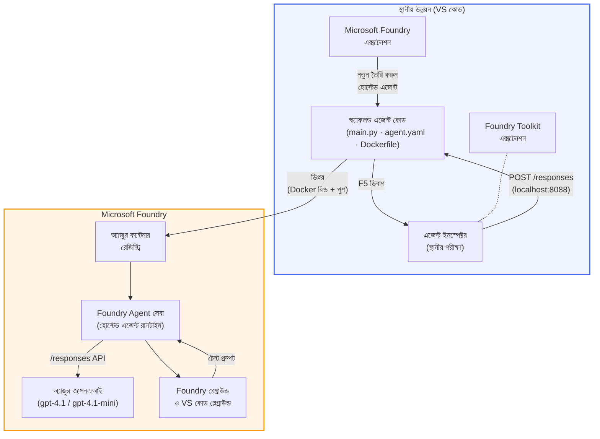

# Foundry Toolkit + Foundry Hosted Agents কর্মশালা

[](https://www.python.org/)
[](https://github.com/microsoft/agents)
[](https://learn.microsoft.com/azure/ai-foundry/agents/concepts/hosted-agents/)
[](https://ai.azure.com/)
[](https://learn.microsoft.com/azure/ai-services/openai/)
[](https://learn.microsoft.com/cli/azure/install-azure-cli)
[](https://learn.microsoft.com/azure/developer/azure-developer-cli/install-azd)
[](https://www.docker.com/)
[](https://marketplace.visualstudio.com/items?itemName=ms-windows-ai-studio.windows-ai-studio)
[](LICENSE)

**Microsoft Foundry Agent Service** এ **Hosted Agents** হিসেবে AI এজেন্ট তৈরি, পরীক্ষা এবং ডিপ্লয় করুন - পুরোপুরি VS Code ব্যবহার করে **Microsoft Foundry এক্সটেনশন** এবং **Foundry Toolkit**।

> **Hosted Agents বর্তমানে প্রিভিউতে রয়েছে।** সমর্থিত অঞ্চল সীমিত - দেখুন [অঞ্চল উপলব্ধতা](https://learn.microsoft.com/azure/foundry/agents/concepts/hosted-agents#region-availability)।

> প্রতিটি ল্যাবের ভিতরে থাকা `agent/` ফোল্ডারটি Foundry এক্সটেনশন দ্বারা **স্বয়ংক্রিয়ভাবে Scaffold করা হয়** - আপনি কোড কাস্টমাইজ করবেন, লোকালি পরীক্ষা করবেন, এবং ডিপ্লয় করবেন।

### 🌐 বহুভাষী সমর্থন

#### GitHub Action এর মাধ্যমে সমর্থিত (স্বয়ংক্রিয় এবং সর্বদা আপ-টু-ডেট)

<!-- CO-OP TRANSLATOR LANGUAGES TABLE START -->
[Arabic](../ar/README.md) | [Bengali](./README.md) | [Bulgarian](../bg/README.md) | [Burmese (Myanmar)](../my/README.md) | [Chinese (Simplified)](../zh-CN/README.md) | [Chinese (Traditional, Hong Kong)](../zh-HK/README.md) | [Chinese (Traditional, Macau)](../zh-MO/README.md) | [Chinese (Traditional, Taiwan)](../zh-TW/README.md) | [Croatian](../hr/README.md) | [Czech](../cs/README.md) | [Danish](../da/README.md) | [Dutch](../nl/README.md) | [Estonian](../et/README.md) | [Finnish](../fi/README.md) | [French](../fr/README.md) | [German](../de/README.md) | [Greek](../el/README.md) | [Hebrew](../he/README.md) | [Hindi](../hi/README.md) | [Hungarian](../hu/README.md) | [Indonesian](../id/README.md) | [Italian](../it/README.md) | [Japanese](../ja/README.md) | [Kannada](../kn/README.md) | [Khmer](../km/README.md) | [Korean](../ko/README.md) | [Lithuanian](../lt/README.md) | [Malay](../ms/README.md) | [Malayalam](../ml/README.md) | [Marathi](../mr/README.md) | [Nepali](../ne/README.md) | [Nigerian Pidgin](../pcm/README.md) | [Norwegian](../no/README.md) | [Persian (Farsi)](../fa/README.md) | [Polish](../pl/README.md) | [Portuguese (Brazil)](../pt-BR/README.md) | [Portuguese (Portugal)](../pt-PT/README.md) | [Punjabi (Gurmukhi)](../pa/README.md) | [Romanian](../ro/README.md) | [Russian](../ru/README.md) | [Serbian (Cyrillic)](../sr/README.md) | [Slovak](../sk/README.md) | [Slovenian](../sl/README.md) | [Spanish](../es/README.md) | [Swahili](../sw/README.md) | [Swedish](../sv/README.md) | [Tagalog (Filipino)](../tl/README.md) | [Tamil](../ta/README.md) | [Telugu](../te/README.md) | [Thai](../th/README.md) | [Turkish](../tr/README.md) | [Ukrainian](../uk/README.md) | [Urdu](../ur/README.md) | [Vietnamese](../vi/README.md)

> **স্থানীয়ভাবে ক্লোন করতে ইচ্ছুক?**
>
> এই রিপোজিটোরি ৫০+ ভাষায় অনুবাদ অন্তর্ভুক্ত করে যা ডাউনলোড সাইজ উল্লেখযোগ্যভাবে বাড়িয়ে দেয়। অনুবাদ ছাড়া ক্লোন করতে, sparse checkout ব্যবহার করুন:
>
> **Bash / macOS / Linux:**
> ```bash
> git clone --filter=blob:none --sparse https://github.com/microsoft-foundry/Foundry_Toolkit_for_VSCode_Lab.git
> cd Foundry_Toolkit_for_VSCode_Lab
> git sparse-checkout set --no-cone '/*' '!translations' '!translated_images'
> ```
>
> **CMD (Windows):**
> ```cmd
> git clone --filter=blob:none --sparse https://github.com/microsoft-foundry/Foundry_Toolkit_for_VSCode_Lab.git
> cd Foundry_Toolkit_for_VSCode_Lab
> git sparse-checkout set --no-cone "/*" "!translations" "!translated_images"
> ```
>
> এতে আপনি পুরো কোর্সটি সম্পন্ন করতে যা যা প্রয়োজন তা অনেক দ্রুত ডাউনলোড করতে পারবেন।
<!-- CO-OP TRANSLATOR LANGUAGES TABLE END -->

---

## আর্কিটেকচার


**প্রবাহ:** Foundry এক্সটেনশন এজেন্ট Scaffold করে → আপনি কোড ও инструкশন কাস্টমাইজ করেন → Agent Inspector দিয়ে লোকালি পরীক্ষা করেন → Foundry তে ডিপ্লয় করেন (Docker ইমেজ ACR তে পুশ করা হয়) → Playground এ যাচাই করেন।

---

## আপনি যা তৈরি করবেন

| ল্যাব | বর্ণনা | অবস্থা |
|-----|-------------|--------|
| **ল্যাব ০১ - সিঙ্গেল এজেন্ট** | **"Explain Like I'm an Executive" এজেন্ট** তৈরি করুন, লোকালি পরীক্ষা করুন, আর Foundry তে ডিপ্লয় করুন | ✅ উপলব্ধ |
| **ল্যাব ০২ - মাল্টি-এজেন্ট কর্মপ্রবাহ** | **"Resume → Job Fit Evaluator"** তৈরি করুন - ৪টি এজেন্ট একসঙ্গে কাজ করে রিজিউমে ফিট স্কোরিং এবং লার্নিং রোডম্যাপ তৈরি করে | ✅ উপলব্ধ |

---

## পরিচিত হন Executive Agent এর সাথে

এই কর্মশালায় আপনি **"Explain Like I'm an Executive" এজেন্ট** তৈরি করবেন - এমন একটি AI এজেন্ট যেটি জটিল প্রযুক্তিগত টার্মগুলো নরম, বোর্ডরুম-সাজানো সারাংশে অনুবাদ করে। কারণ বাস্তবতা হলো, C-suite এর কেউ "v3.2 এ যোগ হওয়া synchronous কলের কারণে thread pool exhaustion" নিয়ে শুনতে চায় না।

আমি এই এজেন্টটি তৈরি করেছি একাধিক ঘটনার পরে যেখানে আমার সাবধানে তৈরি পোস্ট-মর্টেমের উত্তরে পেয়েছিলাম: *"তো... ওয়েবসাইট ডাউন কি না?"*

### এটা কিভাবে কাজ করে

আপনি এতে একটি প্রযুক্তিগত আপডেট দেন। এটি তিনটি বুলেট পয়েন্টে নির্বাক করে দেয় - কোনো জটিল শব্দ নেই, স্ট্যাক ট্রেস নেই, কোনো existential dread নেই। কেবল **কি ঘটেছে**, **ব্যবসায়িক প্রভাব**, এবং **পরবর্তী পদক্ষেপ**।

### কাজ দেখুন

**আপনি বলেন:**
> "API latency v3.2 তে synchronous কলের কারণে thread pool exhaustion এর ফলে বাড়েছে।"

**এজেন্ট উত্তর দেয়:**

> **Executive Summary:**
> - **কি ঘটেছে:** সাম্প্রতিক রিলিজের পরে, সিস্টেম ধীরগতির হয়ে গেছে।
> - **ব্যবসায়িক প্রভাব:** কিছু ব্যবহারকারীরা সার্ভিস ব্যবহার করতে বিলম্ব অনুভব করেছেন।
> - **পরবর্তী পদক্ষেপ:** পরিবর্তনটি পূর্বাবস্থায় ফেরানো হয়েছে এবং পুনরায় ডিপ্লয়ের আগে সংশোধনী প্রস্তুত করা হচ্ছে।

### কেন এই এজেন্ট?

এটি একটি নির্দিষ্ট উদ্দেশ্যের একটি সহজ সিঙ্গেল এজেন্ট - হোস্টেড এজেন্টের কর্মপ্রবাহ শুরু থেকে শেষ পর্যন্ত শিখতে দারুণ। এবং সৎভাবে? প্রতিটি ইঞ্জিনিয়ারিং টিমের এই ধরনের একটি এজেন্ট থাকা দরকার।

---

## কর্মশালা কাঠামো

```
📂 Foundry_Toolkit_for_VSCode_Lab/
├── 📄 README.md                      ← You are here
├── 📂 ExecutiveAgent/                ← Standalone hosted agent project
│   ├── agent.yaml
│   ├── Dockerfile
│   ├── main.py
│   └── requirements.txt
└── 📂 workshop/
    ├── 📂 lab01-single-agent/        ← Full lab: docs + agent code
    │   ├── README.md                 ← Hands-on lab instructions
    │   ├── 📂 docs/                  ← Step-by-step tutorial modules
    │   │   ├── 00-prerequisites.md
    │   │   ├── 01-install-foundry-toolkit.md
    │   │   ├── 02-create-foundry-project.md
    │   │   ├── 03-create-hosted-agent.md
    │   │   ├── 04-configure-and-code.md
    │   │   ├── 05-test-locally.md
    │   │   ├── 06-deploy-to-foundry.md
    │   │   ├── 07-verify-in-playground.md
    │   │   └── 08-troubleshooting.md
    │   └── 📂 agent/                 ← Reference solution (auto-scaffolded by Foundry extension)
    │       ├── agent.yaml
    │       ├── Dockerfile
    │       ├── main.py
    │       └── requirements.txt
    └── 📂 lab02-multi-agent/         ← Resume → Job Fit Evaluator
        ├── README.md                 ← Hands-on lab instructions (end-to-end)
        ├── 📂 docs/                  ← Step-by-step tutorial modules
        │   ├── 00-prerequisites.md
        │   ├── 01-understand-multi-agent.md
        │   ├── 02-scaffold-multi-agent.md
        │   ├── 03-configure-agents.md
        │   ├── 04-orchestration-patterns.md
        │   ├── 05-test-locally.md
        │   ├── 06-deploy-to-foundry.md
        │   ├── 07-verify-in-playground.md
        │   └── 08-troubleshooting.md
        └── 📂 PersonalCareerCopilot/ ← Reference solution (multi-agent workflow)
            ├── agent.yaml
            ├── Dockerfile
            ├── main.py
            └── requirements.txt
```

> **নোট:** প্রতিটি ল্যাবের ভিতরে থাকা `agent/` ফোল্ডারটি **Microsoft Foundry এক্সটেনশন** দ্বারা তৈরি হয় যখন আপনি Command Palette থেকে `Microsoft Foundry: Create a New Hosted Agent` রান করেন। ফাইলগুলো তারপর আপনার এজেন্টের নির্দেশাবলী, টুলস এবং কনফিগারেশন দিয়ে কাস্টমাইজ করা হয়। ল্যাব ০১ আপনাকে এটি শুরু থেকে তৈরি করতে গাইড করে।

---

## শুরু করা যাক

### ১. রিপোজিটরি ক্লোন করুন

```bash
git clone https://github.com/microsoft-foundry/Foundry_Toolkit_for_VSCode_Lab.git
cd Foundry_Toolkit_for_VSCode_Lab
```

### ২. একটি Python ভার্চুয়াল এনভায়রনমেন্ট তৈরি করুন

```bash
python -m venv venv
```

এটি সক্রিয় করুন:

- **Windows (PowerShell):**
  ```powershell
  .\venv\Scripts\Activate.ps1
  ```
- **macOS / Linux:**
  ```bash
  source venv/bin/activate
  ```

### ৩. ডিপেন্ডেন্সি ইনস্টল করুন

```bash
pip install -r workshop/lab01-single-agent/agent/requirements.txt
```

### ৪. পরিবেশগত ভেরিয়েবল কনফিগার করুন

agent ফোল্ডারের ভিতরে থাকা উদাহরণ `.env` ফাইলটি কপি করুন এবং আপনার মানগুলো পূরণ করুন:

```bash
cp workshop/lab01-single-agent/agent/.env.example workshop/lab01-single-agent/agent/.env
```

`workshop/lab01-single-agent/agent/.env` সম্পাদনা করুন:

```env
AZURE_AI_PROJECT_ENDPOINT=https://<your-account>.services.ai.azure.com/api/projects/<your-project>
MODEL_DEPLOYMENT_NAME=<your-model-deployment-name>
```

### ৫. কর্মশালা ল্যাব অনুসরণ করুন

প্রতিটি ল্যাব নিজস্ব মডিউলসমূহ নিয়ে স্বতন্ত্র। মৌলিক শিখতে **ল্যাব ০১** শুরু করুন, এরপর মাল্টি-এজেন্ট কর্মপ্রবাহের জন্য **ল্যাব ০২** এ যান।

#### ল্যাব ০১ - সিঙ্গেল এজেন্ট ([সম্পূর্ণ নির্দেশাবলী](workshop/lab01-single-agent/README.md))

| # | মডিউল | লিঙ্ক |
|---|--------|------|
| ১ | প্রারম্ভিক শর্তাদি পড়ুন | [00-prerequisites.md](workshop/lab01-single-agent/docs/00-prerequisites.md) |
| ২ | Foundry Toolkit ও Foundry এক্সটেনশন ইনস্টল করুন | [01-install-foundry-toolkit.md](workshop/lab01-single-agent/docs/01-install-foundry-toolkit.md) |
| ৩ | একটি Foundry প্রজেক্ট তৈরি করুন | [02-create-foundry-project.md](workshop/lab01-single-agent/docs/02-create-foundry-project.md) |
| ৪ | একটি হোস্টেড এজেন্ট তৈরি করুন | [03-create-hosted-agent.md](workshop/lab01-single-agent/docs/03-create-hosted-agent.md) |
| ৫ | নির্দেশাবলী ও পরিবেশ কনফিগার করুন | [04-configure-and-code.md](workshop/lab01-single-agent/docs/04-configure-and-code.md) |
| ৬ | লোকালি পরীক্ষা করুন | [05-test-locally.md](workshop/lab01-single-agent/docs/05-test-locally.md) |
| ৭ | Foundry তে ডিপ্লয় করুন | [06-deploy-to-foundry.md](workshop/lab01-single-agent/docs/06-deploy-to-foundry.md) |
| ৮ | প্লে গ্রাউন্ডে যাচাই করুন | [07-verify-in-playground.md](workshop/lab01-single-agent/docs/07-verify-in-playground.md) |
| ৯ | সমস্যার সমাধান | [08-troubleshooting.md](workshop/lab01-single-agent/docs/08-troubleshooting.md) |

#### ল্যাব ০২ - মাল্টি-এজেন্ট কর্মপ্রবাহ ([সম্পূর্ণ নির্দেশাবলী](workshop/lab02-multi-agent/README.md))

| # | মডিউল | লিঙ্ক |
|---|--------|------|
| ১ | প্রারম্ভিক শর্তাদি (ল্যাব ০২) | [00-prerequisites.md](workshop/lab02-multi-agent/docs/00-prerequisites.md) |
| ২ | মাল্টি-এজেন্ট আর্কিটেকচার বুঝুন | [01-understand-multi-agent.md](workshop/lab02-multi-agent/docs/01-understand-multi-agent.md) |
| ৩ | মাল্টি-এজেন্ট প্রজেক্ট Scaffold করুন | [02-scaffold-multi-agent.md](workshop/lab02-multi-agent/docs/02-scaffold-multi-agent.md) |
| ৪ | এজেন্ট এবং পরিবেশ কনফিগার করুন | [03-configure-agents.md](workshop/lab02-multi-agent/docs/03-configure-agents.md) |
| ৫ | অর্কেস্ট্রেশন প্যাটার্ন | [04-orchestration-patterns.md](workshop/lab02-multi-agent/docs/04-orchestration-patterns.md) |
| ৬ | লোকালি পরীক্ষা করুন (মাল্টি-এজেন্ট) | [05-test-locally.md](workshop/lab02-multi-agent/docs/05-test-locally.md) |
| 7 | Foundry তে ডিপ্লয় করুন | [06-deploy-to-foundry.md](workshop/lab02-multi-agent/docs/06-deploy-to-foundry.md) |
| 8 | প্লেগ্রাউন্ডে যাচাই করুন | [07-verify-in-playground.md](workshop/lab02-multi-agent/docs/07-verify-in-playground.md) |
| 9 | সমস্যার সমাধান (মাল্টি-এজেন্ট) | [08-troubleshooting.md](workshop/lab02-multi-agent/docs/08-troubleshooting.md) |

---

## রক্ষণাবেক্ষক

<table>
<tr>
    <td align="center"><a href="https://github.com/ShivamGoyal03">
        <br />
        <sub><b>শিবম গয়াল</b></sub>
    </a><br />
    </td>
</tr>
</table>

---

## প্রয়োজনীয় অনুমতিসমূহ (দ্রুত রেফারেন্স)

| পরিস্থিতি | প্রয়োজনীয় ভূমিকা |
|----------|---------------|
| নতুন Foundry প্রকল্প তৈরি করুন | Foundry রিসোর্সে **Azure AI Owner** |
| বিদ্যমান প্রকল্পে ডিপ্লয় করুন (নতুন রিসোর্স) | সাবস্ক্রিপশনে **Azure AI Owner** + **Contributor** |
| পুরোপুরি কনফিগার্ড প্রকল্পে ডিপ্লয় করুন | অ্যাকাউন্টে **Reader** + প্রকল্পে **Azure AI User** |

> **গুরুত্বপূর্ণ:** Azure `Owner` এবং `Contributor` ভূমিকা শুধুমাত্র *ব্যবস্থাপনা* অনুমতি অন্তর্ভুক্ত করে, *বিকাশ* (ডেটা একশন) অনুমতি নয়। এজেন্ট তৈরি এবং ডিপ্লয়ের জন্য আপনার **Azure AI User** অথবা **Azure AI Owner** প্রয়োজন।

---

## রেফারেন্সসমূহ

- [দ্রুত শুরু: আপনার প্রথম হোস্টেড এজেন্ট ডিপ্লয় করুন (VS কোড)](https://learn.microsoft.com/azure/foundry/agents/quickstarts/quickstart-hosted-agent)
- [হোস্টেড এজেন্ট কী?](https://learn.microsoft.com/azure/foundry/agents/concepts/hosted-agents)
- [VS কোডে হোস্টেড এজেন্ট ওয়ার্কফ্লো তৈরি করুন](https://learn.microsoft.com/azure/foundry/agents/how-to/vs-code-agents-workflow-pro-code)
- [একটি হোস্টেড এজেন্ট ডিপ্লয় করুন](https://learn.microsoft.com/azure/foundry/agents/how-to/deploy-hosted-agent)
- [Microsoft Foundry এর জন্য RBAC](https://learn.microsoft.com/azure/foundry/concepts/rbac-foundry)
- [আর্কিটেকচার রিভিউ এজেন্ট স্যাম্পল](https://github.com/Azure-Samples/agent-architecture-review-sample) - MCP টুলস, এক্সকালিড্র ইলাস্ট্রেশন, এবং দ্বৈত ডিপ্লয়মেন্ট সহ বাস্তব হোস্টেড এজেন্ট

---

## লাইসেন্স

[MIT](../../LICENSE)

---

<!-- CO-OP TRANSLATOR DISCLAIMER START -->
**অস্বীকারোক্তি**:
এই দস্তাবেজটি AI অনুবাদ সেবা [Co-op Translator](https://github.com/Azure/co-op-translator) ব্যবহার করে অনূদিত হয়েছে। আমরা যথাসাধ্য নির্ভুলতার চেষ্টা করি, তবে দয়া করে লক্ষ্য করুন যে স্বয়ংক্রিয় অনুবাদে ভুল বা অনির্ভরযোগ্যতা থাকতে পারে। মূল ভাষার দস্তাবেজটিকেই কর্তৃত্বপূর্ণ উৎস হিসেবে বিবেচনা করা উচিত। গুরুত্বপূর্ণ তথ্যের জন্য পেশাদার মানুষের অনুবাদ সুপারিশ করা হয়। এই অনুবাদের ব্যবহারে কোনো ভুল বোঝাবুঝি বা ভুল ব্যাখ্যার জন্য আমরা দায়বদ্ধ নই।
<!-- CO-OP TRANSLATOR DISCLAIMER END -->