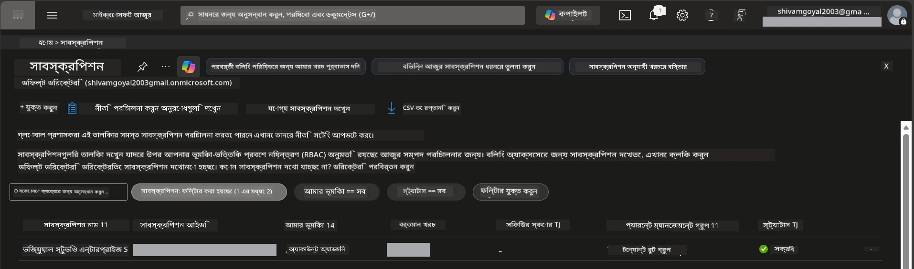

# Module 0 - পূর্বশর্তসমূহ

কর্মশালা শুরু করার আগে, নিশ্চিত করুন আপনার কাছে নিচের টুলস, অ্যাক্সেস, এবং পরিবেশ প্রস্তুত আছে। নিচের প্রতিটি ধাপ অনুসরণ করুন - এগিয়ে যাওয়া উচিত নয়।

---

## 1. Azure অ্যাকাউন্ট ও সাবস্ক্রিপশন

### 1.1 Azure সাবস্ক্রিপশন তৈরি বা যাচাই করুন

1. একটি ব্রাউজার খুলুন এবং যান [https://azure.microsoft.com/free/](https://azure.microsoft.com/free/)।
2. যদি আপনার Azure অ্যাকাউন্ট না থাকে, তাহলে **Start free** তে ক্লিক করুন এবং সাইন-আপ প্রক্রিয়া অনুসরণ করুন। আপনার Microsoft অ্যাকাউন্ট (অথবা একটি তৈরি করুন) এবং পরিচয় যাচাইয়ের জন্য একটি ক্রেডিট কার্ড প্রয়োজন হবে।
3. যদি আপনার আগে থেকেই অ্যাকাউন্ট থাকে, তাহলে সাইন ইন করুন [https://portal.azure.com](https://portal.azure.com) এ।
4. পোর্টালে, বাম পাশের নেভিগেশনে **Subscriptions** ব্লেডে ক্লিক করুন (অথবা উপরের সার্চ বারে "Subscriptions" লিখে সার্চ করুন)।
5. নিশ্চিত করুন আপনি কমপক্ষে একটি **Active** সাবস্ক্রিপশন দেখছেন। **Subscription ID** নোট করে রাখুন - পরে প্রয়োজন হবে।



### 1.2 প্রয়োজনীয় RBAC রোলগুলো বুঝে নিন

[Hosted Agent](https://learn.microsoft.com/azure/foundry/agents/concepts/hosted-agents) ডিপ্লয়মেন্টের জন্য **data action** অনুমতি প্রয়োজন যা স্ট্যান্ডার্ড Azure `Owner` এবং `Contributor` রোলগুলিতে **থেকে থাকে না**। আপনি নিচের [রোল কম্বিনেশনগুলোর](https://learn.microsoft.com/azure/foundry/concepts/rbac-foundry#built-in-roles) একটি প্রয়োজন হবে:

| পরিস্থিতি | প্রয়োজনীয় রোল | কোথায় অ্যাসাইন করবেন |
|----------|---------------|----------------------|
| নতুন Foundry প্রজেক্ট তৈরি | **Azure AI Owner** Foundry রিসোর্সে | Azure পোর্টালের Foundry রিসোর্স |
| বিদ্যমান প্রজেক্টে ডিপ্লয় (নতুন রিসোর্স) | **Azure AI Owner** + **Contributor** সাবস্ক্রিপশনে | সাবস্ক্রিপশন + Foundry রিসোর্স |
| পুরোপুরি কনফিগার করা প্রজেক্টে ডিপ্লয় | **Reader** অ্যাকাউন্টে + **Azure AI User** প্রজেক্টে | অ্যাকাউন্ট + প্রজেক্ট Azure পোর্টালে |

> **মূল নির্দেশিকা:** Azure `Owner` এবং `Contributor` রোলগুলো শুধুমাত্র *ম্যানেজমেন্ট* অনুমতি (ARM অপারেশন) দেয়। আপনি [**Azure AI User**](https://learn.microsoft.com/azure/foundry/concepts/rbac-foundry#built-in-roles) (অথবা তার উপরের) প্রয়োজন *ডেটা অ্যাকশন* এর জন্য, যেমন `agents/write` যা এজেন্ট তৈরী এবং ডিপ্লয়ের জন্য দরকার। আপনি এগুলো [Module 2](02-create-foundry-project.md) এ অ্যাসাইন করবেন।

---

## 2. লোকার টুলস ইনস্টল করুন

নিচের প্রতিটি টুল ইনস্টল করুন। ইনস্টল করার পরে, কাজ করছে কিনা চেক করুন।

### 2.1 Visual Studio Code

1. যান [https://code.visualstudio.com/](https://code.visualstudio.com/)।
2. আপনার OS (Windows/macOS/Linux) এর জন্য ইনস্টলার ডাউনলোড করুন।
3. ডিফল্ট সেটিংস দিয়ে ইনস্টলার চালান।
4. VS Code খুলে নিশ্চিত করুন এটি সফলভাবে লঞ্চ হয়।

### 2.2 Python 3.10+

1. যান [https://www.python.org/downloads/](https://www.python.org/downloads/)।
2. Python 3.10 বা তার পরের ভার্সন ডাউনলোড করুন (3.12+ সুপারিশকৃত)।
3. **Windows:** ইনস্টলেশনের সময় প্রথম স্ক্রিনে **"Add Python to PATH"** চেক করুন।
4. একটি টার্মিনাল খুলুন এবং যাচাই করুন:

   ```powershell
   python --version
   ```

   প্রত্যাশিত আউটপুট: `Python 3.10.x` বা তার বেশি।

### 2.3 Azure CLI

1. যান [https://learn.microsoft.com/cli/azure/install-azure-cli](https://learn.microsoft.com/cli/azure/install-azure-cli)।
2. আপনার OS এর জন্য ইনস্টলেশন নির্দেশনা অনুসরণ করুন।
3. যাচাই করুন:

   ```powershell
   az --version
   ```

   প্রত্যাশিত: `azure-cli 2.80.0` বা তার বেশি।

4. সাইন ইন করুন:

   ```powershell
   az login
   ```

### 2.4 Azure Developer CLI (azd)

1. যান [https://learn.microsoft.com/azure/developer/azure-developer-cli/install-azd](https://learn.microsoft.com/azure/developer/azure-developer-cli/install-azd)।
2. আপনার OS এর জন্য ইনস্টলেশন নির্দেশনা অনুসরণ করুন। Windows এ:

   ```powershell
   winget install microsoft.azd
   ```

3. যাচাই করুন:

   ```powershell
   azd version
   ```

   প্রত্যাশিত: `azd version 1.x.x` বা তার বেশি।

4. সাইন ইন করুন:

   ```powershell
   azd auth login
   ```

### 2.5 Docker Desktop (ঐচ্ছিক)

Docker শুধুমাত্র প্রয়োজন যদি আপনি ডিপ্লয়ের আগে লোকালি কন্টেইনার ইমেজ বিল্ড ও টেস্ট করতে চান। Foundry এক্সটেনশন ডিপ্লয়ের সময় কন্টেইনার বিল্ড স্বয়ংক্রিয়ভাবে হ্যান্ডেল করে।

1. যান [https://docs.docker.com/get-docker/](https://docs.docker.com/get-docker/)।
2. আপনার OS এর জন্য Docker Desktop ডাউনলোড ও ইনস্টল করুন।
3. **Windows:** ইনস্টলেশনের সময় WSL 2 ব্যাকএন্ড সিলেক্ট করা আছে কিনা দেখুন।
4. Docker Desktop চালু করুন এবং সিস্টেম ট্রেতে আইকন **"Docker Desktop is running"** দেখালে যান।
5. একটি টার্মিনাল খুলুন এবং যাচাই করুন:

   ```powershell
   docker info
   ```

   এটি Docker সিস্টেম তথ্য ত্রুটি ছাড়া প্রিন্ট করবে। যদি দেখেন `Cannot connect to the Docker daemon`, তাহলে Docker পুরোপুরি শুরু হতে কিছুক্ষণ অপেক্ষা করুন।

---

## 3. VS Code এক্সটেনশন ইনস্টল করুন

কর্মশালা শুরু হওয়ার আগে আপনাকে তিনটি এক্সটেনশন ইনস্টল করতে হবে।

### 3.1 Microsoft Foundry for VS Code

1. VS Code খুলুন।
2. `Ctrl+Shift+X` চাপুন এক্সটেনশন প্যানেল খুলতে।
3. সার্চ বক্সে টাইপ করুন **"Microsoft Foundry"**।
4. খুঁজে বের করুন **Microsoft Foundry for Visual Studio Code** (পাবলিশার: Microsoft, ID: `TeamsDevApp.vscode-ai-foundry`)।
5. **Install** এ ক্লিক করুন।
6. ইনস্টলেশনের পর, আপনি Activity Bar (বাম সাইডবার) এ **Microsoft Foundry** আইকন দেখতে পারবেন।

### 3.2 Foundry Toolkit

1. এক্সটেনশন প্যানেলে (`Ctrl+Shift+X`), **"Foundry Toolkit"** সার্চ করুন।
2. খুঁজে বের করুন **Foundry Toolkit** (পাবলিশার: Microsoft, ID: `ms-windows-ai-studio.windows-ai-studio`)।
3. **Install** এ ক্লিক করুন।
4. **Foundry Toolkit** আইকন Activity Bar-এ প্রদর্শিত হবে।

### 3.3 Python

1. এক্সটেনশন প্যানেলে, **"Python"** সার্চ করুন।
2. খুঁজে বের করুন **Python** (পাবলিশার: Microsoft, ID: `ms-python.python`)।
3. **Install** এ ক্লিক করুন।

---

## 4. VS Code থেকে Azure এ সাইন ইন করুন

[Microsoft Agent Framework](https://learn.microsoft.com/agent-framework/overview/) [ `DefaultAzureCredential`](https://learn.microsoft.com/azure/developer/python/sdk/authentication/credential-chains#defaultazurecredential-overview) ব্যবহার করে অথেনটিকেশন করে। আপনাকে VS Code-এ Azure এ সাইন ইন থাকতে হবে।

### 4.1 VS Code দিয়ে সাইন ইন

1. VS Code এর নিচের-বাম কর্নারে **Accounts** আইকনে (মানুষের সিলহুয়েট) ক্লিক করুন।
2. **Sign in to use Microsoft Foundry** (অথবা **Sign in with Azure**) এ ক্লিক করুন।
3. একটি ব্রাউজার উইন্ডো খুলবে - আপনার সাবস্ক্রিপশন অ্যাক্সেস করে এমন Azure অ্যাকাউন্ট দিয়ে সাইন ইন করুন।
4. VS Code এ ফিরে আসুন। নিচের-বামে আপনার অ্যাকাউন্ট নাম দেখতে পাবেন।

### 4.2 (ঐচ্ছিক) Azure CLI দিয়ে সাইন ইন

যদি Azure CLI ইনস্টল করে থাকেন এবং CLI-ভিত্তিক অথেনটিকেশন ব্যবহার করতে চান:

```powershell
az login
```

এটি ব্রাউজার খুলবে সাইন ইন করার জন্য। সাইন ইন করার পর সঠিক সাবস্ক্রিপশন সেট করুন:

```powershell
az account set --subscription "<your-subscription-id>"
```

যাচাই করুন:

```powershell
az account show --query "{name:name, id:id, state:state}" --output table
```

আপনি আপনার সাবস্ক্রিপশন নাম, ID, এবং স্টেট = `Enabled` দেখতে পাবেন।

### 4.3 (বিকল্প) সার্ভিস প্রিন্সিপাল অথেনটিকেশন

CI/CD বা শেয়ার্ড পরিবেশের জন্য নিচের এনভায়রনমেন্ট ভেরিয়েবলগুলো সেট করুন:

```powershell
$env:AZURE_TENANT_ID = "<your-tenant-id>"
$env:AZURE_CLIENT_ID = "<your-client-id>"
$env:AZURE_CLIENT_SECRET = "<your-client-secret>"
```

---

## 5. প্রিভিউ সীমাবদ্ধতা

এগোবাড়ানোর আগে নিম্নলিখিত সীমাবদ্ধতাগুলো সম্পর্কে সচেতন থাকুন:

- [**Hosted Agents**](https://learn.microsoft.com/azure/foundry/agents/concepts/hosted-agents) বর্তমানে **পাবলিক প্রিভিউ**-তে আছে - প্রোডাকশন ওয়ার্কলোডের জন্য সুপারিশ করা হয় না।
- **সাপোর্টেড রিজিয়নগুলো সীমিত** - রিসোর্স তৈরি করার আগে [রিজিয়ন অ্যাভেলেবিলিটি](https://learn.microsoft.com/azure/foundry/agents/concepts/hosted-agents#region-availability) চেক করুন। যদি আপনি সাপোর্ট না করে এমন রিজিয়ন বাছাই করেন, ডিপ্লয়মেন্ট ব্যর্থ হবে।
- `azure-ai-agentserver-agentframework` প্যাকেজটি প্রি-রিলিজ (`1.0.0b16`) - APIs পরিবর্তিত হতে পারে।
- স্কেল সীমা: হোস্টেড এজেন্ট 0-5 রেপ্লিকা (স্কেল-টু-জিরো সহ) সমর্থন করে।

---

## 6. প্রিফ্লাইট চেকলিস্ট

নিচের প্রতিটি আইটেম সম্পন্ন করুন। কোনো ধাপ ব্যর্থ হলে, ফিরে গিয়ে ঠিক করুন তারপর এগিয়ে যান।

- [ ] VS Code ত্রুটি ছাড়া খোলে
- [ ] Python 3.10+ PATH এ আছে (`python --version` এ `3.10.x` বা তার বেশি আউটপুট)
- [ ] Azure CLI ইনস্টল করা আছে (`az --version` এ `2.80.0` বা তার বেশি)
- [ ] Azure Developer CLI ইনস্টল করা আছে (`azd version` দিয়ে ভার্সন তথ্য পাওয়া যায়)
- [ ] Microsoft Foundry এক্সটেনশন ইনস্টল করা আছে (Activity Bar-এ আইকন দেখা যায়)
- [ ] Foundry Toolkit এক্সটেনশন ইনস্টল করা আছে (Activity Bar-এ আইকন দেখা যায়)
- [ ] Python এক্সটেনশন ইনস্টল করা আছে
- [ ] আপনি VS Code-এ Azure এ সাইন ইন আছেন (Accounts আইকনে, নিচে-বামে চেক করুন)
- [ ] `az account show` আপনার সাবস্ক্রিপশন দেখায়
- [ ] (ঐচ্ছিক) Docker Desktop চালু আছে (`docker info` ত্রুটি ছাড়া সিস্টেম তথ্য দেখায়)

### চেকপয়েন্ট

VS Code এর Activity Bar খুলুন এবং নিশ্চিত করুন আপনি **Foundry Toolkit** এবং **Microsoft Foundry** সাইডবার ভিউ উভয়ই দেখতে পাচ্ছেন। প্রতিটিতে ক্লিক করে নিশ্চিত করুন এরর ছাড়াই লোড হচ্ছে।

---

**পরবর্তী:** [01 - Install Foundry Toolkit & Foundry Extension →](01-install-foundry-toolkit.md)

---

<!-- CO-OP TRANSLATOR DISCLAIMER START -->
**অস্বীকারোক্তি**:  
এই নথিটি AI অনুবাদ সেবা [Co-op Translator](https://github.com/Azure/co-op-translator) ব্যবহার করে অনূদিত হয়েছে। যদিও আমরা যথাসম্ভব সঠিক হওয়ার চেষ্টা করি, অনুগ্রহ করে সচেতন থাকুন যে স্বয়ংক্রিয় অনুবাদে ভুল বা অসঙ্গতি থাকতে পারে। মূল নথিটি তার নিজ ভাষায় কর্তৃত্বপ্রাপ্ত উৎস হিসেবে বিবেচনা করা উচিত। গুরুত্বপূর্ণ তথ্যের জন্য পেশাদার انسانی অনুবাদ পরামর্শ দেওয়া হয়। এই অনুবাদের ব্যবহারে যে কোনও ভুল বোঝাবুঝি বা ভুল ব্যাখ্যা জন্য আমরা দায়বদ্ধ নই।
<!-- CO-OP TRANSLATOR DISCLAIMER END -->