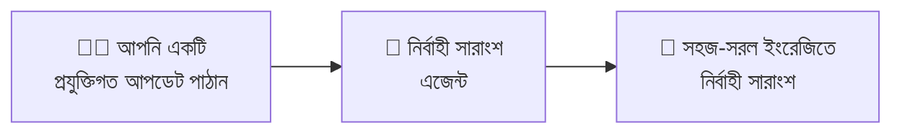

# মডিউল 0 - পরিচিতি

⏱️ ~10 মিনিট

> [!WARNING]
> **পূর্বরূপ এবং সীমাবদ্ধতা:** [হোস্টেড এজেন্টস](https://learn.microsoft.com/azure/foundry/agents/concepts/hosted-agents) বর্তমানে **পাবলিক পূর্বরূপে** আছে - প্রোডাকশন ওয়ার্কলোডের জন্য সুপারিশ করা হয় না। নিম্নলিখিত বিষয়গুলো বিবেচনায় রাখুন:
> - **সমর্থিত অঞ্চল সীমিত** - রিসোর্স তৈরি করার আগে [অঞ্চলের প্রাপ্যতা](https://learn.microsoft.com/azure/foundry/agents/concepts/hosted-agents#region-availability) পরীক্ষা করুন। যদি আপনি একটি অসমর্থিত অঞ্চল নির্বাচন করেন, তবে ডিপ্লয়মেন্ট ব্যর্থ হবে।
> - `azure-ai-agentserver-agentframework` প্যাকেজটি প্রি-রিলিজ - বিভিন্ন সংস্করণের মধ্যে এপিআই পরিবর্তিত হতে পারে।
> - স্কেল সীমা: হোস্টেড এজেন্টস ০–৫ রিপ্লিকা (স্কেল-টু-জিরোসহ) সমর্থন করে।
> - এই ওয়ার্কশপে প্রদর্শিত কিছু ফিচার সার্ভিস GA দিকে যাওয়ার সাথে সাথে পরিবর্তিত হতে পারে।

## আপনি যা তৈরি করবেন

এই ওয়ার্কশপে, আপনি একটি **"ব্যবস্থাপনা কর্মকর্তার মতো ব্যাখ্যা করুন"** এজেন্ট তৈরি করবেন - একটি হোস্টেড AI এজেন্ট যা জটিল প্রযুক্তিগত আপডেটগুলো গ্রহন করে সেগুলোকে সাধারণ ইংরেজি ব্যবস্থাপনা সারসংক্ষেপ হিসেবে পুনঃলিখন করে।

```mermaid
flowchart LR
    A["🧑‍💻 আপনি একটি\nপ্রযুক্তিগত আপডেট পাঠান"] --> B["🤖 নির্বাহী সারাংশ\nএজেন্ট"]
    B --> C["📝 সহজ-সরল ইংরেজিতে\nনির্বাহী সারাংশ"]
```

**এজেন্টটি ব্যবহার করে:**
- **মাইক্রোসফট এজেন্ট ফ্রেমওয়ার্ক** - এজেন্টের লজিক এবং কাঠামোর জন্য
- **ফাউন্ডরি টুলকিট ফর VS কোড** - স্ক্যাফোল্ডিং, স্থানীয়ভাবে টেস্ট এবং ডিপ্লয় করার জন্য
- **একটি AI মডেল** (যেমন, `gpt-4.1-mini/gpt-5-mini`) - সারসংক্ষেপ তৈরির জন্য

এই ল্যাবের শেষে, আপনার কাছে একটি কাজকর্মক্ষম এজেন্ট থাকবে যাকে আপনি Agent Inspector এর মাধ্যমে স্থানীয়ভাবে পরীক্ষা করতে পারবেন এবং ইচ্ছা করলে ক্লাউডে ডিপ্লয় করতে পারবেন।

---

## হোস্টেড এজেন্ট কী?

একটি **হোস্টেড এজেন্ট** হল একটি AI এজেন্ট যা মাইক্রোসফট ফাউন্ডরিতে একটি ম্যানেজড সার্ভিস হিসেবে চলে। নিজের অবকাঠামো পরিচালনা করার বদলে, আপনি আপনার এজেন্ট কোডকে একটি কন্টেইনারে আবদ্ধ করেন এবং ফাউন্ডরি স্কেলিং, হোস্টিং, এবং একটি স্ট্যান্ডার্ড HTTP এন্ডপয়েন্টের মাধ্যমে এক্সপোজ করা পরিচালনা করে।

| ধারণা | এর অর্থ |
|---------|--------------|
| **এজেন্ট** | আপনার পাইটন কোড যা একটি ব্যবহারকারীর মেসেজ গ্রহণ করে, একটি AI মডেল কল করে, এবং একটি কাঠামোবদ্ধ উত্তর প্রদান করে |
| **হোস্টেড** | ফাউন্ডরি আপনার কন্টেইনার চালায় - কোনও VM, Kubernetes, বা অবকাঠামো পরিচালনা করার প্রয়োজন নেই |
| **রেসপন্স প্রোটোকল** | একটি স্ট্যান্ডার্ড HTTP API (`POST /responses`) যা যে কোনো ক্লায়েন্ট আপনার এজেন্টের সাথে ইন্টারঅ্যাক্ট করতে কল করতে পারে |
| **এজেন্ট ইনস্পেক্টর** | একটি স্থানীয় টেস্টিং UI (ফাউন্ডরি টুলকিটের অংশ) যা আপনাকে ডিপ্লয় করার আগে এজেন্টের সাথে চ্যাট করতে দেয় |

এই ওয়ার্কশপে, আপনি শূন্য থেকে সম্পূর্ণ হোস্টেড এজেন্ট তৈরি করবেন - অথবা প্রয়োজনে স্থানীয় টেস্টিং এ থামতে পারেন।

---

## আপনার পথ নির্বাচন করুন

> ⚠️ **চালিয়ে যাওয়ার আগে একটি পথ নির্বাচন করুন।** আপনার পছন্দ নির্ধারণ করবে কোন টুলগুলো ইন্সটল করবেন এবং কোন মডিউলগুলি প্রযোজ্য হবে। যদি আপনার সাবস্ক্রিপশন থাকে তবে পরে Path B থেকে Path A তে পরিবর্তন করতে পারেন।

<strong>🅰️ পথ A - Azure ক্লাউড (Azure সাবস্ক্রিপশন প্রয়োজন)</strong>

| | বিবরণ |
|---|---|
| **এটি কার জন্য?** | আপনার একটি সক্রিয় Azure সাবস্ক্রিপশন আছে এবং আপনি ফাউন্ডরি রিসোর্স তৈরি করতে পারেন |
| **মডেল** | Azure OpenAI via Foundry (যেমন, `gpt-4.1-mini/gpt-5-mini`) |
| **মডিউল কভারেজ** | সমস্ত মডিউল (00–07) |
| **ক্লাউডে ডিপ্লয় করবেন?** | ✅ হ্যাঁ - পুরো এন্ড-টু-এন্ড ডিপ্লয়মেন্ট |

<strong>🅱️ পথ B - স্থানীয় / ফ্রি-টিয়ার (কোন Azure সাবস্ক্রিপশন প্রয়োজন নেই)</strong>

| | বিবরণ |
|---|---|
| **এটি কার জন্য?** | MVP, শিক্ষার্থী, বা যাদের Azure অ্যাক্সেস নেই তাদের জন্য |
| **মডেল** | **Foundry Local** (ফ্রি, আপনার মেশিনে চলে) |
| **মডিউল কভারেজ** | মডিউল 00–04 (ডিপ্লয় এবং ক্লাউড ভেরিফাই ছেড়ে দিন) |
| **ক্লাউডে ডিপ্লয় করবেন?** | ❌ না - শুধুমাত্র Agent Inspector এর মাধ্যমে স্থানীয় টেস্টিং |

---

## সকল পথের জন্য: প্রয়োজনীয় টুলস

নিচের প্রতিটি টুল ইন্সটল করুন। ইন্সটল করার পরে, চেক কমান্ড চালিয়ে কাজ করছে কিনা যাচাই করুন।

| # | টুল | সংস্করণ | ইন্সটল | যাচাই (প্রত্যাশিত আউটপুট) |
|---|------|---------|---------|---------------------------|
| 1 | **ভিজ্যুয়াল স্টুডিও কোড** | সর্বশেষ | [code.visualstudio.com](https://code.visualstudio.com/) | কোনো এরর ছাড়াই খোলে |
| 2 | **পাইথন** | 3.12 বা বেশি| [python.org/downloads](https://www.python.org/downloads/) | `python --version` $\rightarrow$ `Python 3.12.x` |
| 3 | **ফাউন্ডরি টুলকিট ফর VS কোড** | সর্বশেষ | এক্সটেনশন ID: `ms-windows-ai-studio.windows-ai-studio` | Activity Bar এ Foundry আইকন |
| 4 | **পাইথন এক্সটেনশন ফর VS কোড** | সর্বশেষ | এক্সটেনশন ID: `ms-python.python` | এক্সটেনশন প্যানেলে ইন্সটল হয়েছে |

> [!TIP]
> **ইন্সটলেশনের জন্য প্রো-টিপস:**
> - **Python PATH (Windows):** পাইথন ইন্সটলার এর প্রথম স্ক্রিনে সবসময় **"Add Python to PATH"** চেক করুন। এটা না থাকলে, টার্মিনালে `python` কমান্ড চিনতে পারবে না।
> - **একাধিক পাইথন ভার্সন:** যদি আপনার কাছে পাইথন 3.10 এবং 3.12 দুইটি থাকে, তাহলে ভার্চুয়াল এনভায়রনমেন্ট তৈরির জন্য `python3.12 -m venv .venv` ব্যবহার করুন যাতে সঠিক ভার্সন ব্যবহৃত হয়।
> - **ডকার WSL 2 (Windows):** ডকার ডেস্কটপ ইন্সটলেশনের সময়, নিশ্চিত করুন **WSL 2 backend** নির্বাচন করা হয়েছে। Hyper-V দিয়ে ডকার ধীরগতিতে চলে এবং ফাউন্ডরি কন্টেইনার বিল্ডে সমস্যা হতে পারে।
> - **ডকার কাজ করছেনা?** ডকার ডেস্কটপ চালু করার পর ৩০-৬০ সেকেন্ড অপেক্ষা করুন। `docker info` চালান - যদি "Cannot connect to the Docker daemon" দেখায়, তাহলে ডকার এখনও ইনিশিয়ালাইজ হচ্ছে।
> - **VS কোড এক্সটেনশন লোড হচ্ছেনা?** এক্সটেনশন ইন্সটল করার পর উইন্ডো রিলোড করুন: `Ctrl+Shift+P` → `Developer: Reload Window`।

> **উইন্ডোজ ব্যবহারকারীরা:** পাইথন ইন্সটলেশনের সময় অবশ্যই **"Add Python to PATH"** চেক করুন।

**পরবর্তী:** [01 - সেটআপ →](01-setup.md)

---

<!-- CO-OP TRANSLATOR DISCLAIMER START -->
**অস্বীকৃতি**:
এই নথিটি AI অনুবাদ পরিষেবা [Co-op Translator](https://github.com/Azure/co-op-translator) ব্যবহার করে অনূদিত হয়েছে। যদিও আমরা শুদ্ধতার জন্য চেষ্টা করি, অনুগ্রহ করে মনে রাখবেন যে স্বয়ংক্রিয় অনুবাদে ত্রুটি বা অসঙ্গতি থাকতে পারে। মূল নথিটি তার স্বভাষায় কর্তৃত্বপূর্ণ উৎস হিসেবে বিবেচিত হওয়া উচিত। গুরুত্বপূর্ণ তথ্যের জন্য পেশাদার মানব অনুবাদ সুপারিশ করা হয়। এই অনুবাদের ব্যবহারে প্রয়োজনীয় ভুল বোঝাবুঝি বা ভুল ব্যাখ্যার জন্য আমরা দায়বদ্ধ নই।
<!-- CO-OP TRANSLATOR DISCLAIMER END -->