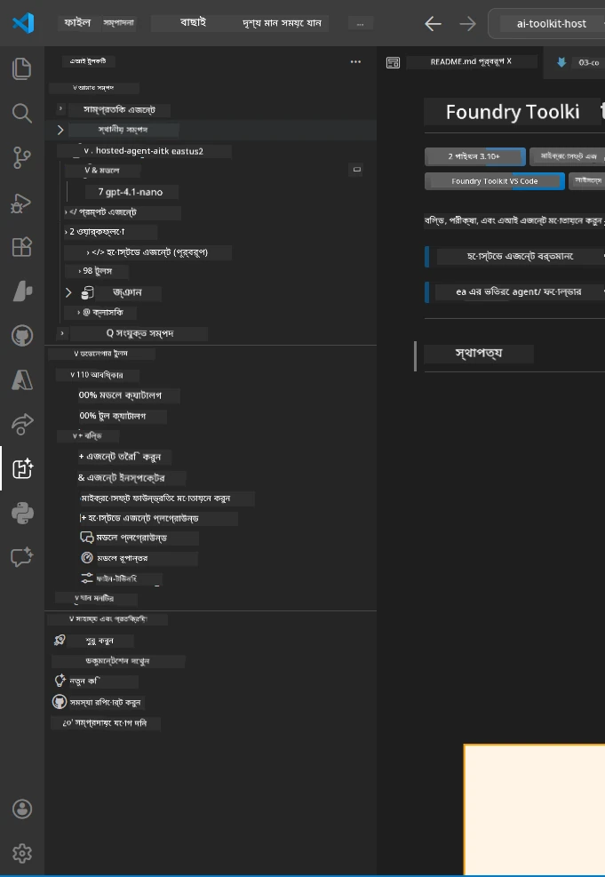
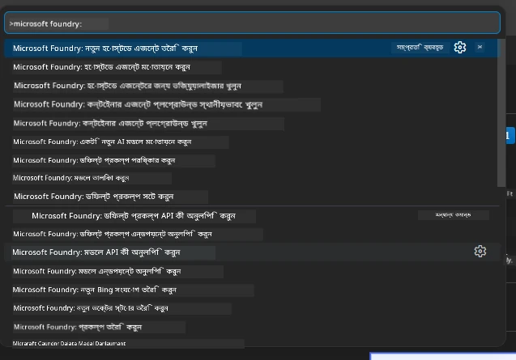

# Module 1 - Foundry Toolkit & Foundry Extension ইনস্টল করুন

এই মডিউলটি আপনাকে এই কর্মশালার জন্য দুটি মূল VS Code এক্সটেনশন ইনস্টল এবং যাচাই করার জন্য নিয়ে যাবে। আপনি যদি আগেই [Module 0](00-prerequisites.md) এ এগুলো ইনস্টল করে থাকেন, তাহলে এই মডিউলটি ব্যবহার করে নিশ্চিত করুন এগুলো সঠিকভাবে কাজ করছে।

---

## Step 1: Microsoft Foundry Extension ইনস্টল করুন

**Microsoft Foundry for VS Code** এক্সটেনশনটি Foundry প্রকল্প তৈরি, মডেল স্থাপন, হোস্ট করা এজেন্ট নির্মাণ এবং সরাসরি VS Code থেকে ডিপ্লয় করার প্রধান টুল।

1. VS Code খুলুন।
2. `Ctrl+Shift+X` চাপুন **Extensions** প্যানেল খোলার জন্য।
3. শর্টকাট সার্চ বক্সে টাইপ করুন: **Microsoft Foundry**
4. ফলাফলের মধ্যে **Microsoft Foundry for Visual Studio Code** টাইটেল দেখুন।
   - প্রকাশক: **Microsoft**
   - এক্সটেনশন আইডি: `TeamsDevApp.vscode-ai-foundry`
5. **Install** বাটনে ক্লিক করুন।
6. ইনস্টলেশন শেষ হওয়া পর্যন্ত অপেক্ষা করুন (আপনি একটি ছোট প্রগ্রেস সূচক দেখতে পাবেন)।
7. ইনস্টলেশনের পর, **Activity Bar** এ দেখুন (VS Code এর বাম দিকের উল্লম্ব আইকন বার)। নতুন **Microsoft Foundry** আইকন দেখতে পাবেন (হীরের মত/এআই আইকন)।
8. **Microsoft Foundry** আইকনে ক্লিক করুন সাইডবার ভিউ খুলতে। সেখানে দেখতে পাবেন:
   - **Resources** (বা Projects)
   - **Agents**
   - **Models**

> **যদি আইকন না দেখায়:** VS Code রিলোড করার চেষ্টা করুন (`Ctrl+Shift+P` → `Developer: Reload Window`)।

---

## Step 2: Foundry Toolkit Extension ইনস্টল করুন

**Foundry Toolkit** এক্সটেনশনটি প্রদান করে [**Agent Inspector**](https://learn.microsoft.com/azure/foundry/agents/how-to/vs-code-agents-workflow-pro-code) - যা এজেন্ট গুলোকে লোকালি পরীক্ষা ও ডিবাগ করার একটি ভিজ্যুয়াল ইন্টারফেস - পাশাপাশি প্লেগ্রাউন্ড, মডেল ম্যানেজমেন্ট এবং মূল্যায়ন টুলস।

1. Extensions প্যানেলে (`Ctrl+Shift+X`), সার্চ বক্স খালি করুন এবং টাইপ করুন: **Foundry Toolkit**
2. ফলাফলে **Foundry Toolkit** খুঁজুন।
   - প্রকাশক: **Microsoft**
   - এক্সটেনশন আইডি: `ms-windows-ai-studio.windows-ai-studio`
3. **Install** ক্লিক করুন।
4. ইনস্টলেশনের পর, **Foundry Toolkit** আইকন Activity Bar এ (রোবট/স্পার্কেলের মত আইকন) প্রদর্শিত হবে।
5. **Foundry Toolkit** আইকনে ক্লিক করুন সাইডবার ভিউ দেখতে। Foundry Toolkit স্বাগত স্ক্রীন দেখতে পাবেন যার মধ্যে অপশন থাকবে:
   - **Models**
   - **Playground**
   - **Agents**

---

## Step 3: দুইটি এক্সটেনশন কাজ করছে কিনা যাচাই করুন

### 3.1 Microsoft Foundry Extension যাচাই করুন

1. Activity Bar এ **Microsoft Foundry** আইকনে ক্লিক করুন।
2. আপনি Azure এ সাইন ইন করে থাকলে (Module 0 থেকে), আপনার প্রোজেক্টগুলো **Resources** এ তালিকাভুক্ত দেখতে পাবেন।
3. যদি লগইন প্রম্পট আসে, **Sign in** ক্লিক করুন এবং অথেন্টিকেশন ফ্লো অনুসরণ করুন।
4. সাইডবার কোনো ত্রুটি ছাড়াই দেখতে পাচ্ছেন কি নিশ্চিত করুন।

### 3.2 Foundry Toolkit Extension যাচাই করুন

1. Activity Bar এ **Foundry Toolkit** আইকনে ক্লিক করুন।
2. স্বাগত ভিউ বা প্রধান প্যানেল ত্রুটি ছাড়াই লোড হচ্ছে নিশ্চিত করুন।
3. এখনো কিছু কনফিগার করার দরকার নেই - আমরা Agent Inspector ব্যবহার করব [Module 5](05-test-locally.md) এ।

### 3.3 Command Palette এর মাধ্যমে যাচাই করুন

1. `Ctrl+Shift+P` চাপুন Command Palette খুলতে।
2. টাইপ করুন **"Microsoft Foundry"** - নিচের মতো কমান্ড দেখতে পাবেন:
   - `Microsoft Foundry: Create a New Hosted Agent`
   - `Microsoft Foundry: Deploy Hosted Agent`
   - `Microsoft Foundry: Open Model Catalog`
3. `Escape` চাপুন Command Palette বন্ধ করতে।
4. আবার Command Palette খোলুন এবং টাইপ করুন **"Foundry Toolkit"** - দেখতে পাবেন কমান্ড যেমন:
   - `Foundry Toolkit: Open Agent Inspector`

> যদি এই কমান্ডগুলো না দেখায়, এক্সটেনশনগুলো সঠিকভাবে ইনস্টল হয়নি হতে পারে। আনইনস্টল করে আবার ইনস্টল করার চেষ্টা করুন।

---

## এই এক্সটেনশনগুলো এই কর্মশালায় কী করে

| Extension | কী করে | কখন ব্যবহার করবেন |
|-----------|---------|-------------------|
| **Microsoft Foundry for VS Code** | Foundry প্রকল্প তৈরি, মডেল স্থাপন, **[hosted agents](https://learn.microsoft.com/azure/foundry/agents/concepts/hosted-agents)** স্ক্যাফোল্ড (স্বয়ংক্রিয়ভাবে `agent.yaml`, `main.py`, `Dockerfile`, `requirements.txt` তৈরি করে) এবং [Foundry Agent Service](https://learn.microsoft.com/azure/foundry/agents/overview) এ ডিপ্লয় করে | Modules 2, 3, 6, 7 |
| **Foundry Toolkit** | লোকালি agent পরীক্ষা/ডিবাগ করার Agent Inspector, প্লেগ্রাউন্ড UI, মডেল ম্যানেজমেন্ট | Modules 5, 7 |

> **Foundry এক্সটেনশন এই কর্মশালার সবচেয়ে গুরুত্বপূর্ণ টুল।** এটি সম্পূর্ণ প্রক্রিয়া পরিচালনা করে: scaffold → configure → deploy → verify। Foundry Toolkit তা সম্পূরক হিসেবে লোকালি টেস্ট করার জন্য ভিজ্যুয়াল Agent Inspector প্রদান করে।

---

### চেকপয়েন্ট

- [ ] Activity Bar এ Microsoft Foundry আইকন দৃশ্যমান
- [ ] ক্লিক করলে সাইডবার ত্রুটি ছাড়াই খুলে
- [ ] Activity Bar এ Foundry Toolkit আইকন দৃশ্যমান
- [ ] ক্লিক করলে সাইডবার ত্রুটি ছাড়াই খুলে
- [ ] `Ctrl+Shift+P` → "Microsoft Foundry" টাইপ করলে উপলব্ধ কমান্ড দেখায়
- [ ] `Ctrl+Shift+P` → "Foundry Toolkit" টাইপ করলে উপলব্ধ কমান্ড দেখায়

---

**আগের:** [00 - Prerequisites](00-prerequisites.md) · **পরবর্তী:** [02 - Create Foundry Project →](02-create-foundry-project.md)

---

<!-- CO-OP TRANSLATOR DISCLAIMER START -->
**অস্বীকৃতি**:  
এই নথিটি AI অনুবাদ সেবা [Co-op Translator](https://github.com/Azure/co-op-translator) ব্যবহার করে অনূদিত হয়েছে। যদিও আমরা যথাসাধ্য সঠিকতার দিকে নজর দিই, দয়া করে জানুন যে স্বয়ংক্রিয় অনুবাদে ত্রুটি বা অসঙ্গতি থাকতে পারে। মূল নথি তার নিজস্ব ভাষায় প্রাধান্যপূর্ণ উৎস হিসেবে বিবেচিত হওয়া উচিত। গুরুত্বপূর্ণ তথ্যের জন্য পেশাদার মানব অনুবাদ সুপারিশ করা হয়। এই অনুবাদের ব্যবহারেเกิด কোনো ভুল বোঝাবুঝি বা ভুল ব্যাখ্যার জন্য আমরা কোনো দায়িত্ব গ্রহণ করি না।
<!-- CO-OP TRANSLATOR DISCLAIMER END -->