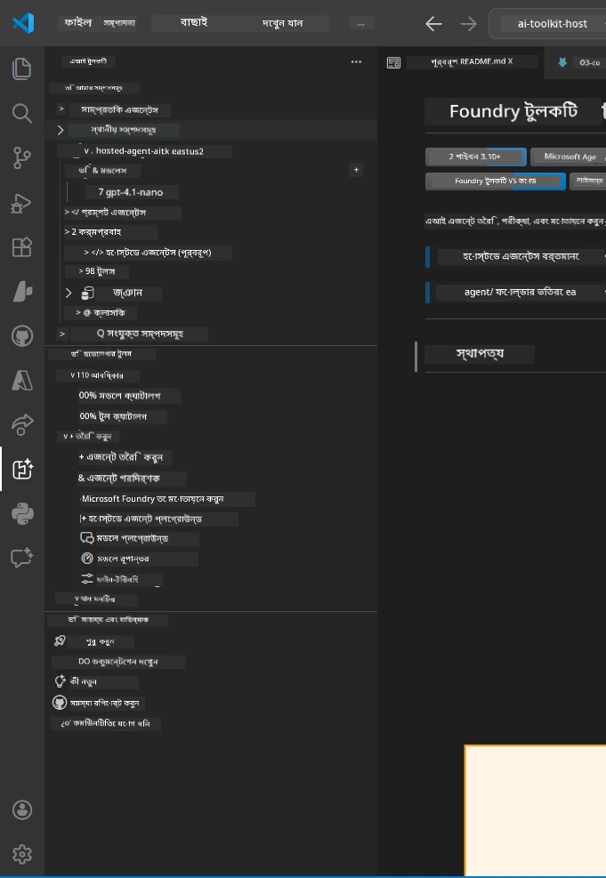
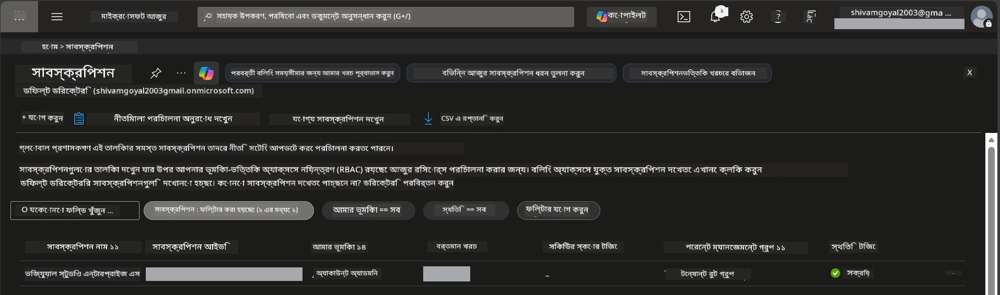
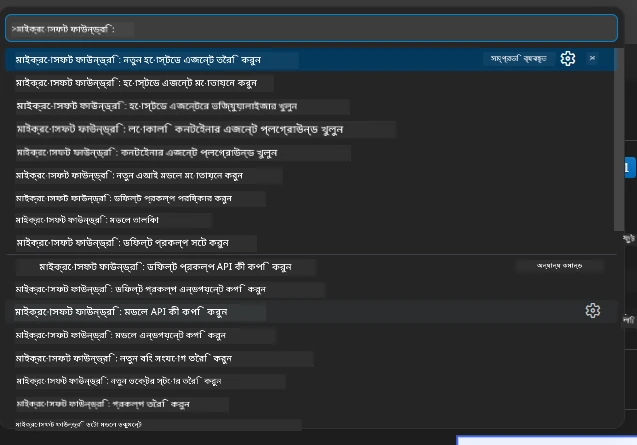
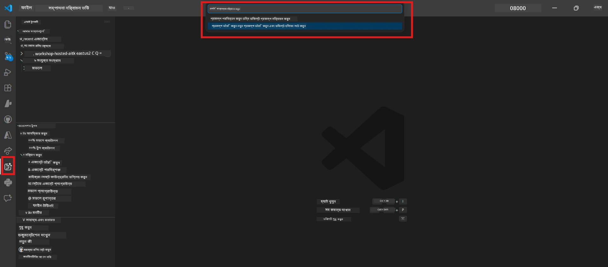
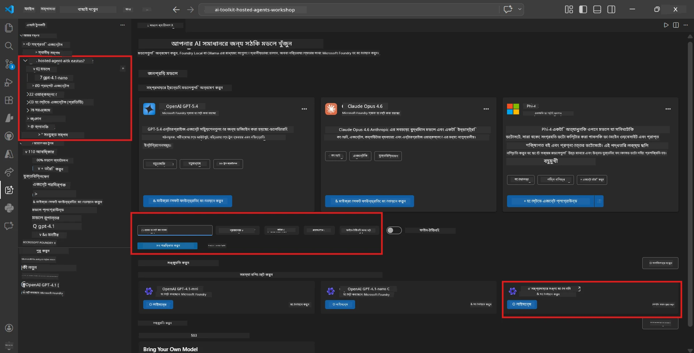
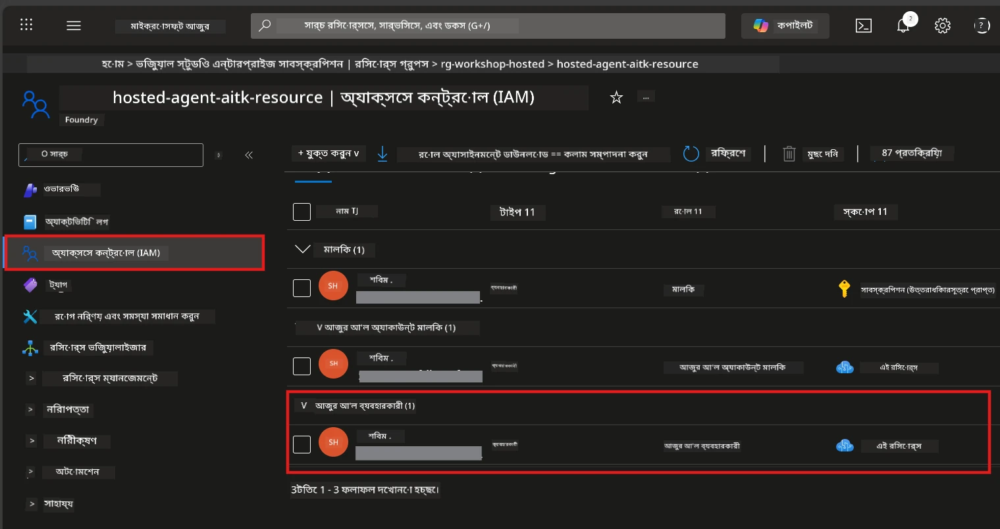

# সেটআপ: এক্সটেনশন, প্রকল্প ও মডেল

⏱️ ~১৫ মিনিট

এই মডিউলে, আপনি Foundry Toolkit এক্সটেনশন ইন্সটল ও যাচাই করবেন, একটি Foundry প্রকল্প তৈরি (অথবা সংযুক্ত) করবেন, এবং আপনার এজেন্ট ব্যবহারের জন্য একটি মডেল ডিপ্লয় করবেন।

## ধাপ ১: Foundry Toolkit ইন্সটল করা

**Foundry Toolkit for VS Code** হল এই কর্মশালার প্রধান এক্সটেনশন। এটি প্রকল্প তৈরি, মডেল ডিপ্লয়মেন্ট, এজেন্ট স্ক্যাফোল্ডিং, লোকাল টেস্টিং (Agent Inspector) এবং ক্লাউড ডিপ্লয়মেন্ট সরবরাহ করে — সবই VS Code থেকে।

১. VS Code খুলুন তারপর `Ctrl+Shift+X` প্রেস করে **Extensions** প্যানেল খুলুন।
২. **Foundry Toolkit** অনুসন্ধান করুন।
৩. **Foundry Toolkit for VS Code** (প্রকাশক: Microsoft, ID: `ms-windows-ai-studio.windows-ai-studio`) ইন্সটল করুন।
৪. ইন্সটলেশনের পর, **Foundry Toolkit** আইকন Activity Bar (বাম সাইডবার) তে প্রদর্শিত হবে।

> *نوٹ: পুরনো এক্সটেনশন সংস্করণে Activity Bar এ "AI TOOLKIT" দেখাতে পারে। কার্যকারিতা একই।*



## ধাপ ২: আপনার অ্যাক্সেস অনুযায়ী সেটআপ করুন

> **আপনার পথ নির্বাচন করুন:** আপনার সেটআপ অনুযায়ী নিচের বিভাগটি খুলুন। আপনাকে কেবল **একটি** পথ সম্পন্ন করতে হবে।

<details>
<summary><strong>🅰️ পথ এ - Azure ক্লাউড (Azure সাবস্ক্রিপশন প্রয়োজন)</strong></summary>

### Azure CLI

১. [learn.microsoft.com/cli/azure/install-azure-cli](https://learn.microsoft.com/cli/azure/install-azure-cli) থেকে ইন্সটল করুন।
২. যাচাই করুন: `az --version` (২.৮০.০+ আশা করুন)।
৩. সাইন ইন করুন: `az login`

### প্রমাণীকরণের অপশনসমূহ

[Microsoft Agent Framework](https://learn.microsoft.com/agent-framework/overview/) [`DefaultAzureCredential`](https://learn.microsoft.com/azure/developer/python/sdk/authentication/credential-chains#defaultazurecredential-overview) ব্যবহার করে যা বিভিন্ন প্রমাণীকরণের পদ্ধতি ধারাবাহিকভাবে চেষ্টা করে। আপনার পরিবেশের জন্য উপযুক্ত পদ্ধতি বেছে নিন:

#### অপশন ১: VS Code একাউন্ট (কর্মশালার জন্য সুপারিশকৃত)
১. VS Code এর বাম নিচের কোণে **Accounts** আইকনে (ব্যক্তির সিলুয়েট) ক্লিক করুন।
২. **Microsoft Foundry ব্যবহার করতে সাইন ইন করুন** (অথবা **Azure দিয়ে সাইন ইন করুন**) নির্বাচন করুন।
৩. ব্রাউজার খুলবে - আপনার Azure সাবস্ক্রিপশন অ্যাক্সেসপত্রযুক্ত অ্যাকাউন্ট দিয়ে সাইন ইন করুন।
৪. VS Code এ ফিরে আসুন। বাম নিচে আপনার অ্যাকাউন্ট নাম দেখাবে।

#### অপশন ২: Azure CLI
```bash
az login
az account set --subscription "<your-subscription-id>"
```

#### অপশন ৩: সার্ভিস প্রিন্সিপাল (এন্টারপ্রাইজ/CI)
লকড-ডাউন পরিবেশ বা CI/CD পাইপলাইনের জন্য, আপনার `.env` ফাইলে নিচের পরিবেশ ভেরিয়েবলগুলো সেট করুন:
```env
AZURE_TENANT_ID=<your-tenant-id>
AZURE_CLIENT_ID=<your-client-id>
AZURE_CLIENT_SECRET=<your-client-secret>
```

> **DefaultAzureCredential কাজের পদ্ধতি:** প্রথমে পরিবেশ ভেরিয়েবলগুলি চেষ্টা করে, তারপর ম্যানেজড আইডেন্টিটি, তারপর VS Code সাইন-ইন, তারপর Azure CLI - এবং যেটি প্রথম সফল হয় সেটি ব্যবহার করে। দেখুন [ক্রেডেনশিয়াল চেইন ডকুমেন্টেশন](https://learn.microsoft.com/azure/developer/python/sdk/authentication/credential-chains#defaultazurecredential-overview)।

### Azure Developer CLI (azd)

১. ইন্সটল করুন: `winget install microsoft.azd` (Windows) অথবা দেখুন [ইন্সটল ডকস](https://learn.microsoft.com/azure/developer/azure-developer-cli/install-azd)।
২. যাচাই করুন: `azd version`
৩. সাইন ইন করুন: `azd auth login`

### Docker Desktop (ঐচ্ছিক)

লোকাল কনটেইনার তৈরি করতে চাইলে Docker দরকার। Foundry এক্সটেনশন ডিপ্লয়মেন্টের সময় বিল্ডগুলি স্বয়ংক্রিয়ভাবে পরিচালনা করে।

১. [docs.docker.com/get-docker](https://docs.docker.com/get-docker/) থেকে ইন্সটল করুন।
২. যাচাই করুন: `docker info`

### Azure সাবস্ক্রিপশন এবং RBAC

১. [portal.azure.com](https://portal.azure.com) এ সাইন ইন করুন।
২. **Subscriptions** এ যান এবং কমপক্ষে একটি **Active** আছে কিনা নিশ্চিত করুন।
৩. আপনার **Subscription ID** নোট করুন — মডিউল ০১ এ দরকার হবে।



#### RBAC পরিস্থিতি টেবিল

[Hosted Agent](https://learn.microsoft.com/azure/foundry/agents/concepts/hosted-agents) ডিপ্লয়মেন্টের জন্য **data action** অনুমতি প্রয়োজন যা সাধারণ Azure `Owner` এবং `Contributor` ভূমিকা রাখে না। আপনি কোন কোন ভূমিকা প্রয়োজন তা নিচের টেবিল থেকে নির্ধারণ করুন:

| পরিস্থিতি | প্রয়োজনীয় ভূমিকা | কোথায় নিয়োগ করবেন |
|----------|---------------|----------------------|
| নতুন Foundry প্রকল্প তৈরি | Foundry রিসোর্সে **Azure AI Owner** | Azure পোর্টালের Foundry রিসোর্সে |
| বিদ্যমান প্রকল্পে ডিপ্লয় (নতুন রিসোর্স) | সাবস্ক্রিপশনে **Azure AI Owner** + **Contributor** | সাবস্ক্রিপশন + Foundry রিসোর্স |
| সম্পূর্ণ কনফিগারড প্রকল্পে ডিপ্লয় | অ্যাকাউন্টে **Reader** + প্রকল্পে **Azure AI User** | Azure পোর্টালের অ্যাকাউন্ট + প্রকল্প |
| শুধু লোকাল টেস্টিং (কোনো ডিপ্লয়মেন্ট নয়) | প্রকল্পে **Azure AI User** | Azure পোর্টালের প্রকল্পে |

> **প্রধান কথা:** Azure `Owner` এবং `Contributor` ভূমিকা শুধুমাত্র *ম্যানেজমেন্ট* অনুমতি দেয় (ARM অপারেশন)। *ডেটা আন্দোলনের* জন্য যেমন `agents/write` - যা এজেন্ট তৈরি ও ডিপ্লয়ের জন্য প্রয়োজন - সেই জন্য দরকার [**Azure AI User**](https://learn.microsoft.com/azure/foundry/concepts/rbac-foundry#built-in-roles) বা উচ্চতর ভূমিকা।

## Foundry প্রকল্প সংযুক্ত বা তৈরি করুন



১. `Ctrl+Shift+P` প্রেস করুন → **Foundry Toolkit: Create Project** টাইপ করুন → নির্বাচন করুন।
২. ড্রপডাউন থেকে আপনার **Azure সাবস্ক্রিপশন** নির্বাচন করুন।
৩. একটি **resource group** নির্বাচন বা তৈরি করুন (যেমন, `rg-hosted-agents-workshop`)।
৪. এমন একটি **region** নির্বাচন করুন যা হোস্টেড এজেন্ট সাপোর্ট করে: `East US`, `West US 2`, অথবা `Sweden Central`। দেখুন [এলাকা প্রাপ্যতা](https://learn.microsoft.com/azure/foundry/agents/concepts/hosted-agents#region-availability)।
৫. একটি প্রকল্প নাম লিখুন (যেমন, `workshop-agents`)।
৬. প্রোভিশনিং এর জন্য ২–৫ মিনিট অপেক্ষা করুন। VS Code এ একটি প্রগতি বিজ্ঞপ্তি প্রদর্শিত হবে।
৭. শেষ হলে, আপনার প্রকল্প **Foundry Toolkit** সাইডবারে **MY RESOURCES** এর অধীনে প্রদর্শিত হবে।



## একটি মডেল ডিপ্লয় ও RBAC নির্ধারণ করুন

আপনার হোস্টেড এজেন্টের উত্তর উৎপাদনের জন্য একটি এআই মডেল প্রয়োজন।

#### মডেল নির্বাচন ম্যাট্রিক্স
আপনার প্রয়োজন অনুযায়ী, বিভিন্ন মডেল স্তর থেকে নির্বাচন করুন:

| মডেল | শ্রেষ্ঠ | খরচ | টীকা |
|-------|----------|------|-------|
| `gpt-4.1` | উচ্চমানের, সূক্ষ্ম উত্তর | উচ্চতর | সেরা ফলাফল, চূড়ান্ত পরীক্ষার জন্য সুপারিশকৃত |
| `gpt-4.1-mini/gpt-5-mini` | দ্রুত পুনরাবৃত্তি, কম খরচ | কম | কর্মশালা উন্নয়ন ও দ্রুত পরীক্ষার জন্য ভালো |
| `gpt-4.1-nano` | হালকা কাজের জন্য | সবচেয়ে কম | সর্বাধিক সাশ্রয়ী, তবে সহজ প্রতিক্রিয়া |

১. `Ctrl+Shift+P` প্রেস করুন → **Foundry Toolkit: Open Model Catalog** (অথবা সাইডবারে DEVELOPER TOOLS এর অধীনে **Model Catalog** ক্লিক করুন → Discover)।
২. ক্যাটালগে **gpt-4.1** অনুসন্ধান করুন।
৩. **OpenAI GPT-4.1-mini** (বা উন্নত গুণমানের জন্য `gpt-5-mini`) খুঁজে বের করুন এবং **Deploy** ক্লিক করুন।



৪. ডিপ্লয়মেন্ট কনফিগারেশনে:
   - **Deployment নাম:** ডিফল্ট থাকবে অথবা আপনি কাস্টম নাম দিতে পারেন। **এই নাম মনে রাখবেন।**
   - **লক্ষ্য:** নির্বাচিত করুন **Deploy to Foundry Toolkit** → আপনার প্রকল্প নির্বাচন করুন।
৫. **Deploy** ক্লিক করুন এবং ১–৩ মিনিট অপেক্ষা করুন।

> **প্রস্তাবনা:** কর্মশালার জন্য `gpt-4.1-mini/gpt-5-mini` ব্যবহার করুন - দ্রুত, সাশ্রয়ী এবং ভাল ফলাফল দেয়।

### আপনার মানগুলি নোট করুন

ডিপ্লয়মেন্টের পর, এই দুইটি মান নোট করুন (মডিউল ০৩ এ দরকার):

| মান | কোথায় পাবেন |
|-------|-----------------|
| **প্রকল্প এন্ডপয়েন্ট** | সাইডবারে আপনার প্রকল্প ক্লিক করুন → বিস্তারিত ভিউতে URL দেখাবে (যেমন `https://<account>.services.ai.azure.com/api/projects/<project>`) |
| **মডেল ডিপ্লয়মেন্ট নাম** | প্রকল্প সম্প্রসারণ করুন → **Models** → আপনার ডিপ্লয়কৃত মডেলের পাশে নাম (যেমন `gpt-4.1-mini/gpt-5-mini`) |

### RBAC ভূমিকা নিয়োগ করুন

> ⚠️ **এটা সবচেয়ে সাধারণ ভুল হয় এমন ধাপ।** সঠিক ভূমিকা ছাড়া মডিউল ০৫ এ ডিপ্লয় ব্যর্থ হবে।

#### কোন ভূমিকা দরকার?
আপনার পরিস্থিতির উপর নির্ভর করে, নিচের ভূমিকা সমন্বয়গুলি প্রয়োজন:

| পরিস্থিতি | প্রয়োজনীয় ভূমিকা | কোথায় নিয়োগ করবেন |
|----------|---------------|----------------------|
| নতুন Foundry প্রকল্প তৈরি | Foundry রিসোর্সে **Azure AI Owner** | Azure পোর্টালে Foundry রিসোর্স |
| বিদ্যমান প্রকল্পে ডিপ্লয় (নতুন রিসোর্স) | সাবস্ক্রিপশনে **Azure AI Owner** + **Contributor** | সাবস্ক্রিপশন + Foundry রিসোর্স |
| সম্পূর্ণ কনফিগারড প্রকল্পে ডিপ্লয় | অ্যাকাউন্টে **Reader** + প্রকল্পে **Azure AI User** | Azure পোর্টালের অ্যাকাউন্ট + প্রকল্প |

**প্রধান কথা:** Azure `Owner` এবং `Contributor` ভূমিকা শুধুমাত্র *ম্যানেজমেন্ট* অনুমতি দেয়। *ডেটা আন্দোলনের* জন্য যেমন `agents/write` যা এজেন্ট তৈরি ও ডিপ্লয়ের জন্য দরকার, সেই জন্য **Azure AI User** (অথবা উচ্চতর) প্রয়োজন।

১. [portal.azure.com](https://portal.azure.com) খুলুন।
২. আপনার **Foundry প্রকল্প** নাম অনুসন্ধান করুন → ধরনের ফলাফল **"Foundry Toolkit project"** ক্লিক করুন (অ্যাকাউন্ট নয়)।
৩. বাম নেভিগেশনে **Access control (IAM)** ক্লিক করুন।
৪. **+ Add** ক্লিক করুন → **Add role assignment** নির্বাচন করুন।
৫. **Role ট্যাব:** **Azure AI User** খুঁজুন, নির্বাচন করুন, **Next** ক্লিক করুন।
৬. **Members ট্যাব:** নির্বাচন করুন **User, group, or service principal** → **+ Select members** → নিজেকে খুঁজে নির্বাচন করুন → **Select** ক্লিক করুন।
৭. **Review + assign** ক্লিক করুন → পুনরায় **Review + assign** ক্লিক করুন।
৮. প্রচারের জন্য **১–২ মিনিট অপেক্ষা করুন**।

> **কেন এই ভূমিকা?** Azure `Owner`/`Contributor` কেবলমাত্র ম্যানেজমেন্ট অনুমতি দেয়। **Azure AI User** ভূমিকা দেয় `agents/write` ডেটা অ্যাকশন যা এজেন্ট তৈরি ও ডিপ্লয় করতে দরকার। দেখুন [Foundry RBAC ডকুমেন্টেশন](https://learn.microsoft.com/azure/foundry/concepts/rbac-foundry#built-in-roles)।



</details>

<details>
<summary><strong>🅱️ পথ বি - লোকাল / ফ্রি-টিয়ার (কোনো Azure সাবস্ক্রিপশন প্রয়োজন নেই)</strong></summary>

### Foundry Local

Foundry Local আপনাকে নিজের মেশিনে AI মডেল চালানোর সুবিধা দেয় — কোনো ক্লাউড অ্যাকাউন্ট প্রয়োজন নেই। আপনি Foundry Toolkit ব্যবহার করে মডেল ক্যাটালগ থেকে Foundry Local মডেলগুলো অ্যাক্সেস করতে পারেন এইভাবে:

১. Foundry Toolkit এক্সটেনশনে যান।
২. Foundry Toolkit নেভিগেশনে **Developer Tools** > **Model Catalog** নির্বাচন করুন।
৩. নতুন উইন্ডোতে, নেভিগেশন বারে থেকে **local** নির্বাচন করুন।
৪. **Phi 4 Mini** তে স্ক্রল করুন, এবং **add button** ক্লিক করুন; একটি পপ-আপ আসবে যা মডেল ডাউনলোড হচ্ছে বলবে।
৫. মডেল ডাউনলোড সম্পন্ন হলে, আপনি পরবর্তী ধাপে যেতে পারবেন।

</details>

### ✅ চেকপয়েন্ট


- [ ] `Ctrl+Shift+P` → "Foundry Toolkit" উপলব্ধ কমান্ড দেখাচ্ছে
- [ ] Foundry Toolkit এক্সটেনশন ইন্সটল হয়েছে এবং সাইডবারে কোনো ত্রুটি ছাড়াই লোড হচ্ছে
- [ ] VS Code খুলে সঠিকভাবে চলছে
- [ ] `python --version` দেখাচ্ছে ৩.১০+
- [ ] Foundry Toolkit আইকন VS Code Activity Bar-এ দৃশ্যমান
- [ ] **পথ এ:** `az login` সফল হয়েছে, সাবস্ক্রিপশন সক্রিয়
- [ ] **পথ বি:** Foundry Local চলছে (`foundry local status`)
- [ ] **পথ এ:** Foundry প্রকল্প সাইডবারে দৃশ্যমান, মডেল ডিপ্লয় হয়েছে, Azure AI User ভূমিকা দেওয়া হয়েছে
- [ ] **পথ বি:** Foundry Local মডেল সঙ্গে চলছে
- [ ] আপনি আপনার **এন্ডপয়েন্ট** এবং **মডেল ডিপ্লয়মেন্ট নাম** নোট করেছেন


**পূর্ববর্তী:** [00 - পূর্বশর্তাদি](00-prerequisites.md) · **পরবর্তী:** [02 - হোস্টেড এজেন্ট তৈরি →](02-create-hosted-agent.md)

---

<!-- CO-OP TRANSLATOR DISCLAIMER START -->
**অস্বীকৃতি**:
এই নথিটি AI অনুবাদ পরিষেবা [Co-op Translator](https://github.com/Azure/co-op-translator) ব্যবহার করে অনূদিত হয়েছে। যদিও আমরা শুদ্ধতার জন্য চেষ্টা করি, অনুগ্রহ করে মনে রাখবেন যে স্বয়ংক্রিয় অনুবাদে ত্রুটি বা অসঙ্গতি থাকতে পারে। মূল নথিটি তার স্বভাষায় কর্তৃত্বপূর্ণ উৎস হিসেবে বিবেচিত হওয়া উচিত। গুরুত্বপূর্ণ তথ্যের জন্য পেশাদার মানব অনুবাদ সুপারিশ করা হয়। এই অনুবাদের ব্যবহারে প্রয়োজনীয় ভুল বোঝাবুঝি বা ভুল ব্যাখ্যার জন্য আমরা দায়বদ্ধ নই।
<!-- CO-OP TRANSLATOR DISCLAIMER END -->