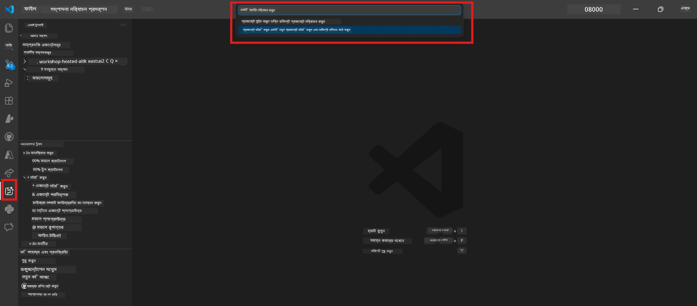
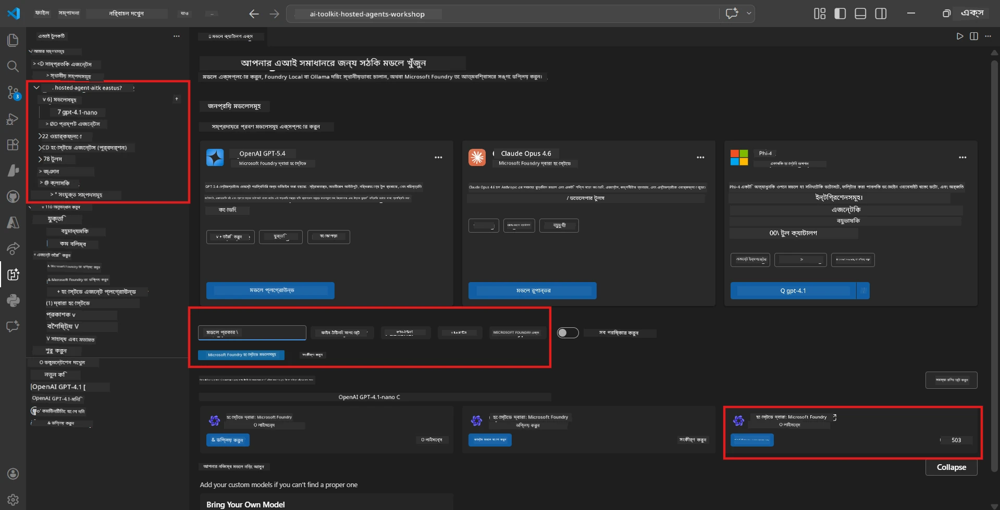
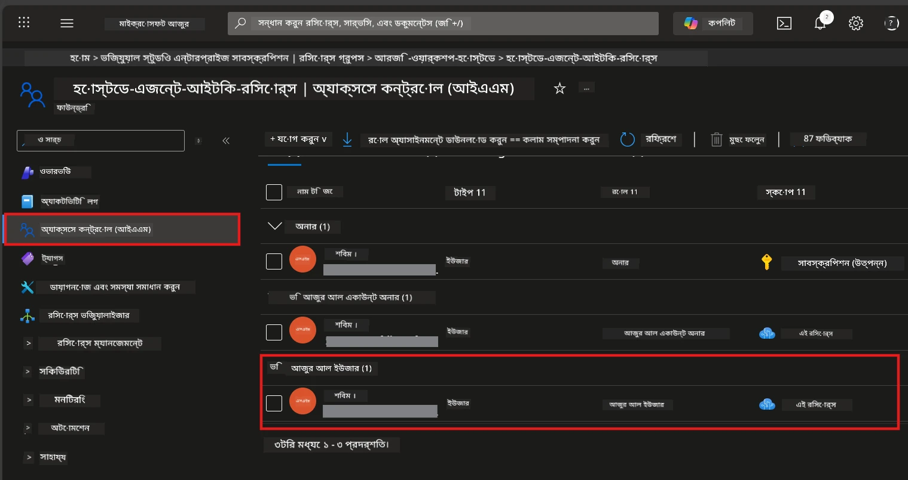

# Module 2 - একটি Foundry প্রকল্প তৈরি করুন এবং একটি মডেল স্থাপন করুন

এই মডিউলে, আপনি একটি Microsoft Foundry প্রকল্প তৈরি করবেন (অথবা নির্বাচন করবেন) এবং একটি মডেল স্থাপন করবেন যা আপনার এজেন্ট ব্যবহার করবে। প্রতিটি ধাপ স্পষ্টভাবে লেখা হয়েছে - সেগুলি ক্রম অনুযায়ী অনুসরণ করুন।

> যদি আপনার ইতিমধ্যে একটি Foundry প্রকল্প থাকে যার মধ্যে একটি স্থাপিত মডেল থাকে, তাহলে [Module 3](03-create-hosted-agent.md) এ যান।

---

## Step 1: VS Code থেকে একটি Foundry প্রকল্প তৈরি করুন

আপনি Microsoft Foundry এক্সটেনশন ব্যবহার করে VS Code ছাড়া প্রজেক্ট তৈরি করবেন।

1. `Ctrl+Shift+P` চাপুন **Command Palette** খুলতে।
2. টাইপ করুন: **Microsoft Foundry: Create Project** এবং সেটি নির্বাচন করুন।
3. একটি ড্রপডাউন আসবে - তালিকা থেকে আপনার **Azure subscription** নির্বাচন করুন।
4. আপনাকে একটি **resource group** নির্বাচন বা তৈরি করতে বলা হবে:
   - নতুন তৈরি করতে: একটি নাম টাইপ করুন (যেমন `rg-hosted-agents-workshop`) এবং Enter চাপুন।
   - বিদ্যমান ব্যবহার করতে: ড্রপডাউন থেকে নির্বাচন করুন।
5. একটি **region** নির্বাচন করুন। **গুরুত্বপূর্ণ:** এমন একটি অঞ্চল নির্বাচন করুন যা হোস্টেড এজেন্ট সমর্থন করে। দেখুন [region availability](https://learn.microsoft.com/azure/foundry/agents/concepts/hosted-agents#region-availability) - সাধারণ পছন্দ হলো `East US`, `West US 2`, অথবা `Sweden Central`।
6. Foundry প্রকল্পের জন্য একটি **নাম** লিখুন (যেমন `workshop-agents`)।
7. Enter চাপুন এবং provisioning সম্পূর্ণ হওয়া পর্যন্ত অপেক্ষা করুন।

> **Provisioning ২-৫ মিনিট সময় নিতে পারে।** VS Code এর নিচে-ডান কোণায় একটি উন্নতি সূচক দেখতে পাবেন। Provisioning চলাকালে VS Code বন্ধ করবেন না।

8. সম্পন্ন হলে, **Microsoft Foundry** সাইডবারে আপনার নতুন প্রকল্প **Resources** এর নিচে দেখাবে।
9. প্রকল্পের নাম ক্লিক করে সেটি সম্প্রসারিত করুন এবং নিশ্চিত করুন যে এতে **Models + endpoints** এবং **Agents** এর মত বিভাগ আছে।



### বিকল্প: Foundry পোর্টালের মাধ্যমে তৈরি করুন

আপনি যদি ব্রাউজার ব্যবহার করতে চান:

1. খুলুন [https://ai.azure.com](https://ai.azure.com) এবং সাইন ইন করুন।
2. হোম পেজে **Create project** ক্লিক করুন।
3. একটি প্রকল্প নাম দিন, আপনার সাবস্ক্রিপশন, রিসোর্স গ্রুপ এবং অঞ্চল নির্বাচন করুন।
4. **Create** ক্লিক করুন এবং provisioning শেষ হওয়া পর্যন্ত অপেক্ষা করুন।
5. তৈরি হওয়ার পর VS Code এ ফিরে যান - রিফ্রেশ (রিফ্রেশ আইকন ক্লিক করুন) করার পর Foundry সাইডবারে প্রকল্পটি দেখা যাবে।

---

## Step 2: একটি মডেল স্থাপন করুন

আপনার [hosted agent](https://learn.microsoft.com/azure/foundry/agents/concepts/hosted-agents) একটি Azure OpenAI মডেলের মাধ্যমে সাড়া তৈরি করবে। এখনই [একটি মডেল স্থাপন করুন](https://learn.microsoft.com/azure/ai-foundry/openai/how-to/create-resource#deploy-a-model)।

1. `Ctrl+Shift+P` চাপুন **Command Palette** খুলতে।
2. টাইপ করুন: **Microsoft Foundry: Open [Model Catalog](https://learn.microsoft.com/azure/ai-foundry/openai/concepts/models)** এবং নির্বাচন করুন।
3. VS Code এ Model Catalog ভিউ খুলবে। ব্রাউজ করুন বা সার্চ বারে **gpt-4.1** খুঁজুন।
4. **gpt-4.1** মডেল কার্ডে ক্লিক করুন (অথবা কম খরচের জন্য `gpt-4.1-mini` নির্বাচন করুন)।
5. **Deploy** ক্লিক করুন।



6. ডিপ্লয়মেন্ট কনফিগারেশনে:
   - **Deployment name**: ডিফল্ট রাখুন (যেমন `gpt-4.1`) অথবা একটি কাস্টম নাম দিন। **এই নাম মনে রাখবেন** - Module 4 এ দরকার হবে।
   - **Target**: নির্বাচন করুন **Deploy to Microsoft Foundry** এবং আপনার তৈরি প্রকল্প নির্বাচন করুন।
7. **Deploy** ক্লিক করুন এবং ডিপ্লয়মেন্ট সম্পন্ন হওয়া পর্যন্ত অপেক্ষা করুন (১-৩ মিনিট)।

### মডেল বাছাই

| মডেল | ব্যবহার উপযোগী | খরচ | নোট |
|-------|----------------|------|-----|
| `gpt-4.1` | উচ্চ-মানের, সূক্ষ্ম সাড়া | বেশি | সেরা ফলাফল, চূড়ান্ত পরীক্ষার জন্য সুপারিশকৃত |
| `gpt-4.1-mini` | দ্রুত পুনরাবৃত্তি, কম খরচ | কম | কর্মশালা বিকাশ ও দ্রুত পরীক্ষার জন্য ভালো |
| `gpt-4.1-nano` | হালকা কাজের জন্য | সর্বনিম্ন | সবচেয়ে সাশ্রয়ী, তবে সরল সাড়া দেয় |

> **এই কর্মশালার সুপারিশ:** উন্নয়ন ও পরীক্ষার জন্য `gpt-4.1-mini` ব্যবহার করুন। এটি দ্রুত, সস্তা এবং ভালো ফলাফল দেয়।

### মডেল স্থাপনার যাচাই করুন

1. **Microsoft Foundry** সাইডবারে আপনার প্রকল্প সম্প্রসারিত করুন।
2. দেখুন **Models + endpoints** (অথবা অনুরূপ বিভাগ) এর নিচে।
3. আপনি আপনার স্থাপিত মডেল (যেমন `gpt-4.1-mini`) দেখতে পাবেন যার স্ট্যাটাস **Succeeded** বা **Active**।
4. মডেল ডিপ্লয়মেন্টে ক্লিক করে বিস্তারিত দেখুন।
5. **এই দুইটি মান নোট করুন** - Module 4 এ লাগবে:

   | সেটিং | কোথায় পাবেন | উদাহরণ মান |
   |---------|--------------|------------|
   | **Project endpoint** | Foundry সাইডবারে প্রকল্পের নাম ক্লিক করুন। ডিটেইল ভিউতে এন্ডপয়েন্ট URL দেখা যাবে। | `https://<account>.services.ai.azure.com/api/projects/<project>` |
   | **Model deployment name** | স্থাপিত মডেলের পাশে দেখানো নাম। | `gpt-4.1-mini` |

---

## Step 3: প্রয়োজনীয় RBAC ভূমিকা বরাদ্দ করুন

এটি হল **সর্বাধিক সাধারণ ভুলে যাওয়া ধাপ**। সঠিক ভূমিকা ছাড়া, Module 6 এ স্থাপন নাকচ হবে এবং অনুমতি সংক্রান্ত ত্রুটি দেখাবে।

### 3.1 নিজের কাছে Azure AI User ভূমিকা বরাদ্দ করুন

1. একটি ব্রাউজার খুলে যান [https://portal.azure.com](https://portal.azure.com)।
2. উপরের সার্চ বারে আপনার **Foundry project** এর নাম লিখে ফলাফল থেকে ক্লিক করুন।
   - **গুরুত্বপূর্ণ:** প্রকল্প রিসোর্সে যান (টাইপ: "Microsoft Foundry project"), প্যারেন্ট অ্যাকাউন্ট/হাব নয়।
3. প্রকল্পের বাম নেভিগেশনে **Access control (IAM)** ক্লিক করুন।
4. উপরের দিকে থাকা **+ Add** বাটনে ক্লিক করুন → নির্বাচন করুন **Add role assignment**।
5. **Role** ট্যাবে সার্চ করুন [**Azure AI User**](https://learn.microsoft.com/azure/foundry/concepts/rbac-foundry#built-in-roles) এবং নির্বাচন করুন। তারপর **Next** ক্লিক করুন।
6. **Members** ট্যাবে:
   - নির্বাচন করুন **User, group, or service principal**।
   - **+ Select members** ক্লিক করুন।
   - আপনার নাম বা ইমেইল সার্চ করে নিজেকে নির্বাচন করুন, তারপর **Select** ক্লিক করুন।
7. **Review + assign** ক্লিক করুন → আবার **Review + assign** ক্লিক করে নিশ্চিত করুন।



### 3.2 (ঐচ্ছিক) Azure AI Developer ভূমিকা বরাদ্দ করুন

যদি আপনাকে প্রকল্পের মধ্যে অতিরিক্ত রিসোর্স তৈরি করতে বা প্রোগ্রাম্যাটিকভাবে ডিপ্লয়মেন্ট পরিচালনা করতে হয়:

1. উপরের ধাপগুলো পুনরাবৃত্তি করুন, তবে ধাপ ৫ এ **Azure AI Developer** নির্বাচন করুন।
2. এটি **Foundry resource (account)** স্তরে বরাদ্দ করুন, শুধু প্রকল্প স্তরে নয়।

### 3.3 আপনার ভূমিকা বরাদ্দ যাচাই করুন

1. প্রকল্পের **Access control (IAM)** পৃষ্ঠায় যান, **Role assignments** ট্যাব ক্লিক করুন।
2. আপনার নাম সার্চ করুন।
3. প্রকল্পের ক্ষেত্রে কমপক্ষে **Azure AI User** দেখানো উচিত।

> **কেন এটা গুরুত্বপূর্ণ:** [`Azure AI User`](https://learn.microsoft.com/azure/foundry/concepts/rbac-foundry#built-in-roles) ভূমিকা `Microsoft.CognitiveServices/accounts/AIServices/agents/write` ডেটা অ্যাকশন দেয়। এটা ছাড়া আপনি ডিপ্লয়মেন্টে নিচের মতো ত্রুটি দেখবেন:
>
> ```
> Error: lacks the required data action 
> Microsoft.CognitiveServices/accounts/AIServices/agents/write 
> to perform POST /api/projects/{projectName}/assistants operation.
> ```
>
> বিস্তারিত জানতে [Module 8 - Troubleshooting](08-troubleshooting.md) দেখুন।

---

### চেকপয়েন্ট

- [ ] Foundry প্রকল্প বিদ্যমান এবং VS Code এর Microsoft Foundry sidebar-এ দৃশ্যমান
- [ ] কমপক্ষে একটি মডেল স্থাপিত আছে (যেমন `gpt-4.1-mini`) এবং স্ট্যাটাস **Succeeded**
- [ ] আপনি **প্রকল্পের এন্ডপয়েন্ট** URL এবং **মডেল ডিপ্লয়মেন্ট নাম** নোট করেছেন
- [ ] আপনার কাছে **Azure AI User** ভূমিকা প্রকল্প স্তরে বরাদ্দ আছে (Azure Portal → IAM → Role assignments এ যাচাই করুন)
- [ ] প্রকল্প একটি [সমর্থিত অঞ্চল](https://learn.microsoft.com/azure/foundry/agents/concepts/hosted-agents#region-availability) এ অবস্থিত যা হোস্টেড এজেন্টের জন্য উপযোগী

---

**আগের:** [01 - Install Foundry Toolkit](01-install-foundry-toolkit.md) · **পরবর্তী:** [03 - Create a Hosted Agent →](03-create-hosted-agent.md)

---

<!-- CO-OP TRANSLATOR DISCLAIMER START -->
**অস্বীকারোক্তি**:
এই ডকুমেন্টটি AI অনুবাদ পরিষেবা [Co-op Translator](https://github.com/Azure/co-op-translator) ব্যবহার করে অনূদিত হয়েছে। যদিও আমরা সঠিকতার জন্য চেষ্টা করি, অনুগ্রহ করে জানুন যে স্বয়ংক্রিয় অনুবাদে ভুল বা অমিল থাকতে পারে। মূল ডকুমেন্টের স্থানীয় ভাষাটি কর্তৃত্বসূত্র হিসেবে ধরা উচিত। গুরুতর তথ্যের জন্য, পেশাদার মানব অনুবাদকৃত অনুবাদ সুপারিশ করা হয়। এই অনুবাদের ব্যবহার থেকে উদ্ভূত কোন ভুল বোঝাবুঝি বা ভুল ব্যাখ্যার জন্য আমরা দায়ী নই।
<!-- CO-OP TRANSLATOR DISCLAIMER END -->