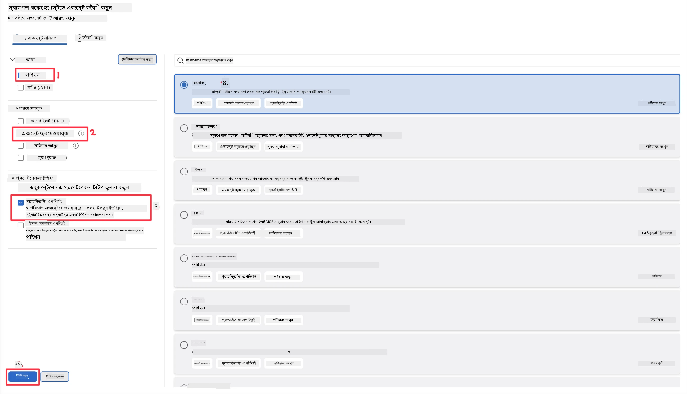
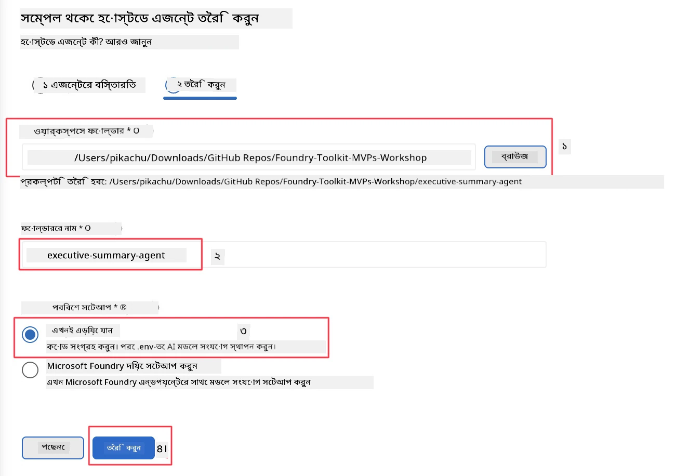

# মডিউল ২ - একটি নতুন হোস্টেড এজেন্ট তৈরি করুন

⏱️ ~৫ মিনিট

এই মডিউলটিতে, আপনি Foundry Toolkit ব্যবহার করে **একটি হোস্টেড এজেন্ট প্রকল্পের জন্য স্ক্যাফোল্ড তৈরি করবেন**। স্ক্যাফোল্ড সম্পূর্ণ প্রকল্প কাঠামো তৈরি করে - `agent.yaml`, `main.py`, `Dockerfile`, `requirements.txt`, এবং VS Code ডিবাগ কনফিগারেশন - যাতে আপনি এজেন্টের আচরণ কাস্টমাইজ করতে মনোযোগ দিতে পারেন।

> **মূল ধারণা:** এই ল্যাবে `agent/` ফোল্ডারটি Foundry Toolkit দ্বারা তৈরি একটি উদাহরণ। আপনি এই ফাইলগুলি স্ক্র্যাচ থেকে লিখবেন না।

### স্ক্যাফোল্ড উইজার্ড প্রবাহ

```mermaid
flowchart LR
    A["Command Palette:
    Create new Hosted Agent"] --> বি["Language:
    Python"]
    B --> C["API type:
    Response API"]
    C --> D["Template:
    Basic - Agent Framework"]
    D --> E["মডেল নির্বাচন করুন"]
    E --> F["Workspace folder
    & agent name"]
    F --> G["তৈরি প্রকল্প"]

    style A fill:#4A90D9,color:#fff
    style B fill:#7B68EE,color:#fff
    style C fill:#7B68EE,color:#fff
    style D fill:#7B68EE,color:#fff
    style E fill:#7B68EE,color:#fff
    style F fill:#7B68EE,color:#fff
    style G fill:#27AE60,color:#fff
```

---

## ধাপ ১: Create Hosted Agent উইজার্ড খুলুন

১. `Ctrl+Shift+P` চাপুন **Command Palette** খুলতে।
২. টাইপ করুন: **Foundry Toolkit: Create new Hosted Agent** এবং এটি নির্বাচন করুন।

> **অন্য উপায়: Foundry Portal থেকে তৈরি করুন**
> আপনি যদি ব্রাউজার পছন্দ করেন, তাহলে আপনার প্রকল্পটি [https://ai.azure.com](https://ai.azure.com) এ তৈরি করতে পারেন। প্রকল্প প্রোভিশন হওয়ার পর, VS Code এ ফিরে এসে **Foundry Toolkit** সাইডবার ব্যবহার করে এটি সংযোগ করুন।

> **অন্য উপায়:** Foundry Toolkit সাইডবারে **Hosted Agents (Preview)** এর পাশে থাকা **+** আইকনে ক্লিক করুন।

## ধাপ ২: সেটিংস নির্বাচন করুন



১. বাম নেভিগেশন/অপশন্স সেকশনে নিম্নলিখিত নির্বাচন করুন:

| মেনু | নির্বাচন | নোট |
|--------|-----------|-------|
| **Language** | Python | C# ও সমর্থিত |
| **Framework** | Agent Framework | Agent Framework SDK দিয়ে সহজ শুরু |
| **API type** | Response API | `POST /responses` - কথোপকথন ভিত্তিক, প্ল্যাটফর্ম-পরিচালিত ইতিহাস সহ |
| **Template** | Basic | Agent Framework SDK ব্যবহার করে সহজ শুরু |

২. একবার নির্বাচন করলে, **Next** ক্লিক করুন



৩. পরবর্তী উইন্ডোতে নিম্নলিখিত নির্বাচন করুন:

| মেনু | নির্বাচন | নোট |
|--------|-----------|-------|
| **Workspace folder** | একটি লক্ষ্য ফোল্ডার নির্বাচন করুন | উদাহরণস্বরূপ, `/workspace/Foundry_Toolkit_for_VSCode_Lab/` অথবা এই রিপো এর একটি সাবফোল্ডার |
| **Agent name** | একটি নাম লিখুন | উদাহরণস্বরূপ, `executive-summary-agent` |
| **Environment Setup** | আপাতত সেটআপ স্কিপ করুন |  |

আমাদের এজেন্ট তৈরি করতে **create** ক্লিক করুন। একটি নতুন ফোল্ডার হোস্টেড এজেন্ট নামে তৈরি হবে।

## ধাপ ৩: তৈরি প্রকল্প পরিদর্শন করুন

স্ক্যাফোল্ড সম্পন্ন হওয়ার পর, Explorer এ (`Ctrl+Shift+E`) নিম্নলিখিত ফাইলগুলি আছে কিনা যাচাই করুন:

```
📂 my-agent/
├── .env                ← Environment variables (placeholders)
├── .vscode/
│   ├── launch.json     ← Debug config (F5 → run + Agent Inspector)
│   └── tasks.json      ← VS Code task definitions
├── agent.yaml          ← Agent definition (kind: hosted)
├── Dockerfile          ← Container config for deployment
├── main.py             ← Agent entry point (your main code)
└── requirements.txt    ← Python dependencies
```

### মূল ফাইলগুলির ব্যাখ্যা

| ফাইল | উদ্দেশ্য |
|------|---------|
| `agent.yaml` | এজেন্টকে `kind: hosted` হিসেবে ঘোষণা করে, পরিবেশ ভেরিয়েবল নির্ণয় করে, `/responses` প্রটোকল সংজ্ঞায়িত করে |
| `main.py` | একটি `FoundryChatClient` তৈরি করে → এটিকে একটি `Agent` এর ভিতরে নির্দেশনা সহ মোড়কে দেয় → `ResponsesHostServer` দ্বারা পোর্ট 8088 এ সার্ভ করে |
| `Dockerfile` | `python:3.12-slim` ব্যবহার করে, নির্ভরশীলতা ইনস্টল করে, পোর্ট 8088 এক্সপোজ করে, `main.py` চালায় |
| `requirements.txt` | `agent-framework-foundry`, `agent-framework-foundry-hosting`, `mcp`, `debugpy` |

> **গুরুত্বপূর্ণ:** স্ক্যাফোল্ড করা এজেন্ট ফোল্ডারটি সরাসরি VS Code এ খুলুন (`agent/` ফোল্ডার নিজেই) যাতে `.vscode/launch.json` এবং `tasks.json` ঠিকমতো F5 ডিবাগিং ভাবে কাজ করে।

---

### ✅ চেকপয়েন্ট

- [ ] সমস্ত প্রত্যাশিত ফাইলসহ স্ক্যাফোল্ড প্রকল্প তৈরি হয়েছে
- [ ] `agent.yaml` এ `kind: hosted` এবং `protocol: responses` দেখাচ্ছে
- [ ] `main.py` এ `Agent`, `FoundryChatClient`, `ResponsesHostServer` ইমপোর্ট করা হয়েছে
- [ ] এজেন্ট ফোল্ডারটি VS Code এ ওয়ার্কস্পেস রুট হিসেবে খোলা রয়েছে

---

**পূর্ববর্তী:** [01 - Setup](01-setup.md) · **পরবর্তী:** [03 - Configure & Code →](03-configure-and-code.md)

---

<!-- CO-OP TRANSLATOR DISCLAIMER START -->
**অস্বীকৃতি**:
এই নথিটি AI অনুবাদ পরিষেবা [Co-op Translator](https://github.com/Azure/co-op-translator) ব্যবহার করে অনূদিত হয়েছে। যদিও আমরা শুদ্ধতার জন্য চেষ্টা করি, অনুগ্রহ করে মনে রাখবেন যে স্বয়ংক্রিয় অনুবাদে ত্রুটি বা অসঙ্গতি থাকতে পারে। মূল নথিটি তার স্বভাষায় কর্তৃত্বপূর্ণ উৎস হিসেবে বিবেচিত হওয়া উচিত। গুরুত্বপূর্ণ তথ্যের জন্য পেশাদার মানব অনুবাদ সুপারিশ করা হয়। এই অনুবাদের ব্যবহারে প্রয়োজনীয় ভুল বোঝাবুঝি বা ভুল ব্যাখ্যার জন্য আমরা দায়বদ্ধ নই।
<!-- CO-OP TRANSLATOR DISCLAIMER END -->