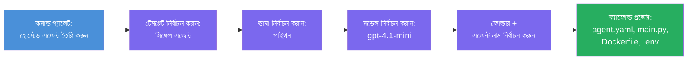

# Module 3 - একটি নতুন হোস্টেড এজেন্ট তৈরি করুন (Foundry এক্সটেনশান দ্বারা স্বয়ংক্রিয় স্ক্যাফোল্ড করা)

এই মডিউলে, আপনি Microsoft Foundry এক্সটেনশন ব্যবহার করে **নতুন [হোস্টেড এজেন্ট](https://learn.microsoft.com/azure/foundry/agents/concepts/hosted-agents) প্রোজেক্ট স্ক্যাফোল্ড করবেন**। এক্সটেনশনটি আপনার জন্য সম্পূর্ণ প্রোজেক্ট স্ট্রাকচার তৈরি করে — যার মধ্যে রয়েছে `agent.yaml`, `main.py`, `Dockerfile`, `requirements.txt`, একটি `.env` ফাইল, এবং একটি VS Code ডিবাগ কনফিগারেশন। স্ক্যাফোল্ড করার পর, আপনি এই ফাইলগুলোকে আপনার এজেন্টের নির্দেশনা, সরঞ্জাম, এবং কনফিগারেশন অনুযায়ী কাস্টমাইজ করবেন।

> **মূল ধারণা:** এই ল্যাবে `agent/` ফোল্ডারটি Foundry এক্সটেনশন যখন আপনি এই স্ক্যাফোল্ড কমান্ড চালান তখন যা তৈরি করে তার একটি উদাহরণ। আপনি এই ফাইলগুলো স্ক্র্যাচ থেকে লিখবেন না — এক্সটেনশন এগুলো তৈরি করে, এবং তারপর আপনি সেগুলো পরিবর্তন করেন।

### স্ক্যাফোল্ড উইজার্ড ফ্লো


---

## ধাপ ১: Create Hosted Agent উইজার্ড খুলুন

1. `Ctrl+Shift+P` চাপুন **Command Palette** খুলতে।
2. টাইপ করুন: **Microsoft Foundry: Create a New Hosted Agent** এবং তা নির্বাচন করুন।
3. হোস্টেড এজেন্ট তৈরির উইজার্ড খুলবে।

> **বিকল্প পথ:** আপনি Microsoft Foundry সাইডবার থেকেও এই উইজার্ডে পৌঁছাতে পারেন → **Agents** এর পাশে থাকা **+** আইকনে ক্লিক করুন বা রাইট-ক্লিক করে **Create New Hosted Agent** নির্বাচন করুন।

---

## ধাপ ২: আপনার টেমপ্লেট নির্বাচন করুন

উইজার্ড আপনাকে একটি টেমপ্লেট নির্বাচন করতে বলবে। আপনি নিম্নলিখিত অপশনগুলি দেখতে পাবেন:

| টেমপ্লেট | বর্ণনা | কখন ব্যবহার করবেন |
|----------|---------|------------------|
| **Single Agent** | নিজস্ব মডেল, নির্দেশনা, এবং ঐচ্ছিক সরঞ্জামসহ এক এজেন্ট | এই ওয়ার্কশপে (ল্যাব ০১) |
| **Multi-Agent Workflow** | একাধিক এজেন্ট যারা ধারাবাহিকভাবে সহযোগিতা করে | ল্যাব ০২ |

1. **Single Agent** নির্বাচন করুন।
2. **Next** ক্লিক করুন (বা নির্বাচন স্বয়ংক্রিয়ভাবে এগিয়ে যাবে)।

---

## ধাপ ৩: প্রোগ্রামিং ভাষা নির্বাচন করুন

1. **Python** নির্বাচন করুন (এই ওয়ার্কশপের জন্য সুপারিশকৃত)।
2. **Next** ক্লিক করুন।

> **C# ও সমর্থিত** যদি আপনি .NET পছন্দ করেন। স্ক্যাফোল্ড স্ট্রাকচার একই রকম (যেখানে `main.py` এর পরিবর্তে `Program.cs` ব্যবহার হয়)।

---

## ধাপ ৪: আপনার মডেল নির্বাচন করুন

1. উইজার্ড আপনার Foundry প্রোজেক্টে (মডিউল ২ থেকে) ডিপ্লয় করা মডেলগুলো দেখাবে।
2. আপনি যে মডেলটি ডিপ্লয় করেছেন তা নির্বাচন করুন — যেমন, **gpt-4.1-mini**।
3. **Next** ক্লিক করুন।

> যদি কোন মডেল না দেখতে পান, তাহলে ফিরে যান [মডিউল ২](02-create-foundry-project.md) এ এবং প্রথমে একটি মডেল ডিপ্লয় করুন।

---

## ধাপ ৫: ফোল্ডার অবস্থান এবং এজেন্টের নাম নির্বাচন করুন

1. একটি ফাইল ডায়ালগ খুলবে - প্রোজেক্ট তৈরি করার জন্য একটি **টার্গেট ফোল্ডার** নির্বাচন করুন। এই ওয়ার্কশপের জন্য:
   - যদি নতুন শুরু করেন: যেকোনো ফোল্ডার নির্বাচন করুন (যেমন, `C:\Projects\my-agent`)
   - যদি ওয়ার্কশপ রিপোতে কাজ করছেন: `workshop/lab01-single-agent/agent/` এর অধীনে একটি নতুন সাবফোল্ডার তৈরি করুন
2. হোস্টেড এজেন্টের জন্য একটি **নাম** লিখুন (যেমন, `executive-summary-agent` অথবা `my-first-agent`)।
3. **Create** ক্লিক করুন (বা Enter চাপুন)।

---

## ধাপ ৬: স্ক্যাফোল্ড সম্পন্ন হওয়ার জন্য অপেক্ষা করুন

1. VS Code একটি **নতুন উইন্ডো** খুলবে যেখানে স্ক্যাফোল্ড করা প্রোজেক্ট থাকবে।
2. প্রোজেক্ট সম্পূর্ণ লোড হওয়ার জন্য কয়েক সেকেন্ড অপেক্ষা করুন।
3. আপনি Explorer প্যানেলে (`Ctrl+Shift+E`) নিম্নলিখিত ফাইলগুলি দেখতে পাবেন:

```
📂 my-first-agent/
├── .env                ← Environment variables (auto-generated with placeholders)
├── .vscode/
│   └── launch.json     ← Debug configuration (F5 to run + Agent Inspector)
├── agent.yaml          ← Agent definition (kind: hosted)
├── Dockerfile          ← Container configuration for deployment
├── main.py             ← Agent entry point (your main code file)
└── requirements.txt    ← Python dependencies
```

> **এই ল্যাবের `agent/` ফোল্ডারের সাথে একই স্ট্রাকচার**। Foundry এক্সটেনশন স্বয়ংক্রিয়ভাবে এই ফাইলগুলো তৈরি করে — আপনাকে ম্যানুয়ালি এগুলো তৈরি করতে হবে না।

> **ওয়ার্কশপ নোট:** এই ওয়ার্কশপ রিপোজিটরিতে `.vscode/` ফোল্ডারটি **ওয়ার্কস্পেস রুটে** আছে (প্রতিটি প্রকল্পের ভিতরে নয়)। এতে একটি শেয়ার্ড `launch.json` এবং `tasks.json` আছে যার মধ্যে দুইটি ডিবাগ কনফিগারেশন — **"Lab01 - Single Agent"** এবং **"Lab02 - Multi-Agent"** — প্রতিটি সংশ্লিষ্ট ল্যাবের সঠিক `cwd` নির্দেশ করে। আপনি যখন F5 চাপবেন, ড্রপডাউন থেকে আপনি যে ল্যাবের উপর কাজ করছেন তার সাথে মিল রাখা কনফিগারেশন নির্বাচন করুন।

---

## ধাপ ৭: প্রতিটি তৈরি ফাইল বুঝে নিন

উইজার্ড যে প্রতিটি ফাইল তৈরি করেছে সেটি খতিয়ে দেখুন। এগুলো বোঝা মডিউল ৪ (কাস্টমাইজেশন) এর জন্য গুরুত্বপূর্ণ।

### ৭.১ `agent.yaml` - এজেন্ট সংজ্ঞা

`agent.yaml` খুলুন। এটি দেখতে এরকম হবে:

```yaml
# yaml-language-server: $schema=https://raw.githubusercontent.com/microsoft/AgentSchema/refs/heads/main/schemas/v1.0/ContainerAgent.yaml

kind: hosted
name: my-first-agent
description: >
  A hosted agent deployed to Microsoft Foundry Agent Service.
metadata:
  authors:
    - Microsoft
  tags:
    - Azure AI AgentServer
    - Microsoft Agent Framework
    - Hosted Agent
protocols:
  - protocol: responses
    version: v1
environment_variables:
  - name: AZURE_AI_PROJECT_ENDPOINT
    value: ${PROJECT_ENDPOINT}
  - name: AZURE_AI_MODEL_DEPLOYMENT_NAME
    value: ${MODEL_DEPLOYMENT_NAME}
dockerfile_path: Dockerfile
resources:
  cpu: '0.25'
  memory: 0.5Gi
```

**মূল ক্ষেত্রসমূহ:**

| ক্ষেত্র | উদ্দেশ্য |
|--------|----------|
| `kind: hosted` | এটি একটি হোস্টেড এজেন্ট (কন্টেইনার-ভিত্তিক, [Foundry Agent Service](https://learn.microsoft.com/azure/foundry/agents/overview) এ ডিপ্লয় করা) হিসেবে ঘোষণা করে |
| `protocols: responses v1` | এজেন্ট OpenAI-সঙ্গত `/responses` HTTP এন্ডপয়েন্ট প্রকাশ করে |
| `environment_variables` | `.env` এর মানকে ডিপ্লয়মেন্ট সময় কন্টেইনারের env var হিসেবে ম্যাপ করে |
| `dockerfile_path` | কন্টেইনার ইমেজ তৈরি করতে ব্যবহৃত Dockerfile নির্দেশ করে |
| `resources` | কন্টেইনারের CPU এবং মেমরি বরাদ্দ (0.25 CPU, 0.5Gi মেমরি) |

### ৭.২ `main.py` - এজেন্ট এন্ট্রি পয়েন্ট

`main.py` খুলুন। এটি প্রধান পাইথন ফাইল যেখানে আপনার এজেন্ট লজিক থাকে। স্ক্যাফোল্ড অন্তর্ভুক্ত:

```python
from agent_framework.azure import AzureAIAgentClient
from azure.ai.agentserver.agentframework import from_agent_framework
from azure.identity.aio import DefaultAzureCredential
```

**মূল ইম্পোর্টসমূহ:**

| ইম্পোর্ট | উদ্দেশ্য |
|----------|----------|
| `AzureAIAgentClient` | আপনার Foundry প্রোজেক্টে কানেক্ট করে এবং `.as_agent()` দিয়ে এজেন্ট তৈরি করে |
| [`DefaultAzureCredential`](https://learn.microsoft.com/azure/developer/python/sdk/authentication/credential-chains#defaultazurecredential-overview) | অথেনটিকেশন পরিচালনা করে (Azure CLI, VS Code সাইন-ইন, ম্যানেজড আইডেন্টিটি, অথবা সার্ভিস প্রিন্সিপাল) |
| `from_agent_framework` | এজেন্টকে একটি HTTP সার্ভার হিসেবে র‌্যাপ করে যা `/responses` এন্ডপয়েন্ট প্রদর্শন করে |

প্রধান ফ্লো হল:
1. ক্রেডেনশিয়াল তৈরি করুন → ক্লায়েন্ট তৈরি করুন → `.as_agent()` ডেকে একটি এজেন্ট পান (অ্যাসিঙ্ক্রোনাস কনটেক্সট ম্যানেজার) → এটিকে সার্ভার হিসেবে র‌্যাপ করুন → রান করুন

### ৭.৩ `Dockerfile` - কন্টেইনার ইমেজ

```dockerfile
FROM python:3.14-slim

WORKDIR /app

COPY ./ .

RUN pip install --upgrade pip && \
    if [ -f requirements.txt ]; then \
        pip install -r requirements.txt; \
    else \
        echo "No requirements.txt found" >&2; exit 1; \
    fi

EXPOSE 8088

CMD ["python", "main.py"]
```

**মূল বিবরণ:**
- `python:3.14-slim` বেস ইমেজ ব্যবহার করে।
- সমস্ত প্রোজেক্ট ফাইল `/app` এ কপি করে।
- `pip` আপগ্রেড করে, `requirements.txt` থেকে ডিপেন্ডেন্সি ইন্সটল করে, এবং যদি ফাইলটি না থাকে তবে দ্রুত ব্যর্থ হয়।
- **পোর্ট 8088 এক্সপোজ করে** — এটি হোস্টেড এজেন্টের জন্য প্রয়োজনীয় পোর্ট। এটি পরিবর্তন করবেন না।
- এজেন্ট শুরু করে `python main.py` দিয়ে।

### ৭.৪ `requirements.txt` - ডিপেন্ডেন্সি

```
agent-framework-azure-ai==1.0.0rc3
agent-framework-core==1.0.0rc3
azure-ai-agentserver-agentframework==1.0.0b16
azure-ai-agentserver-core==1.0.0b16
debugpy
agent-dev-cli
```

| প্যাকেজ | উদ্দেশ্য |
|--------|----------|
| `agent-framework-azure-ai` | Microsoft Agent Framework এর জন্য Azure AI ইন্টিগ্রেশন |
| `agent-framework-core` | এজেন্ট তৈরি করার জন্য কোর রানটাইম (এর মধ্যে `python-dotenv` অন্তর্ভুক্ত) |
| `azure-ai-agentserver-agentframework` | Foundry Agent Service এর জন্য হোস্টেড এজেন্ট সার্ভার রানটাইম |
| `azure-ai-agentserver-core` | কোর এজেন্ট সার্ভার বিমূর্ততা |
| `debugpy` | পাইথন ডিবাগিং সাপোর্ট (VS Code এ F5 ডিবাগিং সক্ষম করে) |
| `agent-dev-cli` | লোকাল ডেভেলপমেন্ট CLI যা এজেন্ট টেস্ট করার জন্য ব্যবহৃত (ডিবাগ/রান কনফিগারেশন থেকে ব্যবহৃত) |

---

## এজেন্ট প্রোটোকল বুঝে নিন

হোস্টেড এজেন্টগুলি **OpenAI Responses API** প্রোটোকল ব্যবহার করে যোগাযোগ করে। চালু থাকা অবস্থায় (লোকাল বা ক্লাউডে), এজেন্ট একটি HTTP এন্ডপয়েন্ট প্রকাশ করে:

```
POST http://localhost:8088/responses
Content-Type: application/json

{
  "input": "Your prompt here",
  "stream": false
}
```

Foundry Agent Service এই এন্ডপয়েন্ট কল করে ইউজারের প্রম্পট পাঠাতে এবং এজেন্টের উত্তর পেতে। এটি OpenAI API দ্বারা ব্যবহৃত একই প্রোটোকল, তাই আপনার এজেন্ট যেকোনো ক্লায়েন্টের সাথে কম্প্যাটিবল যা OpenAI Responses ফরম্যাট ব্যবহার করে।

---

### চেকপয়েন্ট

- [ ] স্ক্যাফোল্ড উইজার্ড সফলভাবে সম্পন্ন হয়েছে এবং একটি **নতুন VS Code উইন্ডো** খুলেছে
- [ ] আপনি সমস্ত ৫টি ফাইল দেখতে পাচ্ছেন: `agent.yaml`, `main.py`, `Dockerfile`, `requirements.txt`, `.env`
- [ ] `.vscode/launch.json` ফাইলটি আছে (F5 ডিবাগিং সক্রিয় করে — এই ওয়ার্কশপে এটি ওয়ার্কস্পেস রুটে থাকে এবং ল্যাব-নির্দিষ্ট কনফিগারেশনসহ)
- [ ] প্রতিটি ফাইল পড়েছেন এবং এর উদ্দেশ্য বুঝেছেন
- [ ] আপনি বুঝেছেন যে পোর্ট `8088` প্রয়োজনীয় এবং `/responses` এন্ডপয়েন্ট হল প্রোটোকল

---

**পূর্ববর্তী:** [02 - Create Foundry Project](02-create-foundry-project.md) · **পরবর্তী:** [04 - Configure & Code →](04-configure-and-code.md)

---

<!-- CO-OP TRANSLATOR DISCLAIMER START -->
**অস্বীকৃতি**:
এই নথিটি AI অনুবাদ সেবা [Co-op Translator](https://github.com/Azure/co-op-translator) ব্যবহার করে অনূদিত হয়েছে। আমরা যথাসম্ভব সঠিকতার চেষ্টা করি, তবে অনুগ্রহ করে জানুন যে স্বয়ংক্রিয় অনুবাদে ত্রুটি বা অসম্পূর্ণতা থাকতে পারে। মূল নথিটি তার স্বাভাবিক ভাষায় সর্বজনীন উৎস হিসেবেই বিবেচিত হওয়া উচিত। গুরুত্বপূর্ণ তথ্যের জন্য পেশাদার মানব অনুবাদ পরামর্শ দেওয়া হয়। এই অনুবাদের ব্যবহারে সৃষ্ট কোনো ভুল বোঝাবুঝি বা ভুল ব্যাখ্যার জন্য আমরা দায়বদ্ধ নই।
<!-- CO-OP TRANSLATOR DISCLAIMER END -->