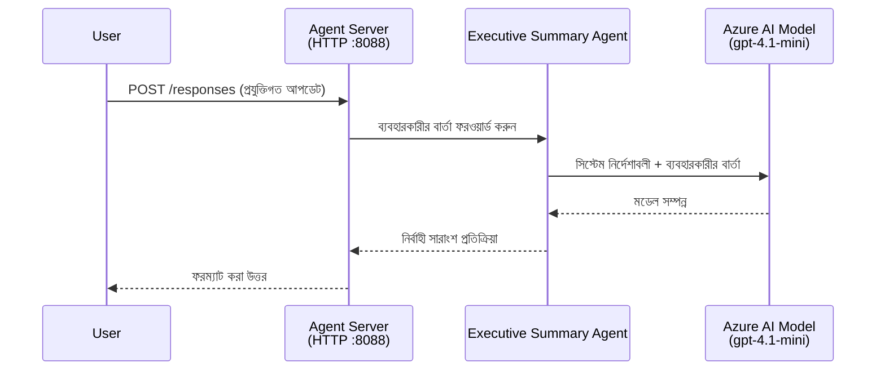
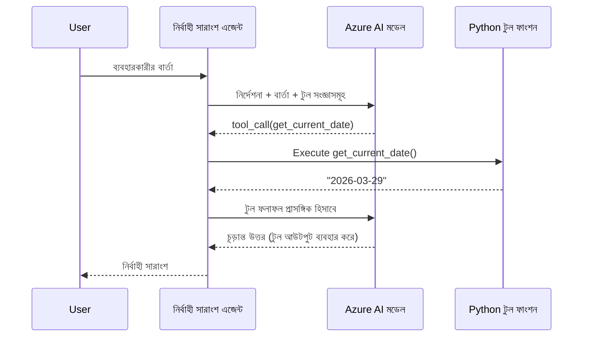

# Module 4 - নির্দেশাবলী কনফিগার করুন, পরিবেশ ও ডিপেন্ডেন্সি ইনস্টল করুন

এই মডিউলে, আপনি মডিউল 3 থেকে অটো-স্ক্যাফোল্ডেড এজেন্ট ফাইলগুলো কাস্টমাইজ করবেন। এখানে আপনি সাধারণ স্ক্যাফোল্ডকে **আপনার** এজেন্টে রূপান্তর করবেন - নির্দেশাবলী লিখে, পরিবেশ ভেরিয়েবল সেট করে, ইচ্ছানুযায়ী টুল যুক্ত করে এবং ডিপেন্ডেন্সি ইনস্টল করে।

> **স্মরণিকা:** Foundry এক্সটেনশন স্বয়ংক্রিয়ভাবে আপনার প্রকল্প ফাইল তৈরি করেছে। এখন আপনি এগুলো পরিবর্তন করবেন। কাস্টমাইজড এজেন্টের সম্পূর্ণ কাজের উদাহরণের জন্য দেখুন [`agent/`](../../../../../workshop/lab01-single-agent/agent) ফোল্ডার।

---

## উপাদানগুলো কিভাবে একসাথে কাজ করে

### অনুরোধ জীবনচক্র (একক এজেন্ট)


> **টুলস সহ:** যদি এজেন্টে টুল রেজিস্টার করা থাকে, তবে মডেল সরাসরি সম্পূর্ণ উত্তর দেওয়ার পরিবর্তে টুল-কলে ফিরিয়ে দিতে পারে। ফ্রেমওয়ার্ক টুলটি লোকালি চালায়, ফলাফলটি মডেলে ফেরত দেয়, এবং মডেল তারপর চূড়ান্ত উত্তর তৈরি করে।


---

## ধাপ ১: পরিবেশ ভেরিয়েবল কনফিগার করুন

স্ক্যাফোল্ড একটি `.env` ফাইল তৈরি করেছে যেখানে প্লেসহোল্ডার মান রয়েছে। আপনাকে মডিউল 2 থেকে আসল মানগুলো পূরণ করতে হবে।

1. আপনার স্ক্যাফোল্ড করা প্রকল্পে, **`.env`** ফাইলটি খুলুন (এটি প্রকল্পের মূল ডিরেক্টরিতে)।
2. প্লেসহোল্ডার মানগুলোর পরিবর্তে আপনার প্রকৃত Foundry প্রকল্পের বিবরণ দিন:

   ```env
   PROJECT_ENDPOINT=https://<your-account>.services.ai.azure.com/api/projects/<your-project>
   MODEL_DEPLOYMENT_NAME=gpt-4.1-mini
   ```

3. ফাইলটি সংরক্ষণ করুন।

### এই মানগুলো কোথায় পাবেন

| মান | কিভাবে পাবেন |
|-------|---------------|
| **প্রকল্পের এন্ডপয়েন্ট** | VS Code-এ **Microsoft Foundry** সাইডবার খুলুন → আপনার প্রকল্পে ক্লিক করুন → বিস্তারিত ভিউয়ে এন্ডপয়েন্ট URL দেখা যাবে। এটি দেখতে হবে `https://<account-name>.services.ai.azure.com/api/projects/<project-name>` |
| **মডেল ডিপ্লয়মেন্ট নাম** | Foundry সাইডবারে আপনার প্রকল্প বিস্তার করুন → **Models + endpoints** অংশে দেখুন → ডিপ্লয় করা মডেলের পাশে নাম থাকে (যেমন, `gpt-4.1-mini`) |

> **নিরাপত্তা:** `.env` ফাইল কখনোও ভার্সন কন্ট্রোলে কমিট করবেন না। এটি ডিফল্টরূপে `.gitignore` এ অন্তর্ভুক্ত থাকে। যদি না থাকে, তবে এটি যোগ করুন:
> ```
> .env
> ```

### পরিবেশ ভেরিয়েবল কিভাবে প্রবাহিত হয়

ম্যাপিং চেইন হল: `.env` → `main.py` (যেখানে `os.getenv` দিয়ে পড়ে) → `agent.yaml` (যা ডিপ্লয়মেন্ট সময় কন্টেইনার পরিবেশ ভেরিয়েবলের সাথে মানচিত্র করে)।

`main.py` এ, স্ক্যাফোল্ড এমানগুলি এভাবে পড়ে:

```python
PROJECT_ENDPOINT = os.getenv("AZURE_AI_PROJECT_ENDPOINT") or os.getenv("PROJECT_ENDPOINT")
MODEL_DEPLOYMENT_NAME = os.getenv("AZURE_AI_MODEL_DEPLOYMENT_NAME", os.getenv("MODEL_DEPLOYMENT_NAME", "gpt-4.1-mini"))
```

`AZURE_AI_PROJECT_ENDPOINT` এবং `PROJECT_ENDPOINT` দুইটাই গ্রহণযোগ্য (কিন্তু `agent.yaml` এ `AZURE_AI_*` উপসর্গ ব্যবহার হয়)।

---

## ধাপ ২: এজেন্ট নির্দেশাবলী লিখুন

এটি সবচেয়ে গুরুত্বপূর্ণ কাস্টমাইজেশন ধাপ। নির্দেশাবলী আপনার এজেন্টের ব্যক্তিত্ব, আচরণ, আউটপুট ফরম্যাট এবং সুরক্ষা নিয়ম নির্ধারণ করে।

1. আপনার প্রকল্পে `main.py` খুলুন।
2. নির্দেশাবলীর স্ট্রিং খুঁজুন (স্ক্যাফোল্ড একটি ডিফল্ট/সাধারণ স্ট্রিং দেয়)।
3. এটি বিস্তারিত, কাঠামোবদ্ধ নির্দেশাবলী দিয়ে প্রতিস্থাপন করুন।

### ভালো নির্দেশাবলীতে কি থাকে

| উপাদান | উদ্দেশ্য | উদাহরণ |
|-----------|---------|---------|
| **ভূমিকা** | এজেন্ট কি এবং কি করে | "আপনি একজন এক্সিকিউটিভ সামারি এজেন্ট" |
| **শ্রোতা** | কার জন্য উত্তর প্রদান করে | "সীমিত প্রযুক্তিগত পটভূমির সিনিয়র নেতা" |
| **ইনপুট সংজ্ঞা** | কী ধরনের প্রম্পট হ্যান্ডেল করে | "প্রযুক্তিগত ইনসিডেন্ট রিপোর্ট, অপারেশনাল আপডেট" |
| **আউটপুট ফরম্যাট** | সঠিক উত্তর কাঠামো | "এক্সিকিউটিভ সামারি: - কি ঘটেছে: ... - ব্যবসায়িক প্রভাব: ... - পরবর্তী পদক্ষেপ: ..." |
| **নিয়মাবলী** | বাধ্যবাধকতা ও প্রত্যাখ্যান শর্ত | "প্রদত্ত তথ্যের বাইরে কিছু যোগ করবেন না" |
| **নিরাপত্তা** | সঠিক ব্যবহার ও ভুল দাবিরোধ | "যদি ইনপুট অস্পষ্ট হয়, স্পষ্টকরণের জন্য প্রশ্ন করুন" |
| **উদাহরণ** | আচরণ নির্দেশক ইনপুট/আউটপুট দম্পতি | বিভিন্ন ইনপুটসহ ২-৩টি উদাহরণ দিন |

### উদাহরণ: এক্সিকিউটিভ সামারি এজেন্ট নির্দেশাবলী

ওয়ার্কশপের [`agent/main.py`](../../../../../workshop/lab01-single-agent/agent/main.py) এ ব্যবহৃত নির্দেশাবলী:

```python
AGENT_INSTRUCTIONS = """You are an "Explain Like I'm an Executive" agent.

Purpose:
Your job is to translate complex technical or operational information into
clear, concise, and outcome-focused summaries that can be easily understood
by non-technical executives.

Audience:
Senior leaders with limited technical background who care about impact,
risk, and what happens next.

What you must do:
- Rephrase the input so it is understandable to a non-technical audience
- Prioritize clarity, brevity, and outcomes over technical accuracy
- Remove technical jargon, logs, metrics, stack traces, and deep root-cause details
- Translate technical causes into simple cause-and-effect statements
- Explicitly call out business impact
- Always include a clear next step or action
- Maintain a neutral, factual, and calm executive tone
- Do NOT add new facts or speculate beyond the input

Standard Output Structure (always use this wording):

Executive Summary:
- What happened: <plain-language description>
- Business impact: <clear, non-technical impact>
- Next step: <clear action or mitigation>

Rules:
- Keep responses under 100 words
- Do NOT add facts beyond the input
- If input is unclear, ask for clarification
"""
```

4. আপনার স্বকীয় নির্দেশাবলী দিয়ে `main.py` এ বিদ্যমান নির্দেশাবলী স্ট্রিং প্রতিস্থাপন করুন।
5. ফাইলটি সংরক্ষণ করুন।

---

## ধাপ ৩: (ঐচ্ছিক) কাস্টম টুল যুক্ত করুন

হোস্টেড এজেন্টগুলি **লোকালি পাইথন ফাংশন** [টুল](https://learn.microsoft.com/azure/foundry/agents/concepts/tool-catalog) হিসেবে চালাতে পারে। এটি কোড-ভিত্তিক হোস্টেড এজেন্টের একটি বড় সুবিধা - আপনার এজেন্ট যেকোনো সার্ভার-সাইড লজিক রান করতে পারে।

### ৩.১ একটি টুল ফাংশন সংজ্ঞায়িত করুন

`main.py` তে একটি টুল ফাংশন যোগ করুন:

```python
from agent_framework import tool

@tool
def get_current_date() -> str:
    """Returns the current date in YYYY-MM-DD format."""
    from datetime import date
    return str(date.today())
```

`@tool` ডেকোরেটর একটি সাধারণ পাইথন ফাংশনকে এজেন্ট টুলে রূপান্তর করে। ডকস্ট্রিং মডেলের টুল বর্ণনা হিসেবে কাজ করে।

### ৩.২ এজেন্টের সাথে টুল রেজিস্টার করুন

`.as_agent()` কন্টেক্সট ম্যানেজারের মাধ্যমে এজেন্ট তৈরি করার সময়, `tools` প্যারামিটারে টুলটি প্রদান করুন:

```python
async with AzureAIAgentClient(
    project_endpoint=PROJECT_ENDPOINT,
    model_deployment_name=MODEL_DEPLOYMENT_NAME,
    credential=credential,
).as_agent(
    name="my-agent",
    instructions=AGENT_INSTRUCTIONS,
    tools=[get_current_date],
) as agent:
    server = from_agent_framework(agent)
    await server.run_async()
```

### ৩.৩ টুল কল কিভাবে কাজ করে

1. ব্যবহারকারী একটি প্রম্পট পাঠায়।
2. মডেল নির্ধারণ করে টুল প্রয়োজন কিনা (প্রম্পট, নির্দেশাবলী ও টুল বর্ণনা অনুযায়ী)।
3. টুল প্রয়োজন হলে, ফ্রেমওয়ার্ক আপনার পাইথন ফাংশনকে লোকালি (কন্টেইনারের ভিতরে) কল করে।
4. টুলের রিটার্ন মান মডেলের প্রেক্ষাপটে ফেরত পাঠানো হয়।
5. মডেল চূড়ান্ত উত্তর তৈরি করে।

> **টুলগুলো সার্ভার-সাইডে চালানো হয়** – এগুলো আপনার কন্টেইনারের ভিতরে চলে, ব্যবহারকারীর ব্রাউজার বা মডেলের মধ্যে নয়। ফলে আপনি ডাটাবেস, API, ফাইল সিস্টেম, বা যেকোন পাইথন লাইব্রেরি ব্যবহার করতে পারেন।

---

## ধাপ ৪: ভার্চুয়াল পরিবেশ তৈরি ও সক্রিয় করুন

ডিপেন্ডেন্সি ইনস্টল করার আগে একটি আলাদা পাইথন পরিবেশ তৈরি করুন।

### ৪.১ ভার্চুয়াল পরিবেশ তৈরি করুন

VS Code এ টার্মিনাল খুলুন (`` Ctrl+` ``) এবং রান করুন:

```powershell
python -m venv .venv
```

এটি আপনার প্রকল্প ডিরেক্টরিতে `.venv` ফোল্ডার তৈরি করবে।

### ৪.২ ভার্চুয়াল পরিবেশ সক্রিয় করুন

**PowerShell (Windows):**

```powershell
.\.venv\Scripts\Activate.ps1
```

**Command Prompt (Windows):**

```cmd
.venv\Scripts\activate.bat
```

**macOS/Linux (Bash):**

```bash
source .venv/bin/activate
```

টার্মিনালের প্রম্পটের শুরুতে `(.venv)` দেখা যাবে, যা নির্দেশ করে ভার্চুয়াল পরিবেশ সক্রিয়।

### ৪.৩ ডিপেন্ডেন্সি ইনস্টল করুন

ভার্চুয়াল পরিবেশ সক্রিয় অবস্থায় প্রয়োজনীয় প্যাকেজগুলো ইনস্টল করুন:

```powershell
pip install -r requirements.txt
```

এই প্যাকেজগুলো ইনস্টল হবে:

| প্যাকেজ | উদ্দেশ্য |
|---------|---------|
| `agent-framework-azure-ai==1.0.0rc3` | [Microsoft Agent Framework](https://learn.microsoft.com/agent-framework/overview/) এর জন্য Azure AI ইন্টিগ্রেশন |
| `agent-framework-core==1.0.0rc3` | এজেন্ট তৈরির মূল রUNTIME (এর মধ্যে `python-dotenv` অন্তর্ভুক্ত) |
| `azure-ai-agentserver-agentframework==1.0.0b16` | [Foundry Agent Service](https://learn.microsoft.com/azure/foundry/agents/overview) এর হোস্টেড এজেন্ট সার্ভার রUNTIME |
| `azure-ai-agentserver-core==1.0.0b16` | মূল এজেন্ট সার্ভার বিমূর্তকরণ |
| `debugpy` | পাইথন ডিবাগিং (VS Code এ F5 ডিবাগিং সক্ষম করে) |
| `agent-dev-cli` | এজেন্টদের জন্য লোকাল ডেভেলপমেন্ট CLI |

### ৪.৪ ইনস্টলেশন যাচাই করুন

```powershell
pip list | Select-String "agent-framework|agentserver"
```

अपेक्षित আউটপুট:
```
agent-framework-azure-ai   1.0.0rc3
agent-framework-core       1.0.0rc3
azure-ai-agentserver-agentframework 1.0.0b16
azure-ai-agentserver-core  1.0.0b16
```

---

## ধাপ ৫: প্রমাণীকরণ যাচাই করুন

এজেন্ট [`DefaultAzureCredential`](https://learn.microsoft.com/azure/developer/python/sdk/authentication/credential-chains#defaultazurecredential-overview) ব্যবহার করে, যা নিম্নলিখিত ক্রমে একাধিক প্রমাণীকরণ পদ্ধতি চেষ্টা করে:

1. **পরিবেশ ভেরিয়েবল** - `AZURE_CLIENT_ID`, `AZURE_TENANT_ID`, `AZURE_CLIENT_SECRET` (সার্ভিস প্রিন্সিপাল)
2. **Azure CLI** - আপনার `az login` সেশন থেকে প্রমাণীকরণ নেয়
3. **VS Code** - আপনি VS Code এ যে অ্যাকাউন্ট দিয়ে লগইন করেছেন সেটি ব্যবহার করে
4. **Managed Identity** - যখন Azure-তে চালানো হয় (ডিপ্লয়মেন্ট সময়)

### ৫.১ লোকাল ডেভেলপমেন্টের জন্য যাচাই করুন

কমপক্ষে নিম্নলিখিত কোন একটির মাধ্যমে কাজ করা উচিৎ:

**অপশন A: Azure CLI (প্রস্তাবিত)**

```powershell
az account show --query "{name:name, id:id}" --output table
```

আশাকরি: আপনার সাবস্ক্রিপশন নাম ও ID দেখাবে।

**অপশন B: VS Code সাইন-ইন**

1. VS Code এর নিচে বাম পাশে **Accounts** আইকন দেখুন।
2. যদি আপনার অ্যাকাউন্ট নাম দেখায়, আপনি প্রমাণীকৃত।
3. না দেখালে, আইকনে ক্লিক করুন → **Sign in to use Microsoft Foundry**।

**অপশন C: সার্ভিস প্রিন্সিপাল (CI/CD এর জন্য)**

```powershell
$env:AZURE_TENANT_ID = "<your-tenant-id>"
$env:AZURE_CLIENT_ID = "<your-client-id>"
$env:AZURE_CLIENT_SECRET = "<your-client-secret>"
```

### ৫.২ সাধারণ প্রমাণীকরণ সমস্যা

যদি একাধিক Azure অ্যাকাউন্টে সাইন ইন থাকেন, নিশ্চিত করুন সঠিক সাবস্ক্রিপশন নির্বাচন করা হয়েছে:

```powershell
az account set --subscription "<your-subscription-id>"
```

---

### চেকপয়েন্ট

- [ ] `.env` ফাইলে সঠিক `PROJECT_ENDPOINT` ও `MODEL_DEPLOYMENT_NAME` (প্লেসহোল্ডার নয়) আছে
- [ ] `main.py` এ এজেন্ট নির্দেশাবলী কাস্টমাইজড - যা ভূমিকা, শ্রোতা, আউটপুট ফরম্যাট, নিয়ম, এবং সুরক্ষা নির্ধারণ করে
- [ ] (ঐচ্ছিক) কাস্টম টুল সংজ্ঞায়িত ও রেজিস্টার করা হয়েছে
- [ ] ভার্চুয়াল পরিবেশ তৈরি ও সক্রিয় (`(.venv)` টার্মিনাল প্রম্পটে দেখা যাচ্ছে)
- [ ] `pip install -r requirements.txt` সফলভাবে সম্পন্ন হয়েছে
- [ ] `pip list | Select-String "azure-ai-agentserver"` প্যাকেজ ইনস্টল হয়েছে দেখাচ্ছে
- [ ] প্রমাণীকরণ বৈধ - `az account show` আপনার সাবস্ক্রিপশন দেখায় অথবা আপনি VS Code এ সাইন ইন করেছেন

---

**পূর্ববর্তী:** [03 - হোস্টেড এজেন্ট তৈরি করুন](03-create-hosted-agent.md) · **পরবর্তী:** [05 - লোকালি পরীক্ষা করুন →](05-test-locally.md)

---

<!-- CO-OP TRANSLATOR DISCLAIMER START -->
**অস্বীকৃতি**:  
এই দলিলটি AI অনুবাদ সেবা [Co-op Translator](https://github.com/Azure/co-op-translator) ব্যবহার করে অনূদিত হয়েছে। আমরা যথার্থতার জন্য চেষ্টা করি, তবে দয়া করে বুঝতে হবে যে স্বয়ংক্রিয় অনুবাদে ত্রুটি বা ভুল থাকতে পারে। আসল নথিটি তার মৌলিক ভাষায় কর্তৃক নিয়ন্ত্রিত উৎস হিসাবে বিবেচিত হওয়া উচিত। গুরুত্বপূর্ণ তথ্যের জন্য পেশাদার মানব অনুবাদ সুপারিশ করা হয়। এই অনুবাদ ব্যবহারে উদ্ভূত যেকোনো ভুল-বুঝাবুঝি বা ভুল ব্যাখ্যার জন্য আমরা দায়ী নই।
<!-- CO-OP TRANSLATOR DISCLAIMER END -->