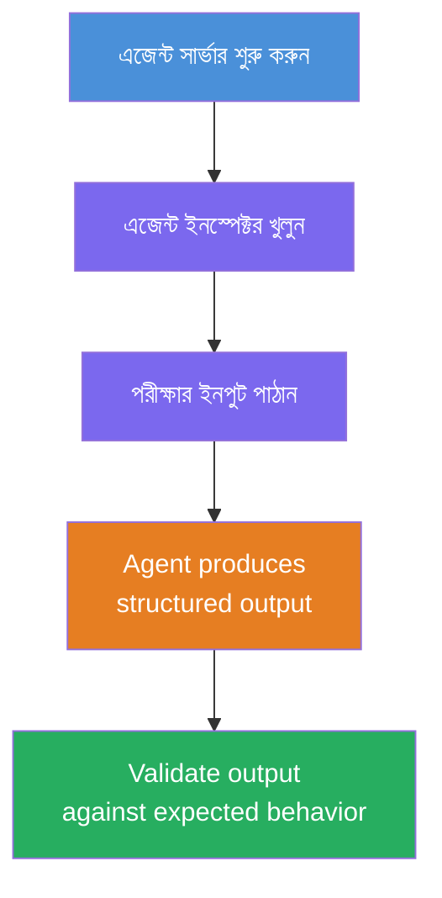
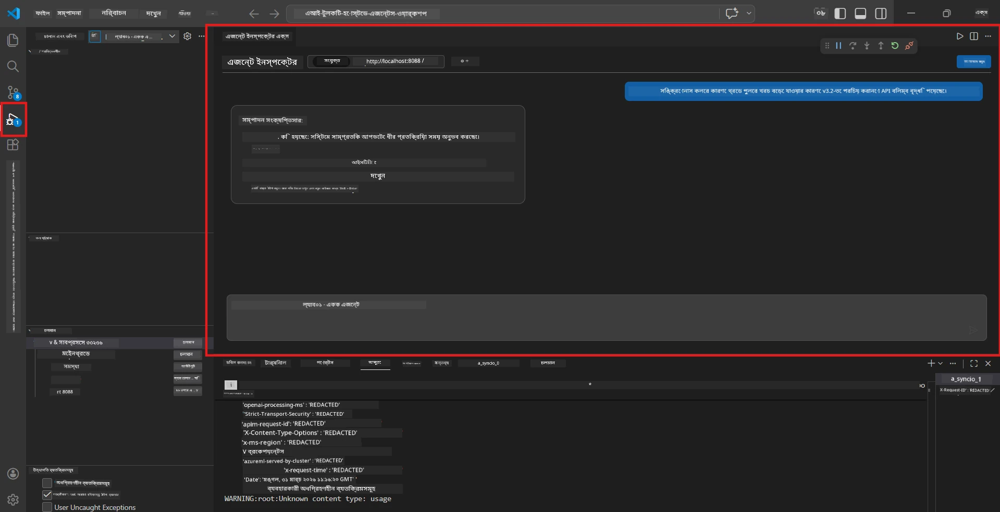
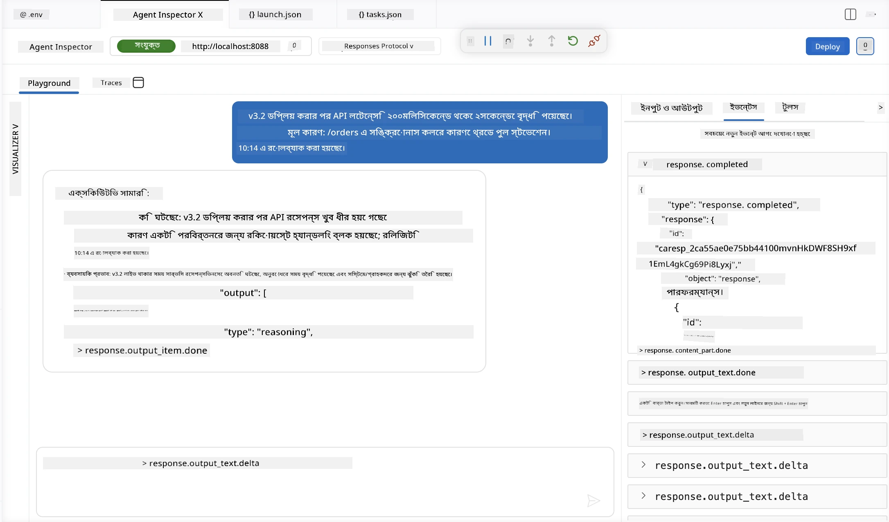

# মডিউল ৪ - লোকালি পরীক্ষা করুন

⏱️ ~১০ মিনিট

এই মডিউলে, আপনি আপনার এজেন্ট লোকালি চালাবেন এবং নিশ্চিত করবেন এটি সঠিকভাবে কাজ করছে কিনা **হ্যাপি-পাথ ফাংশনাল টেস্টস** ব্যবহার করে। আপনি এজেন্ট ইনস্পেক্টর (ভিজ্যুয়াল UI) অথবা সরাসরি HTTP কল ব্যবহার করে নিশ্চিত করবেন যে এজেন্ট সঠিক, কাঠামোবদ্ধ উত্তর প্রদান করছে।

### লোকাল টেস্টিং প্রবাহ



---

## বিকল্প ১: F5 চাপুন - এজেন্ট ইনস্পেক্টর দিয়ে ডিবাগ করুন (সুপারিশকৃত)

### ডিবাগার শুরু করুন

১. VS Code-এ সরাসরি **executive-summary-agent/** ফোল্ডার খুলুন (`File → Open Folder`)।
২. **Run and Debug** প্যানেল খুলুন (`Ctrl+Shift+D`)।
৩. ড্রপডাউনে থেকে **Debug Local Agent Server** নির্বাচন করুন।
৪. **F5** চাপুন (অথবা ▶ Start Debugging এ ক্লিক করুন)।

> ⚠️ **গুরুত্বপূর্ণ: আপনার Python Interpreter নির্বাচন করুন**
> যদি "ModuleNotFoundError" আসে অথবা ডিবাগার শুরু না হয়, তাহলে VS Code-কে আপনার ভার্চুয়াল এনভায়রনমেন্ট ব্যবহার করতে বলুন:
  > ১. `Ctrl+Shift+P` চাপুন → টাইপ করুন **Python: Select Interpreter**।
  > ২. আপনার প্রকল্পের `.venv` ফোল্ডারের মধ্যে থাকা ইন্টারপ্রেটার নির্বাচন করুন (যেমন, Windows-এ `.\.venv\Scripts\python.exe`)।
  > ৩. ডিবাগ সেশন পুনরায় শুরু করুন।
> যদি এখনো ত্রুটি পান, তাহলে ম্যানুয়ালি আপনার `tasks.json` ফাইল আপডেট করুন যেভাবে:
  > ১. `.vscode/tasks.json` ফাইলে যান
  > ২. `Run Agent/Workflow HTTP Server` নামক কমান্ড খুঁজুন
  > ৩. নিম্নরূপ কমান্ড মান আপডেট করুন: `"value": "${workspaceFolder}/.venv/bin/python",`

### কী ঘটে

১. HTTP সার্ভার শুরু হয় `http://localhost:8088/responses` ঠিকানায়।
২. **Agent Inspector** প্যানেল স্বয়ংক্রিয়ভাবে খুলে - পরীক্ষার জন্য একটি ভিজ্যুয়াল চ্যাট ইন্টারফেস।
৩. `main.py`-তে ব্রেকপয়েন্ট সক্রিয় থাকে।

টার্মিনাল মনোযোগ দিয়ে দেখুন:
```
Starting executive summary hosted agent
Executive agent server running on http://localhost:8088
```

> **যদি Agent Inspector না খোলে:** `Ctrl+Shift+P` চাপুন → **Foundry Toolkit: Open Agent Inspector**।



> *স্ক্রিনশটটি পুরাতন 'AI TOOLKIT' ব্র্যান্ডিং দেখাতে পারে যা একটি পুরানো এক্সটেনশন ভার্সন থেকে।*

---

## বিকল্প ২: টার্মিনালের মাধ্যমে পরীক্ষা (অন্য উপায়)

একটি টার্মিনালে এজেন্ট শুরু করুন, অন্যটিতে রিকোয়েস্ট পাঠান:

```bash
# টার্মিনাল ১: এজেন্ট শুরু করুন
cd executive-summary-agent/
source .venv/bin/activate
python main.py
```

```bash
# টার্মিনাল ২: পরীক্ষামূলক পাঠান (কার্ল)
curl -sS -X POST http://localhost:8088/responses \
  -H "Content-Type: application/json" \
  -d '{"input": "The API latency increased due to thread pool exhaustion caused by sync calls in v3.2.", "stream": false}'
```

---

## দৃশ্যপট পরীক্ষা: হ্যাপি-পাথ ফাংশনাল যাচাই

নীচের **সব তিনটি** দৃশ্যপট চালান। এগুলো নিশ্চিত করে যে আপনার এজেন্ট বাস্তবসম্মত ইনপুটের জন্য সঠিক, কাঠামোবদ্ধ আউটপুট তৈরি করছে।



### দৃশ্যপট ১: আইটি ঘটনা - API লেটেন্সি স্পাইক

**ইনপুট:**
```
The API latency increased from 200ms to 2s after deploying v3.2.
Root cause: thread pool starvation from synchronous calls in /orders.
Rolled back at 10:14.
```

**প্রত্যাশিত আচরণ:**
- ✅ "Executive Summary" কাঠামো অনুসরণ করে (কি ঘটেছে / ব্যবসায় প্রভাব / পরবর্তী পদক্ষেপ)
- ✅ প্রযুক্তিগত জার্গন নেই (না "thread pool", না "/orders", না "v3.2")
- ✅ স্পষ্টভাবে ব্যবসায় প্রভাব বর্ণনা করে (যেমন, ব্যবহারকারীরা বিলম্বের সম্মুখীন হয়েছে)
- ✅ একটি পরবর্তী পদক্ষেপ অন্তর্ভুক্ত করে (যেমন, ফিক্স ডিপ্লয় হয়েছে, মনিটরিং চলছে)

---

### দৃশ্যপট ২: ডেটা পাইপলাইন - ETL ব্যর্থতা

**ইনপুট:**
```
The nightly ETL job failed because the upstream schema changed. APAC dashboards show missing data.
```

**প্রত্যাশিত আচরণ:**
- ✅ ডেটা রিফ্রেশ ব্যর্থতা সাধারণ ভাষায় সংক্ষিপ্ত করে
- ✅ APAC ড্যাশবোর্ডের প্রভাব উল্লেখ করে
- ✅ একটি প্রতিকারমূলক পরবর্তী পদক্ষেপ অন্তর্ভুক্ত করে
- ✅ "ETL", "schema" বা অন্যান্য প্রযুক্তিগত শব্দ ব্যবহার করে না

---

### দৃশ্যপট ৩: সিকিউরিটি - প্রকাশিত শংসাপত্র

**ইনপুট:**
```
Static analysis flagged a hardcoded secret in the repository.
The secret may have been exposed in commit history.
```

**প্রত্যাশিত আচরণ:**
- ✅ নির্বাহী-বান্ধব ভাষায় শংসাপত্র/নিরাপত্তার সমস্যা বর্ণনা করে
- ✅ সম্ভাব্য ঝুঁকি (অননুমোদিত অ্যাক্সেস) উল্লেখ করে
- ✅ প্রতিকারমূলক কার্যক্রম বর্ণনা করে (শংসাপত্র পরিবর্তন, অডিট)
- ✅ "static analysis", "commit history", বা "hardcoded" এর মতো শব্দ অন্তর্ভুক্ত করে না

---

## যাচাই মানদণ্ড

প্রতিটি দৃশ্যপটের জন্য পরীক্ষা করুন:

| # | মানদণ্ড | পাশের শর্ত |
|---|----------|---------------|
| ১ | **কাঠামো** | উত্তর "Executive Summary" ফরম্যাটে থাকে, সব তিনটি বিন্দু সহ |
| ২ | **সরল ভাষা** | নির্বাহী বুঝতে পারবে এমন কোন প্রযুক্তিগত জার্গন নেই |
| ৩ | **সঠিকতা** | সংক্ষিপ্তসারে ইনপুট প্রতিফলিত হয় - কোন কাল্পনিক তথ্য নেই |
| ৪ | **সংক্ষেপতা** | উত্তর ১০০ শব্দের নিচে |
| ৫ | **পরবর্তী পদক্ষেপ** | একটি স্পষ্ট কার্যক্রম বা প্রশমন উল্লেখ আছে |

---

## ডিবাগিং টিপস

| সমস্যা | সমাধান |
|-------|-----|
| এজেন্ট শুরু হয় না | `.env` মান যাচাই করুন, venv সক্রিয় কিনা দেখুন, `pip install -r requirements.txt` রান করুন |
| শূন্য বা সাধারণ উত্তর | `main.py` তে নির্দেশনা পর্যালোচনা করুন - আউটপুট ফরম্যাট নির্দিষ্ট আছে কিনা দেখুন |
| উত্তর জার্গন সম্বলিত | নির্দেশনায় "প্রযুক্তিগত শব্দ অপসারণ" নিয়ম শক্তিশালী করুন |
| Agent Inspector না খুলে | `Ctrl+Shift+P` → **Foundry Toolkit: Open Agent Inspector** |
| টার্মিনালে মডেল ত্রুটি | নিশ্চিত করুন `AZURE_AI_MODEL_DEPLOYMENT_NAME` সঠিক (কেস-সেনসেটিভ) |

---

### ✅ চেকপয়েন্ট

- [ ] এজেন্ট স্থানীয়ভাবে ত্রুটি ছাড়া শুরু হয়
- [ ] এজেন্ট ইনস্পেক্টর খোলে এবং চ্যাট ইন্টারফেস দেখায় (F5 ব্যবহারে)
- [ ] **দৃশ্যপট ১** (আইটি ঘটনা) - কাঠামোবদ্ধ Executive Summary, কোন জার্গন নেই
- [ ] **দৃশ্যপট ২** (ডেটা পাইপলাইন) - ব্যবসায় প্রভাবসহ প্রাসঙ্গিক সংক্ষিপ্তসার
- [ ] **দৃশ্যপট ৩** (নিরাপত্তা সতর্কতা) - উপযুক্ত ঝুঁকি যোগাযোগ
- [ ] সকল উত্তর নির্ধারিত আউটপুট কাঠামো অনুসরণ করে

> **আপনার উত্তরগুলো সংরক্ষণ করুন** (কপি বা স্ক্রিনশট) - আপনি এইগুলোর তুলনা Module 06-এ ক্লাউড ফলাফলের সাথে করবেন।

---

**পূর্ববর্তী:** [03 - Configure & Code](03-configure-and-code.md) · **পরবর্তী:** [05 - Deploy to Foundry →](05-deploy-to-foundry.md)

---

<!-- CO-OP TRANSLATOR DISCLAIMER START -->
**অস্বীকৃতি**:
এই নথিটি AI অনুবাদ পরিষেবা [Co-op Translator](https://github.com/Azure/co-op-translator) ব্যবহার করে অনূদিত হয়েছে। যদিও আমরা শুদ্ধতার জন্য চেষ্টা করি, অনুগ্রহ করে মনে রাখবেন যে স্বয়ংক্রিয় অনুবাদে ত্রুটি বা অসঙ্গতি থাকতে পারে। মূল নথিটি তার স্বভাষায় কর্তৃত্বপূর্ণ উৎস হিসেবে বিবেচিত হওয়া উচিত। গুরুত্বপূর্ণ তথ্যের জন্য পেশাদার মানব অনুবাদ সুপারিশ করা হয়। এই অনুবাদের ব্যবহারে প্রয়োজনীয় ভুল বোঝাবুঝি বা ভুল ব্যাখ্যার জন্য আমরা দায়বদ্ধ নই।
<!-- CO-OP TRANSLATOR DISCLAIMER END -->