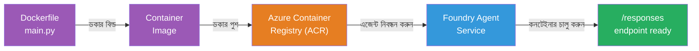
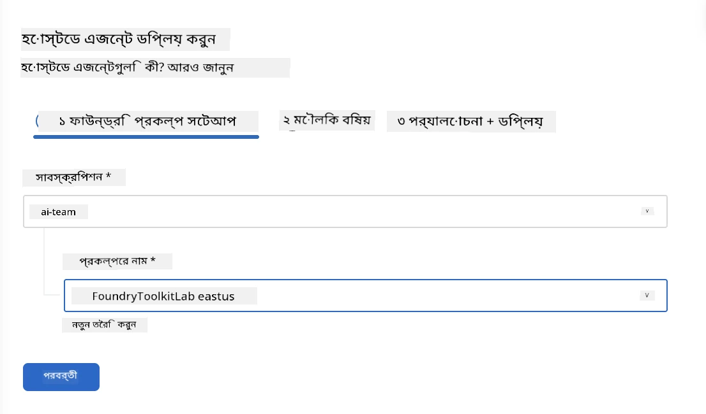
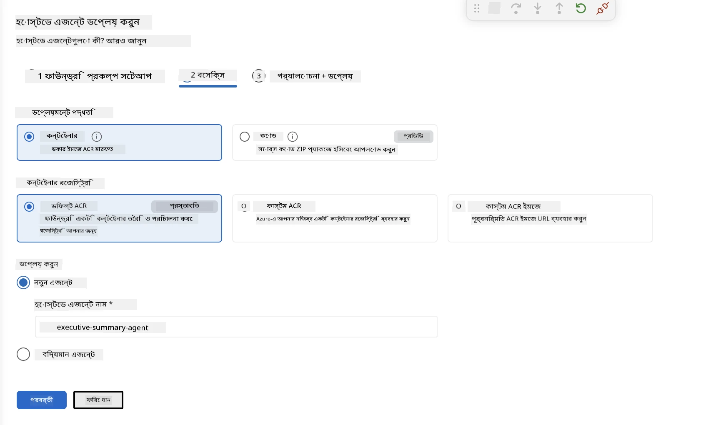
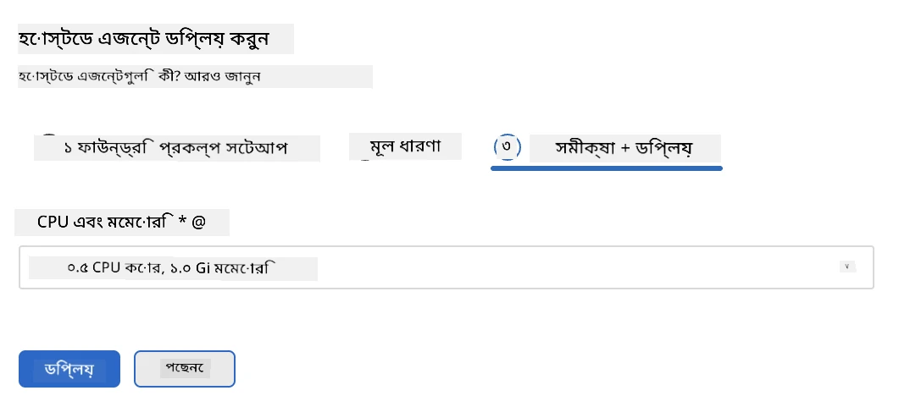
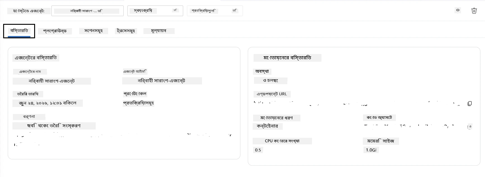

# মডিউল ৫ - Foundry এজেন্ট সার্ভিসে ডিপ্লয় করুন

⏱️ ~১০ মিনিট

> ⚠️ **পাথ বি ব্যবহারকারীরা:** এই মডিউলের জন্য একটি Foundry সাবস্ক্রিপশন আবশ্যক। আপনি যদি Foundry Local ব্যবহার করে থাকেন, তবে [মডিউল ০৭ - সারসংক্ষেপ](07-summary.md) এ যান। আপনি সফলভাবে লোকাল ডেভেলপমেন্ট ওয়ার্কফ্লো সম্পন্ন করেছেন!

এই মডিউলে, আপনি আপনার লোকালি-পরীক্ষিত এজেন্টকে Microsoft Foundry তে **হোস্টেড এজেন্ট** হিসেবে ডিপ্লয় করবেন। ডিপ্লয়মেন্ট একটি কন্টেইনার ইমেজ তৈরি করে, সেটি Azure Container Registry তে পুশ করে, এবং Foundry এর ম্যানেজড ইনফ্রাস্ট্রাকচারে এজেন্টটি চালু করে।

### ডিপ্লয়মেন্ট পাইপলাইন

---

## আগেই পরীক্ষা করুন

ডিপ্লয় করার আগে যাচাই করুন:

- [ ] এজেন্ট [মডিউল ০৪](04-test-locally.md) থেকে সব ৩টি লোকাল সিচুয়েশন পাস করেছে
- [ ] আপনার প্রজেক্ট লেভেলে **Azure AI User** রোল আছে ([মডিউল ০১, আরবিএসি নির্ধারণ](01-setup.md#deploy-a-model--assign-rbac))
- [ ] আপনি VS Code এ Azure এ সাইন ইন করেছেন (অ্যাকাউন্ট আইকনে আপনার নাম দেখানো)

---

## ধাপ ১: ডিপ্লয়মেন্ট শুরু করুন

### বিকল্প A: Agent Inspector থেকে ডিপ্লয় করুন (প্রস্তাবিত)

যদি Agent Inspector খোলা থাকে (পরীক্ষা থেকে):
১. উপরের ডানদিকে কোণায় **Deploy** বাটনে ক্লিক করুন (মেঘ আইকন ↑)।

### বিকল্প B: কমান্ড প্যালেট থেকে ডিপ্লয় করুন

১. `Ctrl+Shift+P` চাপুন → **Foundry Toolkit: Deploy Hosted Agent** নির্বাচন করুন।

---

## ধাপ ২: ডিপ্লয়মেন্ট কনফিগার করুন

উইজার্ড আপনাকে জিজ্ঞাসা করবে:

| প্রশ্ন | নির্বাচন |
|--------|-----------|
| **সাবস্ক্রিপশন** | আপনার Azure সাবস্ক্রিপশন |
| **টার্গেট প্রজেক্ট** | আপনার Foundry প্রজেক্ট (যেমন, `workshop-agents`) |

এজেন্ট কনফিগার করতে **next** ক্লিক করুন।

| প্রশ্ন | নির্বাচন |
|--------|-----------|
| **ডিপ্লয়মেন্ট পদ্ধতি** | কন্টেইনার |
| **কন্টেইনার রেজিস্ট্রি** | **ডিফল্ট ACR** (Microsoft Foundry আপনার জন্য তৈরি ও ম্যানেজ করে) |
| **ডিপ্লয় টু** | নতুন এজেন্ট (নাম, `executive-summary-agent`) |

আপনার এজেন্ট পর্যালোচনা ও ডিপ্লয় করতে **next** ক্লিক করুন।

| প্রশ্ন | নির্বাচন |
|--------|-----------|
| **CPU ও মেমরি** | **০.২৫ CPU কোর, ০.৫ Gi মেমরি** (ওয়ার্কশপের জন্য যথেষ্ট) |

---

## ধাপ ৩: ডিপ্লয় করুন ও মনিটর করুন

১. **Deploy** ক্লিক করুন।
২. **Output** প্যানেলটি দেখুন (ড্রপডাউন থেকে **Microsoft Foundry** নির্বাচন করুন)।
৩. ডিপ্লয়মেন্ট এই ধাপগুলোতে চলে:
   - **Docker build** - আপনার Dockerfile থেকে কন্টেইনার তৈরি করে
   - **Docker push** - ইমেজ ACR তে পুশ করে (প্রথম ডিপ্লয়মেন্টে ১–৩ মিনিট)
   - **Agent registration** - Foundry তে হোস্টেড এজেন্ট তৈরি করে
   - **Container start** - সিস্টেম-ম্যানেজড আইডেন্টিটি দিয়ে শুরু হয়

৪. সম্পূর্ণ হলে একটি নোটিফিকেশন আসবে:
   > **my-agent সফলভাবে ডিপ্লয় হয়েছে।** `View logs` `Run agent`

৫. **Run agent** ক্লিক করে Agent Playground খুলুন।

### ডিপ্লয়মেন্ট স্ট্যাটাস মান

| স্ট্যাটাস | অর্থ |
|--------|---------|
| **Running** | কন্টেইনার প্রস্তুত, এজেন্ট সাড়া দিচ্ছে |
| **Pending** | কন্টেইনার শুরু হচ্ছে - ৩০–৬০ সেকেন্ড অপেক্ষা করুন |
| **Failed** | লগ চেক করুন (নিম্নে সমস্যার সমাধান দেখুন) |

---

## সাধারণ ডিপ্লয়মেন্ট ভুল

| ভুল | কারণ | সমাধান |
|-------|-----------|-----|
| `agents/write` পারমিশন অস্বীকার | প্রজেক্ট লেভেলে **Azure AI User** রোল অনুপস্থিত | [মডিউল ০১, আরবিএসি নির্ধারণ](01-setup.md#deploy-a-model--assign-rbac) |
| Docker চলছে না | Docker Desktop শুরু হয়নি | Docker Desktop চালু করুন → `docker info` যাচাই করুন |
| ACR অনুমোদন | ম্যানেজড আইডেন্টিটি ইমেজ পুল করতে পারেনা | দেখুন [মডিউল ০৮ - Troubleshooting](08-troubleshooting.md) |

---

### ✅ চেকপয়েন্ট

- [ ] ডিপ্লয়মেন্ট ত্রুটিমুক্ত সম্পন্ন হয়েছে
- [ ] এজেন্ট Foundry সাইডবারে **Hosted Agents (Preview)** এর অধীনে দেখাচ্ছে
- [ ] কন্টেইনার স্ট্যাটাস **Running** দেখাচ্ছে
- [ ] Agent Playground ট্যাব খুলেছে এবং এজেন্টের বিবরণ ও এন্ডপয়েন্ট URL দেখাচ্ছে

---

**পূর্ববর্তী:** [০৪ - লোকালি পরীক্ষা করুন](04-test-locally.md) · **পরবর্তী:** [০৬ - প্লেগ্রাউন্ডে যাচাই করুন →](06-verify-in-playground.md)

---

<!-- CO-OP TRANSLATOR DISCLAIMER START -->
**অস্বীকৃতি**:
এই নথিটি AI অনুবাদ পরিষেবা [Co-op Translator](https://github.com/Azure/co-op-translator) ব্যবহার করে অনূদিত হয়েছে। যদিও আমরা শুদ্ধতার জন্য চেষ্টা করি, অনুগ্রহ করে মনে রাখবেন যে স্বয়ংক্রিয় অনুবাদে ত্রুটি বা অসঙ্গতি থাকতে পারে। মূল নথিটি তার স্বভাষায় কর্তৃত্বপূর্ণ উৎস হিসেবে বিবেচিত হওয়া উচিত। গুরুত্বপূর্ণ তথ্যের জন্য পেশাদার মানব অনুবাদ সুপারিশ করা হয়। এই অনুবাদের ব্যবহারে প্রয়োজনীয় ভুল বোঝাবুঝি বা ভুল ব্যাখ্যার জন্য আমরা দায়বদ্ধ নই।
<!-- CO-OP TRANSLATOR DISCLAIMER END -->