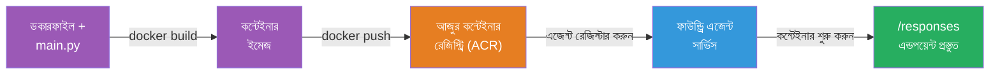
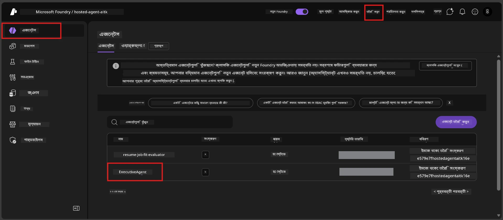

# Module 6 - ফাউন্ড্রি এজেন্ট সার্ভিসে ডিপ্লয় করুন

এই মডিউলে, আপনি আপনার লোকালি-পরীক্ষিত এজেন্টকে Microsoft Foundry তে একটি [**হোস্টেড এজেন্ট**](https://learn.microsoft.com/azure/foundry/agents/concepts/hosted-agents) হিসাবে ডিপ্লয় করবেন। ডিপ্লয়মেন্ট প্রক্রিয়াটি আপনার প্রকল্প থেকে একটি ডকার কন্টেইনার ইমেজ তৈরি করে, এটি [Azure Container Registry (ACR)](https://learn.microsoft.com/azure/container-registry/container-registry-intro) তে পাঠায়, এবং [Foundry Agent Service](https://learn.microsoft.com/azure/foundry/agents/overview)-এ একটি হোস্টেড এজেন্ট সংস্করণ তৈরি করে।

### ডিপ্লয়মেন্ট পাইপলাইন


---

## পূর্বশর্ত যাচাই

ডিপ্লয়মেন্টের আগে, নিচের প্রতিটি আইটেম যাচাই করুন। এগুলো এড়ানো সবচেয়ে সাধারণ ডিপ্লয়মেন্ট ব্যর্থতার কারণ।

1. **এজেন্ট লোকাল স্মোক টেস্ট পাশ করেছে:**
   - আপনি [মডিউল ৫](05-test-locally.md)-এ সম্পন্ন সব ৪ টি টেস্ট সফলভাবে সম্পন্ন করেছেন এবং এজেন্ট সঠিকভাবে প্রতিক্রিয়া দিয়েছে।

2. **আপনার কাছে [Azure AI User](https://learn.microsoft.com/azure/foundry/concepts/rbac-foundry#built-in-roles) ভূমিকা রয়েছে:**
   - এটি [মডিউল ২, ধাপ ৩](02-create-foundry-project.md)-এ নিয়োগ করা হয়েছিল। নিশ্চিত না হলে এখন যাচাই করুন:
   - Azure পোর্টাল → আপনার Foundry **প্রকল্প** সম্পদ → **Access control (IAM)** → **Role assignments** ট্যাব → আপনার নাম অনুসন্ধান করুন → নিশ্চিত করুন **Azure AI User** তালিকাভুক্ত আছে।

3. **আপনি VS Code এ Azure এ সাইন ইন করেছেন:**
   - VS Code এর নিচের-বামে Accounts আইকনে ক্লিক করে যাচাই করুন; আপনার অ্যাকাউন্ট নাম দৃশ্যমান থাকা উচিত।

4. **(ঐচ্ছিক) Docker Desktop চলছে:**
   - Docker এর প্রয়োজন হয় শুধুমাত্র যখন Foundry এক্সটেনশন আপনাকে লোকাল বিল্ডের জন্য অনুরোধ করে। বেশির ভাগ ক্ষেত্রে এক্সটেনশন ডিপ্লয়মেন্টের সময় স্বয়ংক্রিয়ভাবে কন্টেইনার বিল্ড পরিচালনা করে।
   - Docker ইনস্টল করা থাকলে, যাচাই করুন এটি চলছে: `docker info`

---

## ধাপ ১: ডিপ্লয়মেন্ট শুরু করুন

আপনাকে ডিপ্লয় করার দুটি উপায় আছে - উভয় একই ফলাফল দেয়।

### বিকল্প এ: এজেন্ট ইন্সপেক্টর থেকে ডিপ্লয় করুন (প্রস্তাবিত)

যদি আপনি ডিবাগার (F5) দিয়ে এজেন্ট চালাচ্ছেন এবং এজেন্ট ইন্সপেক্টর খোলা থাকে:

1. এজেন্ট ইন্সপেক্টর প্যানেলের **উপর-ডান কোণে** দেখুন।
2. **Deploy** বোতামে ক্লিক করুন (মেঘ আইকন সাথে উপরে তীর ↑)।
3. ডিপ্লয়মেন্ট উইজার্ড খুলবে।

### বিকল্প বি: কমান্ড প্যালেট থেকে ডিপ্লয় করুন

1. `Ctrl+Shift+P` চাপুন **Command Palette** খুলতে।
2. টাইপ করুন: **Microsoft Foundry: Deploy Hosted Agent** এবং নির্বাচন করুন।
3. ডিপ্লয়মেন্ট উইজার্ড খুলবে।

---

## ধাপ ২: ডিপ্লয়মেন্ট কনফিগার করুন

ডিপ্লয়মেন্ট উইজার্ড আপনাকে কনফিগারেশন ধাপে ধাপে পথনির্দেশ দেয়। প্রতিটি প্রম্পট পূরণ করুন:

### ২.১ লক্ষ্য প্রকল্প নির্বাচন করুন

1. একটি ড্রপডাউন আপনার Foundry প্রকল্পগুলো দেখাবে।
2. মডিউল ২-এ তৈরি প্রকল্প নির্বাচন করুন (যেমন, `workshop-agents`)।

### ২.২ কন্টেইনার এজেন্ট ফাইল নির্বাচন করুন

1. আপনাকে এজেন্ট এন্ট্রি পয়েন্ট নির্বাচন করতে বলা হবে।
2. **`main.py`** (পাইথন) নির্বাচন করুন - উইজার্ড এই ফাইলটি ব্যবহার করে আপনার এজেন্ট প্রকল্প শনাক্ত করে।

### ২.৩ রিসোর্স কনফিগার করুন

| সেটিং | প্রস্তাবিত মান | নোটস |
|---------|------------------|-------|
| **CPU** | `0.25` | ডিফল্ট, ওয়ার্কশপের জন্য যথেষ্ট। প্রোডাকশন লোডের জন্য বাড়ান |
| **মেমোরি** | `0.5Gi` | ডিফল্ট, ওয়ার্কশপের জন্য যথেষ্ট |

এসব মান `agent.yaml` এর সাথে মিলে। আপনি ডিফল্ট গ্রহণ করতে পারেন।

---

## ধাপ ৩: নিশ্চিত করুন এবং ডিপ্লয় করুন

1. উইজার্ড একটি ডিপ্লয়মেন্ট সারাংশ দেখায়:
   - লক্ষ্য প্রকল্পের নাম
   - এজেন্টের নাম (`agent.yaml` থেকে)
   - কন্টেইনার ফাইল এবং রিসোর্স
2. সারাংশ পর্যালোচনা করে **Confirm and Deploy** (বা **Deploy**) ক্লিক করুন।
3. VS Code-এ অগ্রগতি দেখুন।

### ডিপ্লয়মেন্টের সময় কী হয় (ধাপে ধাপে)

ডিপ্লয়মেন্ট একটি বহু-ধাপ প্রক্রিয়া। VS Code এর **Output** প্যানেল (ড্রপডাউন থেকে "Microsoft Foundry" নির্বাচন করুন) দেখুন:

1. **ডকার বিল্ড** - VS Code আপনার `Dockerfile` থেকে একটি ডকার কন্টেইনার ইমেজ তৈরি করে। আপনি ডকার স্তরের মেসেজ দেখতে পাবেন:
   ```
   Step 1/6 : FROM python:<version>-slim
   Step 2/6 : WORKDIR /app
   ...
   Successfully built abc123def456
   ```

2. **ডকার পুশ** - ইমেজটি আপনার Foundry প্রকল্পের সাথে সংযুক্ত **Azure Container Registry (ACR)** তে পাঠানো হয়। প্রথম ডিপ্লয়মেন্টে এটি ১-৩ মিনিট সময় নিতে পারে (বেস ইমেজ >100MB)।

3. **এজেন্ট রেজিস্ট্রেশন** - Foundry Agent Service একটি নতুন হোস্টেড এজেন্ট (অথবা এজেন্ট আগেই থাকলে নতুন সংস্করণ) তৈরি করে। `agent.yaml` থেকে এজেন্ট মেটাডেটা ব্যবহার করা হয়।

4. **কন্টেইনার চালু করা** - কন্টেইনার Foundry এর ব্যবস্থাপিত অবকাঠামোতে চালু হয়। প্ল্যাটফর্ম একটি [সিস্টেম-ম্যানেজড আইডেনটিটি](https://learn.microsoft.com/azure/foundry/agents/concepts/agent-identity) বরাদ্দ করে এবং `/responses` এন্ডপয়েন্ট প্রকাশ করে।

> **প্রথম ডিপ্লয়মেন্ট ধীর হয়** (ডকারকে সব স্তর পুশ করতে হয়)। পরবর্তী ডিপ্লয়মেন্ট দ্রুত হয় কারণ ডকার অপরিবর্তিত স্তরগুলি ক্যাশ করে রাখে।

---

## ধাপ ৪: ডিপ্লয়মেন্ট অবস্থা যাচাই

ডিপ্লয়মেন্ট কমান্ড সমাপ্ত হওয়ার পর:

1. অ্যাক্টিভিটি বারে Foundry আইকনে ক্লিক করে **Microsoft Foundry** সাইডবার খুলুন।
2. আপনার প্রকল্পের অধীনে **Hosted Agents (Preview)** অংশটি সম্প্রসারণ করুন।
3. আপনার এজেন্ট নাম দেখতে পাবেন (যেমন `ExecutiveAgent` বা `agent.yaml` থেকে নাম)।
4. **এজেন্ট নামের উপর ক্লিক করুন** প্রসারণ করতে।
5. এক বা একাধিক **ভাষ্যাংশ** (যেমন `v1`) দেখতে পাবেন।
6. সংস্করণে ক্লিক করে **Container Details** দেখুন।
7. **Status** ক্ষেত্রটি পরীক্ষা করুন:

   | অবস্থা | অর্থ |
   |--------|---------|
   | **Started** বা **Running** | কন্টেইনার চলছে এবং এজেন্ট প্রস্তুত |
   | **Pending** | কন্টেইনার শুরু হচ্ছে (৩০-৬০ সেকেন্ড অপেক্ষা করুন) |
   | **Failed** | কন্টেইনার চালু হতে ব্যর্থ (লগ পরীক্ষা করুন - নিচের সমাধান দেখুন) |



> **যদি ২ মিনিটের অধিক সময় "Pending" দেখায়:** কন্টেইনার বেস ইমেজ টানছে হতে পারে। কিছুক্ষণ অপেক্ষা করুন। যদি অবস্থা অপরিবর্তিত থাকে, কন্টেইনার লগ পরীক্ষা করুন।

---

## সাধারণ ডিপ্লয়মেন্ট ত্রুটি ও সমাধান

### ত্রুটি ১: অনুমতি অস্বীকৃত - `agents/write`

```
Error: lacks the required data action 
Microsoft.CognitiveServices/accounts/AIServices/agents/write 
to perform POST /api/projects/{projectName}/assistants operation.
```

**মূল কারণ:** আপনার কাছে **প্রকল্প** স্তরে `Azure AI User` ভূমিকা নেই।

**ধাপে ধাপে সমাধান:**

১. [https://portal.azure.com](https://portal.azure.com) খুলুন।
২. অনুসন্ধান বারে আপনার Foundry **প্রকল্প** নাম লিখুন এবং ক্লিক করুন।
   - **গুরুত্বপূর্ণ:** নিশ্চিত করুন আপনি **প্রকল্প** সম্পদে যাচ্ছেন (টাইপ: "Microsoft Foundry project"), বিবৃতি হিসাবে parent account/hub resource নয়।
৩. বাম নেভিগেশনে **Access control (IAM)** ক্লিক করুন।
৪. **+ Add** → **Add role assignment** ক্লিক করুন।
৫. **Role** ট্যাবে [**Azure AI User**](https://learn.microsoft.com/azure/foundry/concepts/rbac-foundry#built-in-roles) সন্ধান করুন এবং নির্বাচন করুন। **Next** ক্লিক করুন।
৬. **Members** ট্যাবে **User, group, or service principal** নির্বাচন করুন।
৭. **+ Select members** ক্লিক করুন, আপনার নাম/ইমেইল অনুসন্ধান করুন, নিজেকে নির্বাচন করুন, **Select** ক্লিক করুন।
৮. **Review + assign** → আবার **Review + assign** ক্লিক করুন।
৯. ১-২ মিনিট অপেক্ষা করুন ভূমিকা প্রয়োগ হতে।
১০. ধাপ ১ থেকে ডিপ্লয় পুনরায় চেষ্টা করুন।

> ভূমিকা অবশ্যই **প্রকল্প** স্কোপে থাকতে হবে, শুধুমাত্র অ্যাকাউন্ট স্কোপ নয়। এটি হলো ডিপ্লয়মেন্ট ব্যর্থতার সবচেয়ে বড় কারণ।

### ত্রুটি ২: Docker চলছে না

```
Error: Docker build failed / Cannot connect to Docker daemon
```

**সমাধান:**
১. Docker Desktop চালু করুন (স্টার্ট মেনু বা সিস্টেম ট্রেতে সন্ধান করুন)।
২. এটি "Docker Desktop is running" দেখানো পর্যন্ত অপেক্ষা করুন (৩০-৬০ সেকেন্ড)।
৩. যাচাই করুন: টার্মিনালে `docker info` চালান।
৪. **Windows এর জন্য:** নিশ্চিত করুন Docker Desktop সেটিংসে WSL 2 ব্যাকএন্ড সক্ষম (General → Use the WSL 2 based engine)।
৫. পুনরায় ডিপ্লয়মেন্ট চেষ্টা করুন।

### ত্রুটি ৩: ACR অনুমোদন ত্রুটি - `AcrPullUnauthorized`

```
Error: AcrPullUnauthorized
```

**মূল কারণ:** Foundry প্রকল্পের ব্যবস্থাপিত আইডেনটিটির কন্টেইনার রেজিস্ট্রিতে পুল করার অনুমতি নেই।

**সমাধান:**
১. Azure পোর্টালে আপনার **[Container Registry](https://learn.microsoft.com/azure/container-registry/container-registry-intro)** (Foundry প্রকল্পের একই রিসোর্স গ্রুপে) তে যান।
২. **Access control (IAM)** → **Add** → **Add role assignment** এ যান।
৩. **[AcrPull](https://learn.microsoft.com/azure/container-registry/container-registry-roles)** ভূমিকা নির্বাচন করুন।
৪. **Members** এর মধ্যে **Managed identity** নির্বাচন করুন → Foundry প্রকল্পের managed identity খুঁজুন।
৫. **Review + assign** করুন।

> সাধারণত Foundry এক্সটেনশন এটি স্বয়ংক্রিয়ভাবে সেট করে। ত্রুটিটি দেখালে স্বয়ংক্রিয় সেটআপ ব্যর্থ হয়েছে বোঝায়।

### ত্রুটি ৪: কন্টেইনার প্ল্যাটফর্ম অসামঞ্জস্য (Apple Silicon)

Apple Silicon Mac (M1/M2/M3) থেকে ডিপ্লয় করলে, কন্টেইনার অবশ্যই `linux/amd64` আর্কিটেকচারে তৈরি হতে হবে:

```bash
docker build --platform linux/amd64 -t myagent:v1 .
```

> Foundry এক্সটেনশন এই কাজটি অধিকাংশ ব্যবহারকারীর জন্য স্বয়ংক্রিয়ভাবে পরিচালনা করে।

---

### চেকপয়েন্ট

- [ ] VS Code-এ ডিপ্লয়মেন্ট কমান্ড ত্রুটিমুক্ত সম্পন্ন হয়েছে
- [ ] এজেন্ট Foundry সাইডবারের **Hosted Agents (Preview)** এ প্রদর্শিত হচ্ছে
- [ ] আপনি এজেন্টে ক্লিক করেছেন → একটি সংস্করণ নির্বাচন করেছেন → **Container Details** দেখেছেন
- [ ] কন্টেইনার অবস্থা **Started** বা **Running** দেখাচ্ছে
- [ ] (যদি ত্রুটি হয়) আপনি ত্রুটি চিহ্নিত করেছেন, সমাধান করেছেন, এবং সফলভাবে পুনরায় ডিপ্লয় করেছেন

---

**পূর্ববর্তী:** [05 - লোকালি পরীক্ষা করুন](05-test-locally.md) · **পরবর্তী:** [07 - প্লেঙ্গ্রাউন্ডে যাচাই করুন →](07-verify-in-playground.md)

---

<!-- CO-OP TRANSLATOR DISCLAIMER START -->
**ত্যাগযোগ্যতা**:  
এই নথিটি AI অনুবাদ পরিষেবা [Co-op Translator](https://github.com/Azure/co-op-translator) ব্যবহার করে অনূদিত হয়েছে। যদিও আমরা সঠিকতার জন্য চেষ্টা করি, অনুগ্রহ করে মনে রাখবেন যে স্বয়ংক্রিয় অনুবাদে ত্রুটি বা অসঙ্গতি থাকতে পারে। স্বতস্ফূর্ত ভাষায় মূল নথিটিকেই কর্তৃত্বপূর্ণ উৎস হিসাবে বিবেচনা করা উচিত। গুরত্বপূর্ণ তথ্যের জন্য, পেশাদার মানব অনুবাদ সুপারিশ করা হয়। এই অনুবাদের ব্যবহারে সৃষ্ট কোন ভুলবোঝাবুঝি বা ভুল ব্যাখ্যার জন্য আমরা দায়ী নই।
<!-- CO-OP TRANSLATOR DISCLAIMER END -->