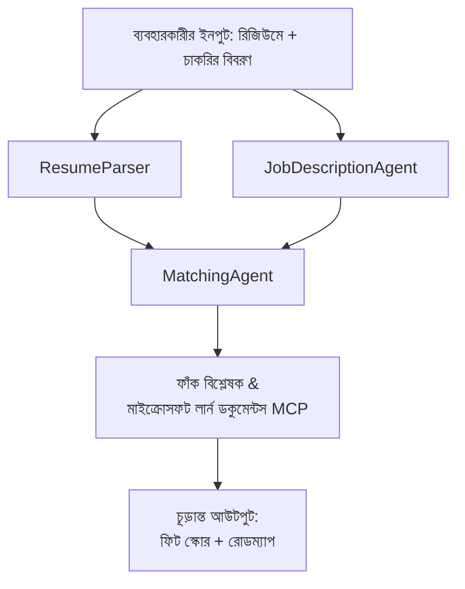

# PersonalCareerCopilot - রেজিউমে → কাজের উপযোগিতা মূল্যায়ক

একটি মাল্টি-এজেন্ট ওয়ার্কফ্লো যা একটি রেজিউমে কতটা ভালভাবে একটি কাজের বর্ণনার সাথে মেলে তা মূল্যায়ন করে, তারপর ফাঁক বন্ধ করার জন্য একটি ব্যক্তিগতকৃত শেখার রোডম্যাপ তৈরি করে।

---

## এজেন্টরা

| এজেন্ট | ভূমিকা | সরঞ্জামসমূহ |
|-------|------|-------|
| **ResumeParser** | রেজিউমে টেক্সট থেকে কাঠামোবদ্ধ দক্ষতা, অভিজ্ঞতা, সার্টিফিকেশন বের করে | - |
| **JobDescriptionAgent** | একটি JD থেকে প্রয়োজনীয়/পছন্দসই দক্ষতা, অভিজ্ঞতা, সার্টিফিকেশন বের করে | - |
| **MatchingAgent** | প্রোফাইল বনাম প্রয়োজনীয়তা তুলনা করে → ফিট স্কোর (0-100) + মিলানো/মিসিং দক্ষতা | - |
| **GapAnalyzer** | Microsoft Learn রিসোর্স দিয়ে একটি ব্যক্তিগতকৃত শেখার রোডম্যাপ তৈরি করে | `search_microsoft_learn_for_plan` (MCP) |

## ওয়ার্কফ্লো


---

## দ্রুত শুরু

### ১. পরিবেশ সেট আপ করুন

```powershell
cd workshop\lab02-multi-agent\PersonalCareerCopilot
python -m venv .venv
.\.venv\Scripts\Activate.ps1          # উইন্ডোজ পাওয়ারশেল
# source .venv/bin/activate            # ম্যাকওএস / লিনাক্স
pip install -r requirements.txt
```

### ২. সনদপত্র কনফিগার করুন

উদাহরণ env ফাইল কপি করুন এবং আপনার Foundry প্রকল্পের বিবরণ পূরণ করুন:

```powershell
cp .env.example .env
```

`.env` সম্পাদনা করুন:

```env
PROJECT_ENDPOINT=https://<your-account>.services.ai.azure.com/api/projects/<your-project>
MODEL_DEPLOYMENT_NAME=gpt-4.1-mini
```

| মান | কোথা থেকে পাবেন |
|-------|-----------------|
| `PROJECT_ENDPOINT` | Microsoft Foundry সাইডবার VS Code এ → আপনার প্রকল্পে রাইট-ক্লিক → **Copy Project Endpoint** |
| `MODEL_DEPLOYMENT_NAME` | Foundry সাইডবার → প্রকল্পটি এক্সপ্যান্ড করুন → **Models + endpoints** → ডিপ্লয়মেন্ট নাম |

### ৩. লোকালি চালান

```powershell
python -m debugpy --listen 127.0.0.1:5679 -m agentdev run main.py --verbose --port 8088
```

অথবা VS Code টাস্ক ব্যবহার করুন: `Ctrl+Shift+P` → **Tasks: Run Task** → **Run Lab02 HTTP Server**।

### ৪. Agent Inspector দিয়ে পরীক্ষা করুন

Agent Inspector খুলুন: `Ctrl+Shift+P` → **Foundry Toolkit: Open Agent Inspector**।

এই টেস্ট প্রম্পট পেস্ট করুন:

```
Resume:
Jane Doe
Senior Software Engineer with 5 years of experience in Python, Django, and AWS.
Built microservices handling 10K+ requests/second. Led a team of 4 developers.
Certifications: AWS Solutions Architect Associate.
Education: B.S. Computer Science, State University.

Job Description:
Senior Cloud Engineer at Contoso Ltd.
Required: Python, Azure, Kubernetes, Terraform, CI/CD pipelines.
Preferred: Go, monitoring (Prometheus/Grafana), cost optimization.
Experience: 5+ years in cloud infrastructure.
Certifications: Azure Solutions Architect Expert preferred.
```

**প্রত্যাশিত:** একটি ফিট স্কোর (0-100), মিলানো/মিসিং দক্ষতা, এবং Microsoft Learn URL সহ ব্যক্তিগতকৃত শেখার রোডম্যাপ।

### ৫. Foundry তে ডিপ্লয় করুন

`Ctrl+Shift+P` → **Microsoft Foundry: Deploy Hosted Agent** → আপনার প্রকল্প নির্বাচন করুন → নিশ্চিত করুন।

---

## প্রকল্পের গঠন

```
PersonalCareerCopilot/
├── .env.example        ← Template for environment variables
├── .env                ← Your credentials (git-ignored)
├── agent.yaml          ← Hosted agent definition (name, resources, env vars)
├── Dockerfile          ← Container image for Foundry deployment
├── main.py             ← 4-agent workflow (instructions, MCP tool, WorkflowBuilder)
└── requirements.txt    ← Python dependencies
```

## মূল ফাইলসমূহ

### `agent.yaml`

Foundry Agent Service এর জন্য হোস্টেড এজেন্ট নির্ধারণ করে:
- `kind: hosted` - একটি ম্যানেজড কনটেইনার হিসেবে চলে
- `protocols: [responses v1]` - `/responses` HTTP এন্ডপয়েন্ট প্রকাশ করে
- `environment_variables` - ডিপ্লয়মেন্ট সময় `PROJECT_ENDPOINT` এবং `MODEL_DEPLOYMENT_NAME` ইনজেক্ট করা হয়

### `main.py`

রয়েছে:
- **এজেন্ট নির্দেশাবলী** - চারটি `*_INSTRUCTIONS` কনস্ট্যান্ট, একেকটি এজেন্টের জন্য
- **MCP টুল** - `search_microsoft_learn_for_plan()` Streamable HTTP এর মাধ্যমে `https://learn.microsoft.com/api/mcp` কল করে
- **এজেন্ট তৈরি** - `create_agents()` কনটেক্সট ম্যানেজার `AzureAIAgentClient.as_agent()` ব্যবহার করে
- **ওয়ার্কফ্লো গ্রাফ** - `create_workflow()` `WorkflowBuilder` ব্যবহার করে এজেন্টদের ফ্যান-আউট/ফ্যান-ইন/সিকোয়েনশিয়াল প্যাটার্নের মাধ্যমে সংযোগ করে
- **সার্ভার স্টার্টআপ** - `from_agent_framework(agent).run_async()` পোর্ট 8088 এ

### `requirements.txt`

| প্যাকেজ | ভার্সন | উদ্দেশ্য |
|---------|---------|---------|
| `agent-framework-azure-ai` | `1.0.0rc3` | Microsoft Agent Framework এর জন্য Azure AI ইন্টিগ্রেশন |
| `agent-framework-core` | `1.0.0rc3` | কোর রানটাইম (WorkflowBuilder অন্তর্ভুক্ত) |
| `azure-ai-agentserver-agentframework` | `1.0.0b16` | হোস্টেড এজেন্ট সার্ভার রানটাইম |
| `azure-ai-agentserver-core` | `1.0.0b16` | কোর এজেন্ট সার্ভার আবস্ট্রাকশন |
| `debugpy` | সর্বশেষ | পাইথন ডিবাগিং (VS Code এ F5) |
| `agent-dev-cli` | `--pre` | লোকাল ডেভ CLI + Agent Inspector ব্যাকএন্ড |

---

## সমস্যা সমাধান

| সমস্যা | সমাধান |
|-------|-----|
| `RuntimeError: Missing required environment variable(s)` | `.env` ফাইল তৈরি করুন যার মধ্যে `PROJECT_ENDPOINT` এবং `MODEL_DEPLOYMENT_NAME` থাকবে |
| `ModuleNotFoundError: No module named 'agent_framework'` | ভেনভ সক্রিয় করুন এবং চালান `pip install -r requirements.txt` |
| আউটপুটে Microsoft Learn URL নেই | ইন্টারনেট সংযোগ পরীক্ষা করুন `https://learn.microsoft.com/api/mcp` সাথে |
| শুধুমাত্র ১টি গ্যাপ কার্ড (কাটছাঁট) | যাচাই করুন `GAP_ANALYZER_INSTRUCTIONS` এ `CRITICAL:` ব্লক আছে কি না |
| পোর্ট ৮০৮৮ ব্যবহার হচ্ছে | অন্য সার্ভার বন্ধ করুন: `netstat -ano \| findstr :8088` |

বিস্তারিত সমস্যা সমাধানের জন্য দেখুন [মডিউল ৮ - Troubleshooting](../docs/08-troubleshooting.md)।

---

**সম্পূর্ণ ওয়াকথ্রু:** [Lab 02 Docs](../docs/README.md) · **ফিরে যান:** [Lab 02 README](../README.md) · [ওয়ার্কশপ হোম](../../../README.md)

---

<!-- CO-OP TRANSLATOR DISCLAIMER START -->
**অস্বীকার**:  
এই ডকুমেন্টটি AI অনুবাদ সেবা [Co-op Translator](https://github.com/Azure/co-op-translator) ব্যবহার করে অনূাদিত হয়েছে। আমরা যত্ন সহকারে সঠিকতার চেষ্টা করি, তবে স্বয়ংক্রিয় অনুবাদে ত্রুটি বা ভুল থাকতে পারে। মূল ডকুমেন্টটি তার নিজস্ব ভাষায়ই সবচেয়ে বিশ্বাসযোগ্য উৎস হিসেবে বিবেচনা করা উচিত। গুরুত্বপূর্ণ তথ্যের জন্য পেশাদার মানব অনুবাদ গ্রহণ করা উত্তম। এই অনুবাদের ব্যবহার থেকে সৃষ্ট কোনও ভুল বোঝাবুঝি বা ভুল ব্যাখ্যার জন্য আমরা দায়ী নই।
<!-- CO-OP TRANSLATOR DISCLAIMER END -->