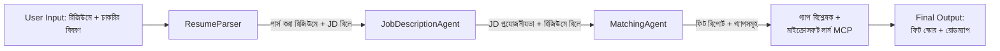

# PersonalCareerCopilot - রিজিউম → চাকরির উপযোগিতা মূল্যায়ক

একটি ওয়ার্কফ্লো-প্রথম মাল্টি-এজেন্ট অ্যাপ যা রিজিউম কতটা ভালোভাবে একটি চাকরির বর্ণনার সাথে মেলে তা মূল্যায়ন করে, তারপর ব্যবধান পূরণের জন্য একটি ব্যক্তিগতকৃত শেখার রোডম্যাপ তৈরি করে।

---

## এজেন্ট

| এজেন্ট | ভূমিকা | সরজমিন |
|-------|------|-------|
| **ResumeParser** | রিজিউম টেক্সট থেকে কাঠামোবদ্ধ দক্ষতা, অভিজ্ঞতা, সার্টিফিকেশন বের করে | - |
| **JobDescriptionAgent** | একটি JD থেকে প্রয়োজনীয়/পছন্দমত দক্ষতা, অভিজ্ঞতা, সার্টিফিকেশন বের করে | - |
| **MatchingAgent** | প্রোফাইল বনাম দাবিসমূহ তুলনা → ফিট স্কোর (০-১০০) + মেলানো/অনুপস্থিত দক্ষতা | - |
| **GapAnalyzer** | Microsoft Learn রিসোর্স ব্যবহার করে একটি ব্যক্তিগতকৃত শেখার রোডম্যাপ তৈরি করে | `search_microsoft_learn_for_plan` (MCP) |

## ওয়ার্কফ্লো


```mermaid
flowchart LR
    UserInput["User Input: রিজিউমে + চাকরির বিবরণ"] --> ResumeParser
    ResumeParser -- "পার্স করা রিজিউমে + JD রিলে" --> JobDescriptionAgent
    JobDescriptionAgent -- "JD প্রয়োজনীয়তা + রিজিউমে রিলে" --> MatchingAgent
    MatchingAgent -- "ফিট রিপোর্ট + গ্যাপসমূহ" --> GapAnalyzerMCP["গ্যাপ বিশ্লেষক +\nমাইক্রোসফট লার্ন MCP"]
    GapAnalyzerMCP --> FinalOutput["Final Output:\nফিট স্কোর + রোডম্যাপ"]
```

---

## দ্রুত শুরু

### ১. পরিবেশ সেটআপ করুন

এই ফোল্ডারটি ওয়ার্কফ্লো-ভিত্তিক ল্যাব ০২ স্ক্যাফোল্ডের রেফারেন্স ইমপ্লিমেন্টেশন। এর `main.py` বিদ্যমান প্রম্পট ব্লক এবং `WorkflowBuilder` ব্যবহার করে চারটি এজেন্টকে একযোগে যুক্ত করে।

```powershell
cd workshop\lab02-multi-agent\PersonalCareerCopilot
python -m venv .venv
.\.venv\Scripts\Activate.ps1          # উইন্ডোজ পাওয়ারশেল
# source .venv/bin/activate            # ম্যাকওএস / লিনাক্স
pip install -r requirements.txt
```

### ২. ক্রেডেনশিয়াল কনফিগার করুন

এই ফোল্ডারে একটি `.env` ফাইল তৈরি করুন:

```powershell
copy .env .env.bak 2>$null; echo $null > .env
```

`.env` সম্পাদনা করুন:

```env
FOUNDRY_PROJECT_ENDPOINT=https://<your-account>.services.ai.azure.com/api/projects/<your-project>
AZURE_AI_MODEL_DEPLOYMENT_NAME=gpt-4.1-mini
```

| মান | কোথা থেকে পাবেন |
|-------|------------------|
| `FOUNDRY_PROJECT_ENDPOINT` | Foundry Toolkit সাইডবার → আপনার প্রকল্পে রাইট-ক্লিক → **Copy Project Endpoint** |
| `AZURE_AI_MODEL_DEPLOYMENT_NAME` | Foundry সাইডবার → প্রকল্প সম্প্রসারণ করুন → **Models + endpoints** → ডেপ্লয়মেন্ট নাম |

### ৩. স্থানীয়ভাবে চালান

```powershell
python -m debugpy --listen 127.0.0.1:5679 main.py --port 8088
```

অথবা VS কোড টাস্ক ব্যবহার করুন: `Ctrl+Shift+P` → **Tasks: Run Task** → **Run Agent HTTP Server**।

F5 ডিবাগিং এর জন্য, ব্যবহার করুন **Debug Local Agent HTTP Server**।

### ৪. এজেন্ট ইন্সপেক্টর দিয়ে পরীক্ষা করুন

এজেন্ট ইন্সপেক্টর খুলুন: `Ctrl+Shift+P` → **Foundry Toolkit: Open Agent Inspector**।

এই পরীক্ষার প্রম্পট পেস্ট করুন:

```
Resume:
Jane Doe
Senior Software Engineer with 5 years of experience in Python, Django, and AWS.
Built microservices handling 10K+ requests/second. Led a team of 4 developers.
Certifications: AWS Solutions Architect Associate.
Education: B.S. Computer Science, State University.

Job Description:
Senior Cloud Engineer at Contoso Ltd.
Required: Python, Azure, Kubernetes, Terraform, CI/CD pipelines.
Preferred: Go, monitoring (Prometheus/Grafana), cost optimization.
Experience: 5+ years in cloud infrastructure.
Certifications: Azure Solutions Architect Expert preferred.
```

**প্রত্যাশিত ফলাফল:** একটি ফিট স্কোর (০-১০০), মেলানো/অনুপস্থিত দক্ষতা, এবং Microsoft Learn URL সহ একটি ব্যক্তিগতকৃত শেখার রোডম্যাপ।

### ৫. Foundry তে ডেপ্লয় করুন

`Ctrl+Shift+P` → **Foundry Toolkit: Deploy Hosted Agent** → আপনার প্রকল্প নির্বাচন করুন → নিশ্চিত করুন।

---

## প্রকল্প কাঠামো

```
PersonalCareerCopilot/
├── .env                ← Your credentials (git-ignored)
├── agent.yaml          ← Hosted agent definition (name, resources, env vars)
├── Dockerfile          ← Container image for Foundry deployment
├── main.py             ← 4-agent workflow (instructions, MCP tool, WorkflowBuilder)
└── requirements.txt    ← Python dependencies
```

## প্রধান ফাইলসমূহ

### `agent.yaml`

Foundry Agent Service এর জন্য হোস্টেড এজেন্ট সংজ্ঞায়িত করে:
- `kind: hosted` - একটি ব্যবস্থাপিত কন্টেইনার হিসেবে চলে
- `protocols` - `responses` প্রোটোকল `version: 1.0.0` সহ, `/responses` HTTP এন্ডপয়েন্ট প্রকাশ করে
- `environment_variables` - এখানে `AZURE_AI_MODEL_DEPLOYMENT_NAME` ঘোষণা করা হয়েছে; `FOUNDRY_PROJECT_ENDPOINT` ডেপ্লয়ে স্বয়ংক্রিয় ইনজেক্ট হয়

### `main.py`

ধারণ করে:
- **Agent নির্দেশনা** - চারটি `*_INSTRUCTIONS` ধ্রুবক, প্রতি এজেন্টের জন্য একটি
- **MCP টুল** - `search_microsoft_learn_for_plan()` কল করে `https://learn.microsoft.com/api/mcp` এর মাধ্যমে Streamable HTTP
- **Agent তৈরি** - চারটি `Agent()` + `AgentExecutor()` ইনস্ট্যান্স যা একটি `FoundryChatClient` শেয়ার করে
- **ওয়ার্কফ্লো গ্রাফ** - `WorkflowBuilder` এজেন্টগুলোকে একটি ধারাবাহিক পাইপলাইনে যুক্ত করে: ResumeParser → JD Agent → MatchingAgent → GapAnalyzer
- **সার্ভার শুরু** - `ResponsesHostServer` পোর্ট ৮০৮৮ এ চলে

### `requirements.txt`

| প্যাকেজ | উদ্দেশ্য |
|---------|----------|
| `agent-framework-foundry` | মূল রানটাইম: `Agent`, `AgentExecutor`, `WorkflowBuilder`, `@tool`, `FoundryChatClient` |
| `agent-framework-foundry-hosting` | `ResponsesHostServer` + Foundry হোস্টিং ইন্টিগ্রেশন |
| `mcp<2,>=1.24.0` | GapAnalyzer এর MCP ক্লায়েন্ট (`streamable_http_client`) |
| `debugpy` | পাইথন ডিবাগিং (VS কোডে F5) |

---

## সমস্যা সমাধান

| সমস্যা | সমাধান |
|-------|-----|
| `KeyError: 'FOUNDRY_PROJECT_ENDPOINT'` বা `KeyError: 'AZURE_AI_MODEL_DEPLOYMENT_NAME'` | `.env` তৈরি করুন এবং উভয় `FOUNDRY_PROJECT_ENDPOINT` এবং `AZURE_AI_MODEL_DEPLOYMENT_NAME` সেট করুন |
| `ModuleNotFoundError: No module named 'agent_framework'` | venv সক্রিয় করুন এবং `pip install -r requirements.txt` চালান |
| আউটপুটে Microsoft Learn URL নেই | `https://learn.microsoft.com/api/mcp` ইন্টারনেট সংযোগ চেক করুন |
| শুধু ১টি গ্যাপ কার্ড (ছেঁটে ফেলা) | যাচাই করুন `GAP_ANALYZER_INSTRUCTIONS` এর মধ্যে `CRITICAL:` ব্লক আছে |
| পোর্ট ৮০৮৮ ব্যস্ত | অন্যান্য সার্ভার বন্ধ করুন: `netstat -ano \| findstr :8088` |

বিস্তারিত সমস্যা সমাধানের জন্য দেখুন [মডিউল ৮ - সমস্যা সমাধান](../docs/08-troubleshooting.md)।

---

**সম্পূর্ণ ওয়াকথ্রু:** [Lab 02 Docs](../docs/README.md) · **ফিরে যান:** [Lab 02 README](../README.md) · [ওয়ার্কশপ হোম](../../../README.md)

---

<!-- CO-OP TRANSLATOR DISCLAIMER START -->
**অস্বীকৃতি**:
এই নথিটি AI অনুবাদ পরিষেবা [Co-op Translator](https://github.com/Azure/co-op-translator) ব্যবহার করে অনূদিত হয়েছে। যদিও আমরা শুদ্ধতার জন্য চেষ্টা করি, অনুগ্রহ করে মনে রাখবেন যে স্বয়ংক্রিয় অনুবাদে ত্রুটি বা অসঙ্গতি থাকতে পারে। মূল নথিটি তার স্বভাষায় কর্তৃত্বপূর্ণ উৎস হিসেবে বিবেচিত হওয়া উচিত। গুরুত্বপূর্ণ তথ্যের জন্য পেশাদার মানব অনুবাদ সুপারিশ করা হয়। এই অনুবাদের ব্যবহারে প্রয়োজনীয় ভুল বোঝাবুঝি বা ভুল ব্যাখ্যার জন্য আমরা দায়বদ্ধ নই।
<!-- CO-OP TRANSLATOR DISCLAIMER END -->