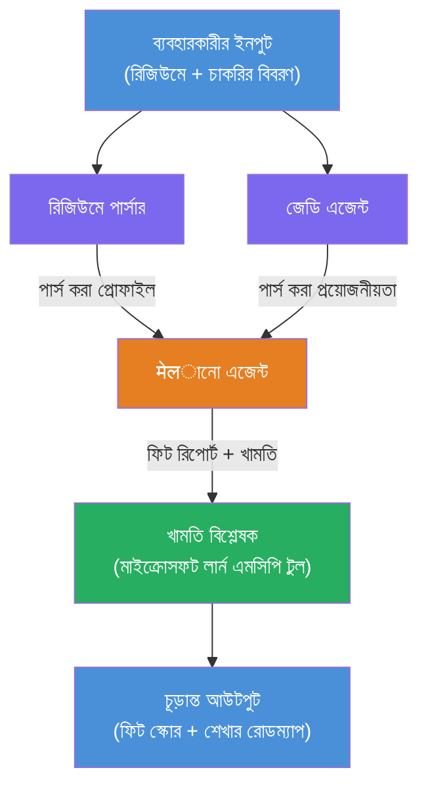

# ল্যাব ০২ - মাল্টি-এজেন্ট ওয়ার্কফ্লো: রিজিউমে → জব ফিট ইভ্যালুয়েটর

---

## আপনি যা তৈরি করবেন

একটি **রিজিউমে → জব ফিট ইভ্যালুয়েটর** - একটি মাল্টি-এজেন্ট ওয়ার্কফ্লো যেখানে চারটি বিশেষায়িত এজেন্ট একযোগে কাজ করে ক্যান্ডিডেটের রিজিউমে কতটা ভালোভাবে একটি চাকরির বর্ণনার সাথে মেলে তা মূল্যায়ন করে, তারপর গ্যাপগুলো বন্ধ করার জন্য একটি ব্যক্তিগতকৃত শেখার রোডম্যাপ তৈরি করে।

### এজেন্টরা

| এজেন্ট | ভূমিকা |
|-------|------|
| **রিজিউমে পার্সার** | রিজিউমে টেক্সট থেকে কাঠামোবদ্ধ স্কিল, অভিজ্ঞতা, সার্টিফিকেশন বের করে আনে |
| **জব ডেসক্রিপশন এজেন্ট** | একটি JD থেকে প্রয়োজনীয়/পছন্দের স্কিল, অভিজ্ঞতা, সার্টিফিকেশন বের করে আনে |
| **ম্যাচিং এজেন্ট** | প্রোফাইল বনাম প্রয়োজনীয়তাগুলো তুলনা করে → ফিট স্কোর (০-১০০) + মেলানো/মিসিং স্কিল রিপোর্ট করে |
| **গ্যাপ অ্যানালাইজার** | রিসোর্স, টাইমলাইন এবং দ্রুত কাজের প্রকল্পসহ একটি ব্যক্তিগতকৃত শেখার রোডম্যাপ তৈরি করে |

### ডেমো ফ্লো

একটি **রিজিউমে + জব ডেসক্রিপশন** আপলোড করুন → একটি **ফিট স্কোর + মিসিং স্কিল** পান → একটি **ব্যক্তিগতকৃত শেখার রোডম্যাপ** গ্রহণ করুন।

### ওয়ার্কফ্লো আর্কিটেকচার

> বেগুনি = সমান্তরাল এজেন্ট | কমলা = অগ্রেগেশন পয়েন্ট | সবুজ = টুলসহ ফাইনাল এজেন্ট। বিস্তারিত ডায়াগ্রাম এবং ডেটা ফ্লো জন্য [মডিউল ১ - আর্কিটেকচার বুঝুন](docs/01-understand-multi-agent.md) এবং [মডিউল ৪ - অর্কেস্ট্রেশন প্যাটার্ন](docs/04-orchestration-patterns.md) দেখুন।

### আলোচিত বিষয়সমূহ

- **WorkflowBuilder** ব্যবহার করে মাল্টি-এজেন্ট ওয়ার্কফ্লো তৈরি
- এজেন্টের ভূমিকা নির্ধারণ এবং অর্কেস্ট্রেশন ফ্লো (সমান্তরাল + ধাপে ধাপে)
- এজেন্টদের মধ্যে যোগাযোগ প্যাটার্ন
- Agent Inspector দিয়ে লোকাল টেস্টিং
- Foundry Agent Service-এ মাল্টি-এজেন্ট ওয়ার্কফ্লো স্থাপন করা

---

## প্রয়োজনীয়তা

প্রথমে ল্যাব ০১ সম্পন্ন করুন:

- [ল্যাব ০১ - সিঙ্গল এজেন্ট](../lab01-single-agent/README.md)

---

## শুরু করুন

সম্পূর্ণ সেটআপ নির্দেশনা, কোড ওয়াকথ্রু এবং টেস্ট কমান্ড এখানে দেখুন:

- [ল্যাব ২ ডকস - প্রয়োজনীয়তা](docs/00-prerequisites.md)
- [ল্যাব ২ ডকস - সম্পূর্ণ শেখার পথ](docs/README.md)
- [PersonalCareerCopilot রান গাইড](PersonalCareerCopilot/README.md)

## অর্কেস্ট্রেশন প্যাটার্ন (এজেন্টিক বিকল্পসমূহ)

ল্যাব ২-এর ডিফল্ট রয়েছে **সমান্তরাল → অ্যাগ্রিগেটর → প্ল্যানার** ফ্লো, এবং ডকুমেন্টেশন আরও বিকল্প প্যাটার্নও বর্ণনা করে যা শক্তিশালী এজেন্টিক আচরণ প্রদর্শন করে:

- **Fan-out/Fan-in সহ Weighted Consensus**
- **ফাইনাল রোডম্যাপের আগে রিভিউয়ার/ক্রিটিক পাস**
- **শর্তাধীন রাউটার** (ফিট স্কোর এবং মিসিং স্কিলের ওপর ভিত্তি করে পথ নির্বাচন)

দেখুন [docs/04-orchestration-patterns.md](docs/04-orchestration-patterns.md)।

---

**আগের:** [ল্যাব ০১ - সিঙ্গল এজেন্ট](../lab01-single-agent/README.md) · **ফিরে যান:** [ওয়ার্কশপ হোম](../../README.md)

---

<!-- CO-OP TRANSLATOR DISCLAIMER START -->
**অস্বীকৃতি**:  
এই দস্তাবেজটি AI অনুবাদ সেবা [Co-op Translator](https://github.com/Azure/co-op-translator) ব্যবহার করে অনূদিত হয়েছে। যদিও আমরা সঠিকতার জন্য চেষ্টা করি, অনুগ্রহ করে মনে রাখবেন যে স্বয়ংক্রিয় অনুবাদে ভুল বা ত্রুটি থাকতে পারে। মৌলিক ভাষায় মূল দস্তাবেজটিকে সরকারি উৎস হিসাবে বিবেচনা করা উচিত। গুরুত্বপূর্ণ তথ্যের জন্য পেশাদার মানুষ দ্বারা অনুবাদ করানো উত্তম। এই অনুবাদের ব্যবহারে কোনো ভুলবোঝাবুঝি বা ভুল ব্যাখ্যার জন্য আমরা দায়ী নই।
<!-- CO-OP TRANSLATOR DISCLAIMER END -->