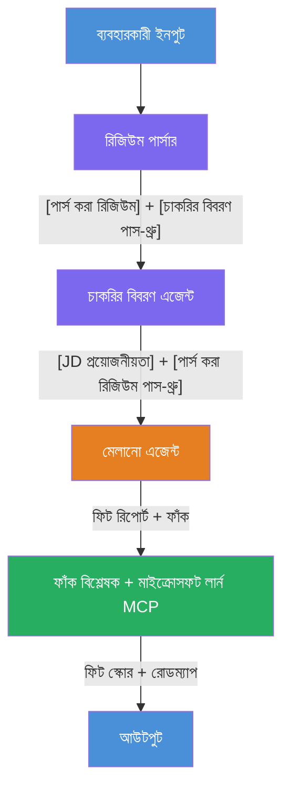

# ল্যাব ০২ - মাল্টি-এজেন্ট ওয়ার্কফ্লো: রিজিউম → জব ফিট ইভ্যালুয়েটর

## ওভারভিউ

এই হ্যান্ডস-অন ল্যাবে, আপনি VS কোডে Foundry Toolkit ব্যবহার করে একটি **ওয়ার্কফ্লো-প্রথম মাল্টি-এজেন্ট অ্যাপ** তৈরি করবেন এবং এটি Microsoft Foundry Agent Service-এ ডিপ্লয় করবেন।

**আপনি যা তৈরি করবেন:** একটি রিজিউম → জব ফিট ইভ্যালুয়েটর যা একটি রিজিউম এবং জব বর্ণনা পার্স করে, ম্যাচ স্কোর করে এবং Microsoft Learn রিসোর্স ব্যবহার করে একটি ব্যক্তিগতকৃত লার্নিং রোডম্যাপ তৈরি করে।

---

## আর্কিটেকচার

```mermaid
flowchart TD
    A["ব্যবহারকারী ইনপুট"] --> B["রিজিউম পার্সার"]
    B -->|"[পার্স করা রিজিউম] + [চাকরির বিবরণ পাস-থ্রু]"| C["চাকরির বিবরণ এজেন্ট"]
    C -->|"[JD প্রয়োজনীয়তা] + [পার্স করা রিজিউম পাস-থ্রু]"| D["মেলানো এজেন্ট"]
    D -->|ফিট রিপোর্ট + ফাঁক| E["ফাঁক বিশ্লেষক + মাইক্রোসফট লার্ন MCP"]
    E -->|ফিট স্কোর + রোডম্যাপ| F["আউটপুট"]

    style A fill:#4A90D9,color:#fff
    style B fill:#7B68EE,color:#fff
    style C fill:#7B68EE,color:#fff
    style D fill:#E67E22,color:#fff
    style E fill:#27AE60,color:#fff
    style F fill:#4A90D9,color:#fff
```

**কিভাবে কাজ করে:**
1. ব্যবহারকারী একটি রিজিউম এবং জব বর্ণনা পেস্ট করেন।
2. **ResumeParser** রিজিউম পার্স করে এবং JD-কে একেবারে অনুলিপি করে `[JOB DESCRIPTION PASS-THROUGH]` সেকশনে রাখে।
3. **JD Agent** পাস-থ্রু থেকে স্ট্রাকচার্ড রিকোয়েরমেন্ট বের করে, তারপর `[PARSED RESUME]` কে সামনে পাঠিয়ে দেয় `[PARSED RESUME PASS-THROUGH]` হিসেবে।
4. **MatchingAgent** `[PARSED RESUME PASS-THROUGH]` বনাম `[JD REQUIREMENTS]` তুলনা করে এবং একটি ফিট স্কোর তৈরি করে।
5. **GapAnalyzer** গ্যাপগুলোকে একটি প্র্যাকটিক্যাল রোডম্যাপে রূপান্তর করে এবং MCP-এর মাধ্যমে আসল Microsoft Learn লিঙ্ক সংগ্রহ করে।

---

## পূর্বশর্তসমূহ

প্রথমে ল্যাব ০১ সম্পূর্ণ করুন:

- [Lab 01 - Single Agent](../lab01-single-agent/README.md)

---

## পার্ট ১: মডিউলগুলো ধারাবাহিকভাবে পড়ুন

সম্পূর্ণ লার্নিং পাথ দেখুন:

- [Lab 2 Docs - Prerequisites](docs/00-prerequisites.md)
- [Lab 2 Docs - Full Learning Path](docs/README.md)
- [PersonalCareerCopilot run guide](PersonalCareerCopilot/README.md)

---

## পার্ট ২: ওয়ার্কফ্লো তৈরি ও পরীক্ষা করুন

1. Foundry Toolkit উইজার্ড ব্যবহার করে ওয়ার্কফ্লো ভিত্তিক প্রোজেক্ট স্ক্যাফোল্ড করুন।
2. `PersonalCareerCopilot/main.py` থেকে প্রম্পট ব্লক এবং ওয়ার্কফ্লো গ্রাফ আপনার ওয়ার্কস্পেসে কপি করুন।
3. Agent Inspector দিয়ে লোকালি চালিয়ে সব চার এজেন্ট এবং MCP টুল যাচাই করুন।
4. লোকাল টেস্ট পাস হলে হোস্ট এজেন্টটি Foundry-তে ডিপ্লয় করুন।

---

## অর্কেস্ট্রেশন প্যাটার্নস

ল্যাব ০২-এ ডিফল্ট **ফ্যান-আউট → ফ্যান-ইন → সিকোয়েনশিয়াল** ফ্লো অন্তর্ভুক্ত রয়েছে, এবং ডকসগুলো পরীক্ষার জন্য বিকল্প অর্কেস্ট্রেশন প্যাটার্নসও বর্ণনা করে।

- **ওজনযুক্ত সম্মতিসহ ফ্যান-আউট/ফ্যান-ইন**
- **শেষ রোডম্যাপের আগে রিভিউয়ার/সমালোচক পাস**
- **ফিট স্কোর এবং অনুপস্থিত দক্ষতার ভিত্তিতে কন্ডিশনাল রাউটার**

দেখুন [docs/04-orchestration-patterns.md](docs/04-orchestration-patterns.md)।

---

**পূর্ববর্তী:** [Lab 01 - Single Agent](../lab01-single-agent/README.md) · **বাড়ি ফিরে যান:** [Workshop Home](../../README.md)

---

<!-- CO-OP TRANSLATOR DISCLAIMER START -->
**অস্বীকৃতি**:
এই নথিটি AI অনুবাদ পরিষেবা [Co-op Translator](https://github.com/Azure/co-op-translator) ব্যবহার করে অনূদিত হয়েছে। যদিও আমরা শুদ্ধতার জন্য চেষ্টা করি, অনুগ্রহ করে মনে রাখবেন যে স্বয়ংক্রিয় অনুবাদে ত্রুটি বা অসঙ্গতি থাকতে পারে। মূল নথিটি তার স্বভাষায় কর্তৃত্বপূর্ণ উৎস হিসেবে বিবেচিত হওয়া উচিত। গুরুত্বপূর্ণ তথ্যের জন্য পেশাদার মানব অনুবাদ সুপারিশ করা হয়। এই অনুবাদের ব্যবহারে প্রয়োজনীয় ভুল বোঝাবুঝি বা ভুল ব্যাখ্যার জন্য আমরা দায়বদ্ধ নই।
<!-- CO-OP TRANSLATOR DISCLAIMER END -->