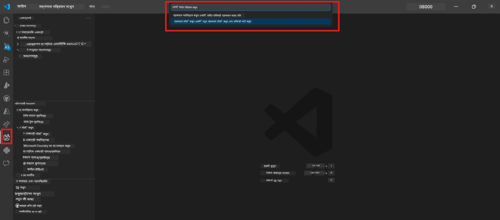

# Module 0 - পূর্বপ্রয়োজনীয়তা

Lab 02 শুরু করার আগে, নিশ্চিত করুন যে আপনার নিচের বিষয়গুলি সম্পন্ন হয়েছে। এই ল্যাব সরাসরি Lab 01 এর উপর ভিত্তি করে তৈরি — এটি ছাড়িয়ে যাবেন না।

---

## 1. Lab 01 সম্পন্ন করুন

Lab 02 অনুমান করে আপনি ইতিমধ্যে:

- [x] [Lab 01 - Single Agent](../../lab01-single-agent/README.md) এর সব ৮টি মডিউল সম্পন্ন করেছেন
- [x] Foundry Agent Service এ সফলভাবে একটি single agent ডিপ্লয় করেছেন
- [x] এজেন্টটি স্থানীয় Agent Inspector এবং Foundry Playground উভয় জায়গায় কাজ করে তা যাচাই করেছেন

যদি আপনি Lab 01 সম্পন্ন না করে থাকেন, এখন ফিরে যান এবং শেষ করুন: [Lab 01 Docs](../../lab01-single-agent/docs/00-prerequisites.md)

---

## 2. বিদ্যমান সেটআপ যাচাই করুন

Lab 01 থেকে সমস্ত টুল এখনো ইনস্টল এবং কাজ করছে তা নিশ্চিত করুন। নিচের দ্রুত পরীক্ষাগুলো চালান:

### 2.1 Azure CLI

```powershell
az account show --query "{name:name, id:id}" --output table
```

আশা করা হচ্ছে: আপনার সাবস্ক্রিপশন নাম এবং আইডি দেখায়। যদি এটি ব্যর্থ হয়, তাহলে চালান [`az login`](https://learn.microsoft.com/cli/azure/authenticate-azure-cli-interactively)।

### 2.2 VS Code এক্সটেনশনসমূহ

1. `Ctrl+Shift+P` চাপুন → টাইপ করুন **"Microsoft Foundry"** → নিশ্চিত করুন আপনি কমান্ডগুলো দেখছেন (যেমন, `Microsoft Foundry: Create a New Hosted Agent`)।
2. `Ctrl+Shift+P` চাপুন → টাইপ করুন **"Foundry Toolkit"** → নিশ্চিত করুন আপনি কমান্ডগুলো দেখছেন (যেমন, `Foundry Toolkit: Open Agent Inspector`)।

### 2.3 Foundry প্রকল্প ও মডেল

1. VS Code Activity Bar এ **Microsoft Foundry** আইকনে ক্লিক করুন।
2. নিশ্চিত করুন আপনার প্রকল্প তালিকাভুক্ত আছে (যেমন, `workshop-agents`)।
3. প্রকল্পটি বিস্তৃত করুন → নিশ্চিত করুন একটি ডিপ্লয় করা মডেল আছে (যেমন, `gpt-4.1-mini`) এবং এর স্ট্যাটাস **Succeeded**।

> **যদি আপনার মডেল ডিপ্লয়মেন্টের মেয়াদ শেষ হয়ে যায়:** কিছু ফ্রি-টিয়ার ডিপ্লয়মেন্ট স্বয়ংক্রিয়ভাবে মেয়াদউত্তীর্ণ হয়। পুনরায় ডিপ্লয় করুন [Model Catalog](https://learn.microsoft.com/azure/foundry/foundry-models/concepts/models-sold-directly-by-azure) থেকে (`Ctrl+Shift+P` → **Microsoft Foundry: Open Model Catalog**)।



### 2.4 RBAC রোল

নিশ্চিত করুন আপনার Foundry প্রকল্পে **Azure AI User** আছে:

1. [Azure Portal](https://portal.azure.com) → আপনার Foundry **প্রকল্প** রিসোর্স → **Access control (IAM)** → **[Role assignments](https://learn.microsoft.com/azure/foundry/concepts/rbac-foundry)** ট্যাব।
2. আপনার নাম অনুসন্ধান করুন → নিশ্চিত করুন **[Azure AI User](https://aka.ms/foundry-ext-project-role)** তালিকাভুক্ত আছে।

---

## 3. মাল্টি-এজেন্ট ধারণা বুঝুন (Lab 02 এর জন্য নতুন)

Lab 02 কিছু ধারণা পরিচয় করায় যা Lab 01 এ ছিল না। এগুলো পড়ে নিন আগানোর আগে:

### 3.1 মাল্টি-এজেন্ট ওয়ার্কফ্লো কি?

একজন এজেন্ট সবকিছু পরিচালনা করার পরিবর্তে, একটি **মাল্টি-এজেন্ট ওয়ার্কফ্লো** কাজ ভাগ করে দেয় একাধিক বিশেষজ্ঞ এজেন্টের মধ্যে। প্রতিটি এজেন্টের আছে:

- নিজস্ব **নির্দেশনা** (সিস্টেম প্রম্পট)
- নিজস্ব **ভূমিকা** (যা এর দায়িত্ব)
- ঐচ্ছিক **টুলস** (যা ফাংশন কল করতে পারে)

এজেন্টরা একটি **অর্কেস্ট্রেশন গ্রাফ** এর মাধ্যমে যোগাযোগ করে যা সংজ্ঞায়িত করে ডেটা কিভাবে তাদের মধ্যে প্রবাহিত হয়।

### 3.2 WorkflowBuilder

`agent_framework` থেকে [`WorkflowBuilder`](https://learn.microsoft.com/agent-framework/workflows/agents-in-workflows) ক্লাস হলো SDK এর উপাদান যা এজেন্টদের সংযোগ করে:

```python
from agent_framework import WorkflowBuilder

workflow = (
    WorkflowBuilder(
        name="MyWorkflow",
        start_executor=agent_a,
        output_executors=[agent_d],
    )
    .add_edge(agent_a, agent_b)
    .add_edge(agent_a, agent_c)
    .add_edge(agent_b, agent_d)
    .add_edge(agent_c, agent_d)
    .build()
)
```

- **`start_executor`** - প্রথম এজেন্ট যিনি ইউজার ইনপুট গ্রহণ করেন
- **`output_executors`** - এজেন্ট(গুলি) যাদের আউটপুট চূড়ান্ত প্রতিক্রিয়া হয়
- **`add_edge(source, target)`** - সংজ্ঞায়িত করে যে `target` পায় `source` এর আউটপুট

### 3.3 MCP (Model Context Protocol) টুলস

Lab 02 একটি **MCP টুল** ব্যবহার করে যা Microsoft Learn API কল করে লার্নিং রিসোর্স সংগ্রহ করে। [MCP (Model Context Protocol)](https://modelcontextprotocol.io/introduction) হলো AI মডেলকে বাইরের ডেটা সোর্স এবং টুলস এর সাথে সংযোগ করার জন্য একটি স্ট্যান্ডার্ডাইজড প্রোটোকল।

| শব্দ | সংজ্ঞা |
|------|-----------|
| **MCP সার্ভার** | একটি সার্ভিস যা [MCP প্রোটোকল](https://learn.microsoft.com/azure/foundry/agents/how-to/tools/model-context-protocol) এর মাধ্যমে টুল/রিসোর্স এক্সপোজ করে |
| **MCP ক্লায়েন্ট** | আপনার এজেন্ট কোড যা MCP সার্ভারের সাথে সংযোগ স্থাপন করে এবং তার টুলস কল করে |
| **[Streamable HTTP](https://learn.microsoft.com/agent-framework/agents/tools/hosted-mcp-tools)** | MCP সার্ভারের সাথে যোগাযোগের ব্যবহৃত ট্রান্সপোর্ট পদ্ধতি |

### 3.4 Lab 02 কিভাবে Lab 01 থেকে আলাদা

| দিক | Lab 01 (Single Agent) | Lab 02 (Multi-Agent) |
|--------|----------------------|---------------------|
| এজেন্ট | ১ | ৪ (বিশেষায়িত ভূমিকা) |
| অর্কেস্ট্রেশন | নেই | WorkflowBuilder (প্যারালাল + সিকোয়েন্সিয়াল) |
| টুলস | ঐচ্ছিক `@tool` ফাংশন | MCP টুল (বাহ্যিক API কল) |
| জটিলতা | সাধারণ প্রম্পট → প্রতিক্রিয়া | Resume + JD → ফিট স্কোর → রোডম্যাপ |
| প্রসঙ্গ প্রবাহ | সরাসরি | এজেন্ট-টু-এজেন্ট হ্যান্ডঅফ |

---

## 4. Lab 02 এর ওয়ার্কশপ রিপোজিটরির কাঠামো

নিশ্চিত করুন আপনি জানেন Lab 02 এর ফাইল কোথায় রয়েছে:

```
workshop/
└── lab02-multi-agent/
    ├── README.md                       ← Lab overview
    ├── docs/                           ← You are here
    │   ├── README.md                   ← Learning path index
    │   ├── 00-prerequisites.md         ← This file
    │   ├── 01-understand-multi-agent.md
    │   ├── ...
    │   └── 08-troubleshooting.md
    └── PersonalCareerCopilot/          ← The agent project
        ├── agent.yaml                  ← Agent definition
        ├── main.py                     ← 4-agent workflow code
        ├── Dockerfile                  ← Container configuration
        └── requirements.txt            ← Python dependencies
```

---

### চেকপয়েন্ট

- [ ] Lab 01 সম্পূর্ণ হয়েছে (সব ৮ মডিউল, এজেন্ট ডিপ্লয় ও যাচাই করা)
- [ ] `az account show` আপনার সাবস্ক্রিপশন দেখায়
- [ ] Microsoft Foundry এবং Foundry Toolkit এক্সটেনশন ইনস্টল ও সাড়া দিচ্ছে
- [ ] Foundry প্রকল্পে একটি ডিপ্লয়ড মডেল আছে (যেমন, `gpt-4.1-mini`)
- [ ] আপনার প্রকল্পে **Azure AI User** রোল আছে
- [ ] উপরের মাল্টি-এজেন্ট ধারণা অংশ পড়ে আপনি WorkflowBuilder, MCP, এবং এজেন্ট অর্কেস্ট্রেশন বুঝেছেন

---

**পরবর্তী:** [01 - মাল্টি-এজেন্ট আর্কিটেকচার বুঝুন →](01-understand-multi-agent.md)

---

<!-- CO-OP TRANSLATOR DISCLAIMER START -->
**অস্বীকৃতি**:
এই ডকুমেন্টটি AI অনুবাদ সেবা [Co-op Translator](https://github.com/Azure/co-op-translator) ব্যবহার করে অনুবাদ করা হয়েছে। আমরা যথাসম্ভব সঠিক হতে চেষ্টা করি, তবে অনুগ্রহ করে লক্ষ্য করুন যে স্বয়ংক্রিয় অনুবাদে ত্রুটি বা ভুল থাকতে পারে। মূল ডকুমেন্টটি তার স্বতন্ত্র ভাষায় প্রাধান্যসূত্রে বিবেচিত হওয়া উচিত। গুরুতর তথ্যের জন্য পেশাদার মানব অনুবাদ সুপারিশ করা হয়। এই অনুবাদের ব্যবহারে সংঘটিত যেকোনো ভুল বোঝাবুঝি বা ভ্রান্ত ব্যাখ্যার জন্য আমরা দায়ী নই।
<!-- CO-OP TRANSLATOR DISCLAIMER END -->