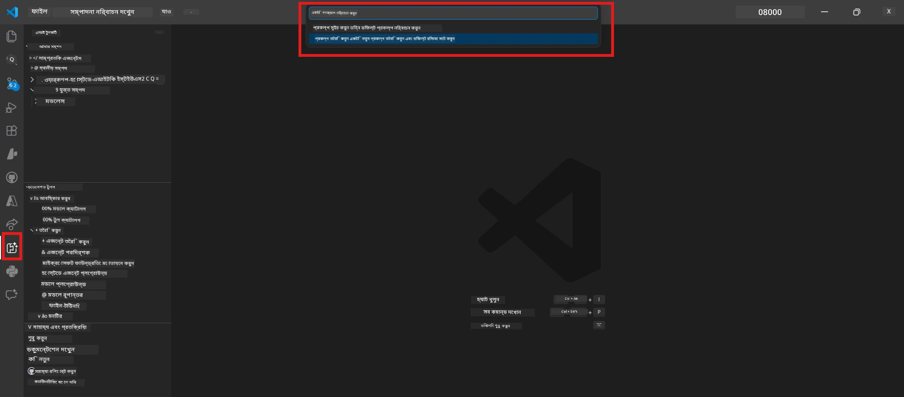

# মডিউল ০ - পরিচিতি

⏱️ ~১০ মিনিট

> [!WARNING]
> **পূর্বরূপ ও সীমাবদ্ধতা:** [হোস্টেড এজেন্টস](https://learn.microsoft.com/azure/foundry/agents/concepts/hosted-agents) বর্তমানে **পাবলিক প্রিভিউ** তে রয়েছে - প্রোডাকশন কাজের জন্য সুপারিশ নয়। এই কর্মশালায় প্রদর্শিত কিছু বৈশিষ্ট্য সেবা GA এর দিকে যাওয়ার সাথে সাথে পরিবর্তিত হতে পারে।

## আপনি যা তৈরী করবেন

এই ল্যাবে, আপনি Lab 01 এর একক-এজেন্ট দক্ষতাগুলি বাড়িয়ে একটি **মাল্টি-এজেন্ট ওয়ার্কফ্লো** তৈরি করবেন - রেজিউমে → চাকরির ফিট ইভ্যালুয়েটর।

আপনি একটি **রেজিউমে** এবং একটি **চাকরির বিবরণ** পেস্ট করবেন। চারজন বিশেষায়িত এজেন্ট ইনপুট ক্রমানুসারে প্রক্রিয়া করবে, তারপর রিটার্ন করবে:
- একটি ফিট স্কোর (০–১০০ এবং স্কোর ব্রেকডাউন সহ)
- একটি দক্ষতা ও সার্টিফিকেশন ফাঁক তালিকা
- প্রতিটি ফাঁকের জন্য বাস্তব Microsoft Learn লিংক সহ একটি ব্যক্তিগতকৃত শেখার রোডম্যাপ

**ওয়ার্কফ্লো ব্যবহার করে:**
- **Microsoft Agent Framework** - `WorkflowBuilder` ক্রমানুসারে পাইপলাইন অর্কেস্ট্রেশনের জন্য
- **Foundry Toolkit for VS Code** - স্কাফোল্ড, স্থানীয়ভাবে পরীক্ষা, ডিপ্লয়
- **একটি AI মডেল** (যেমন, `gpt-4.1-mini`) - চারজন এজেন্টের দ্বারা ব্যবহৃত
- **Microsoft Learn MCP সার্ভার** - প্রতিটি দক্ষতা ফাঁকের জন্য বাস্তব শেখার রিসোর্স লিংক সরবরাহ করে

---

## আপনার পথ নির্বাচন করুন

> ⚠️ **আপনি যে পথটি Lab 01 এ ব্যবহার করেছিলেন, সেটিই চালিয়ে যান।**

<details open>
<summary><strong>🅰️ পথ A - Azure ক্লাউড (Azure সাবস্ক্রিপশন প্রয়োজন)</strong></summary>

| | বিস্তারিত |
|---|---|
| **কার জন্য?** | আপনি Azure সাবস্ক্রিপশন ব্যবহার করে Lab 01 সম্পন্ন করেছেন |
| **মডেল** | Foundry এর মাধ্যমে Azure OpenAI (যেমন, `gpt-4.1-mini`) |
| **আচ্ছাদিত মডিউলসমূহ** | সব মডিউল (০০–০৯) |
| **ক্লাউডে ডিপ্লয়?** | ✅ হ্যাঁ - সম্পূর্ণ এন্ড-টু-এন্ড ডিপ্লয়মেন্ট |

</details>

<details open>
<summary><strong>🅱️ পথ B - Foundry Local (কোন Azure সাবস্ক্রিপশন প্রয়োজন নেই)</strong></summary>

| | বিস্তারিত |
|---|---|
| **কার জন্য?** | আপনি Foundry Local ব্যবহার করে Lab 01 সম্পন্ন করেছেন |
| **মডেল** | Foundry Local (ফ্রি, আপনার মেশিনে চলে) |
| **আচ্ছাদিত মডিউলসমূহ** | মডিউল ০০–০৫ (০৬–০৭ এড়িয়ে যান - ডিপ্লয় ও ক্লাউড যাচাই) |
| **ক্লাউডে ডিপ্লয়?** | ❌ না - শুধুমাত্র স্থানীয় পরীক্ষার জন্য Agent Inspector এর মাধ্যমে |

</details>

---

## Lab 01 যাচাইকরণ

Lab 02 সরাসরি Lab 01 এর উপর ভিত্তি করে তৈরি। শুরু করার আগে Lab 01 প্রথমে সম্পন্ন করুন।

Lab 01 এখনো করেননি? এখানে থেকে শুরু করুন: [Lab 01 - পরিচিতি](../../lab01-single-agent/docs/00-prerequisites.md)

<details open>
<summary><strong>🅰️ পথ A - Azure ক্লাউড</strong></summary>

```powershell
az account show --query "{name:name, id:id}" --output table
```

যদি এটি ব্যর্থ হয়, `az login` চালান। তারপর VS Code এ যাচাই করুন:

১. `Ctrl+Shift+P` → টাইপ করুন **Foundry Toolkit** → নিশ্চিত করুন কমান্ডগুলি প্রদর্শিত হচ্ছে।
২. **Foundry Toolkit** আইকনে ক্লিক করুন → আপনার প্রকল্প এবং ডিপ্লয়ড মডেল **সফল** দেখায়।



> **RBAC:** আপনি Lab 01 এ **Foundry User** নির্ধারণ করেছেন। যদি পুনরায় নির্ধারণ করতে হয়, দেখুন [Lab 01, মডিউল 1](../../lab01-single-agent/docs/01-setup.md#deploy-a-model--assign-rbac)। পূর্বে রোলটির নাম ছিল **Azure AI User** - একই অনুমতি।

</details>

<details open>
<summary><strong>🅱️ পথ B - Foundry Local</strong></summary>

```powershell
Invoke-WebRequest -Uri "http://localhost:5273/v1/health" -UseBasicParsing | Select-Object StatusCode
```

প্রত্যাশিত: `StatusCode: 200`। না হলে, Foundry Toolkit সাইডবার থেকে Foundry Local পুনরায় শুরু করুন।

> সব ইনফারেন্স আপনার মেশিনেই চলে। একমাত্র আউটবাউন্ড কল MCP টুল থেকে `https://learn.microsoft.com/api/mcp`।

</details>

---

## Lab 02 এ নতুন কি আছে

| | Lab 01 | Lab 02 |
|--|--------|--------|
| এজেন্টস | ১ | ৪ (WorkflowBuilder দিয়ে চেইন করা) |
| স্কাফোল্ড টেমপ্লেট | মৌলিক - Agent Framework | ওয়ার্কফ্লো - Agent Framework |
| নতুন প্যাকেজ | - | `mcp` |
| অর্কেস্ট্রেশন | একক কথোপকথন এজেন্ট | ক্রমানুসারে পাইপলাইন (WorkflowBuilder) |
| নতুন টুল | - | `search_microsoft_learn_for_plan` (MCP) |

---

**পরবর্তী:** [০১ - আর্কিটেকচার বোঝা →](01-understand-multi-agent.md)

---

<!-- CO-OP TRANSLATOR DISCLAIMER START -->
**অস্বীকৃতি**:
এই নথিটি AI অনুবাদ পরিষেবা [Co-op Translator](https://github.com/Azure/co-op-translator) ব্যবহার করে অনূদিত হয়েছে। যদিও আমরা শুদ্ধতার জন্য চেষ্টা করি, অনুগ্রহ করে মনে রাখবেন যে স্বয়ংক্রিয় অনুবাদে ত্রুটি বা অসঙ্গতি থাকতে পারে। মূল নথিটি তার স্বভাষায় কর্তৃত্বপূর্ণ উৎস হিসেবে বিবেচিত হওয়া উচিত। গুরুত্বপূর্ণ তথ্যের জন্য পেশাদার মানব অনুবাদ সুপারিশ করা হয়। এই অনুবাদের ব্যবহারে প্রয়োজনীয় ভুল বোঝাবুঝি বা ভুল ব্যাখ্যার জন্য আমরা দায়বদ্ধ নই।
<!-- CO-OP TRANSLATOR DISCLAIMER END -->