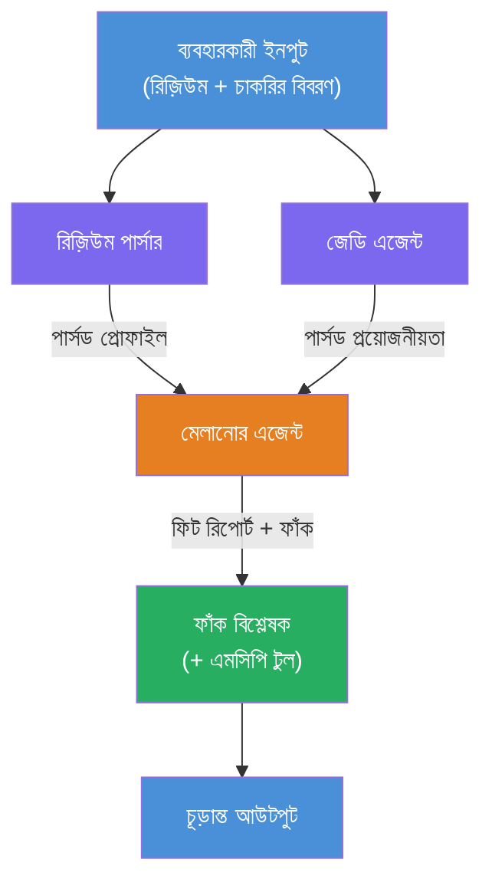
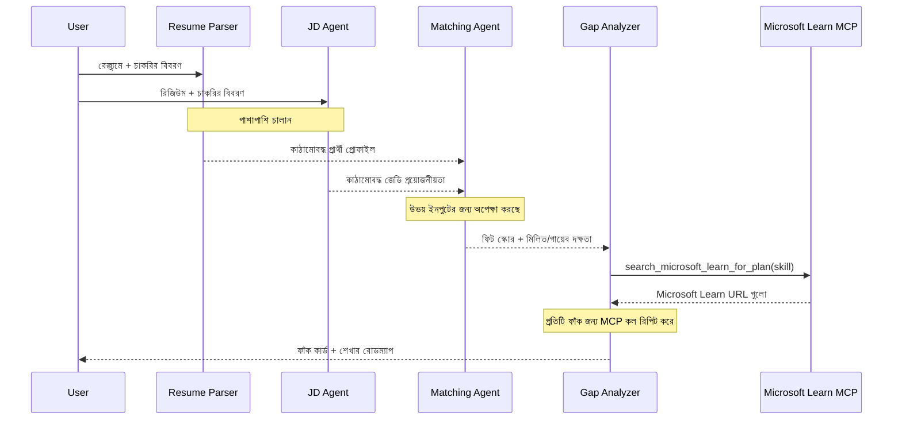
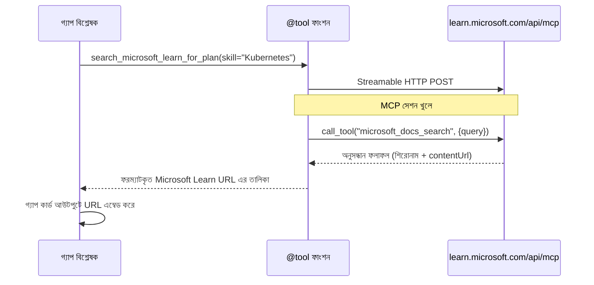

# Module 1 - মাল্টি-এজেন্ট আর্কিটেকচার বুঝুন

এই মডিউলে, আপনি Resume → Job Fit Evaluator এর আর্কিটেকচার শিখবেন কোড লেখার আগে। অর্কেস্ট্রেশন গ্রাফ, এজেন্টের ভূমিকা এবং ডেটা ফ্লো বোঝা ডিবাগিং এবং [মাল্টি-এজেন্ট ওয়ার্কফ্লো](https://learn.microsoft.com/azure/architecture/ai-ml/idea/multiple-agent-workflow-automation) বাড়ানোর জন্য অত্যন্ত গুরুত্বপূর্ণ।

---

## এই সমস্যাটি যা সমাধান করে

কোনো রেজুমে একটি চাকরির বিবরণীর সাথে মিলিয়ে দেখা অনেকগুলি পৃথক দক্ষতা জড়িত:

1. **পার্সিং** - অগঠিত টেক্সট (রেজুমে) থেকে গঠনকৃত ডেটা বের করা
2. **বিশ্লেষণ** - চাকরির বিবরণ থেকে প্রয়োজনীয়তা বের করা
3. **তুলনা** - দুটির মধ্যে সামঞ্জস্যের স্কোর নির্ধারণ
4. **পরিকল্পনা** - ফাঁক পূরণের জন্য একটি শিক্ষণ রোডম্যাপ তৈরি করা

একই এজেন্ট যদি এই চারটি কাজ একসাথে একটি প্রম্পটে করে, তাহলে সাধারণত ঘটে:
- অসম্পূর্ণ তথ্য উত্তোলন (স্কোর পেতেই পার্সিং দ্রুত শেষ করে ফেলা)
- গভীরতা বিহীন স্কোরিং (প্রমাণভিত্তিক বিভাজন নেই)
- সাধারণ রোডম্যাপ (নির্দিষ্ট ফাঁক অনুযায়ী নয়)

**চারটি বিশেষায়িত এজেন্টে ভাগ করে** প্রতিটি তার নিজস্ব কাজের জন্য নিবেদিত নির্দেশনা পায়, যা প্রতিটি পর্যায়ে উচ্চমানের আউটপুট উৎপাদন করে।

---

## চারটি এজেন্ট

প্রতিটি এজেন্ট একটি পূর্ণাঙ্গ [Microsoft Foundry](https://learn.microsoft.com/azure/foundry/agents/concepts/hosted-agents) এজেন্ট যা `AzureAIAgentClient.as_agent()` এর মাধ্যমে তৈরি। তারা একই মডেল ডিপ্লয়মেন্ট ব্যবহার করে কিন্তু আলাদা নির্দেশনা এবং (ঐচ্ছিক) আলাদা টুলস আছে।

| # | এজেন্ট নাম | ভূমিকা | ইনপুট | আউটপুট |
|---|-----------|--------|-------|---------|
| 1 | **ResumeParser** | রেজুমে টেক্সট থেকে গঠিত প্রোফাইল বের করে | কাঁচা রেজুমে টেক্সট (ইউজার থেকে) | প্রার্থী প্রোফাইল, টেকনিক্যাল স্কিলস, সফট স্কিলস, সার্টিফিকেশন, ডোমেইন অভিজ্ঞতা, অর্জনসমূহ |
| 2 | **JobDescriptionAgent** | চাকরির বিবরণ থেকে গঠনকৃত প্রয়োজনীয়তা বের করে | কাঁচা JD টেক্সট (ইউজার থেকে, ResumeParser এর মাধ্যমে ফরওয়ার্ড করা) | রোল ওভারভিউ, আবশ্যক স্কিলস, প্রেফার্ড স্কিলস, অভিজ্ঞতা, সার্টিফিকেশন, শিক্ষা, দায়িত্বসমূহ |
| 3 | **MatchingAgent** | প্রমাণভিত্তিক ফিট স্কোর গণনা করে | ResumeParser ও JobDescriptionAgent এর আউটপুট | ফিট স্কোর (0-100 ফাঙ্গুলের সাথে), মিলিত স্কিলস, অনুপস্থিত স্কিলস, ফাঁকসমূহ |
| 4 | **GapAnalyzer** | ব্যক্তিগতকৃত শিক্ষণ রোডম্যাপ তৈরি করে | MatchingAgent এর আউটপুট | ফাঁকের কার্ডস (প্রতি স্কিল), শেখার ক্রম, সময়রেখা, Microsoft Learn থেকে রিসোর্সসমূহ |

---

## অর্কেস্ট্রেশন গ্রাফ

ওয়ার্কফ্লোটি **সামান্তরাল ফ্যান-আউট** এর পরে **ক্রমিক সংকলন** ব্যবহার করে:


> **চিহ্নিতকরণ:** বেগুনি = সামান্তরাল এজেন্ট, কমলা = সংকলন পয়েন্ট, সবুজ = টুলস সমেত চূড়ান্ত এজেন্ট

### ডেটা কিভাবে প্রবাহিত হয়


1. **ইউজার পাঠায়** একটি বার্তা যা রেজুমে এবং চাকরির বিবরণ অন্তর্ভুক্ত।
2. **ResumeParser** সম্পূর্ণ ইউজার ইনপুট গ্রহণ করে এবং গঠিত প্রার্থী প্রোফাইল উদ্ধার করে।
3. **JobDescriptionAgent** একই সময়ে ইনপুট পায় এবং গঠিত প্রয়োজনীয়তা বের করে।
4. **MatchingAgent** ResumeParser এবং JobDescriptionAgent উভয়ের আউটপুট পায় (ফ্রেমওয়ার্ক উভয় শেষ হওয়া পর্যন্ত অপেক্ষা করে তারপর MatchingAgent চালায়)।
5. **GapAnalyzer** MatchingAgent এর আউটপুট পায় এবং প্রতিটি ফাঁকের জন্য **Microsoft Learn MCP টুল** কল করে বাস্তব শিক্ষণ রিসোর্স আনে।
6. **চূড়ান্ত আউটপুট** হলো GapAnalyzer এর উত্তর, যা ফিট স্কোর, ফাঁকের কার্ডস, এবং সম্পূর্ণ শেখার রোডম্যাপ অন্তর্ভুক্ত।

### কেন সামান্তরাল ফ্যান-আউট গুরুত্বপূর্ণ

ResumeParser এবং JobDescriptionAgent **একসাথে** চলে কারণ তারা একে অপরের ওপর নির্ভরশীল নয়। এটি:
- মোট অপেক্ষার সময় কমায় (দুটি একযোগে চলে, ধারাবাহিক নয়)
- একটি প্রাকৃতিক বিভাজন (রেজুমে পার্সিং ও JD পার্সিং স্বাধীন কাজ)
- একটি সাধারণ মাল্টি-এজেন্ট প্যাটার্ন প্রদর্শন করে: **ফ্যান-আউট → সংকলন → কর্ম**

---

## WorkflowBuilder কোডে

উপরের গ্রাফ কিভাবে `main.py`-তে [`WorkflowBuilder`](https://learn.microsoft.com/agent-framework/workflows/agents-in-workflows) API কলের সাথে মানচিত্রিত হয়:

```python
from agent_framework import WorkflowBuilder

workflow = (
    WorkflowBuilder(
        name="ResumeJobFitEvaluator",
        start_executor=resume_parser,       # প্রথম এজেন্ট যা ব্যবহারকারীর ইনপুটি গ্রহণ করে
        output_executors=[gap_analyzer],     # চূড়ান্ত এজেন্ট যার আউটপুট ফেরত দেওয়া হয়
    )
    .add_edge(resume_parser, jd_agent)      # ResumeParser → JobDescriptionAgent
    .add_edge(resume_parser, matching_agent) # ResumeParser → MatchingAgent
    .add_edge(jd_agent, matching_agent)      # JobDescriptionAgent → MatchingAgent
    .add_edge(matching_agent, gap_analyzer)  # MatchingAgent → GapAnalyzer
    .build()
)
```

**এজ ঘুলো বোঝা:**

| এজ | অর্থ |
|------|--------------|
| `resume_parser → jd_agent` | JD Agent, ResumeParser এর আউটপুট পায় |
| `resume_parser → matching_agent` | MatchingAgent, ResumeParser এর আউটপুট পায় |
| `jd_agent → matching_agent` | MatchingAgent JD Agent এর আউটপুটও পায় (উভয়ের জন্য অপেক্ষা করে) |
| `matching_agent → gap_analyzer` | GapAnalyzer MatchingAgent এর আউটপুট পায় |

MatchingAgent এর **দুইটি আগত এজ** আছে (`resume_parser` এবং `jd_agent`), তাই ফ্রেমওয়ার্ক স্বয়ংক্রিয়ভাবে উভয় সম্পূর্ণ হওয়া পর্যন্ত অপেক্ষা করে MatchingAgent চালায়।

---

## MCP টুল

GapAnalyzer এজেন্টের একটি টুল আছে: `search_microsoft_learn_for_plan`। এটি একটি **[MCP টুল](https://learn.microsoft.com/agent-framework/agents/tools/hosted-mcp-tools)** যা Microsoft Learn API কল করে শিক্ষণ রিসোর্স আনে।

### এটি কিভাবে কাজ করে

```python
@tool
async def search_microsoft_learn_for_plan(
    skill: str, role: str = "", max_results: int = 5
) -> str:
    """Search Microsoft Learn MCP and return curated official links."""
    # Streamable HTTP এর মাধ্যমে https://learn.microsoft.com/api/mcp এর সাথে সংযুক্ত করে
    # MCP সার্ভারে 'microsoft_docs_search' টুল কল করে
    # Microsoft Learn URL গুলোর ফরম্যাটকৃত তালিকা ফেরত দেয়
```

### MCP কল ফ্লো


1. GapAnalyzer নির্ধারণ করে যে একটি স্কিলের জন্য শিক্ষণ রিসোর্স দরকার (যেমন "Kubernetes")
2. ফ্রেমওয়ার্ক কল করে `search_microsoft_learn_for_plan(skill="Kubernetes")`
3. ফাংশন একটি [স্ট্রিমযোগ্য HTTP](https://learn.microsoft.com/agent-framework/agents/tools/hosted-mcp-tools) সংযোগ খুলে `https://learn.microsoft.com/api/mcp`
4. এটি [MCP সার্ভারে](https://learn.microsoft.com/azure/foundry/agents/how-to/tools/model-context-protocol) `microsoft_docs_search` টুলটি কল করে
5. MCP সার্ভার সার্চ ফলাফল (টাইটেল + URL) ফেরত দেয়
6. ফাংশন ফলাফলগুলি ফরম্যাট করে একটি স্ট্রিং হিসেবে রিটার্ন করে
7. GapAnalyzer এই URL গুলো তার ফাঁকের কার্ড আউটপুটে ব্যবহার করে

### MCP লগের প্রত্যাশিত আকার

যখন টুল রান করে, আপনি নিম্নরূপ লগ এন্ট্রি দেখতে পাবেন:

```
GET https://learn.microsoft.com/api/mcp → 405 (Method Not Allowed)
POST https://learn.microsoft.com/api/mcp → 200
DELETE https://learn.microsoft.com/api/mcp → 405 (Method Not Allowed)
```

**এগুলো স্বাভাবিক।** MCP ক্লায়েন্ট GET এবং DELETE দিয়ে প্রোব করে ইনিশিয়ালাইজেশনের সময় - 405 রিটার্ন হওয়া প্রত্যাশিত। আসল টুল কল POST ব্যবহার করে এবং 200 রিটার্ন দেয়। শুধুমাত্র POST কল ব্যর্থ হলে চিন্তা করবেন।

---

## এজেন্ট তৈরির প্যাটার্ন

প্রতিটি এজেন্ট তৈরি হয় **[`AzureAIAgentClient.as_agent()`](https://learn.microsoft.com/python/api/overview/azure/ai-agents-readme) অ্যাসিঙ্ক্রোনাস কনটেক্সট ম্যানেজার** ব্যবহার করে। এটি Foundry SDK এর এজেন্ট তৈরির প্যাটার্ন যা স্বয়ংক্রিয় ক্লিনআপ নিশ্চিত করে:

```python
async with (
    get_credential() as credential,
    AzureAIAgentClient(
        project_endpoint=PROJECT_ENDPOINT,
        model_deployment_name=MODEL_DEPLOYMENT_NAME,
        credential=credential,
    ).as_agent(
        name="ResumeParser",
        instructions=RESUME_PARSER_INSTRUCTIONS,
    ) as resume_parser,
    # ... প্রতিটি এজেন্টের জন্য পুনরাবৃত্তি করুন ...
):
    # এখানে সব ৪ জন এজেন্ট রয়েছে
    workflow = create_workflow(resume_parser, jd_agent, matching_agent, gap_analyzer)
```

**মূল পয়েন্ট:**
- প্রতিটি এজেন্ট তার নিজস্ব `AzureAIAgentClient` ইনস্ট্যান্স পায় (SDK এজেন্ট নাম ক্লায়েন্টের আওতাধীন হওয়া উচিত)
- সমস্ত এজেন্ট একই `credential`, `PROJECT_ENDPOINT`, এবং `MODEL_DEPLOYMENT_NAME` ব্যবহার করে
- `async with` ব্লক নিশ্চিত করে সার্ভার বন্ধ হওয়ার সময় সব এজেন্ট পরিষ্কার হয়
- GapAnalyzer অতিরিক্তভাবে পায় `tools=[search_microsoft_learn_for_plan]`

---

## সার্ভার স্টার্টআপ

এজেন্ট তৈরি ও ওয়ার্কফ্লো বিল্ড করার পর সার্ভার চালু হয়:

```python
from azure.ai.agentserver.agentframework import from_agent_framework

agent = create_workflow(resume_parser, jd_agent, matching_agent, gap_analyzer)
await from_agent_framework(agent).run_async()
```

`from_agent_framework()` ওয়ার্কফ্লোকে HTTP সার্ভার হিসাবে মোড়ক দেয় যা 8088 পোর্টে `/responses` এন্ডপয়েন্ট প্রকাশ করে। এটি ল্যাব 01 এর মতোই প্যাটার্ন, তবে "এজেন্ট" এখন পুরো [ওয়ার্কফ্লো গ্রাফ](https://learn.microsoft.com/agent-framework/workflows/as-agents)।

---

### চেকপয়েন্ট

- [ ] আপনি ৪-এজেন্ট আর্কিটেকচার এবং প্রতিটি এজেন্টের ভূমিকা বুঝতে পেরেছেন
- [ ] আপনি ডেটার প্রবাহ ট্রেস করতে পারেন: ইউজার → ResumeParser → (সামান্তরাল) JD Agent + MatchingAgent → GapAnalyzer → আউটপুট
- [ ] আপনি বুঝতে পেরেছেন কেন MatchingAgent ResumeParser এবং JD Agent দুটোই শেষ হওয়া পর্যন্ত অপেক্ষা করে (দুইটি আগত এজ থাকায়)
- [ ] আপনি MCP টুল বুঝতে পেরেছেন: এটি কি করে, কিভাবে কল হয়, এবং GET 405 লগ স্বাভাবিক
- [ ] আপনি `AzureAIAgentClient.as_agent()` প্যাটার্ন এবং কেন প্রতিটি এজেন্টের নিজস্ব ক্লায়েন্ট ইনস্ট্যান্স থাকে বুঝতে পেরেছেন
- [ ] আপনি `WorkflowBuilder` কোড পড়তে এবং এটি ভিজ্যুয়াল গ্রাফে মানচিত্রিত করতে পারেন

---

**আগের:** [00 - Prerequisites](00-prerequisites.md) · **পরবর্তী:** [02 - Scaffold the Multi-Agent Project →](02-scaffold-multi-agent.md)

---

<!-- CO-OP TRANSLATOR DISCLAIMER START -->
**অস্বীকৃতি**:  
এই দস্তাবেজটি AI অনুবাদ পরিষেবা [Co-op Translator](https://github.com/Azure/co-op-translator) ব্যবহার করে অনূদিত হয়েছে। আমরা সঠিকতার জন্য চেষ্টা করি, তবে দয়া করে মনে রাখবেন যে স্বয়ংক্রিয় অনুবাদে ভুল বা অসম্মতি থাকতে পারে। মূল দস্তাবেজটি তার স্থানীয় ভাষায়ই প্রামাণিক উৎস হিসেবে গণ্য করা উচিত। গুরুত্বপূর্ণ তথ্যের জন্য পেশাদার মানব অনুবাদ প্রস্তাবিত। এই অনুবাদের ব্যবহারে কোনো ভুল বোঝাবুঝি বা ভুল ব্যাখ্যার জন্য আমরা দায়বদ্ধ নই।
<!-- CO-OP TRANSLATOR DISCLAIMER END -->