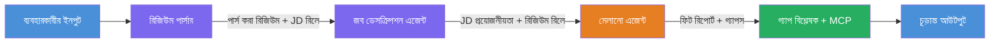

# মডিউল ১ - আর্কিটেকচার বোঝা

⏱️ ~৫ মিনিট

যেকোনো কোড লেখার আগে, আপনি যা তৈরি করছেন এবং এটি কীভাবে কাজ করে তার একটি দ্রুত ওভারভিউ নিচে দেওয়া হল।

---

## আপনি যা তৈরি করছেন

আপনি একটি **রিজিউমে** এবং একটি **চাকরির বিবরণ** পেস্ট করবেন। ওয়ার্কফ্লো রিটার্ন করবে:

- একটি ফিট স্কোর (০–১০০ ভেঙে দেখা সহ)
- স্কিল এবং সার্টিফিকেশন গ্যাপের একটি তালিকা
- প্রতিটি গ্যাপের জন্য Microsoft Learn লিঙ্ক সহ একটি পার্সোনালাইজড লার্নিং রোডম্যাপ

---

## চারজন এজেন্ট

একক এজেন্ট সব কিছু একবারে পার্স, স্কোর এবং প্ল্যান করার চেষ্টা করলে সাধারণত দ্রুত সম্পন্ন করে এবং অগভীর আউটপুট তৈরি হয়। কাজটি চারটি বিশেষায়িত এজেন্টে ভাগ করলে ফলাফল আরও ভালো হয়:

| এজেন্ট | এটি কী করে |
|-------|-------------|
| **ResumeParser** | রিজিউমে পার্স করে; JD (চাকরির বিবরণ) শব্দশঃ `[JOB DESCRIPTION PASS-THROUGH]` এ কপি করে ডাউনস্ট্রিম এজেন্টদের জন্য |
| **JobDescriptionAgent** | পাস-থ্রু থেকে JD অনিবিধির শর্তাবলী বের করে; `[PARSED RESUME]` কে `[PARSED RESUME PASS-THROUGH]` হিসেবে সামনে প্রেরণ করে |
| **MatchingAgent** | উভয় লেবেলযুক্ত সেকশন তুলনা করে; ০-১০০ ফিট স্কোর এবং গ্যাপ তালিকা তৈরি করে |
| **GapAnalyzer** | লার্নিং রোডম্যাপ তৈরি করে; প্রতিটি গ্যাপের জন্য Microsoft Learn অনুসন্ধান করে |

---

## অর্কেস্ট্রেশন গ্রাফ

ওয়ার্কফ্লো একটি **ক্রমিক পাইপলাইন** - প্রতিটি এজেন্ট তার আউটপুট পরবর্তী এজেন্টকে পাঠায়:


```mermaid
flowchart LR
    A["ব্যবহারকারীর ইনপুট"] --> B["রিজিউম পার্সার"]
    B -- "পার্স করা রিজিউম + JD রিলে" --> C["জব ডেসক্রিপশন এজেন্ট"]
    C -- "JD প্রয়োজনীয়তা + রিজিউম রিলে" --> D["মেলানো এজেন্ট"]
    D -- "ফিট রিপোর্ট + গ্যাপস" --> E["গ্যাপ বিশ্লেষক + MCP"]
    E --> F["চূড়ান্ত আউটপুট"]

    style A fill:#4A90D9,color:#fff
    style B fill:#7B68EE,color:#fff
    style C fill:#7B68EE,color:#fff
    style D fill:#E67E22,color:#fff
    style E fill:#27AE60,color:#fff
    style F fill:#4A90D9,color:#fff
```

১. **ResumeParser** ইউজারের ইনপুট নেয়, রিজিউমে পার্স করে, এবং JD `[JOB DESCRIPTION PASS-THROUGH]` এ কপি করে।
২. **JD Agent** কাঠামোগত শর্তাবলী বের করে এবং `[PARSED RESUME PASS-THROUGH]` সামনে পাঠায়।
৩. **MatchingAgent** উভয় সেকশন তুলনা করে ফিট স্কোর এবং গ্যাপ তালিকা তৈরি করে।
৪. **GapAnalyzer** রোডম্যাপ তৈরি করে এবং প্রতিটি গ্যাপের জন্য Microsoft Learn MCP টুল কল করে।

---

## এটি কোডের সাথে কীভাবে ম্যাপ হয়

`main.py` তে, আপনি `WorkflowBuilder` এর মাধ্যমে এই গ্রাফ বর্ণনা করেন:

```python
workflow_agent = (
    WorkflowBuilder(
        start_executor=resume_executor,       # ব্যবহারকারীর ইনপুট গ্রহণের জন্য প্রথম এজেন্ট
        output_executors=[gap_executor],      # শেষ এজেন্ট - এর আউটপুট হলো প্রতিক্রিয়া
    )
    .add_edge(resume_executor, jd_executor)       # ResumeParser → JD এজেন্ট
    .add_edge(jd_executor, matching_executor)     # JD এজেন্ট → MatchingAgent
    .add_edge(matching_executor, gap_executor)    # MatchingAgent → GapAnalyzer
    .build()
    .as_agent()
)
```

প্রতিটি `Agent` একটি `AgentExecutor` এ মোড়ানো থাকে। `add_edge()` কলগুলি একটি কঠোর ক্রমানুসারে পাইপলাইন নির্ধারণ করে - প্রতিটি এজেন্ট শুধুমাত্র তার সরাসরি পূর্ববর্তী এজেন্টের আউটপুট পায়।

> `context_mode="last_agent"` অর্থ প্রতিটি executor শুধুমাত্র তার সরাসরি পূর্বএজেন্টের আউটপুট দেখে। ResumeParser এবং JD Agent লেবেলযুক্ত সেকশনগুলির মাধ্যমে ডেটা সামনে রিলে করে যাতে প্রতিটি ডাউনস্ট্রিম এজেন্টের ঠিক যেটা দরকার তা থাকে।

---

## MCP টুল

GapAnalyzer এর একটি টুল আছে: `search_microsoft_learn_for_plan`। এটি `https://learn.microsoft.com/api/mcp` এর সাথে সংযুক্ত এবং প্রতিটি স্কিল গ্যাপের জন্য আসল Microsoft Learn লিঙ্ক রিটার্ন করে।

যখন টুল চলে তখন আপনি এই লগগুলি দেখবেন - সব প্রত্যাশিত:

```
GET  https://learn.microsoft.com/api/mcp → 405   ← connection probe, normal
POST https://learn.microsoft.com/api/mcp → 200   ← actual tool call
DELETE https://learn.microsoft.com/api/mcp → 405 ← cleanup probe, normal
```

কেবলমাত্র `POST` এরর রিটার্ন করলে উদ্বিগ্ন হোন।

---

**পূর্ববর্তী:** [00 - প্রাথমিক শর্তাবলী](00-prerequisites.md) · **পরবর্তী:** [02 - প্রকল্প স্ক্যাফোল্ডিং →](02-scaffold-multi-agent.md)

---

<!-- CO-OP TRANSLATOR DISCLAIMER START -->
**অস্বীকৃতি**:
এই নথিটি AI অনুবাদ পরিষেবা [Co-op Translator](https://github.com/Azure/co-op-translator) ব্যবহার করে অনূদিত হয়েছে। যদিও আমরা শুদ্ধতার জন্য চেষ্টা করি, অনুগ্রহ করে মনে রাখবেন যে স্বয়ংক্রিয় অনুবাদে ত্রুটি বা অসঙ্গতি থাকতে পারে। মূল নথিটি তার স্বভাষায় কর্তৃত্বপূর্ণ উৎস হিসেবে বিবেচিত হওয়া উচিত। গুরুত্বপূর্ণ তথ্যের জন্য পেশাদার মানব অনুবাদ সুপারিশ করা হয়। এই অনুবাদের ব্যবহারে প্রয়োজনীয় ভুল বোঝাবুঝি বা ভুল ব্যাখ্যার জন্য আমরা দায়বদ্ধ নই।
<!-- CO-OP TRANSLATOR DISCLAIMER END -->