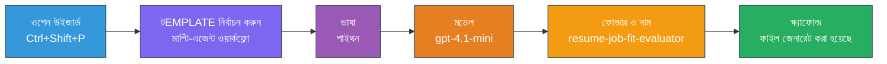
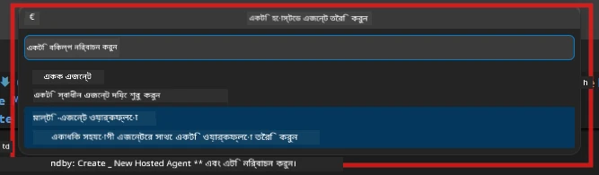

# মডিউল 2 - মাল্টি-এজেন্ট প্রজেক্টের জন্য স্ক্যাফোল্ডিং

এই মডিউলে, আপনি [Microsoft Foundry এক্সটেনশন](https://marketplace.visualstudio.com/items?itemName=TeamsDevApp.vscode-ai-foundry) ব্যবহার করে **মাল্টি-এজেন্ট ওয়ার্কফ্লো প্রজেক্ট স্ক্যাফোল্ড করবেন**। এক্সটেনশন সম্পূর্ণ প্রজেক্ট স্ট্রাকচার - `agent.yaml`, `main.py`, `Dockerfile`, `requirements.txt`, `.env`, এবং ডিবাগ কনফিগারেশন তৈরি করে। আপনি পরে মডিউল ৩ এবং ৪-এ এই ফাইলগুলি কাস্টমাইজ করবেন।

> **নোট:** এই ল্যাবে `PersonalCareerCopilot/` ফোল্ডারটি একটি সম্পূর্ণ, কার্যকর কাস্টমাইজড মাল্টি-এজেন্ট প্রজেক্টের উদাহরণ। আপনি একটি নতুন প্রজেক্ট স্ক্যাফোল্ড করতে পারেন (শেখার জন্য প্রস্তাবিত) অথবা সরাসরি বিদ্যমান কোড অধ্যয়ন করতে পারেন।

---

## ধাপ ১: হোস্টেড এজেন্ট তৈরি উইজার্ড খুলুন


১. `Ctrl+Shift+P` চাপুন **কমান্ড প্যালেট** খুলতে।  
২. টাইপ করুন: **Microsoft Foundry: Create a New Hosted Agent** এবং এটিকে নির্বাচন করুন।  
৩. হোস্টেড এজেন্ট তৈরি উইজার্ড খুলবে।  

> **বিকল্প:** অ্যাক্টিভিটি বার-এ **Microsoft Foundry** আইকনে ক্লিক করুন → **Agents** এর পাশে **+** আইকনে ক্লিক করুন → **Create New Hosted Agent** নির্বাচন করুন।

---

## ধাপ ২: মাল্টি-এজেন্ট ওয়ার্কফ্লো টেমপ্লেট নির্বাচন করুন

উইজার্ড আপনার কাছে একটি টেমপ্লেট নির্বাচন করতে বলবে:

| টেমপ্লেট | বিবরণ | কখন ব্যবহার করবেন |
|----------|-------------|-------------|
| Single Agent | এক এজেন্ট যার নির্দেশাবলী ও ঐচ্ছিক টুলস | ল্যাব ০১ |
| **Multi-Agent Workflow** | একাধিক এজেন্ট যারা WorkflowBuilder মাধ্যমে সহযোগিতা করে | **এই ল্যাব (ল্যাব ০২)** |

১. **Multi-Agent Workflow** নির্বাচন করুন।  
২. **Next** ক্লিক করুন।  



---

## ধাপ ৩: প্রোগ্রামিং ভাষা নির্বাচন করুন

১. **Python** নির্বাচন করুন।  
২. **Next** ক্লিক করুন।

---

## ধাপ ৪: আপনার মডেল নির্বাচন করুন

১. উইজার্ড আপনার Foundry প্রজেক্টে ডিপ্লয় করা মডেলগুলো দেখাবে।  
২. ল্যাব ০১-এ আপনি যেই মডেল ব্যবহার করেছিলেন সেটি নির্বাচন করুন (যেমন, **gpt-4.1-mini**)।  
৩. **Next** ক্লিক করুন।

> **টিপ:** [`gpt-4.1-mini`](https://learn.microsoft.com/azure/foundry/foundry-models/concepts/models-sold-directly-by-azure#gpt-41-series) ডেভেলপমেন্টের জন্য প্রস্তাবিত - এটি দ্রুত, সাশ্রয়ী, এবং মাল্টি-এজেন্ট ওয়ার্কফ্লো ভালোভাবে পরিচালনা করে। উচ্চমানের আউটপুট চাইলে চূড়ান্ত প্রোডাকশন জন্য `gpt-4.1` ব্যবহার করুন।

---

## ধাপ ৫: ফোল্ডার লোকেশন এবং এজেন্টের নাম নির্বাচন করুন

১. একটি ফাইল ডায়ালগ খুলবে। লক্ষ্য ফোল্ডার নির্বাচন করুন:  
   - যদি ওয়ার্কশপ রিপো অনুসরণ করছেন: `workshop/lab02-multi-agent/`-এ যান এবং একটি নতুন সাবফোল্ডার তৈরি করুন  
   - নতুন শুরু করলে: যেকোনো ফোল্ডার নির্বাচন করুন  
২. হোস্টেড এজেন্টের একটি **নাম** দিন (যেমন, `resume-job-fit-evaluator`)।  
৩. **Create** ক্লিক করুন।

---

## ধাপ ৬: স্ক্যাফোল্ডিং সম্পন্ন হওয়া পর্যন্ত অপেক্ষা করুন

১. VS Code একটি নতুন উইন্ডো খুলবে (অথবা বর্তমান উইন্ডো আপডেট হবে) স্ক্যাফোল্ডেড প্রজেক্টসহ।  
২. আপনাকে নিচের ফাইল স্ট্রাকচার দেখতে হবে:

```
resume-job-fit-evaluator/
├── .env                ← Environment variables (placeholders)
├── .vscode/
│   └── launch.json     ← Debug configuration
├── agent.yaml          ← Agent definition (kind: hosted)
├── Dockerfile          ← Container configuration
├── main.py             ← Multi-agent workflow code (scaffold)
└── requirements.txt    ← Python dependencies
```
  
> **ওয়ার্কশপ নোট:** ওয়ার্কশপ রিপোজিটরিতে `.vscode/` ফোল্ডারটি **ওয়ার্কস্পেস রুটে** থাকে এবং শেয়ার্ড `launch.json` ও `tasks.json` ধারণ করে। ল্যাব ০১ ও ল্যাব ০২ উভয় ডিবাগ কনফিগারেশন অন্তর্ভুক্ত। যখন F5 চাপবেন, ড্রপডাউন থেকে **"Lab02 - Multi-Agent"** নির্বাচন করুন।

---

## ধাপ ৭: স্ক্যাফোল্ডেড ফাইলগুলো বোঝা (মাল্টি-এজেন্ট স্পেসিফিক)

মাল্টি-এজেন্ট স্ক্যাফোল্ড একক-এজেন্ট স্ক্যাফোল্ড থেকে কিছু প্রধান দিক থেকে আলাদা:

### ৭.১ `agent.yaml` - এজেন্ট ডেফিনিশন

```yaml
kind: hosted
name: resume-job-fit-evaluator
description: >
  A multi-agent workflow that evaluates resume-to-job fit.
metadata:
  authors:
    - Microsoft
  tags:
    - Multi-Agent Workflow
    - Resume Evaluator
protocols:
  - protocol: responses
    version: v1
environment_variables:
  - name: PROJECT_ENDPOINT
    value: ${PROJECT_ENDPOINT}
  - name: MODEL_DEPLOYMENT_NAME
    value: ${MODEL_DEPLOYMENT_NAME}
```
  
**ল্যাব ০১ থেকে প্রধান পার্থক্য:** `environment_variables` সেকশনে MCP এন্ডপয়েন্ট বা অন্যান্য টুল কনফিগারেশনের জন্য অতিরিক্ত ভেরিয়েবল থাকতে পারে। `name` ও `description` মাল্টি-এজেন্ট ব্যবহার কেস প্রতিফলিত করে।

### ৭.২ `main.py` - মাল্টি-এজেন্ট ওয়ার্কফ্লো কোড

স্ক্যাফোল্ডে রয়েছে:  
- **একাধিক এজেন্ট নির্দেশনা স্ট্রিং** (প্রতি এজেন্টের জন্য একটি কনস্ট্যান্ট)  
- **একাধিক [`AzureAIAgentClient.as_agent()`](https://learn.microsoft.com/python/api/overview/azure/ai-agents-readme) কনটেক্সট ম্যানেজার** (প্রতি এজেন্টের জন্য একটি)  
- **[`WorkflowBuilder`](https://learn.microsoft.com/agent-framework/workflows/agents-in-workflows)** এজেন্টগুলোকে ওয়ার্কফ্লোতে যুক্ত করার জন্য  
- **`from_agent_framework()`** ওয়ার্কফ্লোকে HTTP এন্ডপয়েন্ট হিসাবে সার্ভ করতে  

```python
from agent_framework import WorkflowBuilder, tool
from agent_framework.azure import AzureAIAgentClient
from azure.ai.agentserver.agentframework import from_agent_framework
```
  
অতিরিক্ত ইম্পোর্ট [`WorkflowBuilder`](https://learn.microsoft.com/agent-framework/workflows/agents-in-workflows) ল্যাব ০১-র চেয়ে নতুন।

### ৭.৩ `requirements.txt` - অতিরিক্ত ডিপেন্ডেন্সি

মাল্টি-এজেন্ট প্রজেক্ট ল্যাব ০১-এর বেইস প্যাকেজ ছাড়াও MCP-সম্পর্কিত প্যাকেজ ব্যবহার করে:

```
agent-framework-azure-ai==1.0.0rc3
agent-framework-core==1.0.0rc3
azure-ai-agentserver-agentframework==1.0.0b16
azure-ai-agentserver-core==1.0.0b16
debugpy
agent-dev-cli --pre
```
  
> **গুরুত্বপূর্ণ সংস্করণ নোট:** `agent-dev-cli` প্যাকেজের সর্বশেষ প্রিভিউ সংস্করণ ইনস্টল করতে `requirements.txt`-এ `--pre` ফ্ল্যাগ প্রয়োজন। এটি Agent Inspector এর সাথে `agent-framework-core==1.0.0rc3` সামঞ্জস্যপূর্ণ হওয়ার জন্য দরকার। সংস্করণ বিস্তারিত জানতে দেখুন [মডিউল ৮ - সমস্যা সমাধান](08-troubleshooting.md)।

| প্যাকেজ | সংস্করণ | উদ্দেশ্য |
|---------|---------|---------|
| [`agent-framework-azure-ai`](https://learn.microsoft.com/agent-framework/overview/) | `1.0.0rc3` | [Microsoft Agent Framework](https://github.com/microsoft/agent-framework) এর জন্য Azure AI ইন্টিগ্রেশন |
| [`agent-framework-core`](https://learn.microsoft.com/agent-framework/overview/) | `1.0.0rc3` | মূল রানটাইম (WorkflowBuilder অন্তর্ভুক্ত) |
| `azure-ai-agentserver-agentframework` | `1.0.0b16` | হোস্টেড এজেন্ট সার্ভার রানটাইম |
| `azure-ai-agentserver-core` | `1.0.0b16` | মূল এজেন্ট সার্ভার বিমূর্তি |
| `debugpy` | সর্বশেষ | পাইথন ডিবাগিং (VS Code-এ F5) |
| `agent-dev-cli` | `--pre` | লোকাল ডেভ CLI + Agent Inspector ব্যাকএন্ড |

### ৭.৪ `Dockerfile` - ল্যাব ০১ এর মতোই

Dockerfile ল্যাব ০১-এর মতোই - এটি ফাইলগুলো কপি করে, `requirements.txt` থেকে ডিপেন্ডেন্সি ইনস্টল করে, 8088 পোর্ট এক্সপোজ করে, এবং `python main.py` রান করে।

```dockerfile
FROM python:3.14-slim
WORKDIR /app
COPY ./ .
RUN pip install --upgrade pip && \
    if [ -f requirements.txt ]; then \
        pip install -r requirements.txt; \
    else \
      echo "No requirements.txt found" >&2; exit 1; \
    fi
EXPOSE 8088
CMD ["python", "main.py"]
```
  
---

### চেকপয়েন্ট

- [ ] স্ক্যাফোল্ড উইজার্ড সম্পন্ন হয়েছে → নতুন প্রজেক্ট স্ট্রাকচার দৃশ্যমান  
- [ ] সকল ফাইল দেখা যাচ্ছে: `agent.yaml`, `main.py`, `Dockerfile`, `requirements.txt`, `.env`  
- [ ] `main.py`-এ `WorkflowBuilder` ইম্পোর্ট রয়েছে (নিশ্চিত করে মাল্টি-এজেন্ট টেমপ্লেট নির্বাচন হয়েছে)  
- [ ] `requirements.txt`-এ `agent-framework-core` এবং `agent-framework-azure-ai` উভয়ই আছে  
- [ ] মাল্টি-এজেন্ট স্ক্যাফোল্ড একক-এজেন্ট থেকে কিভাবে আলাদা তা আপনি বুঝতে পেরেছেন (একাধিক এজেন্ট, WorkflowBuilder, MCP টুলস)

---

**আগের:** [০১ - মাল্টি-এজেন্ট আর্কিটেকচার বোঝা](01-understand-multi-agent.md) · **পরবর্তী:** [০৩ - এজেন্ট এবং পরিবেশ কনফিগার করুন →](03-configure-agents.md)

---

<!-- CO-OP TRANSLATOR DISCLAIMER START -->
**অস্বীকৃতি**:  
এই দস্তাবেজটি AI অনুবাদ সেবা [Co-op Translator](https://github.com/Azure/co-op-translator) ব্যবহার করে অনূদিত হয়েছে। আমরা যথাসাধ্য সঠিকতার জন্য চেষ্টা করি, তবুও অনুগ্রহ করে সচেতন থাকুন যে স্বয়ংক্রিয় অনুবাদে ত্রুটি বা ভুল থাকতে পারে। মূল দস্তাবেজটি তার নিজস্ব ভাষায় প্রামাণিক উৎস হিসাবে বিবেচিত হওয়া উচিত। গুরুত্বপূর্ণ তথ্যের জন্য পেশাদার মানব অনুবাদ সুপারিশ করা হয়। এই অনুবাদের ব্যবহারে উদ্ভূত কোনো ভুল বোঝাবুঝি বা ভুল ব্যাখ্যার জন্য আমরা দায়ী নই।
<!-- CO-OP TRANSLATOR DISCLAIMER END -->