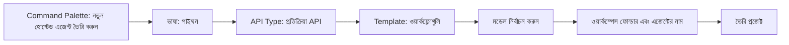
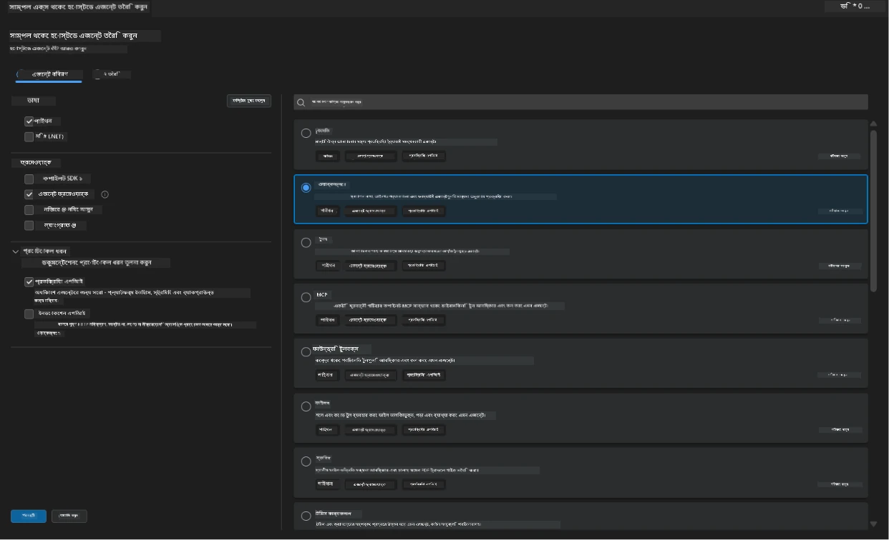
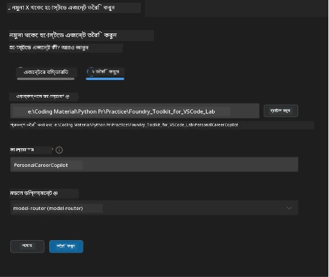

# মডিউল ২ - মাল্টি-এজেন্ট প্রকল্পের স্ক্যাফোল্ড তৈরি

⏱️ ~৫ মিনিট

এই মডিউলে, আপনি [Foundry Toolkit for VS Code](https://aka.ms/foundrytk) ব্যবহার করে **একটি মাল্টি-এজেন্ট প্রকল্পের স্ক্যাফোল্ড তৈরি করবেন**। উইজার্ড `agent.yaml`, `main.py`, `Dockerfile`, `requirements.txt`, `.env`, এবং VS Code ডিবাগ কনফিগারেশন তৈরি করে — যাতে আপনি মডিউল ৩-এ ৪-এজেন্টের ওয়ার্কফ্লো সংযুক্ত করার দিকে মনোযোগ দিতে পারেন।

> **মূল ধারণা:** স্ক্যাফোল্ডটি একটি কাজ করা স্টাব যা একটি এজেন্ট সহ। আপনি মডিউল ৩-এ `WorkflowBuilder` গ্রাফ দিয়ে প্লেসহোল্ডার লজিক প্রতিস্থাপন করবেন। আপনি বয়লারপ্লেট শূন্য থেকে লিখবেন না।

> **রেফারেন্স বাস্তবায়ন:** [`PersonalCareerCopilot/`](../../../../../workshop/lab02-multi-agent/PersonalCareerCopilot) একটি সম্পূর্ণ কাজ করা উদাহরণ। আপনি কাজের সাথে তুলনা করার জন্য এটি ব্যবহার করতে পারেন।

### স্ক্যাফোল্ড উইজার্ড ফ্লো


```mermaid
flowchart LR
    A[Command Palette: নতুন হোস্টেড এজেন্ট তৈরি করুন] --> B[ভাষা: পাইথন]
    B --> C[API Type: প্রতিক্রিয়া API]
    C --> D[Template: ওয়ার্কফ্লোগুলি]
    D --> E[মডেল নির্বাচন করুন]
    E --> F[ওয়ার্কস্পেস ফোল্ডার এবং এজেন্টের নাম]
    F --> G[তৈরি প্রজেক্ট]
```

---

## ধাপ ১: Create Hosted Agent উইজার্ড খুলুন

১. `Ctrl+Shift+P` চাপুন **Command Palette** খুলতে।
২. টাইপ করুন: **Foundry Toolkit: Create a New Hosted Agent** এবং নির্বাচন করুন।
৩. উইজার্ড **Agent Details** ট্যাবে খুলবে।

> **বিকল্প:** Activity Bar-এ থেকে **Foundry Toolkit** আইকনে ক্লিক করুন → **Hosted Agents** এর পাশের **+** আইকনে ক্লিক করুন → **Create New Hosted Agent** নির্বাচন করুন।

---

## ধাপ ২: সেটিংস নির্বাচন করুন



১. বামদিকের নেভিগেশন/অপশন সেকশনে নিচের গুলো নির্বাচন করুন:

| মেনু | নির্বাচন | নোট |
|--------|-----------|-------|
| **ভাষা** | Python | C# (.NET) ও সমর্থিত |
| **ফ্রেমওয়ার্ক** | Agent Framework | `Agent`, `AgentExecutor`, `WorkflowBuilder` প্রদান করে |
| **API টাইপ** | Response API | `POST /responses` - প্ল্যাটফর্ম-পরিচালিত ইতিহাস, স্ট্রিমিং সাপোর্ট |
| **টেমপ্লেট** | **Workflows** | একাধিক এজেন্টের মাধ্যমে অনুরোধ প্রক্রিয়া করে |

২. নির্বাচন করার পর, **Next** ক্লিক করুন



৩. পরবর্তী উইন্ডোতে নিচের গুলো নির্বাচন করুন:

| মেনু | নির্বাচন | নোট |
|--------|-----------|-------|
| **ওয়ার্কস্পেস ফোল্ডার** | লক্ষ্য ফোল্ডারে ব্রাউজ করুন | যেমন, এই রিপোজিটরির `workshop/lab02-multi-agent/` |
| **এজেন্ট নাম** | `PersonalCareerCopilot` | এটি প্রকল্প ডিরেক্টরির নাম হবে |
| **মডেল ডিপ্লয়মেন্ট** | আপনার ডিপ্লয় করা মডেল নির্বাচন করুন | যেমন, Lab 01 থেকে `gpt-4.1-mini` |

৪. প্রজেক্ট স্ক্যাফোল্ড করতে **Create** ক্লিক করুন। VS Code ফাইলগুলি তৈরি করে এবং ফোল্ডারটি খুলবে।

> **টিপ:** [`gpt-4.1-mini`](https://learn.microsoft.com/azure/foundry/foundry-models/concepts/models-sold-directly-by-azure#gpt-41-series) মাল্টি-এজেন্ট ডেভেলপমেন্টের জন্য দ্রুততা এবং মানের মধ্যে সুষমতা প্রদান করে।

---

## ধাপ ৩: নির্মিত প্রকল্প পরিদর্শন করুন

স্ক্যাফোল্ড শেষ হওয়ার পরে, নিশ্চিত করুন Explorer (`Ctrl+Shift+E`) তে নিম্নলিখিত ফাইলগুলি দেখতে পাচ্ছেন:

```
📂 <your-agent-name>/
├── .azdignore          ← Files excluded from Azure Developer CLI deployments
├── .dockerignore       ← Files excluded from Docker builds
├── .env                ← Environment variables (placeholders - fill in Module 3)
├── .vscode/
│   ├── launch.json     ← Debug config (F5 → run + Agent Inspector)
│   └── tasks.json      ← VS Code task definitions
├── agent.yaml          ← Agent definition (kind: hosted, protocol: responses)
├── Dockerfile          ← Container config for deployment
├── main.py             ← Stub agent entry point (replace with WorkflowBuilder in Module 3)
└── requirements.txt    ← Python dependencies
```

> **গুরুত্বপূর্ণ:** `.vscode/launch.json` এবং `tasks.json` সঠিকভাবে F5 ডিবাগিং করার জন্য এই স্ক্যাফোল্ড করা ফোল্ডারটি সরাসরি VS Code-এ খুলুন।

### মূল ফাইলগুলোর ব্যাখ্যা

| ফাইল | উদ্দেশ্য |
|------|---------|
| `agent.yaml` | `kind: hosted` ঘোষণা করে, env vars ম্যাপ করে, `/responses` প্রোটোকল নির্ধারণ করে |
| `main.py` | স্টাব: একটি `FoundryChatClient` → `Agent` → `ResponsesHostServer`। আপনি মডিউল ৩-এ এটি প্রতিস্থাপন করে ৪ এজেন্ট + `WorkflowBuilder` যুক্ত করবেন |
| `Dockerfile` | `python:3.12-slim`, `requirements.txt` ইনস্টল করে, পোর্ট ৮০৮৮ এক্সপোজ করে, `python main.py` চালায় |
| `requirements.txt` | `agent-framework-foundry`, `agent-framework-foundry-hosting`, `mcp<2,>=1.24.0`, `debugpy` |

> **রেফারেন্স:** সম্পূর্ণ তৈরি করা কনটেন্টের জন্য দেখুন [`PersonalCareerCopilot/agent.yaml`](../../../../../workshop/lab02-multi-agent/PersonalCareerCopilot/agent.yaml) এবং [`PersonalCareerCopilot/requirements.txt`](../../../../../workshop/lab02-multi-agent/PersonalCareerCopilot/requirements.txt)।

---

### ✅ চেকপয়েন্ট

- [ ] স্ক্যাফোল্ড উইজার্ড সম্পন্ন হয়েছে - এক নতুন প্রজেক্ট ফোল্ডার Explorer-এ দৃশ্যমান
- [ ] প্রত্যাশিত সব ফাইল উপস্থিত: `agent.yaml`, `main.py`, `Dockerfile`, `requirements.txt`, `.env`
- [ ] `agent.yaml` দেখায় `kind: hosted` এবং `protocol: responses`
- [ ] `main.py` এ `Agent`, `FoundryChatClient`, `ResponsesHostServer` ইমপোর্ট করা হয়েছে
- [ ] স্ক্যাফোল্ড করা ফোল্ডারটি VS Code ওয়ার্কস্পেস রুট হিসেবে খোলা আছে
- [ ] আপনি বুঝতে পারছেন `main.py` একটি স্টাব - মডিউল ৩-এ `WorkflowBuilder` যুক্ত করা হবে

---

**পূর্ববর্তী:** [০১ - মাল্টি-এজেন্ট আর্কিটেকচার বোঝা](01-understand-multi-agent.md) · **পরবর্তী:** [০৩ - এজেন্ট ও পরিবেশ কনফিগার করুন →](03-configure-agents.md)

---

<!-- CO-OP TRANSLATOR DISCLAIMER START -->
**অস্বীকৃতি**:
এই নথিটি AI অনুবাদ পরিষেবা [Co-op Translator](https://github.com/Azure/co-op-translator) ব্যবহার করে অনূদিত হয়েছে। যদিও আমরা শুদ্ধতার জন্য চেষ্টা করি, অনুগ্রহ করে মনে রাখবেন যে স্বয়ংক্রিয় অনুবাদে ত্রুটি বা অসঙ্গতি থাকতে পারে। মূল নথিটি তার স্বভাষায় কর্তৃত্বপূর্ণ উৎস হিসেবে বিবেচিত হওয়া উচিত। গুরুত্বপূর্ণ তথ্যের জন্য পেশাদার মানব অনুবাদ সুপারিশ করা হয়। এই অনুবাদের ব্যবহারে প্রয়োজনীয় ভুল বোঝাবুঝি বা ভুল ব্যাখ্যার জন্য আমরা দায়বদ্ধ নই।
<!-- CO-OP TRANSLATOR DISCLAIMER END -->