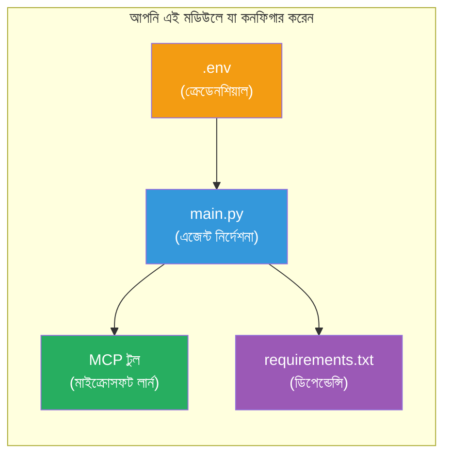

# Module 3 - এজেন্ট, MCP টুল এবং পরিবেশ কনফিগার করুন

এই মডিউলে, আপনি scaffolded মাল্টি-এজেন্ট প্রকল্পটি কাস্টমাইজ করবেন। আপনি চারটি এজেন্টের জন্য নির্দেশিকা লিখবেন, Microsoft Learn এর জন্য MCP টুল সেটআপ করবেন, পরিবেশ ভেরিয়েবল কনফিগার করবেন এবং ডিপেনডেন্সিগুলি ইনস্টল করবেন।


> **রেফারেন্স:** সম্পূর্ণ কাজের কোডটি [`PersonalCareerCopilot/main.py`](../../../../../workshop/lab02-multi-agent/PersonalCareerCopilot/main.py) ফাইলে আছে। নিজের তৈরি করার সময় এটি রেফারেন্স হিসেবে ব্যবহার করুন।

---

## ধাপ ১: পরিবেশ ভেরিয়েবল কনফিগার করুন

১. আপনার প্রকল্প রুটে থাকা **`.env`** ফাইলটি খুলুন।
২. আপনার Foundry প্রকল্পের বিবরণ পূরণ করুন:

   ```env
   PROJECT_ENDPOINT=https://<your-account>.services.ai.azure.com/api/projects/<your-project>
   MODEL_DEPLOYMENT_NAME=gpt-4.1-mini
   ```

৩. ফাইলটি সংরক্ষণ করুন।

### এই মানগুলি কোথায় পাবেন

| মান | এটি কোথায় পাবেন |
|-------|---------------|
| **প্রকল্প এন্ডপয়েন্ট** | Microsoft Foundry সাইডবার → আপনার প্রকল্পে ক্লিক করুন → বিস্তারিত ভিউতে এন্ডপয়েন্ট URL |
| **মডেল ডিপ্লয়মেন্ট নাম** | Foundry সাইডবার → প্রকল্প খুলুন → **Models + endpoints** → ডিপ্লয়ড মডেলের পাশে নাম |

> **সুরক্ষা:** `.env` কখনোই ভার্সন কন্ট্রোলে কমিট করবেন না। যদি না থাকে তাহলে `.gitignore` এ এটি যোগ করুন।

### পরিবেশ ভেরিয়েবল ম্যাপিং

মাল্টি-এজেন্ট `main.py` স্ট্যান্ডার্ড এবং ওয়ার্কশপ-নির্দিষ্ট env var নাম উভয়ই পড়ে:

```python
PROJECT_ENDPOINT = os.getenv("AZURE_AI_PROJECT_ENDPOINT") or os.getenv("PROJECT_ENDPOINT")
MODEL_DEPLOYMENT_NAME = os.getenv(
    "AZURE_AI_MODEL_DEPLOYMENT_NAME",
    os.getenv("MODEL_DEPLOYMENT_NAME", "gpt-4.1-mini"),
)
MICROSOFT_LEARN_MCP_ENDPOINT = os.getenv(
    "MICROSOFT_LEARN_MCP_ENDPOINT", "https://learn.microsoft.com/api/mcp"
)
```

MCP এন্ডপয়েন্টের একটি যুক্তিসঙ্গত ডিফল্ট আছে - আপনাকে `.env` এ সেট করতে হবে না যদি না আপনি এটি ওভাররাইড করতে চান।

---

## ধাপ ২: এজেন্টের নির্দেশনা লিখুন

এটি সবচেয়ে গুরুত্বপূর্ণ ধাপ। প্রতিটি এজেন্টের রোল, আউটপুট ফর্ম্যাট এবং নিয়ম সংজ্ঞায়িত করার জন্য সূক্ষ্মভাবে তৈরি নির্দেশনা প্রয়োজন। `main.py` খুলুন এবং নির্দেশনা কনস্ট্যান্টগুলি তৈরি (অথবা পরিবর্তন) করুন।

### ২.১ রেজুমে পার্সার এজেন্ট

```python
RESUME_PARSER_INSTRUCTIONS = """\
You are the Resume Parser.
Extract resume text into a compact, structured profile for downstream matching.

Output exactly these sections:
1) Candidate Profile
2) Technical Skills (grouped categories)
3) Soft Skills
4) Certifications & Awards
5) Domain Experience
6) Notable Achievements

Rules:
- Use only explicit or strongly implied evidence.
- Do not invent skills, titles, or experience.
- Keep concise bullets; no long paragraphs.
- If input is not a resume, return a short warning and request resume text.
"""
```

**কেন এই সেকশনগুলো?** MatchingAgent এর ভালো স্কোরিংয়ের জন্য কাঠামোবদ্ধ ডাটা দরকার। ধারাবাহিক সেকশনগুলি ক্রস-এজেন্ট হ্যান্ডঅফকে নির্ভরযোগ্য করে তোলে।

### ২.২ জব ডিসক্রিপশন এজেন্ট

```python
JOB_DESCRIPTION_INSTRUCTIONS = """\
You are the Job Description Analyst.
Extract a structured requirement profile from a JD.

Output exactly these sections:
1) Role Overview
2) Required Skills
3) Preferred Skills
4) Experience Required
5) Certifications Required
6) Education
7) Domain / Industry
8) Key Responsibilities

Rules:
- Keep required vs preferred clearly separated.
- Only use what the JD states; do not invent hidden requirements.
- Flag vague requirements briefly.
- If input is not a JD, return a short warning and request JD text.
"""
```

**কেন আলাদা করে প্রয়োজনীয় ও পছন্দসই?** MatchingAgent প্রতিটির জন্য পৃথক ওজন ব্যবহার করে (প্রয়োজনীয় দক্ষতা = ৪০ পয়েন্ট, পছন্দসই দক্ষতা = ১০ পয়েন্ট)।

### ২.৩ ম্যাচিং এজেন্ট

```python
MATCHING_AGENT_INSTRUCTIONS = """\
You are the Matching Agent.
Compare parsed resume output vs JD output and produce an evidence-based fit report.

Scoring (100 total):
- Required Skills 40
- Experience 25
- Certifications 15
- Preferred Skills 10
- Domain Alignment 10

Output exactly these sections:
1) Fit Score (with breakdown math)
2) Matched Skills
3) Missing Skills
4) Partially Matched
5) Experience Alignment
6) Certification Gaps
7) Overall Assessment

Rules:
- Be objective and evidence-only.
- Keep partial vs missing separate.
- Keep Missing Skills precise; it feeds roadmap planning.
"""
```

**কেন স্পষ্ট স্কোরিং?** পুনরুত্পাদনযোগ্য স্কোরিং রানের তুলনা এবং ডিবাগ সম্ভব করে। ১০০ পয়েন্টের স্কেল ব্যবহারকারীদের জন্য সহজ এবং বোঝায়।

### ২.৪ গ্যাপ বিশ্লেষক এজেন্ট

```python
GAP_ANALYZER_INSTRUCTIONS = """\
You are the Gap Analyzer and Roadmap Planner.
Create a practical upskilling plan from the matching report.

Microsoft Learn MCP usage (required):
- For EVERY High and Medium priority gap, call tool `search_microsoft_learn_for_plan`.
- Use returned Learn links in Suggested Resources.
- Prefer Microsoft Learn for free resources.

CRITICAL: You MUST produce a SEPARATE detailed gap card for EVERY skill listed in
the Missing Skills and Certification Gaps sections of the matching report. Do NOT
skip or combine gaps. Do NOT summarize multiple gaps into one card.

Output format:
1) Personalized Learning Roadmap for [Role Title]
2) One DETAILED card per gap (produce ALL cards, not just the first):
   - Skill
   - Priority (High/Medium/Low)
   - Current Level
   - Target Level
   - Suggested Resources (include Learn URL from tool results)
   - Estimated Time
   - Quick Win Project
3) Recommended Learning Order (numbered list)
4) Timeline Summary (week-by-week)
5) Motivational Note

Rules:
- Produce every gap card before writing the summary sections.
- Keep it specific, realistic, and actionable.
- Tailor to candidate's existing stack.
- If fit >= 80, focus on polish/interview readiness.
- If fit < 40, be honest and provide a staged path.
"""
```

**কেন "CRITICAL" জোর দেওয়া?** সমস্ত গ্যাপ কার্ড তৈরি করার স্পষ্ট নির্দেশনা ছাড়া, মডেল সাধারণত ১-২ কার্ড তৈরি করে বাকির সারাংশ দেয়। "CRITICAL" ব্লক এই ট্রাঙ্কেশন রোধ করে।

---

## ধাপ ৩: MCP টুল ডিফাইন করুন

গ্যাপঅ্যানালাইজার একটি টুল ব্যবহার করে যা [Microsoft Learn MCP সার্ভার](https://learn.microsoft.com/azure/foundry/agents/how-to/tools/model-context-protocol) এ কল করে। এটি `main.py` তে যোগ করুন:

```python
import json
from agent_framework import tool
from mcp.client.session import ClientSession
from mcp.client.streamable_http import streamable_http_client

@tool
async def search_microsoft_learn_for_plan(
    skill: str, role: str = "", max_results: int = 5
) -> str:
    """Search Microsoft Learn MCP and return curated official links for roadmap planning."""
    query = " ".join(part for part in [skill, role, "learning path module"] if part).strip()
    query = query or "job skills learning path"

    try:
        async with streamable_http_client(MICROSOFT_LEARN_MCP_ENDPOINT) as (
            read_stream, write_stream, _,
        ):
            async with ClientSession(read_stream, write_stream) as session:
                await session.initialize()
                result = await session.call_tool(
                    "microsoft_docs_search", {"query": query}
                )

        if not result.content:
            return (
                "No results returned from Microsoft Learn MCP. "
                "Fallback: https://learn.microsoft.com/training/support/catalog-api"
            )

        payload_text = getattr(result.content[0], "text", "")
        data = json.loads(payload_text) if payload_text else {}
        items = data.get("results", [])[:max(1, min(max_results, 10))]

        if not items:
            return f"No direct Microsoft Learn results found for '{skill}'."

        lines = [f"Microsoft Learn resources for '{skill}':"]
        for i, item in enumerate(items, start=1):
            title = item.get("title") or item.get("url") or "Microsoft Learn Resource"
            url = item.get("url") or item.get("link") or ""
            lines.append(f"{i}. {title} - {url}".rstrip(" -"))
        return "\n".join(lines)
    except Exception as ex:
        return (
            f"Microsoft Learn MCP lookup unavailable. Reason: {ex}. "
            "Fallbacks: https://learn.microsoft.com/api/mcp"
        )
```

### টুলটি কীভাবে কাজ করে

| ধাপ | কী হয় |
|------|--------|
| ১ | GapAnalyzer একটি দক্ষতার (যেমন "Kubernetes") জন্য রিসোর্স প্রয়োজন সিদ্ধান্ত নেয় |
| ২ | ফ্রেমওয়ার্ক `search_microsoft_learn_for_plan(skill="Kubernetes")` কল করে |
| ৩ | ফাংশন [Streamable HTTP](https://learn.microsoft.com/agent-framework/agents/tools/hosted-mcp-tools) কানেকশন `https://learn.microsoft.com/api/mcp` এ খুলে |
| ৪ | [MCP সার্ভার](https://learn.microsoft.com/azure/foundry/agents/how-to/tools/model-context-protocol) এ `microsoft_docs_search` কল করে |
| ৫ | MCP সার্ভার সার্চ ফলাফল (শিরোনাম + URL) রিটার্ন করে |
| ৬ | ফাংশন ফলাফলগুলি সংখ্যাযুক্ত তালিকা আকারে ফরম্যাট করে |
| ৭ | GapAnalyzer URL গুলি গ্যাপ কার্ডে অন্তর্ভুক্ত করে |

### MCP ডিপেনডেন্সি

MCP ক্লায়েন্ট লাইব্রেরিগুলি ট্রানজিটিভলি [`agent-framework-core`](https://learn.microsoft.com/agent-framework/overview/) এর মাধ্যমে অন্তর্ভুক্ত। আপনাকে এগুলি আলাদাভাবে `requirements.txt` এ যোগ করতে হবে না। যদি ইমপোর্ট ত্রুটি পান, যাচাই করুন:

```powershell
pip list | Select-String "mcp"
```

আশা করা যায়: `mcp` প্যাকেজ ইনস্টল করা আছে (ভার্সন ১.এক্স বা পরবর্তী)।

---

## ধাপ ৪: এজেন্ট এবং ওয়ার্কফ্লো ওয়্যার করুন

### ৪.১ কন্টেক্সট ম্যানেজার দিয়ে এজেন্ট তৈরি করুন

```python
from contextlib import asynccontextmanager

@asynccontextmanager
async def create_agents():
    async with (
        get_credential() as credential,
        AzureAIAgentClient(
            project_endpoint=PROJECT_ENDPOINT,
            model_deployment_name=MODEL_DEPLOYMENT_NAME,
            credential=credential,
        ).as_agent(
            name="ResumeParser",
            instructions=RESUME_PARSER_INSTRUCTIONS,
        ) as resume_parser,
        AzureAIAgentClient(
            project_endpoint=PROJECT_ENDPOINT,
            model_deployment_name=MODEL_DEPLOYMENT_NAME,
            credential=credential,
        ).as_agent(
            name="JobDescriptionAgent",
            instructions=JOB_DESCRIPTION_INSTRUCTIONS,
        ) as jd_agent,
        AzureAIAgentClient(
            project_endpoint=PROJECT_ENDPOINT,
            model_deployment_name=MODEL_DEPLOYMENT_NAME,
            credential=credential,
        ).as_agent(
            name="MatchingAgent",
            instructions=MATCHING_AGENT_INSTRUCTIONS,
        ) as matching_agent,
        AzureAIAgentClient(
            project_endpoint=PROJECT_ENDPOINT,
            model_deployment_name=MODEL_DEPLOYMENT_NAME,
            credential=credential,
        ).as_agent(
            name="GapAnalyzer",
            instructions=GAP_ANALYZER_INSTRUCTIONS,
            tools=[search_microsoft_learn_for_plan],
        ) as gap_analyzer,
    ):
        yield resume_parser, jd_agent, matching_agent, gap_analyzer
```

**মূল পয়েন্ট:**
- প্রতিটি এজেন্টের **অলাদা** `AzureAIAgentClient` ইনস্ট্যান্স থাকে
- শুধু GapAnalyzer পায় `tools=[search_microsoft_learn_for_plan]`
- `get_credential()` Azure-এ [`ManagedIdentityCredential`](https://learn.microsoft.com/python/api/overview/azure/identity-readme#managed-identity-support) রিটার্ন করে, স্থানীয়ভাবে [`DefaultAzureCredential`](https://learn.microsoft.com/azure/developer/python/sdk/authentication/credential-chains#defaultazurecredential-overview) রিটার্ন করে

### ৪.২ ওয়ার্কফ্লো গ্রাফ তৈরি করুন

```python
def create_workflow(resume_parser, jd_agent, matching_agent, gap_analyzer):
    workflow = (
        WorkflowBuilder(
            name="ResumeJobFitEvaluator",
            start_executor=resume_parser,
            output_executors=[gap_analyzer],
        )
        .add_edge(resume_parser, jd_agent)
        .add_edge(resume_parser, matching_agent)
        .add_edge(jd_agent, matching_agent)
        .add_edge(matching_agent, gap_analyzer)
        .build()
    )
    return workflow.as_agent()
```

> `.as_agent()` প্যাটার্ন বোঝার জন্য [Workflows as Agents](https://learn.microsoft.com/agent-framework/workflows/as-agents) দেখুন।

### ৪.৩ সার্ভার চালু করুন

```python
async def main() -> None:
    validate_configuration()
    async with create_agents() as (resume_parser, jd_agent, matching_agent, gap_analyzer):
        agent = create_workflow(resume_parser, jd_agent, matching_agent, gap_analyzer)
        from azure.ai.agentserver.agentframework import from_agent_framework
        await from_agent_framework(agent).run_async()

if __name__ == "__main__":
    asyncio.run(main())
```

---

## ধাপ ৫: ভার্চুয়াল পরিবেশ তৈরি ও সক্রিয় করুন

### ৫.১ পরিবেশ তৈরি করুন

```powershell
cd workshop\lab02-multi-agent\PersonalCareerCopilot
python -m venv .venv
```

### ৫.২ এটি সক্রিয় করুন

**PowerShell (Windows):**
```powershell
.\.venv\Scripts\Activate.ps1
```

**macOS/Linux:**
```bash
source .venv/bin/activate
```

### ৫.৩ ডিপেনডেন্সি ইনস্টল করুন

```powershell
pip install -r requirements.txt
```

> **নোট:** `requirements.txt` এ থাকা `agent-dev-cli --pre` লাইনটি সর্বশেষ প্রিভিউ ভার্সন ইনস্টল নিশ্চিত করে। এটি `agent-framework-core==1.0.0rc3` এর সাথে সামঞ্জস্যের জন্য প্রয়োজন।

### ৫.৪ ইনস্টলেশন যাচাই করুন

```powershell
pip list | Select-String "agent-framework|agentserver|agent-dev"
```

আশিত আউটপুট:
```
agent-dev-cli                  0.0.1b260316
agent-framework-azure-ai       1.0.0rc3
agent-framework-core            1.0.0rc3
azure-ai-agentserver-agentframework 1.0.0b16
azure-ai-agentserver-core      1.0.0b16
```

> **যদি `agent-dev-cli` পুরনো ভার্সন দেখায়** (যেমন `0.0.1b260119`), Agent Inspector 403/404 ত্রুটি দেবে। আপগ্রেড করুন: `pip install agent-dev-cli --pre --upgrade`

---

## ধাপ ৬: প্রমাণীকরণ যাচাই করুন

Lab 01 থেকে একই auth চেক রান করুন:

```powershell
az account show --query "{name:name, id:id}" --output table
```

যদি এটি ব্যর্থ হয়, [`az login`](https://learn.microsoft.com/cli/azure/authenticate-azure-cli-interactively) রান করুন।

মাল্টি-এজেন্ট ওয়ার্কফ্লোতে, চারটি এজেন্টই একই ক্রেডেনশিয়াল শেয়ার করে। একটি এজেন্টের জন্য প্রমাণীকরণ কাজ করলে, সবগুলোর জন্য কাজ করবে।

---

### চেকপয়েন্ট

- [ ] `.env`-এ সঠিক `PROJECT_ENDPOINT` এবং `MODEL_DEPLOYMENT_NAME` মান আছে
- [ ] সব ৪ এজেন্টের নির্দেশনা কনস্ট্যান্ট `main.py` তে সংজ্ঞায়িত (ResumeParser, JD Agent, MatchingAgent, GapAnalyzer)
- [ ] `search_microsoft_learn_for_plan` MCP টুল ডিফাইন ও GapAnalyzer এর সাথে রেজিস্টার করা হয়েছে
- [ ] `create_agents()` প্রত্যেকে আলাদা `AzureAIAgentClient` ইনস্ট্যান্স সহ সব ৪ এজেন্ট তৈরি করে
- [ ] `create_workflow()` সঠিক গ্রাফ `WorkflowBuilder` দিয়ে তৈরি করে
- [ ] ভার্চুয়াল পরিবেশ তৈরি ও সক্রিয় (`(.venv)` দেখা যাচ্ছে)
- [ ] `pip install -r requirements.txt` কোনো ত্রুটি ছাড়া সম্পন্ন হয়েছে
- [ ] `pip list` প্রত্যাশিত সব প্যাকেজ সঠিক ভার্সনে (rc3 / b16) দেখাচ্ছে
- [ ] `az account show` আপনার সাবস্ক্রিপশন দেখাচ্ছে

---

**আগের:** [02 - Scaffold Multi-Agent Project](02-scaffold-multi-agent.md) · **পরের:** [04 - Orchestration Patterns →](04-orchestration-patterns.md)

---

<!-- CO-OP TRANSLATOR DISCLAIMER START -->
**অস্বীকারোক্তি**:
এই নথিটি AI অনুবাদক সেবা [Co-op Translator](https://github.com/Azure/co-op-translator) ব্যবহার করে অনুবাদ করা হয়েছে। আমরা সঠিকতার জন্য চেষ্টা করি, তবুও অনুগ্রহ করে মনে রাখুন যে স্বয়ংক্রিয় অনুবাদে ত্রুটি বা অসঙ্গতি থাকতে পারে। স্থানীয় ভাষায় মৌলিক নথিটিই কর্তৃত্বপূর্ণ উৎস হিসেবে বিবেচিত হওয়া উচিত। গুরুত্বপূর্ণ তথ্যের ক্ষেত্রে, পেশাদার মানব অনুবাদ প্রয়োজনীয়। এই অনুবাদের ব্যবহারে হওয়া ভুল বোঝাবুঝি বা ভুল ব্যাখ্যার জন্য আমরা দায়ী নই।
<!-- CO-OP TRANSLATOR DISCLAIMER END -->