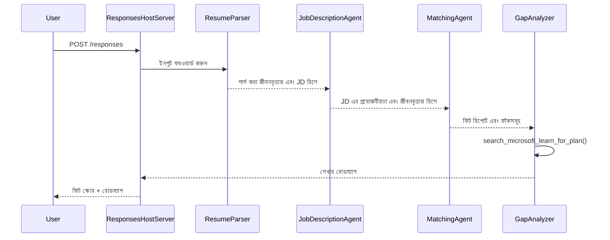

# মডিউল ৩ - নির্দেশাবলী কনফিগার করুন, পরিবেশ এবং নির্ভরতা ইনস্টল করুন

⏱️ ~১৫ মিনিট

এই মডিউলে, আপনি প্রস্তুতকৃত স্টাবকে **আপনার** মাল্টি-এজেন্ট কর্মপ্রবাহে রূপান্তর করেন - পরিবেশ ভেরিয়েবল সেট করে, এজেন্ট নির্দেশাবলী লিখে, MCP টুল যোগ করে, কর্মপ্রবাহ গ্রাফের তারবিল্ডিং করে, এবং নির্ভরতাসমূহ ইনস্টল করে।

> **তথ্যসূত্র:** সম্পূর্ণ কাজকারী কোডটি [`PersonalCareerCopilot/main.py`](../../../../../workshop/lab02-multi-agent/PersonalCareerCopilot/main.py) এ রয়েছে। এটি আপনার নিজের কর্মপ্রবাহ গ্রাফ এবং প্রম্পট ব্লক গড়ার সময় একটি রেফারেন্স হিসেবে ব্যবহার করুন।

---

## চারটি এজেন্ট কীভাবে একসাথে কাজ করে


```mermaid
sequenceDiagram
    participant User
    participant Server as ResponsesHostServer
    participant RP as ResumeParser
    participant JD as JobDescriptionAgent
    participant MA as MatchingAgent
    participant GA as GapAnalyzer

    User->>Server: POST /responses
    Server->>RP: ইনপুট ফরওয়ার্ড করুন
    RP-->>JD: পার্স করা জীবনবৃত্তান্ত এবং JD রিলে
    JD-->>MA: JD এর প্রয়োজনীয়তা এবং জীবনবৃত্তান্ত রিলে
    MA-->>GA: ফিট রিপোর্ট এবং ফাঁকসমূহ
    GA->>GA: search_microsoft_learn_for_plan()
    GA-->>Server: শেখার রোডম্যাপ
    Server-->>User: ফিট স্কোর + রোডম্যাপ
```

---

## ধাপ ১: পরিবেশ ভেরিয়েবল কনফিগার করুন

১. আপনার প্রকল্পের রুটে থাকা **`.env`** ফাইলটি (যা স্ক্যাফোল্ড উইজার্ড দ্বারা তৈরি) খুলুন।
২. প্লেসহোল্ডারগুলোর পরিবর্তে আপনার ল্যাব ০১ থেকে আসল মানগুলো বসান।

<details open>
<summary><strong>🅰️ পাথ A - ফাউন্ড্রি সাবস্ক্রিপশন</strong></summary>

```env
FOUNDRY_PROJECT_ENDPOINT=https://<your-account>.services.ai.azure.com/api/projects/<your-project>
AZURE_AI_MODEL_DEPLOYMENT_NAME=gpt-4.1-mini
```

> **মানগুলো কোথায় পাবেন:** দেখুন [Lab 01, মডিউল 1](../../lab01-single-agent/docs/01-setup.md#deploy-a-model--assign-rbac)।

</details>

<details open>
<summary><strong>🅱️ পাথ B - ফাউন্ড্রি লোকাল</strong></summary>

```env
FOUNDRY_PROJECT_ENDPOINT=http://localhost:5273/v1
AZURE_AI_MODEL_DEPLOYMENT_NAME=phi-4-mini
```

> সব ইনফারেন্স আপনার মেশিনে চলে – কোনো ডেটা আপনার ডিভাইস ছেড়ে যায় না। নির্দিষ্ট মডেল্যালিয়াস নিশ্চিত করতে `foundry model list` চালান। মাত্র MCP টুল `https://learn.microsoft.com/api/mcp` তে আউটবাউন্ড রিকোয়েস্ট যায়।

> **মানগুলো কোথায় পাবেন:** দেখুন [Lab 01, মডিউল 1 - লোকাল পাথ](../../lab01-single-agent/docs/01-setup.md#step-2-set-up-based-on-your-access)।

</details>

> **নিরাপত্তা:** `.env` কখনোই ভার্সন কন্ট্রোল এ কমিট করবেন না। এটি ইতোমধ্যে `.gitignore` ফাইলে থাকা উচিত।

---

## ধাপ ২: এজেন্ট নির্দেশাবলী লিখুন

নির্দেশাবলী প্রতিটি এজেন্টের ভূমিকা, আউটপুট ফরম্যাট, এবং নিয়ম নির্ধারণ করে। `main.py` খুলুন এবং চারটি নির্দেশাবলী কনস্ট্যান্ট নির্ধারণ করুন (বা প্রতিস্থাপন করুন) - সম্পূর্ণ স্ট্রিঙগুলি [`PersonalCareerCopilot/main.py`](../../../../../workshop/lab02-multi-agent/PersonalCareerCopilot/main.py) এ রয়েছে।

### ২.১ `RESUME_PARSER_INSTRUCTIONS`
রেজুমেকে একটি কাঠামোবদ্ধ প্রার্থী প্রোফাইলে বিশ্লেষণ করে **এবং** জব ডিসক্রিপশন সরাসরি `[JOB DESCRIPTION PASS-THROUGH]` এ অনুলিপি করে। উভয় লেবেলকৃত সেকশন অবশ্যই আউটপুটে থাকতে হবে।

> **কেন পাস-থ্রু?** `context_mode="last_agent"` থাকায় ResumeParser একমাত্র এজেন্ট যে আসল ব্যবহারকারীর মেসেজ দেখে। যদি এটি JD এগিয়ে না পাঠায়, তবে পরবর্তী এজেন্টরা JD দেখতে পায় না।

### ২.২ `JOB_DESCRIPTION_INSTRUCTIONS`
ResumeParser আউটপুট থেকে `[PARSED RESUME]` এবং `[JOB DESCRIPTION PASS-THROUGH]` পড়ে। `[JD REQUIREMENTS]` (কাঠামোবদ্ধ প্রয়োজনীয়তা) এবং `[PARSED RESUME PASS-THROUGH]` (সদৃশ রেজুমে MatchingAgent এর জন্য) আউটপুট করে।

### ২.৩ `MATCHING_AGENT_INSTRUCTIONS`
`[JD REQUIREMENTS]` এবং `[PARSED RESUME PASS-THROUGH]` পড়ে। ০-১০০ স্কেলে ফিট রিপোর্ট তৈরি করে, ব্রেকডাউন গণিত, মিলানো দক্ষতা, অভাবিত দক্ষতা, এবং অভিজ্ঞতা সামঞ্জস্য সহ।

### ২.৪ `GAP_ANALYZER_INSTRUCTIONS`
ফিট রিপোর্ট পড়ে। **প্রতিটি** অনুপস্থিত দক্ষতার জন্য `search_microsoft_learn_for_plan` কল করে Microsoft Learn রিসোর্স সংগ্রহ করে। প্রতিটি দক্ষতার জন্য একটি বিস্তারিত গ্যাপ কার্ড এবং সপ্তাহের ভিত্তিতে শেখার রোডম্যাপ তৈরি করে।

---

## ধাপ ৩: MCP টুল যোগ করুন

GapAnalyzer [Microsoft Learn MCP সার্ভার](https://learn.microsoft.com/azure/foundry/agents/how-to/tools/model-context-protocol) কে কল করে প্রতিটি দক্ষতা গ্যাপের জন্য বাস্তব শেখার রিসোর্স আনে। পূর্ণ `search_microsoft_learn_for_plan` ফাংশন [`PersonalCareerCopilot/main.py`](../../../../../workshop/lab02-multi-agent/PersonalCareerCopilot/main.py) এ আছে।

এজেন্ট তৈরি করার সময় GapAnalyzer এ টুলটি নিবন্ধন করুন:

```python
gap_analyzer = Agent(
    client=client,
    instructions=GAP_ANALYZER_INSTRUCTIONS,
    name="GapAnalyzer",
    tools=[search_microsoft_learn_for_plan],
)
```

> সম্পূর্ণ `WorkflowBuilder` গ্রাফের জন্য [`PersonalCareerCopilot/main.py`](../../../../../workshop/lab02-multi-agent/PersonalCareerCopilot/main.py) দেখুন, যেখানে `FoundryChatClient`, `AgentExecutor`, এবং সব `add_edge()` কল রয়েছে।

---

## ধাপ ৪: ভার্চুয়াল পরিবেশ তৈরি ও নির্ভরতাসমূহ ইনস্টল করুন

> ⚠️ **এই ধাপটি মিস করবেন না।** নির্ভরতাসমূহ ইনস্টল না করলে, F5 ডিবাগিং ব্যর্থ হবে।

### ৪.১ ভার্চুয়াল পরিবেশ তৈরি করুন

```powershell
python -m venv .venv
```

### ৪.২ এটি সক্রিয় করুন

| OS | কমান্ড |
|----|---------|
| **Windows (PowerShell)** | `.\.venv\Scripts\Activate.ps1` |
| **Windows (CMD)** | `.venv\Scripts\activate.bat` |
| **macOS / Linux** | `source .venv/bin/activate` |

আপনার টার্মিনাল প্রম্পটে `(.venv)` দেখতে পাবেন।

### ৪.৩ নির্ভরতাসমূহ ইনস্টল করুন

```powershell
pip install -r requirements.txt
```

### ৪.৪ যাচাই করুন

```powershell
pip list | Select-String "agent-framework|mcp|debugpy"
```

প্রত্যাশিত: `agent-framework-foundry`, `agent-framework-foundry-hosting`, `mcp`, এবং `debugpy` তালিকাভুক্ত থাকা উচিত।

---

## ধাপ ৫: প্রমাণীকরণ যাচাই করুন

<details open>
<summary><strong>🅰️ পাথ A - Azure শংসাপত্র</strong></summary>

```powershell
az account show --query "{name:name, id:id}" --output table
```

যদি ব্যর্থ হয়, তাহলে চালান [`az login`](https://learn.microsoft.com/cli/azure/authenticate-azure-cli-interactively)।

চারটি এজেন্টেই একটি `FoundryChatClient` এবং একটি `DefaultAzureCredential` শেয়ার করা হয়। একটির জন্য প্রমাণীকরণ কাজ করলে সবার জন্য কাজ করবে।

</details>

<details open>
<summary><strong>🅱️ পাথ B - ফাউন্ড্রি লোকাল</strong></summary>

লোকাল টেস্টিং-এর জন্য কোনো প্রমাণীকরণ প্রয়োজন নেই।

</details>

---

### ✅ চেকপয়েন্ট

> **মডিউল ০৪ এ এগোনোর আগে:** **(1)** `(.venv)` আপনার প্রম্পটে দৃশ্যমান থাকতে হবে এবং **(2)** `pip install -r requirements.txt` সফলভাবে সম্পন্ন হতে হবে।

- [ ] `.env`-এ সঠিক এন্ডপয়েন্ট এবং মডেল ডিপ্লয়মেন্ট নাম আছে (প্লেসহোল্ডার নয়)
- [ ] `main.py`-তে চার এজেন্ট নির্দেশাবলী কনস্ট্যান্ট নির্ধারণ করা হয়েছে (ResumeParser, JD Agent, MatchingAgent, GapAnalyzer)
- [ ] `search_microsoft_learn_for_plan` MCP টুল সংজ্ঞায়িত এবং GapAnalyzer-এ নিবন্ধন করা হয়েছে
- [ ] `main()`-এ `FoundryChatClient` + ৪ `Agent` + ৪ `AgentExecutor` অবজেক্ট তৈরি হয়েছে
- [ ] `WorkflowBuilder` সঠিক ক্রমবদ্ধ গ্রাফ তৈরি করে সব ৩টি `add_edge()` কল সহ
- [ ] ভার্চুয়াল পরিবেশ তৈরি এবং সক্রিয় করা হয়েছে (`(.venv)` প্রম্পটে দৃশ্যমান)
- [ ] `pip install -r requirements.txt` ত্রুটিমুক্ত সম্পন্ন হয়েছে
- [ ] **পাথ A:** `az account show` সফল বা VS Code Accounts আইকনে সাইন-ইন অ্যাকাউন্ট দেখাচ্ছে

---

**পূর্ববর্তী:** [০২ - মাল্টি-এজেন্ট প্রকল্প তৈরি](02-scaffold-multi-agent.md) · **পরবর্তী:** [০৪ - অর্কেস্ট্রেশন প্যাটার্ন →](04-orchestration-patterns.md)

---

<!-- CO-OP TRANSLATOR DISCLAIMER START -->
**অস্বীকৃতি**:
এই নথিটি AI অনুবাদ পরিষেবা [Co-op Translator](https://github.com/Azure/co-op-translator) ব্যবহার করে অনূদিত হয়েছে। যদিও আমরা শুদ্ধতার জন্য চেষ্টা করি, অনুগ্রহ করে মনে রাখবেন যে স্বয়ংক্রিয় অনুবাদে ত্রুটি বা অসঙ্গতি থাকতে পারে। মূল নথিটি তার স্বভাষায় কর্তৃত্বপূর্ণ উৎস হিসেবে বিবেচিত হওয়া উচিত। গুরুত্বপূর্ণ তথ্যের জন্য পেশাদার মানব অনুবাদ সুপারিশ করা হয়। এই অনুবাদের ব্যবহারে প্রয়োজনীয় ভুল বোঝাবুঝি বা ভুল ব্যাখ্যার জন্য আমরা দায়বদ্ধ নই।
<!-- CO-OP TRANSLATOR DISCLAIMER END -->