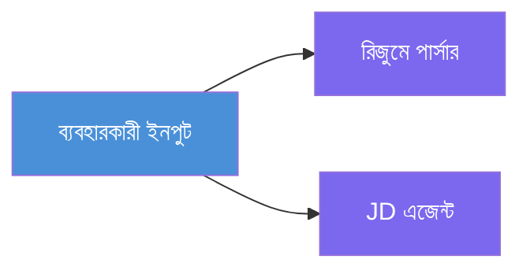
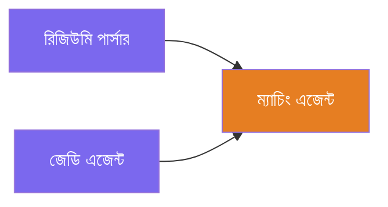
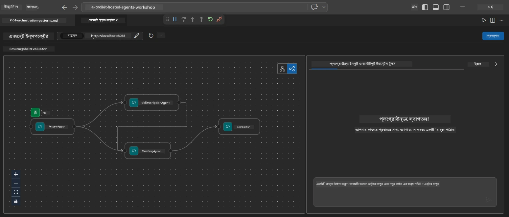
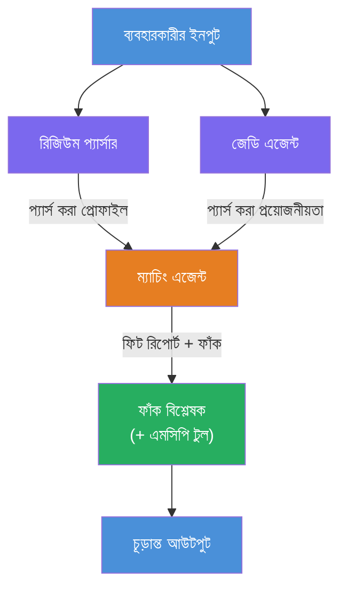
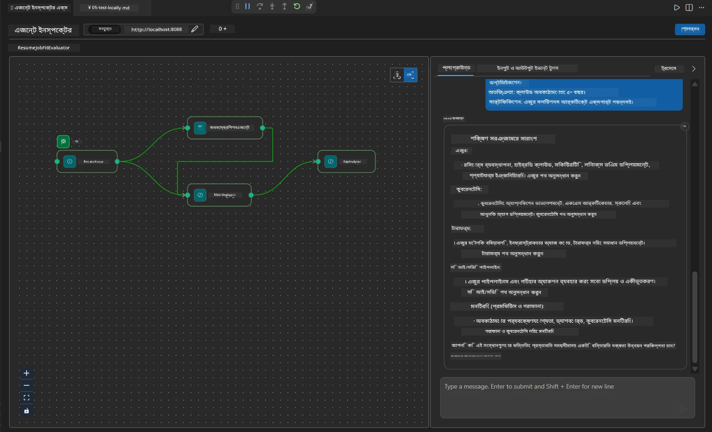

# মডিউল ৪ - অর্কেস্ট্রেশন প্যাটার্নস

এই মডিউলে, আপনি রেজুমে জব ফিট ইভ্যালুয়েটরে ব্যবহৃত অর্কেস্ট্রেশন প্যাটার্নগুলি অন্বেষণ করবেন এবং কীভাবে ওয়ার্কফ্লো গ্রাফ পড়তে, পরিবর্তন করতে এবং বাড়াতে হয় তা শিখবেন। এই প্যাটার্নগুলো বুঝতে পারা ডাটা ফ্লো সমস্যাগুলো ডিবাগিং করার জন্য এবং আপনার নিজস্ব [মাল্টি-এজেন্ট ওয়ার্কফ্লো](https://learn.microsoft.com/agent-framework/workflows/) তৈরি করার জন্য অপরিহার্য।

---

## প্যাটার্ন ১: ফ্যান-আউট (সমান্তরাল বিভাজন)

ওয়ার্কফ্লোতে প্রথম প্যাটার্ন হলো **ফ্যান-আউট** - একটি ইনপুট একসাথে একাধিক এজেন্টে পাঠানো হয়।


কোডে, এটা ঘটে কারণ `resume_parser` হলো `start_executor` - এটি প্রথমে ব্যবহারকারীর মেসেজ গ্রহণ করে। তারপর, যেহেতু `jd_agent` এবং `matching_agent` উভয়েরই `resume_parser` থেকে এজ রয়েছে, ফ্রেমওয়ার্ক `resume_parser` এর আউটপুট উভয় এজেন্টে রাউট করে:

```python
.add_edge(resume_parser, jd_agent)         # ResumeParser আউটপুট → JD এজেন্ট
.add_edge(resume_parser, matching_agent)   # ResumeParser আউটপুট → MatchingAgent
```

**কেন এটা কাজ করে:** ResumeParser এবং JD Agent একই ইনপুটের বিভিন্ন দিক প্রক্রিয়াকরণ করে। সেগুলো সমান্তরালে চালানো ল্যাটেন্সি কমায় তুলনামূলকভাবে ধারাবাহিক চালানোর থেকে।

### কখন ফ্যান-আউট ব্যবহার করবেন

| ব্যবহার ক্ষেত্র | উদাহরণ |
|----------|---------|
| স্বাধীন উপকার্য | রেজুমে পার্সিং বনাম জেডি পার্সিং |
| পুনরাবৃত্তি / ভোটিং | দুই এজেন্ট একই ডাটা বিশ্লেষণ করে, তৃতীয়টি সেরা উত্তর নির্বাচন করে |
| মাল্টি-ফরম্যাট আউটপুট | এক এজেন্ট টেক্সট জেনারেট করে, অন্যটি স্ট্রাকচার্ড JSON তৈরি করে |

---

## প্যাটার্ন ২: ফ্যান-ইন (সমষ্টিকরণ)

দ্বিতীয় প্যাটার্ন হলো **ফ্যান-ইন** - একাধিক এজেন্টের আউটপুট সংগ্রহ করে একক নিম্নবর্তী এজেন্টে পাঠানো হয়।


কোডে:

```python
.add_edge(resume_parser, matching_agent)   # ResumeParser আউটপুট → MatchingAgent
.add_edge(jd_agent, matching_agent)        # JD Agent আউটপুট → MatchingAgent
```

**মূল আচরণ:** যখন একটি এজেন্টের **দুটি বা ততোধিক ইনকামিং এজ** থাকে, ফ্রেমওয়ার্ক স্বয়ংক্রিয়ভাবে **সকল** উর্ধ্বমুখী এজেন্ট সম্পন্ন হওয়া পর্যন্ত অপেক্ষা করে তারপর নিম্নবর্তী এজেন্ট চালায়। MatchingAgent শুরু হয় না যতক্ষণ না ResumeParser এবং JD Agent দুটোই শেষ করে।

### MatchingAgent কি পায়

ফ্রেমওয়ার্ক সব উর্ধ্বমুখী এজেন্টের আউটপুট একত্রিত করে। MatchingAgent এর ইনপুট দেখতে এমন হয়:

```
[ResumeParser output]
---
Candidate Profile:
  Name: Jane Doe
  Technical Skills: Python, Azure, Kubernetes, ...
  ...

[JobDescriptionAgent output]
---
Role Overview: Senior Cloud Engineer
Required Skills: Python, Azure, Terraform, ...
...
```

> **দ্রষ্টব্য:** সঠিক একত্রিকরণ ফরম্যাট ফ্রেমওয়ার্ক সংস্করণের উপর নির্ভর করে। এজেন্টের নির্দেশনা উভয় স্ট্রাকচার্ড এবং আনস্ট্রাকচারড উর্ধ্বমুখী আউটপুট মোকাবেলা করতে লেখা উচিত।



---

## প্যাটার্ন ৩: সিকোয়েন্সিয়াল চেইন

তৃতীয় প্যাটার্ন হলো **সিকোয়েন্সিয়াল চেইনিং** - একটি এজেন্টের আউটপুট সরাসরি পরবর্তী এজেন্টে যায়।


কোডে:

```python
.add_edge(matching_agent, gap_analyzer)    # MatchingAgent আউটপুট → GapAnalyzer
```

এটা সবচেয়ে সহজ প্যাটার্ন। GapAnalyzer MatchingAgent এর ফিট স্কোর, ম্যাচড/মিসিং স্কিল এবং গ্যাপস গ্রহণ করে। তারপর প্রতিটি গ্যাপের জন্য [MCP টুল](https://learn.microsoft.com/azure/foundry/agents/how-to/tools/model-context-protocol) কল করে Microsoft Learn রিসোর্স উদ্ধার করে।

---

## সম্পূর্ণ গ্রাফ

এই তিনটি প্যাটার্ন মিলিয়ে সম্পূর্ণ ওয়ার্কফ্লো তৈরি হয়:


### চালানোর টাইমলাইন

```mermaid
gantt
    title এজেন্ট এক্সিকিউশন টাইমলাইন
    dateFormat X
    axisFormat %s

    section Parallel
    Resume Parser       :rp, 0, 3
    JD Agent            :jd, 0, 2

    section Sequential
    Matching Agent      :ma, 3, 5
    Gap Analyzer        :ga, 5, 9
```


> মোট দেওয়াল-ঘড়ির সময় আনুমানিক `max(ResumeParser, JD Agent) + MatchingAgent + GapAnalyzer`। GapAnalyzer সাধারণত সবচেয়ে ধীর কারণ এটি একাধিক MCP টুল কল করে (প্রতি গ্যাপ একটি করে)।

---

## WorkflowBuilder কোড পড়া

`main.py` থেকে সম্পূর্ণ `create_workflow()` ফাংশন, মন্তব্যসহ:

```python
def create_workflow(resume_parser, jd_agent, matching_agent, gap_analyzer):
    workflow = (
        WorkflowBuilder(
            name="ResumeJobFitEvaluator",

            # প্রথম এজেন্ট যা ব্যবহারকারীর ইনপুট গ্রহণ করে
            start_executor=resume_parser,

            # সেই এজেন্ট(গুলি) যাদের আউটপুট চূড়ান্ত প্রতিক্রিয়া হয়
            output_executors=[gap_analyzer],
        )
        # ফ্যান-আউট: ResumeParser এর আউটপুট উভয় JD এজেন্ট এবং MatchingAgent এ যায়
        .add_edge(resume_parser, jd_agent)
        .add_edge(resume_parser, matching_agent)

        # ফ্যান-ইন: MatchingAgent উভয় ResumeParser এবং JD এজেন্টের জন্য অপেক্ষা করে
        .add_edge(jd_agent, matching_agent)

        # ধারাবাহিক: MatchingAgent এর আউটপুট GapAnalyzer এ পাঠানো হয়
        .add_edge(matching_agent, gap_analyzer)

        .build()
    )
    return workflow.as_agent()
```

### এজ সারাংশ টেবিল

| # | এজ | প্যাটার্ন | প্রভাব |
|---|------|---------|--------|
| ১ | `resume_parser → jd_agent` | ফ্যান-আউট | JD Agent পায় ResumeParser এর আউটপুট (ওরিজিনাল ইউজার ইনপুটসহ) |
| ২ | `resume_parser → matching_agent` | ফ্যান-আউট | MatchingAgent পায় ResumeParser এর আউটপুট |
| ৩ | `jd_agent → matching_agent` | ফ্যান-ইন | MatchingAgent পায় JD Agent এর আউটপুটও (দুয়েটার জন্য অপেক্ষা করে) |
| ৪ | `matching_agent → gap_analyzer` | সিকোয়েন্সিয়াল | GapAnalyzer ফিট রিপোর্ট + গ্যাপ লিস্ট পায় |

---

## গ্রাফ পরিবর্তন করা

### নতুন এজেন্ট যোগ করা

পঞ্চম এজেন্ট (যেমন, গ্যাপ বিশ্লেষণের ভিত্তিতে ইন্টারভিউ প্রশ্ন তৈরির **InterviewPrepAgent**) যোগ করার জন্য:

```python
# ১. নির্দেশাবলী সংজ্ঞায়িত করুন
INTERVIEW_PREP_INSTRUCTIONS = """\
You are the Interview Prep Agent.
Given a gap analysis and fit report, generate 10 targeted interview questions
the candidate should prepare for.
"""

# ২. এজেন্ট তৈরি করুন (async with ব্লকের ভিতরে)
AzureAIAgentClient(
    project_endpoint=PROJECT_ENDPOINT,
    model_deployment_name=MODEL_DEPLOYMENT_NAME,
    credential=credential,
).as_agent(
    name="InterviewPrepAgent",
    instructions=INTERVIEW_PREP_INSTRUCTIONS,
) as interview_prep,

# ৩. create_workflow() এ এজ যুক্ত করুন
.add_edge(matching_agent, interview_prep)   # ফিট রিপোর্ট গ্রহণ করে
.add_edge(gap_analyzer, interview_prep)     # গ্যাপ কার্ডও গ্রহণ করে

# ৪. output_executors আপডেট করুন
output_executors=[interview_prep],  # এখন চূড়ান্ত এজেন্ট
```

### চালানোর ক্রম পরিবর্তন

JD Agent কে ResumeParser এর **পরে** চালানোর জন্য (সমান্তরাল নয় সিকোয়েন্সিয়াল):

```python
# মুছুন: .add_edge(resume_parser, jd_agent)  ← ইতিমধ্যে বিদ্যমান, এটি রাখুন
# jd_agent সরাসরি ব্যবহারকারীর ইনপুট গ্রহণ না করে গোপন সাদৃশ্য (implicit parallel) অপসারণ করুন
# start_executor প্রথমে resume_parser কে পাঠায়, এবং jd_agent শুধুমাত্র
# edge এর মাধ্যমে resume_parser এর আউটপুট পায়। এটি তাদের ধারাবাহিক করে তোলে।
```

> **গুরুত্বপূর্ণ:** `start_executor` একমাত্র এমন এজেন্ট যা র’ ডি ইউজার ইনপুট পায়। অন্য সব এজেন্ট তাদের উর্ধ্বমুখী এজ থেকে আউটপুট পায়। যদি কোনো এজেন্ট র’ ডি ইউজার ইনপুটও পেতে চায়, তবে সেটার একটি এজ থাকা প্রয়োজন `start_executor` থেকে।

---

## সাধারণ গ্রাফ ভুল

| ভুল | উপসর্গ | সমাধান |
|---------|---------|-----|
| `output_executors` এজ অনুপস্থিত | এজেন্ট রান হয় কিন্তু আউটপুট খালি | নিশ্চিত করুন `start_executor` থেকে প্রত্যেক `output_executors` এজেন্ট পর্যন্ত পথ রয়েছে |
| ঘুর্ণায়মান নির্ভরতা | অসীম লুপ বা টাইমআউট | নিশ্চিত করুন কোনো এজেন্ট তার উর্ধ্বমুখী এজেন্টে ফিরে ফিড না করে |
| ইনকামিং এজ ছাড়া `output_executors` এজেন্ট | খালি আউটপুট | অন্তত একটি `add_edge(source, that_agent)` যোগ করুন |
| ফ্যান-ইন ছাড়া একাধিক `output_executors` | আউটপুটে মাত্র এক এজেন্টের প্রতিক্রিয়া থাকে | একটি একক আউটপুট এজেন্ট ব্যবহার করুন যা একত্রিত করে, অথবা একাধিক আউটপুট গ্রহণ করুন |
| `start_executor` অনুপস্থিত | বিল্ড টাইমে `ValueError` | সবসময় `WorkflowBuilder()` এ `start_executor` নির্দিষ্ট করুন |

---

## গ্রাফ ডিবাগ করা

### Agent Inspector ব্যবহার

১. এজেন্ট লোকালি চালু করুন (F5 বা টার্মিনাল - দেখুন [মডিউল ৫](05-test-locally.md))।  
২. Agent Inspector খুলুন (`Ctrl+Shift+P` → **Foundry Toolkit: Open Agent Inspector**)।  
৩. একটি টেস্ট মেসেজ পাঠান।  
৪. Inspector এর প্রতিক্রিয়া প্যানেলে **স্ট্রিমিং আউটপুট** দেখুন - এতে প্রতিটি এজেন্টের অবদান ধারাবাহিকভাবে প্রদর্শিত হয়।



### লগ ব্যবহার

`main.py` এ লগ যোগ করে ডাটা ফ্লো ট্রেস করুন:

```python
import logging
logger = logging.getLogger("resume-job-fit")

# create_workflow()-এ, তৈরি করার পর:
logger.info("Workflow graph built with edges: RP→JD, RP→MA, JD→MA, MA→GA")
```

সার্ভারের লগগুলো এজেন্টের নির্বাহী ক্রম এবং MCP টুল কলগুলি দেখায়:

```
INFO:resume-job-fit:Starting Resume -> Job Fit Evaluator HTTP server...
INFO:resume-job-fit:Server running on http://localhost:8088
INFO:agent_framework:Executing agent: ResumeParser
INFO:agent_framework:Executing agent: JobDescriptionAgent
INFO:agent_framework:Waiting for upstream agents: ResumeParser, JobDescriptionAgent
INFO:agent_framework:Executing agent: MatchingAgent
INFO:agent_framework:Executing agent: GapAnalyzer
INFO:agent_framework:Tool call: search_microsoft_learn_for_plan(skill="Kubernetes")
POST https://learn.microsoft.com/api/mcp → 200
INFO:agent_framework:Tool call: search_microsoft_learn_for_plan(skill="Terraform")
POST https://learn.microsoft.com/api/mcp → 200
```

---

### চেকপয়েন্ট

- [ ] আপনি ওয়ার্কফ্লোতে তিনটি অর্কেস্ট্রেশন প্যাটার্ন চিনতে পারবেন: ফ্যান-আউট, ফ্যান-ইন, এবং সিকোয়েন্সিয়াল চেইন  
- [ ] আপনি বুঝতে পারবেন যে একাধিক ইনকামিং এজ যুক্ত এজেন্টসমূহ সকল উর্ধ্বমুখী এজেন্ট শেষ হওয়ার জন্য অপেক্ষা করে  
- [ ] আপনি `WorkflowBuilder` কোড পড়তে পারবেন এবং প্রতিটি `add_edge()` কলকে ভিজ্যুয়াল গ্রাফের সাথে মেলাতে পারবেন  
- [ ] আপনি নির্বাহী টাইমলাইন বুঝতে পারবেন: প্রথমে সমান্তরাল এজেন্ট, তারপর সমষ্টিকরণ, তারপর সিকোয়েন্সিয়াল  
- [ ] আপনি গ্রাফে নতুন এজেন্ট যোগ করতে পারবেন (নির্দেশনা সংজ্ঞায়িত করা, এজেন্ট তৈরি, এজ যোগ করা, আউটপুট আপডেট করা)  
- [ ] আপনি সাধারণ গ্রাফ ভুল এবং তাদের লক্ষণ চিহ্নিত করতে পারবেন  

---

**পূর্ববর্তী:** [03 - কনফিগার এজেন্টস & এনভায়রনমেন্ট](03-configure-agents.md) · **পরবর্তী:** [05 - লোকালি পরীক্ষা করুন →](05-test-locally.md)

---

<!-- CO-OP TRANSLATOR DISCLAIMER START -->
**অস্বীকৃতি**:  
এই ডকুমেন্টটি AI অনুবাদ পরিষেবা [Co-op Translator](https://github.com/Azure/co-op-translator) ব্যবহার করে অনূদিত হয়েছে। আমরা নির্ভুলতার চেষ্টা করি, কিন্তু স্বয়ংক্রিয় অনুবাদে ত্রুটি বা ভুল থাকতে পারে। মূল নথিটি তার নিজ ভাষায়ই বৈধ এবং প্রামাণিক উৎস হিসেবে বিবেচিত হওয়া উচিত। গুরুত্বপূর্ণ তথ্যের জন্য পেশাদার মানুষের দ্বারা অনুবাদ করানোই উত্তম। এই অনুবাদের ব্যবহার থেকে সৃষ্ট যেকোনো ভুল বোঝাবুঝি বা ভুল ব্যাখ্যার জন্য আমরা দায়বদ্ধ নই।
<!-- CO-OP TRANSLATOR DISCLAIMER END -->