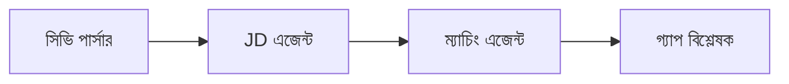
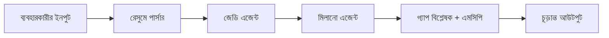

# মডিউল ৪ - অর্কেস্ট্রেশন প্যাটার্নস

⏱️ ~১০ মিনিট

এই মডিউলটিতে, আপনি Resume Job Fit Evaluator-এ ব্যবহৃত অর্কেস্ট্রেশন প্যাটার্নগুলি অন্বেষণ করবেন এবং শেখাবেন কিভাবে ওয়ার্কফ্লো গ্রাফ পড়তে, পরিবর্তন করতে এবং বাড়াতে হয়। এই প্যাটার্নগুলি বোঝা ডেটা ফ্লো সমস্যাগুলির ডিবাগিং এবং আপনার নিজস্ব [মাল্টি-এজেন্ট ওয়ার্কফ্লো](https://learn.microsoft.com/agent-framework/workflows/) তৈরি করার জন্য অপরিহার্য।

---

## প্যাটার্ন ১: ধারাবাহিক চেইন

ওয়ার্কফ্লোর মৌলিক প্যাটার্ন হল একটি **ধারাবাহিক চেইন** - প্রতিটি এজেন্টের আউটপুট সরাসরি পরবর্তী এজেন্টকে পৌঁছে দেয়।


```mermaid
flowchart LR
    RP[সিভি পার্সার] --> JD[JD এজেন্ট]
    JD --> MA[ম্যাচিং এজেন্ট]
    MA --> GA[গ্যাপ বিশ্লেষক]
```

কোডে, প্রতিটি `add_edge()` কল চেইনে একটি ধাপ তৈরি করে:

```python
.add_edge(resume_executor, jd_executor)       # রিজুমে পার্সার আউটপুট → জেডি এজেন্ট
.add_edge(jd_executor, matching_executor)     # জেডি এজেন্ট আউটপুট → ম্যাচিংএজেন্ট
.add_edge(matching_executor, gap_executor)    # ম্যাচিংএজেন্ট আউটপুট → গ্যাপঅ্যানালাইজার
```

> **কেন ধারাবাহিক, ফ্যান-আউট/ফ্যান-ইন নয়?** `WorkflowBuilder` ইনকামিং এজগুলির জন্য **OR-অর্থ** ব্যবহার করে: একটি নিচের_executor ওভার চালু হয় যেতোকোনও পূর্বসূরি সম্পন্ন হওয়ার সাথে সাথেই। যদি `matching_executor`-এর দুটি ইনকামিং এজ থাকে (`resume_executor` এবং `jd_executor` থেকে), তাহলে এটি দুইবার ট্রিগার হবে - একবার ResumeParser শেষ হলে এবং আরেকবার JD Agent শেষ হলে - ফলে GapAnalyzer ও দুইবার চালু হবে এবং আউটপুটও দুইবার দেখাবে। ধারাবাহিক পাইপলাইন এটি সম্পূর্ণরূপে এড়ায়।

## প্যাটার্ন ২: কনটেন্ট রিলে

কারণ `context_mode="last_agent"` মানে প্রতিটি Executor শুধুমাত্র তার **সরাসরি পূর্বসূরির আউটপুট** দেখে, ধারাবাহিক চেইনের এজেন্টগুলিকে স্পষ্টভাবে অগ্রবর্তী কোনো এজেন্টের ডেটা যা দরকার তা ফরোয়ার্ড করতে হয়।

এই ওয়ার্কফ্লোতে:
- **ResumeParser** JD-কে Word-to-word `[JOB DESCRIPTION PASS-THROUGH]`-এ অনুলিপি করে (যাতে JD Agent সেটি খুঁজে পায়)।
- **JD Agent** `[PARSED RESUME]`-কে Word-to-word `[PARSED RESUME PASS-THROUGH]`-এ অনুলিপি করে (যাতে MatchingAgent উভয় প্রোফাইল তুলনা করতে পারে)।

```
ResumeParser output
└─ [PARSED RESUME]               ← extracted by JD Agent
└─ [JOB DESCRIPTION PASS-THROUGH] ← extracted by JD Agent

JD Agent output
└─ [JD REQUIREMENTS]             ← extracted by MatchingAgent
└─ [PARSED RESUME PASS-THROUGH]  ← extracted by MatchingAgent
```

প্রতিটি রিলে অংশ **Word-to-word** অনুলিপি করতে হবে - এর সংক্ষিপ্তসার বা প্যারাফ্রেজ করলে নিচের এজেন্টের কাজ নষ্ট হয়।

---

## সম্পূর্ণ গ্রাফ

ধারাবাহিক চেইন এবং কনটেন্ট রিলে প্যাটার্ন একত্র করে সম্পূর্ণ ওয়ার্কফ্লো তৈরী হয়:


```mermaid
flowchart LR
    U[ব্যবহারকারীর ইনপুট] --> RP[রেসুমে পার্সার]
    RP --> JD[জেডি এজেন্ট]
    JD --> MA[মিলানো এজেন্ট]
    MA --> GA[গ্যাপ বিশ্লেষক + এমসিপি]
    GA --> O[চূড়ান্ত আউটপুট]
```

এজেন্ট Inspector একই গ্রাফ গঠন দেখায় যখন এজেন্ট লোকালি চলছে। [মডিউল ৫ - টেস্ট লোকালি](05-test-locally.md) দেখুন স্ক্রিনশটের জন্য।

---

## WorkflowBuilder কোড পড়া

সম্পূর্ণ `create_workflow()` ফাংশন [`PersonalCareerCopilot/main.py`](../../../../../workshop/lab02-multi-agent/PersonalCareerCopilot/main.py)-তে রয়েছে। তিনটি `add_edge()` কল ধারাবাহিক পাইপলাইন তৈরি করে:

| # | এজ | প্রভাব |
|---|------|--------|
| ১ | `resume_executor → jd_executor` | JD Agent `[PARSED RESUME]` + `[JOB DESCRIPTION PASS-THROUGH]` পায় |
| ২ | `jd_executor → matching_executor` | MatchingAgent `[JD REQUIREMENTS]` + `[PARSED RESUME PASS-THROUGH]` পায় |
| ৩ | `matching_executor → gap_executor` | GapAnalyzer ফিট রিপোর্ট + গ্যাপ তালিকা পায় |

---

## গ্রাফ পরিবর্তন করা

### নতুন একটি এজেন্ট যোগ করা

পঞ্চম এজেন্ট (যেমন, GapAnalyzer এর পর একটি **InterviewPrepAgent**) যোগ করতে:

১. একটি `INTERVIEW_PREP_INSTRUCTIONS` ধ্রুবক সংজ্ঞায়িত করুন।
২. `Agent` + `AgentExecutor` অবজেক্ট তৈরি করুন (আগের চারটির মতো প্যাটার্নে)।
৩. `WorkflowBuilder`-এ `.add_edge(gap_executor, interview_exec)` যোগ করুন।
৪. `output_executors=[interview_exec]` আপডেট করুন।

> **গুরুত্বপূর্ণ:** `start_executor` হল একমাত্র এজেন্ট যা কাঁচা ব্যবহারকারী ইনপুট পায়। অন্য সব এজেন্ট তাদের upstream এজ থেকে আউটপুট পায়।

---

## সাধারণ গ্রাফ ভুল

| ভুল | লক্ষণ | সমাধান |
|---------|---------|-----|
| `output_executors`-এ এজ অনুপস্থিত | এজেন্ট চলে কিন্তু আউটপুট খালি | নিশ্চিত করুন `start_executor` থেকে প্রতিটি `output_executors` এজেন্ট পর্যন্ত একটি পথ আছে |
| বৃত্তাকার নির্ভরতা | অসীম লুপ বা টাইমআউট | পরীক্ষা করুন কোনো এজেন্ট উপরের এজেন্টে ফিরে ফিড না করে |
| `output_executors` এ থাকা এজেন্টের কাছে কোনো ইনকামিং এজ নেই | আউটপুট খালি | কমপক্ষে একটি `add_edge(source, that_agent)` যোগ করুন |
| একাধিক `output_executors` ফ্যান-ইন ছাড়া | আউটপুটে শুধুমাত্র এক এজেন্টের প্রতিক্রিয়া থাকে | একটি একক আউটপুট এজেন্ট ব্যবহার করুন যা সকলকে একত্র করে অথবা একাধিক আউটপুট গ্রহণ করুন |
| `start_executor` অনুপস্থিত | বিল্ড টাইমে `ValueError` | সর্বদা `WorkflowBuilder()`-এ `start_executor` উল্লেখ করুন |

---

## গ্রাফ ডিবাগ করা

### Agent Inspector ব্যবহার করা

১. F5 দিয়ে এজেন্ট লোকালি শুরু করুন।
২. Agent Inspector খুলুন (`Ctrl+Shift+P` → **Foundry Toolkit: Open Agent Inspector**)।
৩. একটি টেস্ট মেসেজ পাঠান।
৪. Inspector এর রেস্পন্স প্যানেলে **স্ট্রিমিং আউটপুট** দেখুন - এটি ধারাবাহিকভাবে প্রতিটি এজেন্টের অবদান দেখায়।


### লগিং ব্যবহার করে

`main.py`-তে লগিং যোগ করুন ডেটা ফ্লো ট্রেস করার জন্য:

```python
import logging
logger = logging.getLogger("resume-job-fit")

# main() এ, ওয়ার্কফ্লো তৈরি করার পর:
logger.info("Workflow graph built with edges: RP→JD, JD→MA, MA→GA")
```

সার্ভার লগ এজেন্ট এক্সিকিউশনের ক্রম এবং MCP টুল কল দেখায়:

```
INFO:agent_framework:Executing agent: ResumeParser
INFO:agent_framework:Executing agent: JobDescriptionAgent
INFO:agent_framework:Executing agent: MatchingAgent
INFO:agent_framework:Executing agent: GapAnalyzer
INFO:agent_framework:Tool call: search_microsoft_learn_for_plan(skill="Kubernetes")
POST https://learn.microsoft.com/api/mcp → 200
INFO:agent_framework:Tool call: search_microsoft_learn_for_plan(skill="Terraform")
POST https://learn.microsoft.com/api/mcp → 200
```

---

### চেকপয়েন্ট

- [ ] আপনি ওয়ার্কফ্লোতে দুটি অর্কেস্ট্রেশন প্যাটার্ন চিনতে পারেন: ধারাবাহিক চেইন এবং কনটেন্ট রিলে
- [ ] আপনি বুঝতে পারেন কেন `context_mode="last_agent"` এজেন্টদের মধ্যে স্পষ্ট ডেটা রিলে প্রয়োজন
- [ ] আপনি `WorkflowBuilder` কোড পড়তে পারেন এবং প্রতিটি `add_edge()` কলকে ভিজ্যুয়াল গ্রাফের সাথে মেলাতে পারেন
- [ ] আপনি পাইপলাইনের শেষে নতুন এজেন্ট যোগ করতে পারেন
- [ ] আপনি সাধারণ গ্রাফ ভুল এবং তাদের লক্ষণ চিনতে পারেন

---

**আগের:** [03 - Configure Agents & Environment](03-configure-agents.md) · **পরবর্তী:** [05 - Test Locally →](05-test-locally.md)

---

<!-- CO-OP TRANSLATOR DISCLAIMER START -->
**অস্বীকৃতি**:
এই নথিটি AI অনুবাদ পরিষেবা [Co-op Translator](https://github.com/Azure/co-op-translator) ব্যবহার করে অনূদিত হয়েছে। যদিও আমরা শুদ্ধতার জন্য চেষ্টা করি, অনুগ্রহ করে মনে রাখবেন যে স্বয়ংক্রিয় অনুবাদে ত্রুটি বা অসঙ্গতি থাকতে পারে। মূল নথিটি তার স্বভাষায় কর্তৃত্বপূর্ণ উৎস হিসেবে বিবেচিত হওয়া উচিত। গুরুত্বপূর্ণ তথ্যের জন্য পেশাদার মানব অনুবাদ সুপারিশ করা হয়। এই অনুবাদের ব্যবহারে প্রয়োজনীয় ভুল বোঝাবুঝি বা ভুল ব্যাখ্যার জন্য আমরা দায়বদ্ধ নই।
<!-- CO-OP TRANSLATOR DISCLAIMER END -->