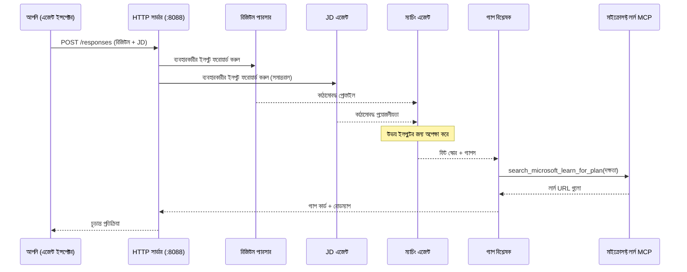
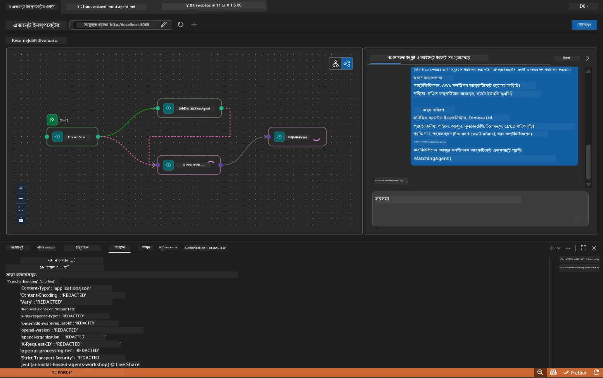

# মডিউল ৫ - লোকালি পরীক্ষা করুন (মাল্টি-এজেন্ড)

এই মডিউলে, আপনি মাল্টি-এজেন্ট ওয়ার্কফ্লো স্থানীয়ভাবে চালাবেন, Agent Inspector দিয়ে এটি পরীক্ষা করবেন, এবং নিশ্চিত করবেন যে চারটি এজেন্ট এবং MCP টুল সঠিকভাবে কাজ করছে Foundry-তে ডিপ্লয় করার আগে।

### একটি লোকাল টেস্ট রান চলাকালীন কী ঘটে


---

## ধাপ ১: এজেন্ট সার্ভার শুরু করুন

### অপশন এ: VS কোড টাস্ক ব্যবহার করে (প্রস্তাবিত)

১. প্রেস করুন `Ctrl+Shift+P` → টাইপ করুন **Tasks: Run Task** → নির্বাচন করুন **Run Lab02 HTTP Server**।
২. টাস্কটি ডিবাগপাই (debugpy) পোর্ট `5679` এ যুক্ত করে সার্ভার এবং এজেন্ট পোর্ট `8088` এ চালু করে।
৩. আউটপুটে নিম্নলিখিত দেখানো পর্যন্ত অপেক্ষা করুন:

```
INFO:resume-job-fit:Starting Resume -> Job Fit Evaluator HTTP server...
INFO:resume-job-fit:Server running on http://localhost:8088
```

### অপশন বি: টার্মিনালে ম্যানুয়ালি ব্যবহার করা

```powershell
cd workshop\lab02-multi-agent\PersonalCareerCopilot
```

ভার্চুয়াল এনভায়রনমেন্ট সক্রিয় করুন:

**PowerShell (Windows):**
```powershell
.\.venv\Scripts\Activate.ps1
```

**macOS/Linux:**
```bash
source .venv/bin/activate
```

সার্ভার শুরু করুন:

```powershell
python -m debugpy --listen 127.0.0.1:5679 -m agentdev run main.py --verbose --port 8088
```

### অপশন সি: F5 (ডিবাগ মোড) ব্যবহার করা

১. প্রেস করুন `F5` অথবা যান **Run and Debug** (`Ctrl+Shift+D`) এ।
২. ড্রপডাউন থেকে **Lab02 - Multi-Agent** লঞ্চ কনফিগারেশন নির্বাচন করুন।
৩. সার্ভার সম্পূর্ণ ব্রেকপয়েন্ট সমর্থনের সাথে শুরু হবে।

> **টিপ:** ডিবাগ মোড আপনাকে `search_microsoft_learn_for_plan()` এর ভিতরে ব্রেকপয়েন্ট সেট করার সুযোগ দেয় MCP রেসপন্স যাচাই করার জন্য, অথবা এজেন্ট ইন্সট্রাকশন স্ট্রিং এর ভিতরে দেখতে যে প্রতিটি এজেন্ট কী পায়।

---

## ধাপ ২: Agent Inspector খুলুন

১. প্রেস করুন `Ctrl+Shift+P` → টাইপ করুন **Foundry Toolkit: Open Agent Inspector**।
২. Agent Inspector একটি ব্রাউজার ট্যাবে খুলবে `http://localhost:5679` এ।
৩. আপনি এজেন্ট ইন্টারফেস দেখতে পাবেন যা মেসেজ গ্রহণের জন্য প্রস্তুত।

> **যদি Agent Inspector না খোলে:** নিশ্চিত করুন সার্ভার সম্পূর্ণরূপে শুরু হয়েছে (আপনি "Server running" লগ দেখছেন)। যদি পোর্ট 5679 ব্যস্ত থাকে, দেখুন [মডিউল ৮ - Troubleshooting](08-troubleshooting.md)।

---

## ধাপ ৩: স্মোক টেস্ট চালান

এই তিনটি টেস্ট ক্রম ধরে চালান। প্রতিটি টেস্ট ওয়ার্কফ্লোর আরও বেশি অংশ পরীক্ষা করে।

### টেস্ট ১: বেসিক রেজুমে + কাজের বিবরণ

Agent Inspector-এ নিম্নলিখিত পেস্ট করুন:

```
Resume:
Jane Doe
Senior Software Engineer with 5 years of experience in Python, Django, and AWS.
Built microservices handling 10K+ requests/second. Led a team of 4 developers.
Certifications: AWS Solutions Architect Associate.
Education: B.S. Computer Science, State University.

Job Description:
Senior Cloud Engineer at Contoso Ltd.
Required: Python, Azure, Kubernetes, Terraform, CI/CD pipelines.
Preferred: Go, monitoring (Prometheus/Grafana), cost optimization.
Experience: 5+ years in cloud infrastructure.
Certifications: Azure Solutions Architect Expert preferred.
```

**প্রত্যাশিত আউটপুট স্ট্রাকচার:**

রেসপন্সে ক্রমবদ্ধভাবে চারটি এজেন্টের আউটপুট থাকা উচিত:

১. **Resume Parser output** - শ্রেণিবদ্ধ দক্ষতা সহ কাঠামোবদ্ধ প্রার্থী প্রোফাইল
২. **JD Agent output** - কাঠামোবদ্ধ প্রয়োজনীয়তা, প্রয়োজনীয় ও পছন্দনীয় দক্ষতা পৃথকভাবে
৩. **Matching Agent output** - ম্যাচিং স্কোর (০-১০০) সহ বিশ্লেষণ, মিলের দক্ষতা, অনুপস্থিত দক্ষতা, ফাঁক
৪. **Gap Analyzer output** - প্রতিটি অনুপস্থিত দক্ষতার জন্য পৃথক গ্যাপ কার্ড, প্রতিটিতে Microsoft Learn URL সহ



### টেস্ট ১-এ কি যাচাই করবেন

| পরীক্ষা | প্রত্যাশিত | পাস? |
|--------|------------|-------|
| রেসপন্সে ফিট স্কোর আছে | ০-১০০ এর মধ্যে সংখ্যা সহ বিশ্লেষণ | |
| মিলের দক্ষতা তালিকাভুক্ত | পাইথন, CI/CD (আংশিক), ইত্যাদি | |
| অনুপস্থিত দক্ষতা তালিকাভুক্ত | আলোকসজ্জা, কুবেরনেটিস, টেরাফর্ম, ইত্যাদি | |
| প্রতিটি অনুপস্থিত দক্ষতার জন্য গ্যাপ কার্ড রয়েছে | প্রতিটি দক্ষতার জন্য একটি কার্ড | |
| Microsoft Learn URL উপস্থিত | বাস্তব `learn.microsoft.com` লিঙ্ক | |
| রেসপন্সে কোন ত্রুটি নেই | পরিষ্কার কাঠামোবদ্ধ আউটপুট | |

### টেস্ট ২: MCP টুলের কার্যকারিতা যাচাই করুন

টেস্ট ১ চলাকালীন, **সার্ভার টার্মিনাল** এ MCP লগ এন্ট্রি চেক করুন:

```
GET https://learn.microsoft.com/api/mcp → 405 (Method Not Allowed)
POST https://learn.microsoft.com/api/mcp → 200
DELETE https://learn.microsoft.com/api/mcp → 405 (Method Not Allowed)
```

| লগ এন্ট্রি | অর্থ | প্রত্যাশিত? |
|------------|--------|-------------|
| `GET ... → 405` | MCP ক্লায়েন্ট ইনিশিয়ালাইজেশনে GET দিয়ে যাচাই করে | হ্যাঁ - স্বাভাবিক |
| `POST ... → 200` | মূল টুল কল Microsoft Learn MCP সার্ভারে | হ্যাঁ - এটি প্রকৃত কল |
| `DELETE ... → 405` | MCP ক্লায়েন্ট ক্লিনআপে DELETE দিয়ে যাচাই করে | হ্যাঁ - স্বাভাবিক |
| `POST ... → 4xx/5xx` | টুল কল ব্যর্থ | না - দেখুন [Troubleshooting](08-troubleshooting.md) |

> **মুখ্য পয়েন্ট:** `GET 405` এবং `DELETE 405` লাইন গুলো **আশানুরূপ আচরণ**। শুধু ভয় পাবেন যদি `POST` কল থেকে নন-২০০ স্ট্যাটাস ফিরে আসে।

### টেস্ট ৩: অতিরিক্ত কেস - উচ্চ ফিট প্রার্থী

একটি রেজুমে পেস্ট করুন যা JD এর সাথে ঘনিষ্ঠভাবে মেলে, যাচাই করার জন্য যে GapAnalyzer উচ্চ ফিট পরিস্থিতি সঠিকভাবে হ্যান্ডেল করে:

```
Resume:
Alex Chen
Senior Cloud Engineer with 7 years of experience.
Skills: Python, Azure (AKS, Functions, DevOps), Kubernetes, Terraform, CI/CD (GitHub Actions, Azure Pipelines), Go, Prometheus, Grafana, cost optimization.
Certifications: Azure Solutions Architect Expert, Azure DevOps Engineer Expert.
Led infrastructure migration to Azure for 3 enterprise clients.
Education: M.S. Computer Science, Tech University.

Job Description:
Senior Cloud Engineer at Contoso Ltd.
Required: Python, Azure, Kubernetes, Terraform, CI/CD pipelines.
Preferred: Go, monitoring (Prometheus/Grafana), cost optimization.
Experience: 5+ years in cloud infrastructure.
Certifications: Azure Solutions Architect Expert preferred.
```

**প্রত্যাশিত আচরণ:**
- ফিট স্কোর হবে **৮০+** (অধিকাংশ দক্ষতা মেলে)
- গ্যাপ কার্ডগুলো পলিশ/সাক্ষাৎকার প্রস্তুতির উপর কেন্দ্রিত থাকবে ফাউন্ডেশনাল শিক্ষার পরিবর্তে
- GapAnalyzer নির্দেশনা বলে: "যদি ফিট >= ৮০ হয়, পলিশ/সাক্ষাৎকার প্রস্তুতির দিকে মনোযোগ দিন"

---

## ধাপ ৪: আউটপুট সম্পূর্ণতা যাচাই

টেস্ট সমাপ্তির পরে, আউটপুট নিম্নলিখিত মানদণ্ড পূরণ করছে কিনা যাচাই করুন:

### আউটপুট স্ট্রাকচার চেকলিস্ট

| সেকশন | এজেন্ট | উপস্থিত? |
|---------|---------|----------|
| প্রার্থী প্রোফাইল | Resume Parser | |
| প্রযুক্তিগত দক্ষতা (গোষ্ঠীবদ্ধ) | Resume Parser | |
| ভূমিকা সংক্ষিপ্তসার | JD Agent | |
| প্রয়োজনীয় বনাম পছন্দনীয় দক্ষতা | JD Agent | |
| বিশ্লেষণসহ ফিট স্কোর | Matching Agent | |
| মিল / অনুপস্থিত / আংশিক দক্ষতা | Matching Agent | |
| অনুপস্থিত প্রতিটি দক্ষতার জন্য গ্যাপ কার্ড | Gap Analyzer | |
| গ্যাপ কার্ডে Microsoft Learn URL | Gap Analyzer (MCP) | |
| শেখার ক্রম (নম্বরাইজড) | Gap Analyzer | |
| সময়রেখার সংক্ষিপ্তসার | Gap Analyzer | |

### এই পর্যায়ে সাধারণ সমস্যা

| সমস্যা | কারণ | সমাধান |
|--------|---------|---------|
| শুধু ১টি গ্যাপ কার্ড (অন্যগুলি সংক্ষিপ্ত) | GapAnalyzer নির্দেশনায় CRITICAL ব্লক অনুপস্থিত | `GAP_ANALYZER_INSTRUCTIONS` এ `CRITICAL:` অংশ যোগ করুন - দেখুন [মডিউল ৩](03-configure-agents.md) |
| Microsoft Learn URL নেই | MCP এন্ডপয়েন্টে প্রবেশযোগ্যতা নেই | ইন্টারনেট কানেকশন চেক করুন। `.env` এ `MICROSOFT_LEARN_MCP_ENDPOINT` যাচাই করুন `https://learn.microsoft.com/api/mcp` আছে কিনা |
| ফাঁকা রেসপন্স | `PROJECT_ENDPOINT` বা `MODEL_DEPLOYMENT_NAME` সেট নেই | `.env` ফাইলের মান চেক করুন। টার্মিনালে `echo $env:PROJECT_ENDPOINT` চালান |
| ফিট স্কোর ০ বা অনুপস্থিত | MatchingAgent upstream ডেটা পায়নি | `create_workflow()` তে `add_edge(resume_parser, matching_agent)` এবং `add_edge(jd_agent, matching_agent)` আছে কিনা দেখুন |
| এজেন্ট শুরু হয় কিন্তু অবিলম্বে বন্ধ হয়ে যায় | ইম্পোর্ট এরর বা ডিপেন্ডেন্সি অনুপস্থিত | আবার `pip install -r requirements.txt` রান করুন। টার্মিনালে স্ট্যাক ট্রেস চেক করুন |
| `validate_configuration` এরর | এনভায়রনমেন্ট ভ্যারিয়েবল অনুপস্থিত | `.env` তৈরি করুন `PROJECT_ENDPOINT=<your-endpoint>` এবং `MODEL_DEPLOYMENT_NAME=<your-model>` সহ |

---

## ধাপ ৫: নিজস্ব ডেটা দিয়ে পরীক্ষা করুন (ঐচ্ছিক)

নিজের রেজুমে এবং একটি বাস্তব কাজের বিবরণ পেস্ট করে চেষ্টা করুন। এটি যাচাই করতে সাহায্য করে:

- এজেন্টরা বিভিন্ন রেজুমে ফর্ম্যাট সামলাতে সক্ষম (কালানুক্রমিক, ফাংশনাল, হাইব্রিড)
- JD এজেন্ট বিভিন্ন JD স্টাইল হ্যান্ডেল করে (বুলেট পয়েন্ট, অনুচ্ছেদ, কাঠামোবদ্ধ)
- MCP টুল বাস্তব দক্ষতার জন্য প্রাসঙ্গিক রিসোর্স ফেরত দেয়
- গ্যাপ কার্ডগুলো আপনার নির্দিষ্ট পটভূমি অনুযায়ী ব্যক্তিগতকৃত

> **গোপনীয়তার নোট:** স্থানীয়ভাবে পরীক্ষা করার সময়, আপনার ডেটা আপনার মেশিনেই থাকে এবং শুধুমাত্র আপনার Azure OpenAI ডিপ্লয়মেন্টে পাঠানো হয়। এটি ওয়ার্কশপ অবকাঠামো দ্বারা লগ বা সংরক্ষিত হয় না। আপনি চাইলে প্লেসহোল্ডার নাম ব্যবহার করতে পারেন (যেমন, প্রকৃত নামের পরিবর্তে "Jane Doe")।

---

### চেকপয়েন্ট

- [ ] পোর্ট `8088` এ সার্ভার সফলভাবে চালু হয়েছে ("Server running" লগ আছে)
- [ ] Agent Inspector খুলেছে এবং এজেন্টের সাথে সংযুক্ত
- [ ] টেস্ট ১: সম্পূর্ণ রেসপন্স ফিট স্কোর, মিল/অনুপস্থিত দক্ষতা, গ্যাপ কার্ড, এবং Microsoft Learn URL সহ
- [ ] টেস্ট ২: MCP লগে `POST ... → 200` দেখায় (টুল কল সফল)
- [ ] টেস্ট ৩: উচ্চ ফিট প্রার্থী ৮০+ স্কোর পেয়েছে পলিশ-কেন্দ্রিক সুপারিশসহ
- [ ] সব গ্যাপ কার্ড উপস্থিত (প্রতিটি অনুপস্থিত দক্ষতার জন্য, কোন ট্রাঙ্কেশন নেই)
- [ ] সার্ভার টার্মিনালে কোন ত্রুটি বা স্ট্যাক ট্রেস নেই

---

**পূর্বের:** [04 - Orchestration Patterns](04-orchestration-patterns.md) · **পরবর্তী:** [06 - Deploy to Foundry →](06-deploy-to-foundry.md)

---

<!-- CO-OP TRANSLATOR DISCLAIMER START -->
**দায়বদ্ধতা**:  
এই নথিটি AI অনুবাদ সেবা [Co-op Translator](https://github.com/Azure/co-op-translator) ব্যবহার করে অনূদিত হয়েছে। আমরা সঠিকতার জন্য চেষ্টা করি, তবে দয়া করে জানবেন যে স্বয়ংক্রিয় অনুবাদগুলিতে ভুল বা অসম্পূর্ণতা থাকতে পারে। মূল নথি তার নিজ নিজ ভাষায় কর্তৃত্বপূর্ণ সূত্র হিসেবে বিবেচিত হওয়া উচিত। গুরুত্বপূ্র্ণ তথ্যের জন্য পেশাদার মানব অনুবাদ সুপারিশ করা হয়। এই অনুবাদের ব্যবহার থেকে উদ্ভূত কোনো ভুল বোঝাবুঝি বা ভুল ব্যাখ্যার জন্য আমরা দায়বদ্ধ নই।
<!-- CO-OP TRANSLATOR DISCLAIMER END -->