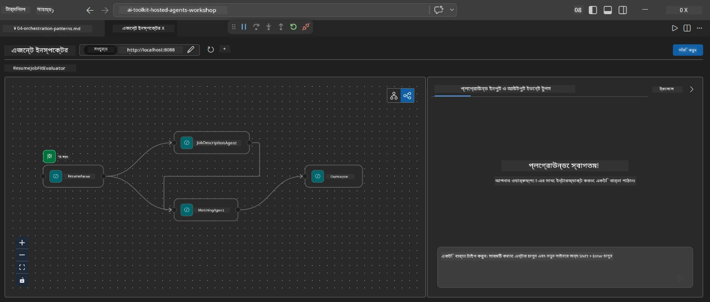
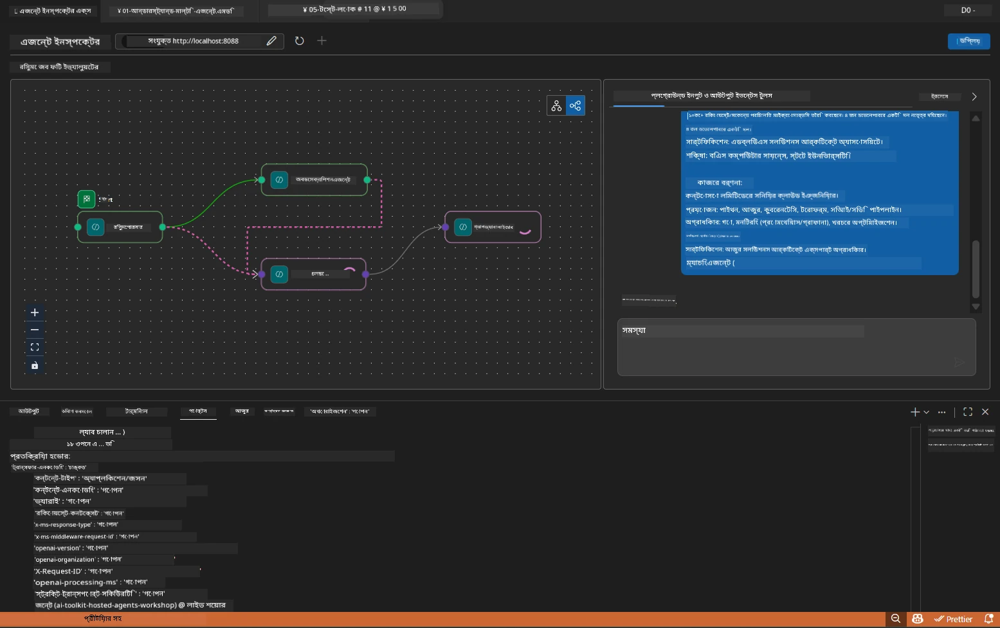
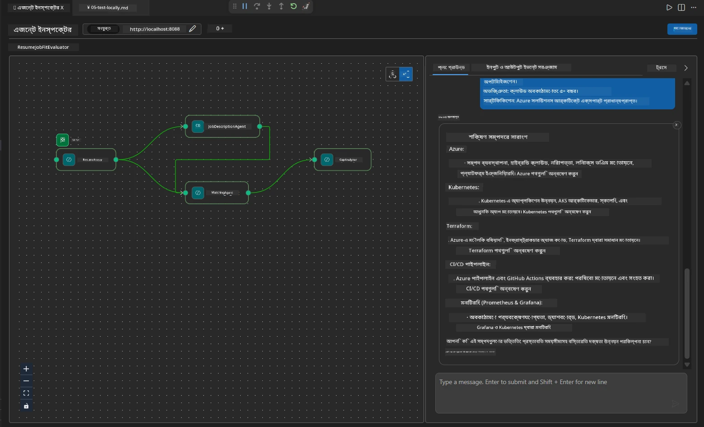

# মডিউল ৫ - লোকালি পরীক্ষা করুন

⏱️ ~১৫ মিনিট

এই মডিউলটিতে, আপনি মাল্টি-এজেন্ট ওয়ার্কফ্লো লোকালি চালাবেন, এটিকে এজেন্ট ইন্সপেক্টর দিয়ে পরীক্ষা করবেন, এবং চারটি এজেন্ট এবং MCP টুল সঠিকভাবে কাজ করছে কিনা তা যাচাই করবেন ডিপ্লয় করার আগে।

---

## ধাপ ১: এজেন্ট সার্ভার চালু করুন

### অপশন A: VS কোড টাস্ক ব্যবহার করে (পরামর্শকৃত)

1. `workshop/lab02-multi-agent/PersonalCareerCopilot/` ফোল্ডারটিকে আপনার VS কোড ফোল্ডার হিসাবে খুলুন।
2. `Ctrl+Shift+P` চাপুন → টাইপ করুন **Tasks: Run Task** → নির্বাচন করুন **Run Agent HTTP Server**।
3. টাস্কটি ডিবাগপাই সংযুক্ত করে `5679` পোর্টে এবং এজেন্টটি `8088` পোর্টে সার্ভার শুরু করবে।
4. আউটপুটে প্রদর্শিত হওয়া পর্যন্ত অপেক্ষা করুন:

```
INFO:resume-job-fit:Starting Resume -> Job Fit Evaluator HTTP server...
INFO:resume-job-fit:Server running on http://localhost:8088
```

### অপশন B: F5 ব্যবহার করে (ডিবাগ মোড)

1. `F5` চাপুন → নির্বাচন করুন **Debug Local Agent HTTP Server**।
2. সার্ভারটি পূর্ণ ব্রেকপয়েন্ট সাপোর্টসহ শুরু হবে - MCP রেসপন্স বা এজেন্ট আউটপুট পরীক্ষা করার জন্য উপকারী।

---

## ধাপ ২: এজেন্ট ইন্সপেক্টর খুলুন

1. `Ctrl+Shift+P` চাপুন → টাইপ করুন **Foundry Toolkit: Open Agent Inspector**।
2. এজেন্ট ইন্সপেক্টর VS কোড প্যানেল হিসেবে খুলবে যা `http://localhost:8088` এ সংযুক্ত।
3. আপনি এজেন্ট ইন্টারফেসটি দেখতে পাবেন যা মেসেজ গ্রহণের জন্য প্রস্তুত।



> **যদি এজেন্ট ইন্সপেক্টর না খোলে:** নিশ্চিত করুন সার্ভার সম্পূর্ণরূপে শুরু হয়েছে (আপনি "Server running" লগ দেখতে পাবেন)। যদি পোর্ট 5679 ব্যস্ত থাকে, দেখুন [মডিউল ৮ - সমস্যা সমাধান](08-troubleshooting.md)।

---

## ধাপ ২বি: (ঐচ্ছিক) ওয়ার্কফ্লো ভিজুয়ালাইজার খুলুন

Foundry Toolkit একটি রিয়েল-টাইম **Workflow Visualizer** অন্তর্ভুক্ত করে যা দেখায় এজেন্টরা কিভাবে ইন্টারঅ্যাক্ট করে যখন গ্রাফ কার্যকর হয়। এটি মাল্টি-এজেন্ট ডিবাগিংয়ের জন্য বিশেষভাবে উপযোগী।

1. `Ctrl+Shift+P` চাপুন → টাইপ করুন **Foundry Toolkit: Open Visualizer for Hosted Agents**।
2. একটি নতুন VS কোড ট্যাব খুলবে যা লাইভ এক্সিকিউশনের গ্রাফ দেখাবে।
3. আপনি যখন এজেন্ট ইন্সপেক্টরে মেসেজ পাঠাবেন, ভিজুয়ালাইজার স্বয়ংক্রিয়ভাবে আপডেট হবে - সবুজ নোডগুলি সম্পন্ন এজেন্টগুলাকে নির্দেশ করে, এবং অ্যানিমেটেড এজগুলি তাদের মধ্যে ডেটা প্রবাহ দেখায়।

> **পোর্ট সংঘর্ষ:** যদি ভিজুয়ালাইজারের পোর্ট ইতিমধ্যে ব্যবহার হচ্ছে, তাহলে VS কোড সেটিংসে পরিবর্তন করুন → **Extensions** → **Microsoft Foundry Configuration** → **Hosted Agents: Visualizer Port**।

---

## ধাপ ৩: স্মোক টেস্ট চালান

এই তিনটি টেস্ট ধারাবাহিকভাবে চালান। প্রতিটি ওয়ার্কফ্লোর আরও বেশি অংশ পরীক্ষা করে।

### টেস্ট ১: বেসিক রিজিউমে + জব ডিসক্রিপশন

Agent Inspector-এ নিম্নলিখিত পেস্ট করুন:

```
Resume:
Jane Doe
Senior Software Engineer with 5 years of experience in Python, Django, and AWS.
Built microservices handling 10K+ requests/second. Led a team of 4 developers.
Certifications: AWS Solutions Architect Associate.
Education: B.S. Computer Science, State University.

Job Description:
Senior Cloud Engineer at Contoso Ltd.
Required: Python, Azure, Kubernetes, Terraform, CI/CD pipelines.
Preferred: Go, monitoring (Prometheus/Grafana), cost optimization.
Experience: 5+ years in cloud infrastructure.
Certifications: Azure Solutions Architect Expert preferred.
```

**প্রত্যাশিত আউটপুট গঠন:**

রেসপন্সে পর্যায়ক্রমে চারটি এজেন্টের আউটপুট থাকা উচিত:

১. **Resume Parser আউটপুট** - দুইটি লেবেলযুক্ত সেকশন: `[PARSED RESUME]` (প্রার্থী প্রোফাইল গ্রুপড স্কিল সহ) এবং `[JOB DESCRIPTION PASS-THROUGH]` (পৌঁছানো JD টেক্সট যা JD এজেন্টকে দেয়)
২. **JD Agent আউটপুট** - কাঠামোবদ্ধ চাহিদাসমূহ প্রয়োজনীয় ও প্রাধান্যপ্রাপ্ত স্কিল আলাদা করে
৩. **Matching Agent আউটপুট** - ফিটস্কোর (০-১০০) ব্রেকডাউন সহ, ম্যাচড স্কিল, অনুপস্থিত স্কিল, গ্যাপ
৪. **Gap Analyzer আউটপুট** - প্রতিটি অনুপস্থিত স্কিলের জন্য পৃথক গ্যাপ কার্ড, প্রতিটি Microsoft Learn URL সহ





### টেস্ট ১ এ কী যাচাই করবেন

| পরীক্ষা করুন | প্রত্যাশিত | পাশ? |
|-------|----------|-------|
| রেসপন্সে ফিট স্কোর রয়েছে | ০-১০০ এর মধ্যে একটি নম্বর ব্রেকডাউন সহ | |
| ম্যাচড স্কিল তালিকাভুক্ত | Python, CI/CD (আংশিক), ইত্যাদি | |
| অনুপস্থিত স্কিল তালিকাভুক্ত | Azure, Kubernetes, Terraform, ইত্যাদি | |
| প্রতিটি অনুপস্থিত স্কিলের জন্য গ্যাপ কার্ড রয়েছে | প্রতিটি স্কিলের জন্য একটি কার্ড | |
| Microsoft Learn URL রয়েছে | বাস্তব `learn.microsoft.com` লিঙ্ক | |
| রেসপন্সে কোন ত্রুটি নেই | পরিষ্কার কাঠামোবদ্ধ আউটপুট | |

### টেস্ট ২: এজ কেস - উচ্চ ফিট প্রার্থী

একটি রিজিউমে পেস্ট করুন যা JD এর সাথে ঘনিষ্টভাবে মেলে যাতে যাচাই করা যায় GapAnalyzer উচ্চ-ফিট পরিস্থিতি সঠিকভাবে পরিচালনা করে:

```
Resume:
Alex Chen
Senior Cloud Engineer with 7 years of experience.
Skills: Python, Azure (AKS, Functions, DevOps), Kubernetes, Terraform, CI/CD (GitHub Actions, Azure Pipelines), Go, Prometheus, Grafana, cost optimization.
Certifications: Azure Solutions Architect Expert, Azure DevOps Engineer Expert.
Led infrastructure migration to Azure for 3 enterprise clients.
Education: M.S. Computer Science, Tech University.

Job Description:
Senior Cloud Engineer at Contoso Ltd.
Required: Python, Azure, Kubernetes, Terraform, CI/CD pipelines.
Preferred: Go, monitoring (Prometheus/Grafana), cost optimization.
Experience: 5+ years in cloud infrastructure.
Certifications: Azure Solutions Architect Expert preferred.
```

**প্রত্যাশিত আচরণ:**
- ফিট স্কোর হওয়া উচিত **৮০+** (প্রায় সব স্কিল ম্যাচ করে)
- গ্যাপ কার্ড মূলত পলিশ/ইন্টারভিউ প্রস্তুতির দিকে মনোনিবেশ করবে সূচনামূলক শেখার পরিবর্তে
- GapAnalyzer নির্দেশনায় বলা হয়: "যদি ফিট >= ৮০ হয়, পলিশ/ইন্টারভিউ প্রস্তুতির উপর ফোকাস করতে হবে"

---

## ধাপ ৪: নিজের ডেটা দিয়ে পরীক্ষা করুন (ঐচ্ছিক)

নিজের রিজিউমে এবং একটি বাস্তব জব ডিসক্রিপশন পেস্ট করে চেষ্টা করুন। এটি যাচাই করতে সাহায্য করে:

- এজেন্টরা বিভিন্ন রিজিউমে ফরম্যাট (ক্রমানুসারে, কার্যকরী, হাইব্রিড) পরিচালনা করে
- JD Agent বিভিন্ন JD স্টাইল (বুলেট পয়েন্ট, প্যারাগ্রাফ, কাঠামোবদ্ধ) পরিচালনা করে
- MCP টুল সঠিক দক্ষতার জন্য প্রাসঙ্গিক সম্পদ ফেরত দেয়
- গ্যাপ কার্ডগুলি আপনার ব্যক্তিগত পটভূমির জন্য ব্যক্তিগতকৃত

> **গোপনীয়তা - পথ A (Foundry ক্লাউড):** রিজিউমে এবং JD টেক্সট আপনার Azure OpenAI ডিপ্লয়মেন্টে ইনফারেন্সের জন্য পাঠানো হয়। এটি ওয়ার্কশপ অবকাঠামো দ্বারা লগ বা সংরক্ষণ করা হয় না। আপনি চাইলে প্লেসহোল্ডার নাম ব্যবহার করুন (যেমন, "Jane Doe")।
>
> **গোপনীয়তা - পথ B (Foundry লোকাল):** চারটি এজেন্ট ইনফারেন্স সম্পূর্ণরূপে আপনার ডিভাইসেই চলে। আপনার রিজিউমে এবং জব ডিসক্রিপশন টেক্সট **কখনোই আপনার মেশিন ছাড়ে না**। একমাত্র বহির্গামী কল হল MCP টুলের `https://learn.microsoft.com/api/mcp` থেকে সম্পদ আনা; সেই কোয়েরিতে শুধুমাত্র দক্ষতার নাম থাকে, আপনার ব্যক্তিগত তথ্য নয়।

---

### চেকপয়েন্ট

- [ ] পোর্ট `8088` এ সার্ভার সফলভাবে শুরু হয়েছে (লগে "Server running" দেখায়)
- [ ] এজেন্ট ইন্সপেক্টর খুলেছে এবং এজেন্টের সাথে সংযুক্ত
- [ ] টেস্ট ১: সম্পূর্ণ রেসপন্স ফিট স্কোর, ম্যাচড/অনুপস্থিত স্কিল, গ্যাপ কার্ড এবং Microsoft Learn URL সহ
- [ ] টেস্ট ২: উচ্চ-ফিট প্রার্থী ৮০+ স্কোর পায় পলিশ-কেন্দ্রিক সুপারিশ সহ
- [ ] সব গ্যাপ কার্ড উপস্থিত (প্রতিটি অনুপস্থিত স্কিলের জন্য একটি করে, কোন সংক্ষাপন নয়)
- [ ] সার্ভার টার্মিনালে কোন ত্রুটি বা স্ট্যাক ট্রেস নেই

---

**পূর্ববর্তী:** [০৪ - অর্কেস্ট্রেশন প্যাটার্নস](04-orchestration-patterns.md) · **পরবর্তী:** [০৬ - Foundry তে ডিপ্লয় করুন →](06-deploy-to-foundry.md)

---

<!-- CO-OP TRANSLATOR DISCLAIMER START -->
**অস্বীকৃতি**:
এই নথিটি AI অনুবাদ পরিষেবা [Co-op Translator](https://github.com/Azure/co-op-translator) ব্যবহার করে অনূদিত হয়েছে। যদিও আমরা শুদ্ধতার জন্য চেষ্টা করি, অনুগ্রহ করে মনে রাখবেন যে স্বয়ংক্রিয় অনুবাদে ত্রুটি বা অসঙ্গতি থাকতে পারে। মূল নথিটি তার স্বভাষায় কর্তৃত্বপূর্ণ উৎস হিসেবে বিবেচিত হওয়া উচিত। গুরুত্বপূর্ণ তথ্যের জন্য পেশাদার মানব অনুবাদ সুপারিশ করা হয়। এই অনুবাদের ব্যবহারে প্রয়োজনীয় ভুল বোঝাবুঝি বা ভুল ব্যাখ্যার জন্য আমরা দায়বদ্ধ নই।
<!-- CO-OP TRANSLATOR DISCLAIMER END -->