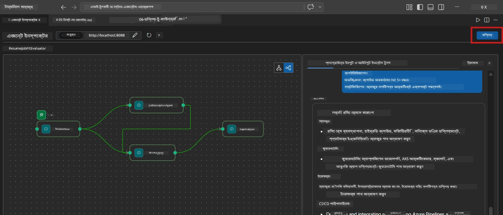
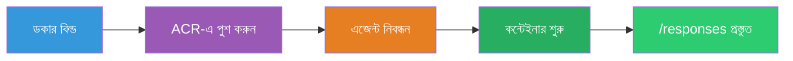
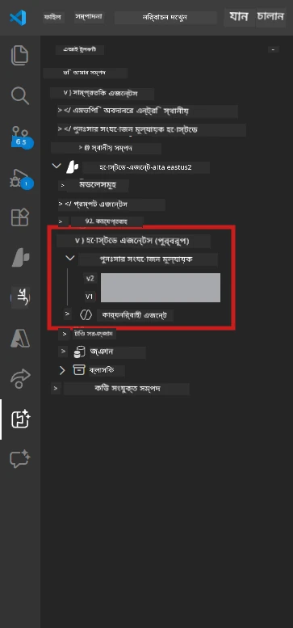

# Module 6 - Foundry Agent Service-এ ডিপ্লয় করুন

এই মডিউলে, আপনি আপনার লোকালি পরীক্ষা করা মাল্টি-এজেন্ট ওয়ার্কফ্লো [Microsoft Foundry](https://learn.microsoft.com/azure/foundry/agents/concepts/hosted-agents)-এ **Hosted Agent** হিসেবে ডিপ্লয় করবেন। ডিপ্লয়মেন্ট প্রক্রিয়াটি একটি Docker container image তৈরি করে, তা [Azure Container Registry (ACR)](https://learn.microsoft.com/azure/container-registry/container-registry-intro)-তে ধাক্কা দেয় এবং [Foundry Agent Service](https://learn.microsoft.com/azure/foundry/agents/how-to/publish-agent)-এ একটি hosted agent সংস্করণ তৈরি করে।

> **Lab 01 থেকে মূল পার্থক্য:** ডিপ্লয়মেন্ট প্রক্রিয়া একরকমই। Foundry আপনার মাল্টি-এজেন্ট ওয়ার্কফ্লোকে একটি একক hosted agent হিসেবে বিবেচনা করে - জটিলতা কন্টেইনারের ভিতর, কিন্তু ডিপ্লয়মেন্ট পৃষ্ঠতল একই `/responses` endpoint।

---

## পূর্বশর্ত যাচাই

ডিপ্লয়মেন্টের আগে, নিচের প্রতিটি আইটেম যাচাই করুন:

1. **এজেন্ট স্থানীয় স্মোক টেস্ট পাস করেছে:**
   - আপনি [Module 5](05-test-locally.md)-এ সব ৩টি পরীক্ষা সম্পন্ন করেছেন এবং ওয়ার্কফ্লো সম্পূর্ণ আউটপুট সহ গ্যাপ কার্ড ও Microsoft Learn URL তৈরি করেছে।

2. **আপনার কাছে [Azure AI User](https://learn.microsoft.com/azure/foundry/concepts/rbac-foundry) ভূমিকা আছে:**
   - [Lab 01, Module 2](../../lab01-single-agent/docs/02-create-foundry-project.md)-এ বরাদ্দ করা হয়েছে। যাচাই করুন:
   - [Azure Portal](https://portal.azure.com) → আপনার Foundry **project** রিসোর্স → **Access control (IAM)** → **Role assignments** → নিশ্চিত করুন **[Azure AI User](https://aka.ms/foundry-ext-project-role)** আপনার অ্যাকাউন্টের জন্য তালিকাভুক্ত আছে।

3. **আপনি VS Code-এ Azure-এ সাইন ইন করেছেন:**
   - VS Code-এর নীচের বামদিকে Accounts আইকন দেখুন। আপনার অ্যাকাউন্টের নাম দৃশ্যমান থাকা উচিত।

4. **`agent.yaml` এর সঠিক মান আছে:**
   - `PersonalCareerCopilot/agent.yaml` খুলুন এবং যাচাই করুন:
     ```yaml
     environment_variables:
       - name: PROJECT_ENDPOINT
         value: ${PROJECT_ENDPOINT}
       - name: MODEL_DEPLOYMENT_NAME
         value: ${MODEL_DEPLOYMENT_NAME}
     ```
   - এগুলো অবশ্যই আপনার `main.py`-এ পড়া env var-গুলোর সাথে মিলে যেতে হবে।

5. **`requirements.txt`-এ সঠিক সংস্করণ আছে:**
   ```
   agent-framework-azure-ai==1.0.0rc3
   agent-framework-core==1.0.0rc3
   azure-ai-agentserver-agentframework==1.0.0b16
   azure-ai-agentserver-core==1.0.0b16
   debugpy
   agent-dev-cli --pre
   ```

---

## ধাপ ১: ডিপ্লয়মেন্ট শুরু করুন

### বিকল্প A: Agent Inspector থেকে ডিপ্লয় (প্রস্তাবিত)

যদি এজেন্ট F5 এর মাধ্যমে চলছে এবং Agent Inspector খোলা থাকে:

1. Agent Inspector প্যানেলের **উপরের-ডান কোণ** দেখুন।
2. **Deploy** বোতামে ক্লিক করুন (ক্লাউড আইকন সাথে একটি উপরের তীর ↑)।
3. ডিপ্লয়মেন্ট উইজার্ড খুলবে।



### বিকল্প B: Command Palette থেকে ডিপ্লয়

1. `Ctrl+Shift+P` চাপুন **Command Palette** খোলার জন্য।
2. টাইপ করুন: **Microsoft Foundry: Deploy Hosted Agent** এবং নির্বাচন করুন।
3. ডিপ্লয়মেন্ট উইজার্ড খুলবে।

---

## ধাপ ২: ডিপ্লয়মেন্ট কনফিগার করুন

### ২.১ লক্ষ্য প্রকল্প নির্বাচন করুন

1. একটি ড্রপডাউন আপনার Foundry প্রকল্পগুলি দেখায়।
2. যেই প্রকল্প আপনি পুরো কর্মশালার সময় ব্যবহার করেছেন তা নির্বাচন করুন (যেমন, `workshop-agents`)।

### ২.২ container agent ফাইল নির্বাচন করুন

1. আপনাকে agent এন্ট্রি পয়েন্ট নির্বাচন করতে বলা হবে।
2. `workshop/lab02-multi-agent/PersonalCareerCopilot/` এ যান এবং **`main.py`** নির্বাচন করুন।

### ২.৩ রিসোর্স কনফিগার করুন

| সেটিং | প্রস্তাবিত মান | নোট |
|---------|------------------|-------|
| **CPU** | `0.25` | ডিফল্ট। মাল্টি-এজেন্ট ওয়ার্কফ্লো অতিরিক্ত CPU দরকার হয় না কারণ মডেল কলগুলি I/O-বাউন্ড |
| **মেমরি** | `0.5Gi` | ডিফল্ট। বড় ডেটা প্রসেসিং টুল যুক্ত করলে `1Gi` পর্যন্ত বাড়ানো যেতে পারে |

---

## ধাপ ৩: নিশ্চিত করুন এবং ডিপ্লয় করুন

1. উইজার্ড একটি ডিপ্লয়মেন্ট সারাংশ দেখায়।
2. পর্যালোচনা করুন এবং **Confirm and Deploy** ক্লিক করুন।
3. VS Code-এ প্রগতি দেখুন।

### ডিপ্লয়মেন্টের সময় কী ঘটে

VS Code এর **Output** প্যানেল দেখুন (ড্রপডাউন থেকে "Microsoft Foundry" নির্বাচন করুন):


1. **Docker build** - আপনার `Dockerfile` থেকে কন্টেইনার তৈরি করে:
   ```
   Step 1/6 : FROM python:3.14-slim
   Step 2/6 : WORKDIR /app
   ...
   Successfully built abc123def456
   ```

2. **Docker push** - ইমেজটি ACR-এ আপলোড করে (প্রথম ডিপ্লয়মেন্টে ১-৩ মিনিট সময় লাগে)।

3. **Agent registration** - Foundry `agent.yaml` মেটাডাটা ব্যবহার করে একটি hosted agent তৈরি করে। এজেন্টের নাম `resume-job-fit-evaluator`।

4. **Container start** - কন্টেইনারটি Foundry এর ব্যবস্থাপিত অবকাঠামোতে একটি সিস্টেম-ম্যানেজড আইডেন্টিটিসহ শুরু হয়।

> **প্রথম ডিপ্লয়মেন্ট ধীর হয়** (Docker সব লেয়ার আপলোড করে)। পরবর্তী ডিপ্লয়মেন্টে ক্যাশড লেয়ার ব্যবহার করা হয়, তাই দ্রুত হয়।

### মাল্টি-এজেন্ট-সংক্রান্ত বিশেষ নোট

- **সব চারটি এজেন্ট একটি কন্টেইনারের ভিতরে।** Foundry একটি একক hosted agent দেখবে। WorkflowBuilder গ্রাফ অভ্যন্তরীণভাবে চলে।
- **MCP কলগুলি আউটবাউন্ড হয়।** কন্টেইনারের ইন্টারনেট অ্যাক্সেস থাকতে হবে `https://learn.microsoft.com/api/mcp` এ পৌঁছাতে। Foundry-এর ব্যবস্থাপিত অবকাঠামো ডিফল্ট হিসেবে এটি প্রদান করে।
- **[Managed Identity](https://learn.microsoft.com/python/api/overview/azure/identity-readme#managed-identity-support)।** হোস্টেড পরিবেশে, `main.py`-এর `get_credential()` `ManagedIdentityCredential()` ফেরত দেয় (কারণ `MSI_ENDPOINT` সেট), যা স্বয়ংক্রিয়।

---

## ধাপ ৪: ডিপ্লয়মেন্ট স্ট্যাটাস যাচাই করুন

1. **Microsoft Foundry** সাইডবার খুলুন (Activity Bar-এ Foundry আইকনে ক্লিক করুন)।
2. আপনার প্রকল্পের নিচে **Hosted Agents (Preview)** বিক্সিত করুন।
3. **resume-job-fit-evaluator** (অথবা আপনার এজেন্ট নাম) খুঁজুন।
4. এজেন্ট নাম ক্লিক করুন → সংস্করণ গুলো দেখুন (যেমন, `v1`)।
5. সংস্করণে ক্লিক করুন → **Container Details** → **Status** চেক করুন:



| স্ট্যাটাস | মানে |
|--------|---------|
| **Started** / **Running** | কন্টেইনার চলছে, এজেন্ট প্রস্তুত |
| **Pending** | কন্টেইনার শুরু হচ্ছে (৩০-৬০ সেকেন্ড অপেক্ষা করুন) |
| **Failed** | কন্টেইনার শুরু করতে ব্যর্থ (লগ চেক করুন - নিচে দেখুন) |

> **মাল্টি-এজেন্টে স্টার্টআপ বেশি সময় নেয়** কারণ কন্টেইনার শুরুতে ৪টি এজেন্ট ইন্সট্যান্স তৈরি করে। "Pending" ২ মিনিট পর্যন্ত স্বাভাবিক।

---

## সাধারণ ডিপ্লয়মেন্ট ত্রুটি এবং সমাধান

### ত্রুটি ১: অনুমতি অস্বীকৃত - `agents/write`

```
Error: lacks the required data action 
Microsoft.CognitiveServices/accounts/AIServices/agents/write
```

**সমাধান:** **[Azure AI User](https://learn.microsoft.com/azure/foundry/concepts/rbac-foundry)** ভূমিকা **প্রকল্প** পর্যায়ে বরাদ্দ করুন। বিস্তারিত ধাপে ধাপে নির্দেশনার জন্য দেখুন [Module 8 - Troubleshooting](08-troubleshooting.md)।

### ত্রুটি ২: Docker চলছে না

```
Error: Docker build failed / Cannot connect to Docker daemon
```

**সমাধান:**
1. Docker Desktop চালু করুন।
2. "Docker Desktop is running" হওয়ার জন্য অপেক্ষা করুন।
3. যাচাই করুন: `docker info`
4. **Windows:** Docker Desktop সেটিংসে WSL 2 backend চালু আছে নিশ্চিত করুন।
5. পুনরায় চেষ্টা করুন।

### ত্রুটি ৩: Docker build সময় pip install ব্যর্থ

```
Error: Could not find a version that satisfies the requirement agent-dev-cli
```

**সমাধান:** `requirements.txt`-এর `--pre` ফ্ল্যাগ Docker-এ ভিন্নভাবে পরিচালিত হয়। নিশ্চিত করুন:
```
agent-dev-cli --pre
```

যদি Docker আবারও ব্যর্থ হয়, একটি `pip.conf` তৈরি করুন অথবা build argument হিসেবে `--pre` পাঠান। বিস্তারিত দেখতে [Module 8](08-troubleshooting.md)।

### ত্রুটি ৪: হোস্টেড এজেন্টে MCP টুল ব্যর্থ

ডিপ্লয়মেন্টের পরে Gap Analyzer Microsoft Learn URL তৈরি বন্ধ করলে:

**মূল কারণ:** নেটওয়ার্ক নীতিমালা কন্টেইনার থেকে আউটবাউন্ড HTTPS ব্লক করতে পারে।

**সমাধান:**
1. সাধারণত Foundry ডিফল্ট কনফিগারেশনে এটি সমস্যা হয় না।
2. যদি হয়, পরীক্ষা করুন Foundry প্রকল্পের ভার্চুয়াল নেটওয়ার্কে কোনো NSG আউটবাউন্ড HTTPS ব্লক করছে কিনা।
3. MCP টুলের বিল্ট-ইন ফ্যালব্যাক URL আছে, তাই এজেন্ট এখনও আউটপুট উৎপাদন করবে (লাইভ URL ছাড়া)।

---

### চেকপয়েন্ট

- [ ] ডিপ্লয়মেন্ট কমান্ড VS Code-এ ত্রুটিহীন সম্পন্ন হয়েছে
- [ ] এজেন্ট Foundry সাইডবারে **Hosted Agents (Preview)** এর মধ্যে দেখা যাচ্ছে
- [ ] এজেন্টের নাম `resume-job-fit-evaluator` (অথবা আপনার পছন্দের নাম)
- [ ] কন্টেইনার স্ট্যাটাস **Started** বা **Running** দেখাচ্ছে
- [ ] (ত্রুটি থাকলে) আপনি ত্রুটি সনাক্ত করেছেন, সমাধান করেছেন এবং সফল ডিপ্লয়মেন্ট করেছেন

---

**আগের:** [05 - Test Locally](05-test-locally.md) · **পরবর্তী:** [07 - Verify in Playground →](07-verify-in-playground.md)

---

<!-- CO-OP TRANSLATOR DISCLAIMER START -->
**বিজ্ঞপ্তি**:
এই দলিলটি AI অনুবাদ সেবা [Co-op Translator](https://github.com/Azure/co-op-translator) ব্যবহার করে অনূদিত হয়েছে। আমরা যথাসাধ্য সঠিকতার চেষ্টা করি, তবুও স্বয়ংক্রিয় অনুবাদে ভুল বা অসঙ্গতি থাকতে পারে। মূল ভাষায় থাকা দলিলটিকেই প্রামাণিক উৎস হিসেবে গণ্য করা উচিত। গুরুত্বপূর্ণ তথ্যের জন্য পেশাদার মানব অনুবাদের পরামর্শ দেওয়া হয়। এই অনুবাদ ব্যবহারে কোনো ভুল বোঝাবুঝি বা ভুল ব্যখ্যার জন্য আমরা দায়ী থাকব না।
<!-- CO-OP TRANSLATOR DISCLAIMER END -->