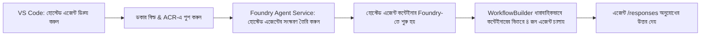
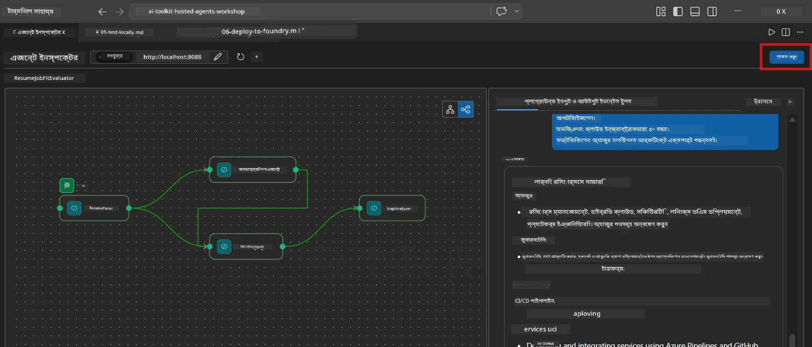
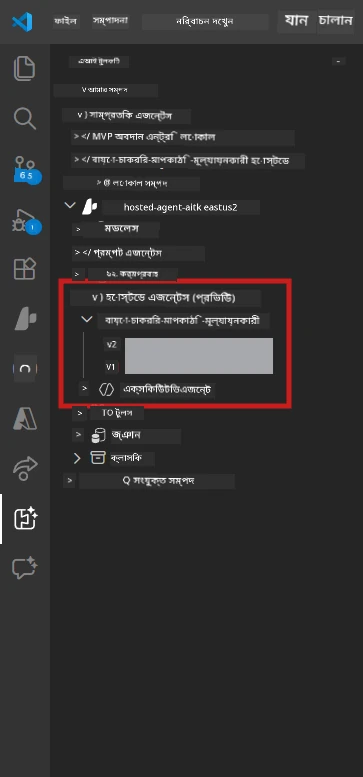

# মডিউল ৬ - Foundry Agent সার্ভিসে ডিপ্লয় করুন

⏱️ ~১০ মিনিট

এই মডিউলে, আপনি আপনার লোকালি টেস্ট করা মাল্টি-এজেন্ট ওয়ার্কফ্লো [Microsoft Foundry](https://learn.microsoft.com/azure/foundry/agents/concepts/hosted-agents)-এ একটি **হোস্টেড এজেন্ট** হিসেবে ডিপ্লয় করবেন। ডিপ্লয়মেন্ট প্রক্রিয়ায় একটি Docker কন্টেইনার ইমেজ তৈরি করা হয়, যা [Azure Container Registry (ACR)](https://learn.microsoft.com/azure/container-registry/container-registry-intro)-তে পুশ করা হয়, এবং [Foundry Agent Service](https://learn.microsoft.com/azure/foundry/agents/how-to/publish-agent)-এ একটি হোস্টেড এজেন্ট ভার্সন তৈরি করা হয়।

> **ল্যাব ০১ থেকে প্রধান পার্থক্য:** ডিপ্লয়মেন্ট প্রক্রিয়াটি একই থাকে। Foundry আপনার মাল্টি-এজেন্ট ওয়ার্কফ্লোকে একটি একক হোস্টেড এজেন্ট হিসেবে বিবেচনা করে - জটিলতা কন্টেইনারের ভিতরে থাকে, কিন্তু ডিপ্লয়মেন্ট সারফেস একই `/responses` এন্ডপয়েন্ট।

### ডিপ্লয়মেন্ট পাইপলাইন


```mermaid
flowchart LR
    A[VS Code: হোস্টেড এজেন্ট ডিপ্লয় করুন] --> B[ডকার বিল্ড & ACR-এ পুশ করুন]
    B --> C[Foundry Agent Service: হোস্টেড এজেন্টের সংস্করণ তৈরি করুন]
    C --> D[হোস্টেড এজেন্ট কন্টেইনার Foundry-তে শুরু হয়]
    D --> E[WorkflowBuilder ধারাবাহিকভাবে কন্টেইনারের ভিতরে ৪ জন এজেন্ট চালায়]
    E --> F[এজেন্ট /responses অনুরোধের উত্তর দেয়]
```

---

## পূর্বশর্ত যাচাই

ডিপ্লয় করার আগে নিচের প্রতিটি আইটেম যাচাই করুন:

১. **এজেন্ট লোকাল স্মোক টেস্ট পাস করেছে:**
   - আপনি [মডিউল ৫](05-test-locally.md)-এর সব ৩টি টেস্ট সম্পন্ন করেছেন এবং ওয়ার্কফ্লো সম্পূর্ণ আউটপুট দিয়েছে গ্যাপ কার্ড এবং Microsoft Learn URL সহ।

২. **আপনার কাছে [Foundry User](https://learn.microsoft.com/azure/foundry/concepts/rbac-foundry) রোল আছে** (ডিপ্লয় করতে, ন্যূনতম প্রয়োজন **Foundry Project Manager** প্রোজেক্ট স্কোপে):

   > **নোট:** Foundry RBAC রোলগুলি সম্প্রতি পুনঃনামকরণ করা হয়েছে - **Foundry User**, **Foundry Owner**, এবং **Foundry Project Manager** পূর্বে Azure AI User, Azure AI Owner, এবং Azure AI Project Manager নামে পরিচিত ছিল। রোল আইডি ও অনুমতিগুলি অপরিবর্তিত।

   - [Azure Portal](https://portal.azure.com)-এ যাচাই করুন → আপনার Foundry **প্রোজেক্ট** রিসোর্স → **Access control (IAM)** → **Role assignments** → নিশ্চিত করুন যে আপনার অ্যাকাউন্টের জন্য **Foundry User** (বা উচ্চতর) তালিকাভুক্ত।

৩. **আপনি VS Code-এ Azure-এ সাইন ইন আছেন:**
   - VS Code-এর বাম নিম্ন কোণে Accounts আইকনে দেখুন। আপনার অ্যাকাউন্ট নাম দৃশ্যমান থাকা উচিত।

৪. **`agent.yaml`-এ সঠিক মান আছে:**
   - `PersonalCareerCopilot/agent.yaml` ফাইলটি খুলুন এবং যাচাই করুন:
     ```yaml
     environment_variables:
       - name: AZURE_AI_MODEL_DEPLOYMENT_NAME
         value: ${AZURE_AI_MODEL_DEPLOYMENT_NAME}
     ```
   - `FOUNDRY_PROJECT_ENDPOINT` এখানে **তালিকাভুক্ত নয়** - Foundry রানটাইমে এটি ইনজেক্ট করে। শুধুমাত্র `AZURE_AI_MODEL_DEPLOYMENT_NAME` ঘোষণা করতে হবে।

৫. **`requirements.txt`-এ সঠিক ভার্সন আছে:**
   ```
   agent-framework-foundry
   agent-framework-foundry-hosting
   mcp<2,>=1.24.0
   debugpy
   ```

---

## ধাপ ১: ডিপ্লয়মেন্ট শুরু করুন

### বিকল্প ক: এজেন্ট ইন্সপেক্টর থেকে ডিপ্লয় করুন (সুপারিশকৃত)

যদি এজেন্ট F5 দ্বারা চালু থাকে এবং এজেন্ট ইন্সপেক্টর খোলা থাকে:

১. এজেন্ট ইন্সপেক্টর প্যানেলের **উপর-ডান কোণ** দেখুন।
২. **Deploy** বাটনে ক্লিক করুন (ক্লাউড আইকন সাথে আপ লেখচিহ্ন ↑)।
৩. ডিপ্লয়মেন্ট উইজার্ড খুলবে।



### বিকল্প খ: কমান্ড প্যালেট থেকে ডিপ্লয় করুন

১. **Command Palette** খুলতে `Ctrl+Shift+P` চাপুন।
২. টাইপ করুন: **Foundry Toolkit: Deploy Hosted Agent** এবং নির্বাচন করুন।
৩. ডিপ্লয়মেন্ট উইজার্ড খুলবে।

---

## ধাপ ২: ডিপ্লয়মেন্ট কনফিগার করুন

### ২.১ টার্গেট প্রোজেক্ট নির্বাচন করুন

১. একটি ড্রপডাউন আপনার Foundry প্রোজেক্টগুলি দেখাবে।
২. টিউটোরিয়ালে ব্যবহার করা প্রোজেক্ট (যেমন, `workshop-agents`) নির্বাচন করুন।

### ২.২ কন্টেইনার এজেন্ট ফাইল নির্বাচন করুন

১. আপনাকে এজেন্ট এন্ট্রি পয়েন্ট নির্বাচন করতে বলা হবে।
২. `workshop/lab02-multi-agent/PersonalCareerCopilot/` ফিরেও যান এবং **`main.py`** নির্বাচন করুন।

### ২.৩ রিসোর্স কনফিগার করুন

| সেটিং | সুপারিশকৃত মান | নোটস |
|---------|------------------|-------|
| **ডিপ্লয়মেন্ট পদ্ধতি** | **কন্টেইনার** (সুপারিশকৃত) অথবা **কোড** | কন্টেইনার একটি Docker ইমেজ তৈরি করে; কোড সোর্সকে ZIP আকারে আপলোড করে (প্রিভিউ) |
| **কন্টেইনার রেজিস্ট্রি** | **ডিফল্ট ACR** | Foundry আপনার জন্য এটি তৈরি ও পরিচালনা করে |
| **CPU** | `0.25` | ডিফল্ট। মাল্টি-এজেন্ট ওয়ার্কফ্লোগুলোর অতিরিক্ত CPU দরকার হয় না কারণ মডেল কলগুলি I/O-বাউন্ড |
| **মেমরি** | `0.5Gi` | ডিফল্ট। বড় ডেটা প্রক্রিয়াকরণ সরঞ্জাম যোগ করলে `1Gi` বাড়ান |

---

## ধাপ ৩: নিশ্চিত করুন এবং ডিপ্লয় করুন

১. উইজার্ড একটি ডিপ্লয়মেন্ট সারাংশ দেখায়।
২. পর্যালোচনা করে **Confirm and Deploy** ক্লিক করুন।
৩. VS Code-এ প্রগতি দেখুন।

### ডিপ্লয়মেন্ট চলাকালীন কি ঘটে

VS Code **Output** প্যানেল দেখুন (ড্রপডাউন থেকে "Microsoft Foundry" নির্বাচন করুন):

১. **Docker build** - আপনার `Dockerfile` থেকে কন্টেইনার তৈরি করে
   ```
   Step 1/6 : FROM python:3.12-slim
   Step 2/6 : WORKDIR /app
   ...
   Successfully built abc123def456
   ```

২. **Docker push** - ইমেজ ACR-এ পুশ করে (প্রথম ডিপ্লয়-এ ১-৩ মিনিট সময় লাগে)।

৩. **এজেন্ট রেজিস্ট্রেশন** - Foundry `agent.yaml` মেটাডেটার সাহায্যে হোস্টেড এজেন্ট তৈরি করে। এজেন্টের নাম `resume-job-fit-evaluator`।

৪. **কন্টেইনার শুরু** - Foundry-এর পরিচালিত অবকাঠামোতে কন্টেইনার শুরু হয় একটি সিস্টেম-পরিচালিত পরিচয় দিয়ে।

> **প্রথম ডিপ্লয় ধীর গতি হয়** (Docker সব লেয়ার পুশ করে)। পরবর্তী ডিপ্লয়গুলো ক্যাশড লেয়ার পুনর্ব্যবহার করে দ্রুত হয়।

### মাল্টি-এজেন্ট নির্দিষ্ট নোটস

- **সব চারটি এজেন্ট একটি কন্টেইনারের ভিতরে।** Foundry একটি একক হোস্টেড এজেন্ট দেখেন। WorkflowBuilder গ্রাফ অভ্যন্তরীণভাবে চলে।
- **MCP কলগুলো আউটবাউন্ড যায়।** কন্টেইনারের ইন্টারনেট অ্যাক্সেস থাকা প্রয়োজন `https://learn.microsoft.com/api/mcp` পৌঁছাতে। Foundry-এর পরিচালিত অবকাঠামো এটি ডিফল্টরূপে দেয়।
- **[Managed Identity](https://learn.microsoft.com/azure/foundry/agents/concepts/agent-identity)।** Foundry নিজে থেকেই প্রতিটি হোস্টেড এজেন্টের জন্য ডিপ্লয়মেন্ট সময় একটি **ডেডিকেটেড প্রতি-এজেন্ট Entra পরিচয়** তৈরি করে। হোস্টেড পরিবেশে, `DefaultAzureCredential` স্বয়ংক্রিয়ভাবে এই এজেন্ট পরিচয়ে রেজল্ভ হয় - ম্যানুয়াল ম্যানেজড আইডেন্টিটি কনফিগারেশন দরকার নেই।

---

## ধাপ ৪: ডিপ্লয়মেন্ট অবস্থা যাচাই করুন

১. **Microsoft Foundry** সাইডবার খুলুন (Activity Bar-এর Foundry আইকনে ক্লিক করুন)।
২. আপনার প্রোজেক্টের অধীনে **Hosted Agents (Preview)** এক্সপ্যান্ড করুন।
৩. **resume-job-fit-evaluator** (অথবা আপনার এজেন্টের নাম) খুঁজুন।
৪. এজেন্টের নাম ক্লিক করুন → ভার্সন এক্সপ্যান্ড করুন (যেমন, `v1`)।
৫. ভার্সন ক্লিক → **Container Details** → **Status** চেক করুন:



| স্ট্যাটাস | অর্থ |
|--------|---------|
| **active** | এজেন্ট চলছে এবং অনুরোধ গ্রহণে প্রস্তুত |
| **creating** | কন্টেইনার শুরু হচ্ছে (৩০–৬০ সেকেন্ড অপেক্ষা করুন) |
| **failed** | কন্টেইনার শুরু করতে ব্যর্থ (লগ চেক করুন - নিচে দেখুন) |

> **নোট:** VS Code সাইডবারে "Running" বা "Started" লেবেল দেখা যেতে পারে যদিও আন্ডারলাইন API স্ট্যাটাস `active`/`creating` হয়। উভয়ই একই অবস্থা নির্দেশ করে।

> **মাল্টি-এজেন্ট স্টার্টআপ বেশিক্ষণ সময় নেয়** কারণ কন্টেইনার শুরুতে ৪টি এজেন্ট ইনস্ট্যান্স তৈরি করে। `creating` ২ মিনিট পর্যন্ত স্বাভাবিক।

---

## সাধারণ ডিপ্লয়মেন্ট ত্রুটি এবং সমাধান

### ভুল ১: অনুমতি নিষিদ্ধ - `agents/write`

```
Error: lacks the required data action 
Microsoft.CognitiveServices/accounts/AIServices/agents/write
```

**সমাধান:** **[Foundry User](https://learn.microsoft.com/azure/foundry/concepts/rbac-foundry)** রোল (পূর্বে **Azure AI User**) **প্রোজেক্ট** স্তরে নিয়োগ করুন। ধাপে ধাপে নির্দেশনার জন্য [মডিউল ৮ - Troubleshooting](08-troubleshooting.md) দেখুন।

### ভুল ২: Docker চলছে না

```
Error: Docker build failed / Cannot connect to Docker daemon
```

**সমাধান:**
১. Docker Desktop চালু করুন।
২. "Docker Desktop is running" পর্যন্ত অপেক্ষা করুন।
৩. যাচাই করুন: `docker info`
৪. **Windows:** Docker Desktop সেটিংসে WSL 2 ব্যাকএন্ড সক্রিয় আছে কিনা নিশ্চিত করুন।
৫. পুনরায় চেষ্টা করুন।

### ভুল ৩: Docker build চলাকালীন pip install ব্যর্থ

```
Error: Could not find a version that satisfies the requirement agent-framework-foundry
```

**সমাধান:** যাচাই করুন `requirements.txt` মিলছে:
```
agent-framework-foundry
agent-framework-foundry-hosting
mcp<2,>=1.24.0
debugpy
```

যদি বিল্ড এখনও ব্যর্থ হয়, আপনার Docker নেটওয়ার্ক PyPI ব্লক করতে পারে। `docker info`-তে প্রক্সি সেটিংস চেক করুন।

### ভুল ৪: MCP টুল হোস্টেড এজেন্টে ব্যর্থ

ডিপ্লয়মেন্টের পরে যদি Gap Analyzer Microsoft Learn URL তৈরি করা বন্ধ করে:

**মূল কারণ:** নেটওয়ার্ক নীতিমালা কন্টেইনার থেকে আউটবাউন্ড HTTPS ব্লক করছে।

**সমাধান:**
১. এটি সাধারণত Foundry-এর ডিফল্ট কনফিগারেশনে সমস্যা হয় না।
২. যদি হয়, Foundry প্রোজেক্টের ভার্চুয়াল নেটওয়ার্কে NSG আউটবাউন্ড HTTPS ব্লক করছে কিনা পরীক্ষা করুন।
৩. MCP টুলে বিল্ট-ইন ব্যাকআপ URL আছে, তাই এজেন্ট আউটপুট তৈরি করবে (লাইভ URL ছাড়া)।

---

### চেকপয়েন্ট

- [ ] VS Code-এ ডিপ্লয়মেন্ট কমান্ড ত্রুটি ছাড়া সম্পন্ন হয়েছে
- [ ] Foundry সাইডবারে **Hosted Agents (Preview)** এর অধীনে এজেন্টটি দেখা যাচ্ছে
- [ ] এজেন্টের নাম `resume-job-fit-evaluator` (অথবা আপনার নির্বাচিত নাম)
- [ ] কন্টেইনার স্ট্যাটাস **Started** বা **Running** প্রদর্শন করছে
- [ ] (যদি ত্রুটি থাকে) আপনি ত্রুটিটি সনাক্ত করেছেন, সমাধান প্রয়োগ করেছেন, এবং সফলভাবে পুনরায় ডিপ্লয় করেছেন

---

**পূর্ববর্তী:** [০৫ - লোকালি টেস্ট করুন](05-test-locally.md) · **পরবর্তী:** [০৭ - প্লেগ্রাউন্ডে যাচাই →](07-verify-in-playground.md)

---

<!-- CO-OP TRANSLATOR DISCLAIMER START -->
**অস্বীকৃতি**:
এই নথিটি AI অনুবাদ পরিষেবা [Co-op Translator](https://github.com/Azure/co-op-translator) ব্যবহার করে অনূদিত হয়েছে। যদিও আমরা শুদ্ধতার জন্য চেষ্টা করি, অনুগ্রহ করে মনে রাখবেন যে স্বয়ংক্রিয় অনুবাদে ত্রুটি বা অসঙ্গতি থাকতে পারে। মূল নথিটি তার স্বভাষায় কর্তৃত্বপূর্ণ উৎস হিসেবে বিবেচিত হওয়া উচিত। গুরুত্বপূর্ণ তথ্যের জন্য পেশাদার মানব অনুবাদ সুপারিশ করা হয়। এই অনুবাদের ব্যবহারে প্রয়োজনীয় ভুল বোঝাবুঝি বা ভুল ব্যাখ্যার জন্য আমরা দায়বদ্ধ নই।
<!-- CO-OP TRANSLATOR DISCLAIMER END -->