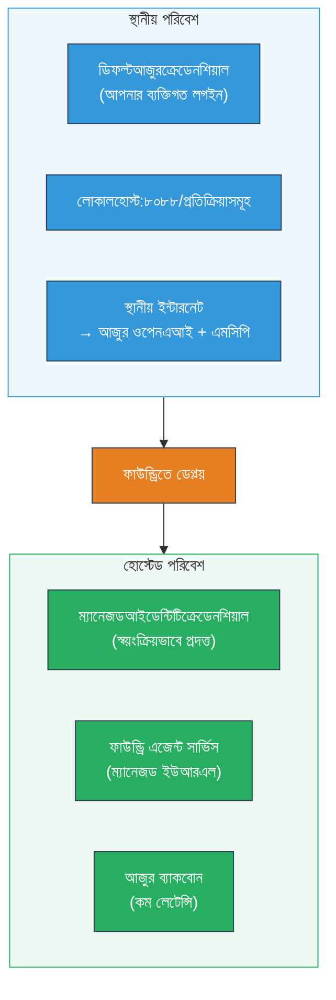

# মডিউল ৭ - প্লেগ্রাউন্ডে যাচাই করুন

এই মডিউলে, আপনি আপনার ডিপ্লয় করা মাল্টি-এজেন্ট ওয়ার্কফ্লো উভয়ই **VS Code** এবং **[Foundry Portal](https://ai.azure.com)** এ পরীক্ষা করেন, নিশ্চিত করেন যে এজেন্টটি স্থানীয় পরীক্ষার মতোই আচরণ করছে।

---

## ডিপ্লয়ের পরে যাচাই কেন?

আপনার মাল্টি-এজেন্ট ওয়ার্কফ্লো স্থানীয়ভাবে সম্পূর্ণরূপে কাজ করেছে, তাহলে আবার পরীক্ষা কেন করবেন? হোস্ট করা পরিবেশ কিছু উপায়ে ভিন্ন:


| পার্থক্য | স্থানীয় | হোস্টেড |
|-----------|-------|--------|
| **পরিচয়** | [`DefaultAzureCredential`](https://learn.microsoft.com/azure/developer/python/sdk/authentication/credential-chains#defaultazurecredential-overview) (আপনার ব্যক্তিগত সাইন-ইন) | [`ManagedIdentityCredential`](https://learn.microsoft.com/python/api/overview/azure/identity-readme#managed-identity-support) (স্বয়ংক্রিয়ভাবে প্রদানকৃত) |
| **এন্ডপয়েন্ট** | `http://localhost:8088/responses` | [Foundry Agent Service](https://learn.microsoft.com/azure/foundry/agents/concepts/hosted-agents) এন্ডপয়েন্ট (পরিচালিত URL) |
| **নেটওয়ার্ক** | স্থানীয় মেশিন → Azure OpenAI + MCP আউটবাউন্ড | Azure ব্যাকবোন (সেবাগুলোর মধ্যে কম বিলম্ব) |
| **MCP সংযোগ** | স্থানীয় ইন্টারনেট → `learn.microsoft.com/api/mcp` | কন্টেইনার আউটবাউন্ড → `learn.microsoft.com/api/mcp` |

যদি কোনো পরিবেশ ভেরিয়েবল ভুলভাবে কনফিগার করা হয়, RBAC আলাদা হয়, বা MCP আউটবাউন্ড ব্লক হয়, তাহলে আপনি এখানে তা ধরতে পারবেন।

---

## বিকল্প A: VS Code প্লেগ্রাউন্ডে পরীক্ষা করুন (প্রথমে সুপারিশ করা)

[Foundry এক্সটেনশন](https://marketplace.visualstudio.com/items?itemName=TeamsDevApp.vscode-ai-foundry) একটি ইন্টিগ্রেটেড প্লেগ্রাউন্ড অন্তর্ভুক্ত করে যা আপনাকে VS Code ছাড়াই আপনার ডিপ্লয় করা এজেন্টের সাথে চ্যাট করার সুযোগ দেয়।

### ধাপ ১: আপনার হোস্টেড এজেন্টে যান

1. VS Code এর **Activity Bar** (বাম সাইডবার) এ **Microsoft Foundry** আইকনে ক্লিক করুন Foundry প্যানেল খুলতে।
2. আপনার সংযুক্ত প্রকল্পটি (যেমন `workshop-agents`) বিস্তৃত করুন।
3. **Hosted Agents (Preview)** খুলুন।
4. আপনি আপনার এজেন্টের নাম দেখতে পাবেন (যেমন `resume-job-fit-evaluator`)।

### ধাপ ২: একটি সংস্করণ নির্বাচন করুন

1. এজেন্ট নামটিতে ক্লিক করে এর সংস্করণগুলি দেখুন।
2. আপনি যে সংস্করণটি ডিপ্লয় করেছেন (যেমন `v1`) তাতে ক্লিক করুন।
3. একটি **বিস্তারিত প্যানেল** খুলবে যেখানে কন্টেইনার বিবরণ থাকবে।
4. যাচাই করুন অবস্থা **Started** বা **Running** আছে।

### ধাপ ৩: প্লেগ্রাউন্ড খুলুন

1. বিস্তারিত প্যানেলে, **Playground** বোতামে ক্লিক করুন (অথবা সংস্করণে রাইট-ক্লিক → **Open in Playground**)।
2. একটি চ্যাট ইন্টারফেস VS Code ট্যাবে খুলবে।

### ধাপ ৪: আপনার স্মোক টেস্টগুলি চালান

[মডিউল ৫](05-test-locally.md) থেকে একই ৩টি টেস্ট ব্যবহার করুন। প্রতিটি বার্তা প্লেগ্রাউন্ড ইনপুট বক্সে টাইপ করে **Send** (অথবা **Enter**) চাপুন।

#### টেস্ট ১ - সম্পূর্ণ রিজিউমে + JD (স্ট্যান্ডার্ড ফ্লো)

মডিউল ৫, টেস্ট ১ থেকে সম্পূর্ণ রিজিউমে + JD প্রম্পট পেস্ট করুন (Jane Doe + Senior Cloud Engineer at Contoso Ltd)।

**প্রত্যাশিত:**
- ফিট স্কোর সহ বিস্তারিত গণনা (১০০-পয়েন্ট স্কেল)
- মেলানো দক্ষতা সেকশন
- অনুপস্থিত দক্ষতা সেকশন
- **প্রতিটি অনুপস্থিত দক্ষতার জন্য একটি গ্যাপ কার্ড** Microsoft Learn URL সহ
- লার্নিং রোডম্যাপ এবং টাইমলাইন

#### টেস্ট ২ - দ্রুত শর্ট টেস্ট (কম ইনপুট)

```
RESUME: 3 years Python developer, knows Django and PostgreSQL, no cloud experience.

JOB: Cloud DevOps Engineer requiring AWS, Kubernetes, Terraform, CI/CD. 5 years needed.
```

**প্রত্যাশিত:**
- কম ফিট স্কোর (< ৪০)
- সৎ মূল্যায়ন সহ পর্যায়ক্রমিক শিক্ষণ পথ
- একাধিক গ্যাপ কার্ড (AWS, Kubernetes, Terraform, CI/CD, অভিজ্ঞতা ফাঁক)

#### টেস্ট ৩ - উচ্চ ফিট প্রার্থী

```
RESUME:
10 years Azure Cloud Architect. AZ-305 certified. Expert in AKS, Terraform, Azure DevOps, 
Azure Functions, Helm, Prometheus, Grafana, Python, Go. Led platform team of 8.

JOB:
Senior Cloud Engineer. Required: AKS, Terraform, Azure DevOps, Python. Preferred: Helm, Go.
5+ years experience. AZ-305 preferred.
```

**প্রত্যাশিত:**
- উচ্চ ফিট স্কোর (≥ ৮০)
- ইন্টারভিউ প্রস্তুতি এবং পালিশের উপর ফোকাস
- কম অথবা কোনো গ্যাপ কার্ড নেই
- প্রস্তুতির উপর ফোকাস করা স্বল্প সময়সীমা

### ধাপ ৫: স্থানীয় ফলাফলের সাথে তুলনা করুন

মডিউল ৫ থেকে আপনার নোট অথবা ব্রাউজার ট্যাব খুলুন যেখানে আপনি স্থানীয় প্রতিক্রিয়া সংরক্ষণ করেছিলেন। প্রতিটি টেস্টের জন্য:

- কি প্রতিক্রিয়ার **গঠন একই** (ফিট স্কোর, গ্যাপ কার্ড, রোডম্যাপ)?
- কি একই **স্কোরিং রুব্রিক অনুসরণ করে** (১০০-পয়েন্ট বিশ্লেষণ)?
- গ্যাপ কার্ডে কি **Microsoft Learn URL** এখনও আছে?
- অনুপস্থিত প্রতিটি দক্ষতার জন্য কি **একটি গ্যাপ কার্ড আছে** (ট্রাঙ্কেটেড নয়)?

> **ছোটখাট্টা শব্দগত পার্থক্য স্বাভাবিক** - মডেলটি অস্পষ্ট। গঠন, স্কোরিং সামঞ্জস্য এবং MCP টুল ব্যবহারের উপর মনোযোগ দিন।

---

## বিকল্প B: Foundry পোর্টালে পরীক্ষা করুন

[Foundry Portal](https://ai.azure.com) একটি ওয়েব-বেসড প্লেগ্রাউন্ড প্রদান করে, যা দলের সদস্য বা স্টেকহোল্ডারদের সাথে ভাগ করার জন্য উপকারী।

### ধাপ ১: Foundry পোর্টাল খুলুন

1. আপনার ব্রাউজার খুলে [https://ai.azure.com](https://ai.azure.com) এ যান।
2. ওয়ার্কশপে ব্যবহার করা একই অ্যাজুর একাউন্ট দিয়ে সাইন ইন করুন।

### ধাপ ২: আপনার প্রকল্পে যান

1. হোম পেজে, বাম সাইডবারে **Recent projects** দেখুন।
2. আপনার প্রকল্পের নাম (যেমন `workshop-agents`) ক্লিক করুন।
3. যদি না দেখতে পান, **All projects** ক্লিক করে সার্চ করুন।

### ধাপ ৩: আপনার ডিপ্লয়ড এজেন্ট খুঁজুন

1. প্রকল্পের বাম নেভিগেশনে **Build** → **Agents** (অথবা **Agents** সেকশন) তে ক্লিক করুন।
2. এজেন্টের তালিকা দেখতে পাবেন। আপনার ডিপ্লয়ড এজেন্ট (যেমন `resume-job-fit-evaluator`) খুঁজুন।
3. এজেন্টের নাম ক্লিক করে বিস্তারিত পেজ খুলুন।

### ধাপ ৪: প্লেগ্রাউন্ড খুলুন

1. এজেন্ট বিস্তারিত পেজের উপরের টুলবার দেখুন।
2. **Open in playground** (অথবা **Try in playground**) এ ক্লিক করুন।
3. একটি চ্যাট ইন্টারফেস খুলবে।

### ধাপ ৫: একই স্মোক টেস্টগুলি চালান

উপরের VS Code প্লেগ্রাউন্ড অংশ থেকে সব ৩টি টেস্ট পুনরাবৃত্তি করুন। প্রতিটি প্রতিক্রিয়া স্থানীয় ফলাফল (মডিউল ৫) এবং VS Code প্লেগ্রাউন্ডের ফলাফলের সাথে (এখানে বিকল্প A) তুলনা করুন।

---

## মাল্টি-এজেন্ট নির্দিষ্ট যাচাই

মৌলিক সঠিকতার অতিরিক্ত, এই মাল্টি-এজেন্ট নির্দিষ্ট আচরণগুলি যাচাই করুন:

### MCP টুল কার্যকরীতা

| পরীক্ষা | কিভাবে যাচাই করবেন | পাস শর্ত |
|-------|---------------|----------------|
| MCP কল সফল | গ্যাপ কার্ডে `learn.microsoft.com` URL আছে | আসল URL, ফallback বার্তা নয় |
| একাধিক MCP কল | প্রতিটি উচ্চ/মধ্যম অগ্রাধিকারের গ্যাপের রিসোর্স আছে | শুধুমাত্র প্রথম গ্যাপ কার্ড নয় |
| MCP fallback কাজ করে | URL অনুপস্থিত হলে fallback টেক্সট আছে | এজেন্ট এখনও গ্যাপ কার্ড তৈরি করে (URL সহ বা ছাড়াই) |

### এজেন্ট সমন্বয়

| পরীক্ষা | কিভাবে যাচাই করবেন | পাস শর্ত |
|-------|---------------|----------------|
| সব ৪ এজেন্ট রান করেছে | আউটপুটে ফিট স্কোর এবং গ্যাপ কার্ড আছে | স্কোর MatchingAgent থেকে, কার্ড GapAnalyzer থেকে |
| সমান্তরাল ফ্যান-আউট | প্রতিক্রিয়া সময় যুক্তিসঙ্গত (< ২ মিনিট) | যদি > ৩ মিনিট হয়, সমান্তরাল কার্যক্রম কাজ করছে না বলে ধরে নিন |
| ডেটা ফ্লো অখণ্ডতা | গ্যাপ কার্ডে Matching রিপোর্ট থেকে দক্ষতার উল্লেখ | JD তে না থাকা দক্ষতা নেই |

---

## যাচাই রুব্রিক

এই রুব্রিক ব্যবহার করে আপনার মাল্টি-এজেন্ট ওয়ার্কফ্লোর হোস্টেড আচরণ মূল্যায়ন করুন:

| # | মানদণ্ড | পাস শর্ত | পাস? |
|---|----------|---------------|-------|
| ১ | **কার্যকরী সঠিকতা** | এজেন্ট রিজিউমে + JD তে ফিট স্কোর এবং গ্যাপ বিশ্লেষণে সাড়া দেয় | |
| ২ | **স্কোরিং সামঞ্জস্য** | ফিট স্কোর ১০০-পয়েন্ট স্কেলে বিশ্লেষণ সহ ব্যবহার করা হয় | |
| ৩ | **গ্যাপ কার্ড সম্পূর্ণতা** | প্রতিটি অনুপস্থিত দক্ষতার জন্য একটি কার্ড (ট্রাঙ্কেট বা একত্রিত নয়) | |
| ৪ | **MCP টুল ইন্টিগ্রেশন** | গ্যাপ কার্ডে আসল Microsoft Learn URL অন্তর্ভুক্ত | |
| ৫ | **গঠনগত সামঞ্জস্য** | আউটপুট গঠন স্থানীয় ও হোস্টেড রান উভয়ের ক্ষেত্রেই মিল রাখে | |
| ৬ | **প্রতিক্রিয়া সময়** | হোস্টেড এজেন্ট সম্পূর্ণ মূল্যায়ন ২ মিনিটের মধ্যে প্রতিক্রিয়া দেয় | |
| ৭ | **কোনো ত্রুটি নেই** | HTTP ৫০০ ত্রুটি, টাইমআউট বা শূন্য প্রতিক্রিয়া নেই | |

> "পাস" অর্থ হলো সমস্ত ৭টি মানদণ্ড কমপক্ষে একটি প্লেগ্রাউন্ডে (VS Code অথবা পোর্টাল) তিনটি স্মোক টেস্টের জন্য পূরণ হয়েছে।

---

## প্লেগ্রাউন্ড সমস্যা সমাধান

| লক্ষণ | সম্ভাব্য কারণ | সমাধান |
|---------|-------------|-----|
| প্লেগ্রাউন্ড লোড হয় না | কন্টেইনার স্ট্যাটাস "Started" নয় | ফিরে যান [মডিউল ৬](06-deploy-to-foundry.md) এ, ডিপ্লয়মেন্ট স্ট্যাটাস যাচাই করুন। যদি "Pending" হয় অপেক্ষা করুন |
| এজেন্ট খালি প্রতিক্রিয়া দেয় | মডেল ডিপ্লয়মেন্ট নাম মিসম্যাচ | চেক করুন `agent.yaml` → `environment_variables` → `MODEL_DEPLOYMENT_NAME` আপনার ডিপ্লয়ড মডেলের সাথে মেলে |
| এজেন্ট ত্রুটি বার্তা দেয় | [RBAC](https://learn.microsoft.com/azure/foundry/concepts/rbac-foundry) অনুমতি নেই | প্রকল্প স্কোপে **[Azure AI User](https://aka.ms/foundry-ext-project-role)** বরাদ্দ করুন |
| গ্যাপ কার্ডে কোনো Microsoft Learn URL নেই | MCP আউটবাউন্ড ব্লক বা MCP সার্ভার অপ্রাপ্য | চেক করুন কন্টেইনার `learn.microsoft.com` এ যোগাযোগ করতে পারে কিনা। দেখুন [মডিউল ৮](08-troubleshooting.md) |
| শুধুমাত্র ১টি গ্যাপ কার্ড (ট্রাঙ্কেটেড) | GapAnalyzer এর "CRITICAL" ব্লক অনুপস্থিত | পর্যালোচনা করুন [মডিউল ৩, ধাপ ২.৪](03-configure-agents.md) |
| স্থানীয় থেকে ফিট স্কোর খুব ভিন্ন | ভিন্ন মডেল বা নির্দেশিকা ডিপ্লয় করা হয়েছে | `agent.yaml` env vars তুলনা করুন স্থানীয় `.env` এর সঙ্গে। প্রয়োজন হলে পুনরায় ডিপ্লয় করুন |
| পোর্টালে "Agent not found" | ডিপ্লয়মেন্ট এখনও সম্প্রসারিত হচ্ছে অথবা ব্যর্থ হয়েছে | ২ মিনিট অপেক্ষা করুন, রিফ্রেশ করুন। যদি এখনও না থাকে, পুনরায় ডিপ্লয় করুন [মডিউল ৬](06-deploy-to-foundry.md) থেকে |

---

### চেকপয়েন্ট

- [ ] VS Code প্লেগ্রাউন্ডে এজেন্ট পরীক্ষা করা হয়েছে - সব ৩ স্মোক টেস্ট পাশ করেছে
- [ ] [Foundry Portal](https://ai.azure.com) প্লেগ্রাউন্ডে এজেন্ট পরীক্ষা করা হয়েছে - সব ৩ স্মোক টেস্ট পাশ করেছে
- [ ] প্রতিক্রিয়া গঠনগতভাবে স্থানীয় পরীক্ষার সাথে সঙ্গতিপূর্ণ (ফিট স্কোর, গ্যাপ কার্ড, রোডম্যাপ)
- [ ] Microsoft Learn URL গ্যাপ কার্ডে রয়েছে (হোস্টেড পরিবেশে MCP টুল কাজ করছে)
- [ ] অনুপস্থিত প্রতিটি দক্ষতার জন্য একটি গ্যাপ কার্ড (কোনো ট্রাঙ্কেশন নেই)
- [ ] পরীক্ষার সময় কোনো ত্রুটি বা টাইমআউট হয়নি
- [ ] যাচাই রুব্রিক পূর্ণ হয়েছে (সমস্ত ৭ মানদণ্ড পাস)

---

**পূর্ববর্তী:** [০৬ - Foundry এ ডিপ্লয় করুন](06-deploy-to-foundry.md) · **পরবর্তী:** [০৮ - সমস্যা সমাধান →](08-troubleshooting.md)

---

<!-- CO-OP TRANSLATOR DISCLAIMER START -->
**অস্বীকারোক্তি**:
এই দলিলটি AI অনুবাদ সেবা [Co-op Translator](https://github.com/Azure/co-op-translator) ব্যবহার করে অনূদিত হয়েছে। আমরা যথাসাধ্য সঠিকতার জন্য চেষ্টা করি, তবে অনুগ্রহ করে লক্ষ্য করুন যে স্বয়ংক্রিয় অনুবাদে ত্রুটি বা অসত্যতা থাকতে পারে। মূল ভাষায় থাকা মূল দলিলটিকেই কর্তৃত্বপূর্ণ উৎস বিবেচনা করা উচিত। গুরুত্বপূর্ন তথ্যের জন্য, পেশাদার মানব অনুবাদ করা সুপারিশ করা হয়। এই অনুবাদ ব্যবহারের ফলে যে কোনও ভুলবোঝাবুঝি বা ভুল ব্যাখ্যার জন্য আমরা দায়ী নই।
<!-- CO-OP TRANSLATOR DISCLAIMER END -->