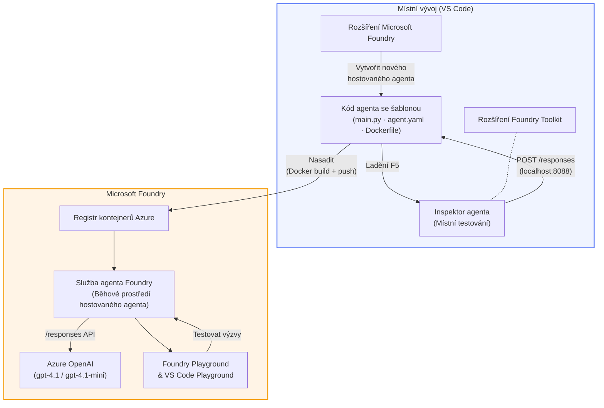

# Foundry Toolkit + Foundry Hosted Agents Workshop

[](https://www.python.org/)
[](https://github.com/microsoft/agents)
[](https://learn.microsoft.com/azure/ai-foundry/agents/concepts/hosted-agents/)
[](https://ai.azure.com/)
[](https://learn.microsoft.com/azure/ai-services/openai/)
[](https://learn.microsoft.com/cli/azure/install-azure-cli)
[](https://learn.microsoft.com/azure/developer/azure-developer-cli/install-azd)
[](https://www.docker.com/)
[](https://marketplace.visualstudio.com/items?itemName=ms-windows-ai-studio.windows-ai-studio)
[](LICENSE)

Vytvořte, otestujte a nasadte AI agenty do **Microsoft Foundry Agent Service** jako **Hosted Agents** – zcela z VS Code pomocí **Microsoft Foundry rozšíření** a **Foundry Toolkit**.

> **Hosted Agents jsou momentálně ve verzi preview.** Podporované regiony jsou omezené – viz [regionální dostupnost](https://learn.microsoft.com/azure/foundry/agents/concepts/hosted-agents#region-availability).

> Složka `agent/` uvnitř každé laboratoře je **automaticky generována** rozšířením Foundry – poté upravujete kód, testujete lokálně a nasazujete.

<!-- CO-OP TRANSLATOR LANGUAGES TABLE START -->
[Arabic](../ar/README.md) | [Bengali](../bn/README.md) | [Bulgarian](../bg/README.md) | [Burmese (Myanmar)](../my/README.md) | [Chinese (Simplified)](../zh-CN/README.md) | [Chinese (Traditional, Hong Kong)](../zh-HK/README.md) | [Chinese (Traditional, Macau)](../zh-MO/README.md) | [Chinese (Traditional, Taiwan)](../zh-TW/README.md) | [Croatian](../hr/README.md) | [Czech](./README.md) | [Danish](../da/README.md) | [Dutch](../nl/README.md) | [Estonian](../et/README.md) | [Finnish](../fi/README.md) | [French](../fr/README.md) | [German](../de/README.md) | [Greek](../el/README.md) | [Hebrew](../he/README.md) | [Hindi](../hi/README.md) | [Hungarian](../hu/README.md) | [Indonesian](../id/README.md) | [Italian](../it/README.md) | [Japanese](../ja/README.md) | [Kannada](../kn/README.md) | [Khmer](../km/README.md) | [Korean](../ko/README.md) | [Lithuanian](../lt/README.md) | [Malay](../ms/README.md) | [Malayalam](../ml/README.md) | [Marathi](../mr/README.md) | [Nepali](../ne/README.md) | [Nigerian Pidgin](../pcm/README.md) | [Norwegian](../no/README.md) | [Persian (Farsi)](../fa/README.md) | [Polish](../pl/README.md) | [Portuguese (Brazil)](../pt-BR/README.md) | [Portuguese (Portugal)](../pt-PT/README.md) | [Punjabi (Gurmukhi)](../pa/README.md) | [Romanian](../ro/README.md) | [Russian](../ru/README.md) | [Serbian (Cyrillic)](../sr/README.md) | [Slovak](../sk/README.md) | [Slovenian](../sl/README.md) | [Spanish](../es/README.md) | [Swahili](../sw/README.md) | [Swedish](../sv/README.md) | [Tagalog (Filipino)](../tl/README.md) | [Tamil](../ta/README.md) | [Telugu](../te/README.md) | [Thai](../th/README.md) | [Turkish](../tr/README.md) | [Ukrainian](../uk/README.md) | [Urdu](../ur/README.md) | [Vietnamese](../vi/README.md)

> **Raději klonovat lokálně?**
>
> Tento repozitář obsahuje přes 50 jazykových překladů, což značně zvětšuje velikost stažení. Pro klonování bez překladů použijte sparse checkout:
>
> **Bash / macOS / Linux:**
> ```bash
> git clone --filter=blob:none --sparse https://github.com/microsoft-foundry/Foundry_Toolkit_for_VSCode_Lab.git
> cd Foundry_Toolkit_for_VSCode_Lab
> git sparse-checkout set --no-cone '/*' '!translations' '!translated_images'
> ```
>
> **CMD (Windows):**
> ```cmd
> git clone --filter=blob:none --sparse https://github.com/microsoft-foundry/Foundry_Toolkit_for_VSCode_Lab.git
> cd Foundry_Toolkit_for_VSCode_Lab
> git sparse-checkout set --no-cone "/*" "!translations" "!translated_images"
> ```
>
> Toto vám dá všechno potřebné pro dokončení kurzu mnohem rychleji.
<!-- CO-OP TRANSLATOR LANGUAGES TABLE END -->

---

## Architektura


**Průběh:** Rozšíření Foundry vygeneruje agenta → upravíte kód a instrukce → otestujete lokálně s Agent Inspector → nasadíte do Foundry (Docker image pushnutý do ACR) → ověříte v Playground.

---

## Co budete vytvářet

| Laboratoř | Popis | Stav |
|-----|-------------|--------|
| **Laboratoř 01 - Jediný agent** | Vytvořte **"Explain Like I'm an Executive" agenta**, otestujte jej lokálně a nasaďte do Foundry | ✅ K dispozici |
| **Laboratoř 02 - Multi-Agent Workflow** | Vytvořte **"Resume → Job Fit Evaluator"** – 4 agenti spolupracují na hodnocení životopisu a sestavení vzdělávacího plánu | ✅ K dispozici |

---

## Seznamte se s Executive Agentem

V tomto workshopu si vytvoříte **"Explain Like I'm an Executive" agenta** – AI agenta, který vezme složitý technický žargon a přeloží ho do klidných shrnutí vhodných pro jednání ve vedení. Protože upřímně, nikdo v C-suite nechce slyšet o „vyčerpání vláknového poolu způsobeném synchronními voláními zavedenými ve verzi 3.2.“

Tento agent vznikl po příliš mnoha situacích, kdy můj perfektně připravený závěrečný rozbor vyvolal odpověď: *„Takže… web je nebo není mimo provoz?“*

### Jak to funguje

Dáte mu technickou aktualizaci. On vám vrátí exekutivní shrnutí – tři odrážky, žádný žargon, žádné stack trace, žádné existenční obavy. Jen **co se stalo**, **dopad na byznys** a **další krok**.

### Podívejte se, jak to funguje

**Vy říkáte:**
> „Latence API se zvýšila kvůli vyčerpání vláknového poolu způsobenému synchronními voláními zavedenými ve verzi 3.2.“

**Agent odpovídá:**

> **Exekutivní shrnutí:**
> - **Co se stalo:** Po posledním vydání systém zpomalil.
> - **Dopad na byznys:** Někteří uživatelé zažívali zpoždění při používání služby.
> - **Další krok:** Změna byla vrácena zpět a připravuje se oprava před novým nasazením.

### Proč tento agent?

Je to jednoduchý agent s jediným účelem – ideální pro naučení se workflow hosted agentů od začátku do konce, aniž byste se ztráceli v komplikovaných nástrojích. A upřímně? Každý engineering tým by mohl takového chtít.

---

## Struktura workshopu

```
📂 Foundry_Toolkit_for_VSCode_Lab/
├── 📄 README.md                      ← You are here
├── 📂 ExecutiveAgent/                ← Standalone hosted agent project
│   ├── agent.yaml
│   ├── Dockerfile
│   ├── main.py
│   └── requirements.txt
└── 📂 workshop/
    ├── 📂 lab01-single-agent/        ← Full lab: docs + agent code
    │   ├── README.md                 ← Hands-on lab instructions
    │   ├── 📂 docs/                  ← Step-by-step tutorial modules
    │   │   ├── 00-prerequisites.md
    │   │   ├── 01-install-foundry-toolkit.md
    │   │   ├── 02-create-foundry-project.md
    │   │   ├── 03-create-hosted-agent.md
    │   │   ├── 04-configure-and-code.md
    │   │   ├── 05-test-locally.md
    │   │   ├── 06-deploy-to-foundry.md
    │   │   ├── 07-verify-in-playground.md
    │   │   └── 08-troubleshooting.md
    │   └── 📂 agent/                 ← Reference solution (auto-scaffolded by Foundry extension)
    │       ├── agent.yaml
    │       ├── Dockerfile
    │       ├── main.py
    │       └── requirements.txt
    └── 📂 lab02-multi-agent/         ← Resume → Job Fit Evaluator
        ├── README.md                 ← Hands-on lab instructions (end-to-end)
        ├── 📂 docs/                  ← Step-by-step tutorial modules
        │   ├── 00-prerequisites.md
        │   ├── 01-understand-multi-agent.md
        │   ├── 02-scaffold-multi-agent.md
        │   ├── 03-configure-agents.md
        │   ├── 04-orchestration-patterns.md
        │   ├── 05-test-locally.md
        │   ├── 06-deploy-to-foundry.md
        │   ├── 07-verify-in-playground.md
        │   └── 08-troubleshooting.md
        └── 📂 PersonalCareerCopilot/ ← Reference solution (multi-agent workflow)
            ├── agent.yaml
            ├── Dockerfile
            ├── main.py
            └── requirements.txt
```

> **Poznámka:** Složka `agent/` uvnitř každé laboratoře je to, co **rozšíření Microsoft Foundry** vytvoří po spuštění příkazu `Microsoft Foundry: Create a New Hosted Agent` v Command Palette. Soubory pak upravujete s instrukcemi, nástroji a konfigurací vašeho agenta. Laboratoř 01 vás provede vytvářením od nuly.

---

## Začínáme

### 1. Klonujte repozitář

```bash
git clone https://github.com/microsoft-foundry/Foundry_Toolkit_for_VSCode_Lab.git
cd Foundry_Toolkit_for_VSCode_Lab
```

### 2. Nastavte si Python virtuální prostředí

```bash
python -m venv venv
```

Aktivujte ho:

- **Windows (PowerShell):**
  ```powershell
  .\venv\Scripts\Activate.ps1
  ```
- **macOS / Linux:**
  ```bash
  source venv/bin/activate
  ```

### 3. Nainstalujte závislosti

```bash
pip install -r workshop/lab01-single-agent/agent/requirements.txt
```

### 4. Nakonfigurujte proměnné prostředí

Zkopírujte příklad souboru `.env` ze složky agenta a doplňte své hodnoty:

```bash
cp workshop/lab01-single-agent/agent/.env.example workshop/lab01-single-agent/agent/.env
```

Upravte `workshop/lab01-single-agent/agent/.env`:

```env
AZURE_AI_PROJECT_ENDPOINT=https://<your-account>.services.ai.azure.com/api/projects/<your-project>
MODEL_DEPLOYMENT_NAME=<your-model-deployment-name>
```

### 5. Sledujte workshop laboratoře

Každá laboratoř je samostatná s vlastními moduly. Začněte **Laboratoří 01**, kde se naučíte základy, poté pokračujte na **Laboratoř 02** zaměřenou na multi-agent workflow.

#### Laboratoř 01 - Jediný agent ([plné instrukce](workshop/lab01-single-agent/README.md))

| # | Modul | Odkaz |
|---|--------|------|
| 1 | Přečtěte si předpoklady | [00-prerequisites.md](workshop/lab01-single-agent/docs/00-prerequisites.md) |
| 2 | Nainstalujte Foundry Toolkit & Foundry rozšíření | [01-install-foundry-toolkit.md](workshop/lab01-single-agent/docs/01-install-foundry-toolkit.md) |
| 3 | Vytvořte Foundry projekt | [02-create-foundry-project.md](workshop/lab01-single-agent/docs/02-create-foundry-project.md) |
| 4 | Vytvořte hosted agenta | [03-create-hosted-agent.md](workshop/lab01-single-agent/docs/03-create-hosted-agent.md) |
| 5 | Nakonfigurujte instrukce a prostředí | [04-configure-and-code.md](workshop/lab01-single-agent/docs/04-configure-and-code.md) |
| 6 | Testujte lokálně | [05-test-locally.md](workshop/lab01-single-agent/docs/05-test-locally.md) |
| 7 | Nasazení do Foundry | [06-deploy-to-foundry.md](workshop/lab01-single-agent/docs/06-deploy-to-foundry.md) |
| 8 | Ověření v playgroundu | [07-verify-in-playground.md](workshop/lab01-single-agent/docs/07-verify-in-playground.md) |
| 9 | Řešení problémů | [08-troubleshooting.md](workshop/lab01-single-agent/docs/08-troubleshooting.md) |

#### Laboratoř 02 - Multi-Agent Workflow ([plné instrukce](workshop/lab02-multi-agent/README.md))

| # | Modul | Odkaz |
|---|--------|------|
| 1 | Předpoklady (Laboratoř 02) | [00-prerequisites.md](workshop/lab02-multi-agent/docs/00-prerequisites.md) |
| 2 | Pochopení multi-agent architektury | [01-understand-multi-agent.md](workshop/lab02-multi-agent/docs/01-understand-multi-agent.md) |
| 3 | Generování multi-agent projektu | [02-scaffold-multi-agent.md](workshop/lab02-multi-agent/docs/02-scaffold-multi-agent.md) |
| 4 | Konfigurace agentů a prostředí | [03-configure-agents.md](workshop/lab02-multi-agent/docs/03-configure-agents.md) |
| 5 | Vzorce orchestrace | [04-orchestration-patterns.md](workshop/lab02-multi-agent/docs/04-orchestration-patterns.md) |
| 6 | Lokální test multi-agentů | [05-test-locally.md](workshop/lab02-multi-agent/docs/05-test-locally.md) |
| 7 | Nasazení do Foundry | [06-deploy-to-foundry.md](workshop/lab02-multi-agent/docs/06-deploy-to-foundry.md) |
| 8 | Ověření v playgroundu | [07-verify-in-playground.md](workshop/lab02-multi-agent/docs/07-verify-in-playground.md) |
| 9 | Řešení problémů (více agentů) | [08-troubleshooting.md](workshop/lab02-multi-agent/docs/08-troubleshooting.md) |

---

## Správce

<table>
<tr>
    <td align="center"><a href="https://github.com/ShivamGoyal03">
        <br />
        <sub><b>Shivam Goyal</b></sub>
    </a><br />
    </td>
</tr>
</table>

---

## Požadovaná oprávnění (rychlý přehled)

| Scénář | Požadované role |
|----------|---------------|
| Vytvoření nového projektu Foundry | **Azure AI Owner** na zdroji Foundry |
| Nasazení do existujícího projektu (nové zdroje) | **Azure AI Owner** + **Contributor** na odběru |
| Nasazení do plně nakonfigurovaného projektu | **Reader** na účtu + **Azure AI User** na projektu |

> **Důležité:** Role Azure `Owner` a `Contributor` obsahují pouze *správcovská* oprávnění, nikoliv oprávnění *vývojová* (akce s daty). K vytváření a nasazení agentů potřebujete **Azure AI User** nebo **Azure AI Owner**.

---

## Odkazy

- [Rychlý start: Nasazení vašeho prvního hostovaného agenta (VS Code)](https://learn.microsoft.com/azure/foundry/agents/quickstarts/quickstart-hosted-agent)
- [Co jsou hostovaní agenti?](https://learn.microsoft.com/azure/foundry/agents/concepts/hosted-agents)
- [Vytvoření pracovních postupů hostovaného agenta ve VS Code](https://learn.microsoft.com/azure/foundry/agents/how-to/vs-code-agents-workflow-pro-code)
- [Nasazení hostovaného agenta](https://learn.microsoft.com/azure/foundry/agents/how-to/deploy-hosted-agent)
- [RBAC pro Microsoft Foundry](https://learn.microsoft.com/azure/foundry/concepts/rbac-foundry)
- [Příklad agenta pro recenzi architektury](https://github.com/Azure-Samples/agent-architecture-review-sample) - Hostovaný agent z reálného světa s nástroji MCP, diagramy Excalidraw a duálním nasazením

---


## Licence

[MIT](../../LICENSE)

---

<!-- CO-OP TRANSLATOR DISCLAIMER START -->
**Upozornění**:  
Tento dokument byl přeložen pomocí AI překladatelské služby [Co-op Translator](https://github.com/Azure/co-op-translator). Ačkoliv usilujeme o přesnost, mějte prosím na paměti, že automatické překlady mohou obsahovat chyby nebo nepřesnosti. Originální dokument v jeho rodném jazyce by měl být považován za závazný zdroj. Pro kritické informace se doporučuje profesionální lidský překlad. Nejsme odpovědni za jakékoliv nedorozumění nebo nesprávné výklady vyplývající z použití tohoto překladu.
<!-- CO-OP TRANSLATOR DISCLAIMER END -->