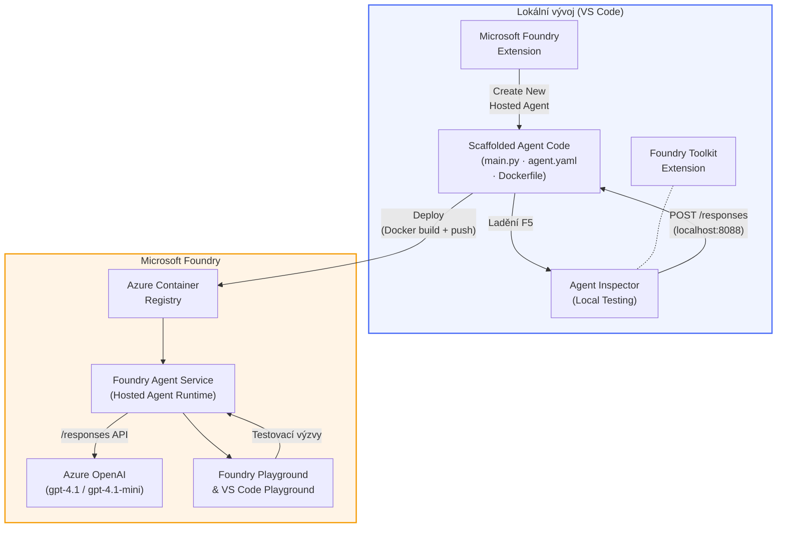

# Foundry Toolkit + Workshop pro Hosted Agents ve Foundry

[](https://www.python.org/)
[](https://github.com/microsoft/agents)
[](https://learn.microsoft.com/azure/foundry/agents/concepts/hosted-agents)
[](https://ai.azure.com/)
[](https://learn.microsoft.com/azure/ai-services/openai/)
[](https://learn.microsoft.com/cli/azure/install-azure-cli)
[](https://learn.microsoft.com/azure/developer/azure-developer-cli/install-azd)
[](https://www.docker.com/)
[](https://marketplace.visualstudio.com/items?itemName=ms-windows-ai-studio.windows-ai-studio)
[](LICENSE)

Vytvářejte, testujte a nasazujte AI agenty do **Microsoft Foundry Agent Service** jako **Hosted Agents** - vše přímo z VS Code pomocí **Microsoft Foundry rozšíření** a **Foundry Toolkit**.

> **Hosted Agents jsou momentálně ve fázi preview.** Podporované regiony jsou omezené - viz [dostupnost regionů](https://learn.microsoft.com/azure/foundry/agents/concepts/hosted-agents#region-availability).

> Složka `agent/` uvnitř každé laboratoře je **automaticky generována** Foundry rozšířením - poté upravujete kód, testujete lokálně a nasazujete.

### 🌐 Podpora více jazyků

#### Podpora přes GitHub Action (automatizované a vždy aktuální)

<!-- CO-OP TRANSLATOR LANGUAGES TABLE START -->
[Arabština](../ar/README.md) | [Bengálština](../bn/README.md) | [Bulharština](../bg/README.md) | [Barmština (Myanmar)](../my/README.md) | [Čínština (zjednodušená)](../zh-CN/README.md) | [Čínština (tradiční, Hong Kong)](../zh-HK/README.md) | [Čínština (tradiční, Macau)](../zh-MO/README.md) | [Čínština (tradiční, Taiwan)](../zh-TW/README.md) | [Chorvatština](../hr/README.md) | [Čeština](./README.md) | [Dánština](../da/README.md) | [Nizozemština](../nl/README.md) | [Estonština](../et/README.md) | [Finština](../fi/README.md) | [Francouzština](../fr/README.md) | [Němčina](../de/README.md) | [Řečtina](../el/README.md) | [Hebrejština](../he/README.md) | [Hindština](../hi/README.md) | [Maďarština](../hu/README.md) | [Indonéština](../id/README.md) | [Italština](../it/README.md) | [Japonština](../ja/README.md) | [Kandština](../kn/README.md) | [Khmerština](../km/README.md) | [Korejština](../ko/README.md) | [Litevština](../lt/README.md) | [Malajština](../ms/README.md) | [Malajalámština](../ml/README.md) | [Maráthština](../mr/README.md) | [Nepálština](../ne/README.md) | [Nigerijský pidžin](../pcm/README.md) | [Norština](../no/README.md) | [Perština (Fársí)](../fa/README.md) | [Polština](../pl/README.md) | [Portugalština (Brazílie)](../pt-BR/README.md) | [Portugalština (Portugalsko)](../pt-PT/README.md) | [Pandžábština (Gurmukhí)](../pa/README.md) | [Rumunština](../ro/README.md) | [Ruština](../ru/README.md) | [Srbština (cyrilice)](../sr/README.md) | [Slovenština](../sk/README.md) | [Slovinština](../sl/README.md) | [Španělština](../es/README.md) | [Svahilština](../sw/README.md) | [Švédština](../sv/README.md) | [Tagalog (Filipínština)](../tl/README.md) | [Tamilština](../ta/README.md) | [Telugština](../te/README.md) | [Thajština](../th/README.md) | [Turečtina](../tr/README.md) | [Ukrajinština](../uk/README.md) | [Urdština](../ur/README.md) | [Vietnamština](../vi/README.md)

> **Raději chcete klonovat lokálně?**
>
> Tento repozitář obsahuje přes 50 jazykových překladů, což výrazně zvyšuje velikost ke stažení. Pro klonování bez překladů použijte sparse checkout:
>
> **Bash / macOS / Linux:**
> ```bash
> git clone --filter=blob:none --sparse https://github.com/microsoft-foundry/Foundry_Toolkit_for_VSCode_Lab.git
> cd Foundry_Toolkit_for_VSCode_Lab
> git sparse-checkout set --no-cone '/*' '!translations' '!translated_images'
> ```
>
> **CMD (Windows):**
> ```cmd
> git clone --filter=blob:none --sparse https://github.com/microsoft-foundry/Foundry_Toolkit_for_VSCode_Lab.git
> cd Foundry_Toolkit_for_VSCode_Lab
> git sparse-checkout set --no-cone "/*" "!translations" "!translated_images"
> ```
>
> To vám poskytne vše potřebné pro dokončení kurzu s výrazně rychlejším stažením.
<!-- CO-OP TRANSLATOR LANGUAGES TABLE END -->

---

## Architektura


```mermaid
flowchart TB
    subgraph Local["Lokální vývoj (VS Code)"]
        direction TB
        FE["Microsoft Foundry
        Extension"]
        FoundryToolkit["Foundry Toolkit
        Extension"]
        Scaffold["Scaffolded Agent Code
        (main.py · agent.yaml · Dockerfile)"]
        Inspector["Agent Inspector
        (Local Testing)"]
        FE -- "Create New
        Hosted Agent" --> Scaffold
        Scaffold -- "Ladění F5" --> Inspector
        FoundryToolkit -.- Inspector
    end

    subgraph Cloud["Microsoft Foundry"]
        direction TB
        ACR["Azure Container
        Registry"]
        AgentService["Foundry Agent Service
        (Hosted Agent Runtime)"]
        Model["Azure OpenAI
        (gpt-4.1 / gpt-4.1-mini)"]
        Playground["Foundry Playground
        & VS Code Playground"]
        ACR --> AgentService
        AgentService -- "/responses API" --> Model
        AgentService --> Playground
    end

    Scaffold -- "Deploy
    (Docker build + push)" --> ACR
    Inspector -- "POST /responses
    (localhost:8088)" --> Scaffold
    Playground -- "Testovací výzvy" --> AgentService

    style Local fill:#f0f4ff,stroke:#4a6cf7,stroke-width:2px
    style Cloud fill:#fff4e6,stroke:#f59e0b,stroke-width:2px
```

**Tok:** Foundry rozšíření vygeneruje agenta → vy upravíte kód a instrukce → testujete lokálně s Agent Inspector → nasadíte do Foundry (Docker image se pushne do ACR) → ověříte v Playground.

---

## Co budete budovat

| Laboratoř | Popis | Stav |
|-----|-------------|--------|
| **Lab 01 - Jednotlivý agent** | Vytvořte **„Vysvětlení jako pro ředitele“ agenta**, otestujte lokálně a nasaďte do Foundry | ✅ K dispozici |
| **Lab 02 - Workflow s více agenty** | Vytvořte **„Hodnocení životopisu → vhodnost pro práci“** - 4 agenti spolupracují na skórování vhodnosti a vytvoření učební mapy | ✅ K dispozici |

---

## Poznejte Executive Agenta

V tomto workshopu vytvoříte **„Vysvětlení jako pro ředitele“ agenta** - AI agenta, který vezme složité technické výrazy a přeloží je do klidných, připravených, srozumitelných shrnutí pro představenstvo. Protože upřímně, nikdo v C-suitu nechce slyšet o „vyčerpání thread pool způsobeném synchronními voláními přidanými ve verzi 3.2.“

Tento agent vznikl po několika incidentech, kdy moje dokonale napsaná analýza příčin dostala odpověď: *„Takže... je webová stránka dole, nebo ne?“*

### Jak to funguje

Zadáte mu technickou aktualizaci. Vrátí vám výkonný souhrn - tři hlavní body, žádný žargon, žádné výpisy stack trace, žádné existenční obavy. Jen **co se stalo**, **dopad na byznys** a **další krok**.

### Podívejte se na to v akci

**Řeknete:**
> „API latency se zvýšila kvůli vyčerpání thread pool způsobenému synchronními voláními přidanými ve verzi 3.2.“

**Agent odpoví:**

> **Výkonný souhrn:**
> - **Co se stalo:** Po posledním vydání systém zpomalil.
> - **Dopad na byznys:** Někteří uživatelé zaznamenali zpoždění při používání služby.
> - **Další krok:** Změna byla vrácena zpět a připravuje se oprava před dalším nasazením.

### Proč právě tento agent?

Je to jednoduchý agent na jedno použití - ideální pro naučení workflow hostovaných agentů od začátku do konce bez složitých nástrojových řetězců. A upřímně? Každý engineering tým by takového mohl potřebovat.

---

## Struktura workshopu

```
📂 Foundry_Toolkit_for_VSCode_Lab/
├── 📄 README.md                      ← You are here
└── 📂 workshop/
    ├── 📂 lab01-single-agent/        ← Full lab: docs + agent code
    │   ├── README.md                 ← Hands-on lab instructions
    │   ├── 📂 docs/                  ← Step-by-step tutorial modules
    │   │   ├── 00-prerequisites.md
    │   │   ├── 01-setup.md
    │   │   ├── 02-create-hosted-agent.md
    │   │   ├── 03-configure-and-code.md
    │   │   ├── 04-test-locally.md
    │   │   ├── 05-deploy-to-foundry.md
    │   │   ├── 06-verify-in-playground.md
    │   │   ├── 07-summary.md
    │   │   └── 08-troubleshooting.md
    │   └── 📂 agent/                 ← Reference solution (auto-scaffolded by Foundry extension)
    │       ├── agent.yaml
    │       ├── Dockerfile
    │       ├── main.py
    │       └── requirements.txt
    └── 📂 lab02-multi-agent/         ← Resume → Job Fit Evaluator
        ├── README.md                 ← Hands-on lab instructions (end-to-end)
        ├── 📂 docs/                  ← Step-by-step tutorial modules
        │   ├── 00-prerequisites.md
        │   ├── 01-understand-multi-agent.md
        │   ├── 02-scaffold-multi-agent.md
        │   ├── 03-configure-agents.md
        │   ├── 04-orchestration-patterns.md
        │   ├── 05-test-locally.md
        │   ├── 06-deploy-to-foundry.md
        │   ├── 07-verify-in-playground.md
        │   └── 08-troubleshooting.md
        └── 📂 PersonalCareerCopilot/ ← Reference solution (multi-agent workflow)
            ├── agent.yaml
            ├── Dockerfile
            ├── main.py
            └── requirements.txt
```

> **Poznámka:** Složka `agent/` uvnitř každé laboratoře je to, co **Microsoft Foundry rozšíření** vygeneruje při spuštění příkazu `Microsoft Foundry: Create a New Hosted Agent` z Command Palette. Soubory se pak přizpůsobují podle instrukcí, nástrojů a konfigurace agenta. Lab 01 vás provede jak toto vytvořit od začátku.

---

## Začínáme

### 1. Naklonujte repozitář

```bash
git clone https://github.com/microsoft-foundry/Foundry_Toolkit_for_VSCode_Lab.git
cd Foundry_Toolkit_for_VSCode_Lab
```

### 2. Nastavte Python virtuální prostředí

```bash
python -m venv venv
```

Aktivujte ho:

- **Windows (PowerShell):**
  ```powershell
  .\venv\Scripts\Activate.ps1
  ```
- **macOS / Linux:**
  ```bash
  source venv/bin/activate
  ```

### 3. Nainstalujte závislosti

```bash
pip install -r workshop/lab01-single-agent/agent/requirements.txt
```

### 4. Nakonfigurujte proměnné prostředí

Zkopírujte příklad `.env` souboru do složky agenta a vyplňte své hodnoty:

```bash
cp workshop/lab01-single-agent/agent/.env.example workshop/lab01-single-agent/agent/.env
```

Upravte `workshop/lab01-single-agent/agent/.env`:

```env
AZURE_AI_PROJECT_ENDPOINT=https://<your-account>.services.ai.azure.com/api/projects/<your-project>
AZURE_AI_MODEL_DEPLOYMENT_NAME=<your-model-deployment-name>
```

### 5. Následujte laboratoře workshopu

Každá laboratoř je samostatná s vlastními moduly. Začněte s **Lab 01** pro naučení základů a pokračujte na **Lab 02** pro multifunkční workflow s více agenty.

#### Lab 01 - Jednotlivý agent ([plné instrukce](workshop/lab01-single-agent/README.md))

| # | Modul | Odkaz |
|---|--------|------|
| 1 | Přečtěte si požadavky | [00-prerequisites.md](workshop/lab01-single-agent/docs/00-prerequisites.md) |
| 2 | Nainstalujte Foundry Toolkit & Foundry rozšíření | [01-setup.md](workshop/lab01-single-agent/docs/01-setup.md) |
| 3 | Vytvořte Foundry projekt | [01-setup.md](workshop/lab01-single-agent/docs/01-setup.md) |
| 4 | Vytvořte hosted agenta | [02-create-hosted-agent.md](workshop/lab01-single-agent/docs/02-create-hosted-agent.md) |
| 5 | Nakonfigurujte instrukce & prostředí | [03-configure-and-code.md](workshop/lab01-single-agent/docs/03-configure-and-code.md) |
| 6 | Otestujte lokálně | [04-test-locally.md](workshop/lab01-single-agent/docs/04-test-locally.md) |
| 7 | Nasazení do Foundry | [05-deploy-to-foundry.md](workshop/lab01-single-agent/docs/05-deploy-to-foundry.md) |
| 8 | Ověření v playgroundu | [06-verify-in-playground.md](workshop/lab01-single-agent/docs/06-verify-in-playground.md) |
| 9 | Řešení problémů | [08-troubleshooting.md](workshop/lab01-single-agent/docs/08-troubleshooting.md) |

#### Lab 02 - Workflow s více agenty ([plné instrukce](workshop/lab02-multi-agent/README.md))

| # | Modul | Odkaz |
|---|--------|------|
| 1 | Požadavky (Lab 02) | [00-prerequisites.md](workshop/lab02-multi-agent/docs/00-prerequisites.md) |
| 2 | Pochopte architekturu multi-agentů | [01-understand-multi-agent.md](workshop/lab02-multi-agent/docs/01-understand-multi-agent.md) |
| 3 | Generujte multi-agent projekt | [02-scaffold-multi-agent.md](workshop/lab02-multi-agent/docs/02-scaffold-multi-agent.md) |
| 4 | Nakonfigurujte agenty & prostředí | [03-configure-agents.md](workshop/lab02-multi-agent/docs/03-configure-agents.md) |
| 5 | Vzorce orchestrace | [04-orchestration-patterns.md](workshop/lab02-multi-agent/docs/04-orchestration-patterns.md) |
| 6 | Testujte lokálně (multi-agent) | [05-test-locally.md](workshop/lab02-multi-agent/docs/05-test-locally.md) |

| 7 | Nasazení do Foundry | [06-deploy-to-foundry.md](workshop/lab02-multi-agent/docs/06-deploy-to-foundry.md) |
| 8 | Ověření v playgroundu | [07-verify-in-playground.md](workshop/lab02-multi-agent/docs/07-verify-in-playground.md) |
| 9 | Řešení problémů (multi-agent) | [08-troubleshooting.md](workshop/lab02-multi-agent/docs/08-troubleshooting.md) |

---

## Správce

<table>
<tr>
    <td align="center"><a href="https://github.com/ShivamGoyal03">
        <br />
        <sub><b>Shivam Goyal</b></sub>
    </a><br />
    </td>
</tr>
</table>

---

## Vyžadovaná oprávnění (rychlá reference)

| Scénář | Vyžadované role |
|----------|---------------|
| Vytvoření nového projektu Foundry | **Azure AI Owner** na Foundry zdroji |
| Nasazení do existujícího projektu (nové zdroje) | **Azure AI Owner** + **Přispěvatel** na subscription |
| Nasazení do plně nakonfigurovaného projektu | **Čtenář** na účtu + **Azure AI User** na projektu |

> **Důležité:** Role Azure `Owner` a `Contributor` zahrnují pouze *správcovská* oprávnění, nikoliv *vývojová* (akce s daty). Pro vytváření a nasazení agentů potřebujete **Azure AI User** nebo **Azure AI Owner**.

---

## Reference

- [Rychlý start: Nasazení vašeho prvního hostovaného agenta (VS Code)](https://learn.microsoft.com/azure/foundry/agents/quickstarts/quickstart-hosted-agent)
- [Co jsou hostovaní agenti?](https://learn.microsoft.com/azure/foundry/agents/concepts/hosted-agents)
- [Vytváření pracovních postupů hostovaných agentů ve VS Code](https://learn.microsoft.com/azure/foundry/agents/how-to/vs-code-agents-workflow-pro-code)
- [Nasazení hostovaného agenta](https://learn.microsoft.com/azure/foundry/agents/how-to/deploy-hosted-agent)
- [RBAC pro Microsoft Foundry](https://learn.microsoft.com/azure/foundry/concepts/rbac-foundry)
- [Příklad architektonického recenzního agenta](https://github.com/Azure-Samples/agent-architecture-review-sample) - Reálný hostovaný agent s nástroji MCP, diagramy Excalidraw a dvojím nasazením

---


## Licence

[MIT](../../LICENSE)

---

<!-- CO-OP TRANSLATOR DISCLAIMER START -->
**Prohlášení o omezení odpovědnosti**:
Tento dokument byl přeložen pomocí AI překladatelské služby [Co-op Translator](https://github.com/Azure/co-op-translator). Přestože usilujeme o co největší přesnost, mějte prosím na paměti, že automatizované překlady mohou obsahovat chyby nebo nepřesnosti. Originální dokument v jeho mateřském jazyce by měl být považován za autoritativní zdroj. Pro kritické informace se doporučuje profesionální lidský překlad. Nejsme odpovědní za jakékoli nedorozumění nebo nesprávné interpretace vzniklé použitím tohoto překladu.
<!-- CO-OP TRANSLATOR DISCLAIMER END -->