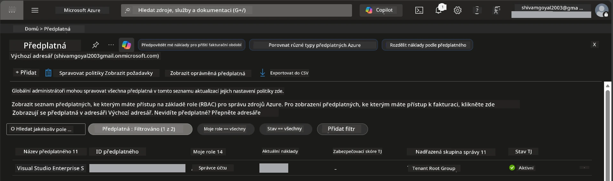

# Modul 0 - Požadavky

Před zahájením workshopu ověřte, že máte připraveny následující nástroje, přístupy a prostředí. Postupujte podle každého kroku níže - nepřeskakujte.

---

## 1. Azure účet a předplatné

### 1.1 Vytvoření nebo ověření předplatného Azure

1. Otevřete prohlížeč a přejděte na [https://azure.microsoft.com/free/](https://azure.microsoft.com/free/).
2. Pokud nemáte účet Azure, klikněte na **Start free** a postupujte podle postupu registrace. Budete potřebovat účet Microsoft (nebo si jej vytvořit) a kreditní kartu pro ověření identity.
3. Pokud účet již máte, přihlaste se na [https://portal.azure.com](https://portal.azure.com).
4. V Portálu klikněte na **Subscriptions** v levém navigačním menu (nebo vyhledejte "Subscriptions" v horním vyhledávacím panelu).
5. Ověřte, že vidíte alespoň jedno **Active** předplatné. Poznamenejte si **Subscription ID** – později ho budete potřebovat.



### 1.2 Pochopení požadovaných RBAC rolí

Nasazení [Hosted Agent](https://learn.microsoft.com/azure/foundry/agents/concepts/hosted-agents) vyžaduje oprávnění pro **datové akce**, která standardní role Azure `Owner` a `Contributor` **nezahrnují**. Budete potřebovat jednu z těchto [kombinací rolí](https://learn.microsoft.com/azure/foundry/concepts/rbac-foundry#built-in-roles):

| Scénář | Požadované role | Kde je přiřadit |
|----------|---------------|----------------------|
| Vytvoření nového Foundry projektu | **Azure AI Owner** na Foundry resource | Foundry resource v Azure Portalu |
| Nasazení do existujícího projektu (nové zdroje) | **Azure AI Owner** + **Contributor** na předplatném | Předplatné + Foundry resource |
| Nasazení do plně nakonfigurovaného projektu | **Reader** na účtu + **Azure AI User** na projektu | Účet + Projekt v Azure Portalu |

> **Klíčové:** Role `Owner` a `Contributor` v Azure pokrývají pouze *správcovská* oprávnění (operace ARM). Pro *datové akce* jako `agents/write`, které jsou potřeba k vytvoření a nasazení agentů, potřebujete [**Azure AI User**](https://learn.microsoft.com/azure/foundry/concepts/rbac-foundry#built-in-roles) (nebo vyšší). Tyto role přiřadíte v [Modulu 2](02-create-foundry-project.md).

---

## 2. Instalace lokálních nástrojů

Nainstalujte níže uvedené nástroje. Po instalaci ověřte, že fungují spuštěním kontrolního příkazu.

### 2.1 Visual Studio Code

1. Přejděte na [https://code.visualstudio.com/](https://code.visualstudio.com/).
2. Stáhněte instalační program pro svůj operační systém (Windows/macOS/Linux).
3. Spusťte instalátor s výchozím nastavením.
4. Otevřete VS Code a ověřte, že se spustil.

### 2.2 Python 3.10+

1. Přejděte na [https://www.python.org/downloads/](https://www.python.org/downloads/).
2. Stáhněte Python verze 3.10 nebo novější (doporučujeme 3.12+).
3. **Windows:** Během instalace zatrhněte **"Add Python to PATH"** na první obrazovce.
4. Otevřete terminál a ověřte:

   ```powershell
   python --version
   ```

   Očekávaný výstup: `Python 3.10.x` nebo vyšší.

### 2.3 Azure CLI

1. Přejděte na [https://learn.microsoft.com/cli/azure/install-azure-cli](https://learn.microsoft.com/cli/azure/install-azure-cli).
2. Postupujte podle instalačních pokynů pro váš operační systém.
3. Ověřte:

   ```powershell
   az --version
   ```

   Očekávané: `azure-cli 2.80.0` nebo vyšší.

4. Přihlaste se:

   ```powershell
   az login
   ```

### 2.4 Azure Developer CLI (azd)

1. Přejděte na [https://learn.microsoft.com/azure/developer/azure-developer-cli/install-azd](https://learn.microsoft.com/azure/developer/azure-developer-cli/install-azd).
2. Postupujte podle instalačních pokynů pro váš OS. Na Windows:

   ```powershell
   winget install microsoft.azd
   ```

3. Ověřte:

   ```powershell
   azd version
   ```

   Očekávané: `azd version 1.x.x` nebo vyšší.

4. Přihlaste se:

   ```powershell
   azd auth login
   ```

### 2.5 Docker Desktop (volitelné)

Docker je potřeba jen v případě, že chcete lokálně sestavit a otestovat kontejnerový obraz před nasazením. Rozšíření Foundry řeší sestavení kontejneru během nasazení automaticky.

1. Přejděte na [https://docs.docker.com/get-docker/](https://docs.docker.com/get-docker/).
2. Stáhněte a nainstalujte Docker Desktop pro svůj operační systém.
3. **Windows:** Zajistěte, aby během instalace bylo vybráno jádro WSL 2.
4. Spusťte Docker Desktop a počkejte, až se v systémové liště zobrazí ikona s textem **"Docker Desktop is running"**.
5. Otevřete terminál a ověřte:

   ```powershell
   docker info
   ```

   Mělo by se vytisknout systémové info Dockeru bez chyb. Pokud vidíte `Cannot connect to the Docker daemon`, počkejte ještě několik sekund, než se Docker plně spustí.

---

## 3. Instalace rozšíření pro VS Code

Potřebujete tři rozšíření. Nainstalujte je **před** zahájením workshopu.

### 3.1 Microsoft Foundry pro VS Code

1. Otevřete VS Code.
2. Stiskněte `Ctrl+Shift+X` pro otevření panelu rozšíření.
3. Do vyhledávacího pole napište **"Microsoft Foundry"**.
4. Najděte **Microsoft Foundry for Visual Studio Code** (vydavatel: Microsoft, ID: `TeamsDevApp.vscode-ai-foundry`).
5. Klikněte na **Install**.
6. Po instalaci by se v Aktivita liště (levý panel) měla objevit ikona **Microsoft Foundry**.

### 3.2 Foundry Toolkit

1. V panelu rozšíření (`Ctrl+Shift+X`) vyhledejte **"Foundry Toolkit"**.
2. Najděte **Foundry Toolkit** (vydavatel: Microsoft, ID: `ms-windows-ai-studio.windows-ai-studio`).
3. Klikněte na **Install**.
4. Ikona **Foundry Toolkit** by se měla zobrazit v Aktivita liště.

### 3.3 Python

1. V panelu rozšíření vyhledejte **"Python"**.
2. Najděte **Python** (vydavatel: Microsoft, ID: `ms-python.python`).
3. Klikněte na **Install**.

---

## 4. Přihlášení do Azure z VS Code

[Rámec Microsoft Agent Framework](https://learn.microsoft.com/agent-framework/overview/) používá [`DefaultAzureCredential`](https://learn.microsoft.com/azure/developer/python/sdk/authentication/credential-chains#defaultazurecredential-overview) pro autentizaci. Musíte být přihlášeni do Azure ve VS Code.

### 4.1 Přihlášení přes VS Code

1. V levém dolním rohu VS Code klikněte na ikonu **Accounts** (siloueta osoby).
2. Klikněte na **Sign in to use Microsoft Foundry** (nebo **Sign in with Azure**).
3. Otevře se okno prohlížeče – přihlaste se pomocí Azure účtu, který má přístup k vašemu předplatnému.
4. Vraťte se do VS Code. Měli byste vidět název svého účtu v levém dolním rohu.

### 4.2 (Volitelné) Přihlášení přes Azure CLI

Pokud jste nainstalovali Azure CLI a preferujete autentizaci z příkazové řádky:

```powershell
az login
```

Tím se otevře prohlížeč k přihlášení. Po přihlášení nastavte správné předplatné:

```powershell
az account set --subscription "<your-subscription-id>"
```

Ověřte:

```powershell
az account show --query "{name:name, id:id, state:state}" --output table
```

Měli byste vidět název, ID a stav předplatného = `Enabled`.

### 4.3 (Alternativa) Autentizace pomocí service principal

Pro CI/CD nebo sdílená prostředí nastavte místo toho tyto proměnné prostředí:

```powershell
$env:AZURE_TENANT_ID = "<your-tenant-id>"
$env:AZURE_CLIENT_ID = "<your-client-id>"
$env:AZURE_CLIENT_SECRET = "<your-client-secret>"
```

---

## 5. Omezení preview verze

Před pokračováním si uvědomte aktuální omezení:

- [**Hosted Agents**](https://learn.microsoft.com/azure/foundry/agents/concepts/hosted-agents) jsou zatím v **public preview** – nedoporučuje se pro produkční nasazení.
- **Podporované regiony jsou omezené** – zkontrolujte [dostupnost regionů](https://learn.microsoft.com/azure/foundry/agents/concepts/hosted-agents#region-availability) před vytvořením zdrojů. Pokud zvolíte nepodporovaný region, nasazení selže.
- Balíček `azure-ai-agentserver-agentframework` je ve stavu pre-release (`1.0.0b16`) – API se mohou měnit.
- Limity škálování: hosted agenti podporují 0-5 replik (včetně škálování na nulu).

---

## 6. Kontrolní seznam před začátkem

Projďte si všechny body níže. Pokud některý krok selže, vraťte se a opravte jej před pokračováním.

- [ ] VS Code se otevírá bez chyb
- [ ] Python 3.10+ je v PATH (`python --version` vypíše `3.10.x` nebo vyšší)
- [ ] Azure CLI je nainstalované (`az --version` vypíše verzi `2.80.0` nebo vyšší)
- [ ] Azure Developer CLI je nainstalované (`azd version` vypíše informace o verzi)
- [ ] Rozšíření Microsoft Foundry je nainstalováno (ikona viditelná v Aktivita liště)
- [ ] Rozšíření Foundry Toolkit je nainstalováno (ikona viditelná v Aktivita liště)
- [ ] Rozšíření Python je nainstalováno
- [ ] Jste přihlášeni do Azure ve VS Code (zkontrolujte ikonu účtů v levém dolním rohu)
- [ ] `az account show` vrací vaše předplatné
- [ ] (Volitelné) Docker Desktop běží (`docker info` vrací systémové info bez chyb)

### Kontrolní bod

Otevřete Aktivita lištu ve VS Code a ověřte, že vidíte zobrazení bočního panelu **Foundry Toolkit** i **Microsoft Foundry**. Klikněte na každé z nich a zkontrolujte, že se načítají bez chyb.

---

**Další:** [01 - Install Foundry Toolkit & Foundry Extension →](01-install-foundry-toolkit.md)

---

<!-- CO-OP TRANSLATOR DISCLAIMER START -->
**Vymezení odpovědnosti**:  
Tento dokument byl přeložen pomocí AI překladatelské služby [Co-op Translator](https://github.com/Azure/co-op-translator). Přestože usilujeme o přesnost, mějte prosím na paměti, že automatické překlady mohou obsahovat chyby nebo nepřesnosti. Originální dokument v jeho mateřském jazyce by měl být považován za autoritativní zdroj. Pro kritické informace se doporučuje profesionální lidský překlad. Nejsme odpovědní za jakékoliv nedorozumění nebo mylné výklady vyplývající z použití tohoto překladu.
<!-- CO-OP TRANSLATOR DISCLAIMER END -->