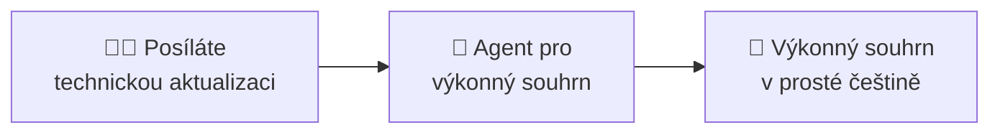

# Modul 0 - Úvod

⏱️ ~10 min

> [!WARNING]
> **Náhled a omezení:** [Hostovaní agenti](https://learn.microsoft.com/azure/foundry/agents/concepts/hosted-agents) jsou aktuálně ve **veřejném náhledu** - nedoporučuje se pro produkční zátěže. Mějte na paměti následující:
> - **Podporované regiony jsou omezené** - před vytvořením zdrojů zkontrolujte [dostupnost regionu](https://learn.microsoft.com/azure/foundry/agents/concepts/hosted-agents#region-availability). Pokud zvolíte nepodporovaný region, nasazení selže.
> - Balíček `azure-ai-agentserver-agentframework` je ve fázi předběžného vydání - API se může mezi verzemi měnit.
> - Limity škálování: hostovaní agenti podporují 0–5 replik (včetně škálování na nulu).
> - Některé funkce zobrazené v tomto workshopu se mohou změnit, jak se služba bude posouvat směrem k obecnému dostupnosti.

## Co vybudujete

V tomto workshopu vybudujete agenta **"Vysvětli to jako pro vedení"** - hostovaného AI agenta, který vezme složité technické aktualizace a přepíše je do výstižných výtažků v běžné angličtině pro vedení.

```mermaid
flowchart LR
    A["🧑‍💻 Posíláte\ntechnickou aktualizaci"] --> B["🤖 Agent pro\nvýkonný souhrn"]
    B --> C["📝 Výkonný souhrn\nv prosté češtině"]
```

**Agent využívá:**
- **Microsoft Agent Framework** - pro logiku a strukturu agenta
- **Foundry Toolkit pro VS Code** - pro vytváření, lokální testování a nasazení
- **AI model** (např. `gpt-4.1-mini/gpt-5-mini`) - k generování souhrnů

Na konci tohoto modulu budete mít funkčního agenta, kterého můžete otestovat lokálně přes Agent Inspector, a volitelně nasadit do cloudu.

---

## Co jsou hostovaní agenti?

**Hostovaný agent** je AI agent běžící jako spravovaná služba v Microsoft Foundry. Místo správy vlastní infrastruktury balíte kód agenta do kontejneru a Foundry se stará o škálování, hosting a zpřístupnění přes standardní HTTP endpoint.

| Koncept | Co znamená |
|---------|--------------|
| **Agent** | Váš Python kód, který přijímá zprávu uživatele, volá AI model a vrací strukturovanou odpověď |
| **Hostovaný** | Foundry spouští váš kontejner za vás - žádné VM, Kubernetes ani správa infrastruktury |
| **Protokol odpovědí** | Standardní HTTP API (`POST /responses`), které může použít libovolný klient pro komunikaci s agentem |
| **Agent Inspector** | Lokální testovací UI (součást Foundry Toolkit), které vám umožňuje chatovat s agentem před nasazením |

V tomto workshopu přejdete od nuly až k plně hostovanému agentovi - nebo můžete zůstat u lokálního testování.

---

## Vyberte si cestu

> ⚠️ **Vyberte si jednu cestu před pokračováním.** Váš výběr určí, které nástroje nainstalujete a které moduly budete následovat. Z cesty B → cesta A můžete později přejít, pokud získáte předplatné.

<strong>🅰️ Cesta A - Azure cloud (vyžaduje Azure předplatné)</strong>

| | Podrobnosti |
|---|---|
| **Pro koho je?** | Máte aktivní předplatné Azure a můžete vytvářet Foundry zdroje |
| **Model** | Azure OpenAI přes Foundry (např. `gpt-4.1-mini/gpt-5-mini`) |
| **Pokryté moduly** | Všechny moduly (00–07) |
| **Nasazení do cloudu?** | ✅ Ano - plné end-to-end nasazení |

<strong>🅱️ Cesta B - Lokální / free-tier (nevyžaduje Azure předplatné)</strong>

| | Podrobnosti |
|---|---|
| **Pro koho je?** | MVP, studenti nebo kdokoliv bez přístupu k Azure |
| **Model** | **Foundry Local** (zdarma, běží na vašem počítači) |
| **Pokryté moduly** | Moduly 00–04 (vynechat nasazení a ověření v cloudu) |
| **Nasazení do cloudu?** | ❌ Ne - pouze lokální testování přes Agent Inspector |

---

## Všechny cesty: Požadované nástroje

Nainstalujte každý nástroj níže. Po instalaci ověřte, že funguje spuštěním kontrolního příkazu.

| # | Nástroj | Verze | Instalace | Ověření (očekávaný výstup) |
|---|------|---------|---------|---------------------------|
| 1 | **Visual Studio Code** | Nejnovější | [code.visualstudio.com](https://code.visualstudio.com/) | Otevře se bez chyb |
| 2 | **Python** | 3.12 nebo vyšší| [python.org/downloads](https://www.python.org/downloads/) | `python --version` $\rightarrow$ `Python 3.12.x` |
| 3 | **Foundry Toolkit pro VS Code** | Nejnovější | Extension ID: `ms-windows-ai-studio.windows-ai-studio` | Ikona Foundry v Activity Baru |
| 4 | **Python rozšíření pro VS Code** | Nejnovější | Extension ID: `ms-python.python` | Nainstalováno v panelu rozšíření |

> [!TIP]
> **Tipy pro instalaci:**
> - **Python PATH (Windows):** Vždy zaškrtněte **"Add Python to PATH"** v první obrazovce instalátoru Pythonu. Bez toho nebude příkaz `python` v terminálu rozpoznán.
> - **Více verzí Pythonu:** Pokud máte nainstalované verze Python 3.10 i 3.12, použijte `python3.12 -m venv .venv` pro správné vytvoření virtuálního prostředí s požadovanou verzí.
> - **Docker WSL 2 (Windows):** Při instalaci Docker Desktopu se ujistěte, že je vybrán **WSL 2 backend**. Docker s Hyper-V je pomalejší a může způsobovat problémy s buildy Foundry kontejnerů.
> - **Docker se nespouští?** Po spuštění Docker Desktop počkejte 30–60 sekund. Spusťte `docker info` - pokud vidíte "Cannot connect to the Docker daemon," Docker se ještě inicializuje.
> - **Rozšíření VS Code se nenačítají?** Po instalaci rozšíření znovu načtěte okno: `Ctrl+Shift+P` → `Developer: Reload Window`.

> **Uživatelé Windows:** Při instalaci Pythonu zaškrtněte **"Add Python to PATH"**.

**Další:** [01 - Nastavení →](01-setup.md)

---

<!-- CO-OP TRANSLATOR DISCLAIMER START -->
**Prohlášení o omezení odpovědnosti**:
Tento dokument byl přeložen pomocí AI překladatelské služby [Co-op Translator](https://github.com/Azure/co-op-translator). Přestože usilujeme o co největší přesnost, mějte prosím na paměti, že automatizované překlady mohou obsahovat chyby nebo nepřesnosti. Originální dokument v jeho mateřském jazyce by měl být považován za autoritativní zdroj. Pro kritické informace se doporučuje profesionální lidský překlad. Nejsme odpovědní za jakékoli nedorozumění nebo nesprávné interpretace vzniklé použitím tohoto překladu.
<!-- CO-OP TRANSLATOR DISCLAIMER END -->