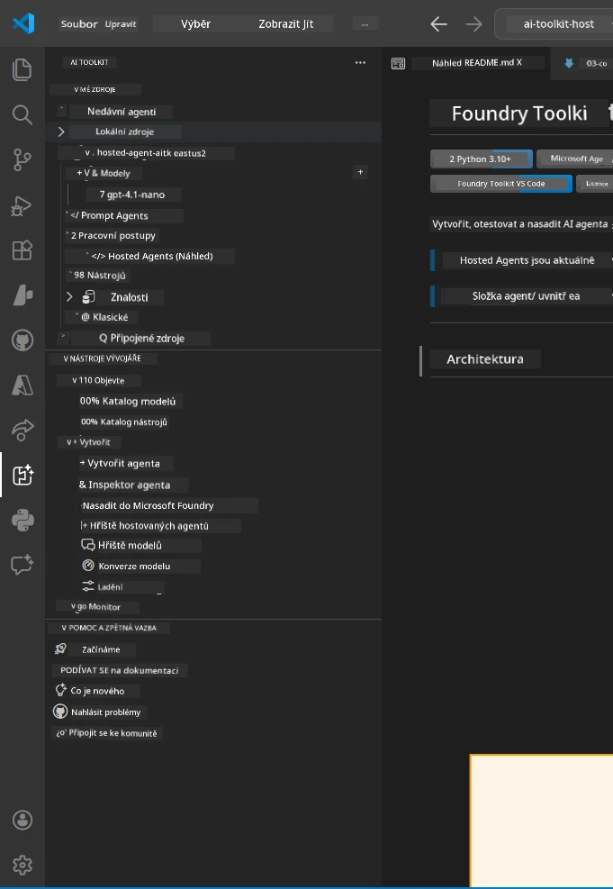
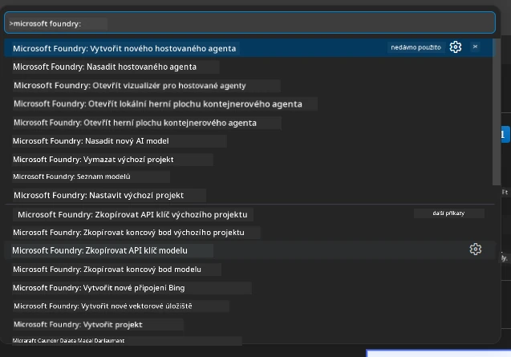

# Modul 1 - Instalace Foundry Toolkit a Foundry Extension

Tento modul vás provede instalací a ověřením dvou klíčových rozšíření VS Code pro tento workshop. Pokud jste je již nainstalovali během [Modulu 0](00-prerequisites.md), použijte tento modul k ověření, zda fungují správně.

---

## Krok 1: Instalace Microsoft Foundry rozšíření

Rozšíření **Microsoft Foundry for VS Code** je váš hlavní nástroj pro vytváření Foundry projektů, nasazování modelů, generování hostovaných agentů a nasazování přímo z VS Code.

1. Otevřete VS Code.
2. Stiskněte `Ctrl+Shift+X` pro otevření panelu **Extensions**.
3. Do vyhledávacího pole nahoře napište: **Microsoft Foundry**
4. Najděte výsledek s názvem **Microsoft Foundry for Visual Studio Code**.
   - Vydavatel: **Microsoft**
   - Extension ID: `TeamsDevApp.vscode-ai-foundry`
5. Klikněte na tlačítko **Install**.
6. Počkejte, až instalace dokončí (uvidíte malý indikátor průběhu).
7. Po instalaci se podívejte na **Activity Bar** (vertikální panel ikon vlevo ve VS Code). Měl by se zobrazit nový **Microsoft Foundry** ikona (vypadá jako diamant/AI ikona).
8. Klikněte na ikonu **Microsoft Foundry**, čímž se otevře panel postranní lišty. Měli byste vidět sekce:
   - **Resources** (nebo Projekty)
   - **Agents**
   - **Models**

> **Pokud se ikona nezobrazí:** Zkuste VS Code znovu načíst (`Ctrl+Shift+P` → `Developer: Reload Window`).

---

## Krok 2: Instalace Foundry Toolkit rozšíření

Rozšíření **Foundry Toolkit** poskytuje [**Agent Inspector**](https://learn.microsoft.com/azure/foundry/agents/how-to/vs-code-agents-workflow-pro-code) – vizuální rozhraní pro testování a ladění agentů lokálně – plus nástroje pro playground, správu modelů a vyhodnocování.

1. V panelu Extensions (`Ctrl+Shift+X`) vyčistěte vyhledávací pole a napište: **Foundry Toolkit**
2. Najděte v výsledcích **Foundry Toolkit**.
   - Vydavatel: **Microsoft**
   - Extension ID: `ms-windows-ai-studio.windows-ai-studio`
3. Klikněte na **Install**.
4. Po instalaci se v Activity Bar objeví ikona **Foundry Toolkit** (vypadá jako ikonka robota/jiskry).
5. Klikněte na ikonu **Foundry Toolkit**, čímž se otevře jeho panel postranní lišty. Měli byste vidět úvodní obrazovku Foundry Toolkit s možnostmi:
   - **Models**
   - **Playground**
   - **Agents**

---

## Krok 3: Ověření, že obě rozšíření fungují

### 3.1 Ověření Microsoft Foundry Extension

1. Klikněte na ikonu **Microsoft Foundry** v Activity Bar.
2. Pokud jste přihlášeni do Azure (z Modulu 0), měli byste vidět své projekty v sekci **Resources**.
3. Pokud budete vyzváni k přihlášení, klikněte na **Sign in** a dokončete autentizaci.
4. Potvrďte, že vidíte panel bez chyb.

### 3.2 Ověření Foundry Toolkit Extension

1. Klikněte na ikonu **Foundry Toolkit** v Activity Bar.
2. Potvrďte, že se zobrazí uvítací obrazovka nebo hlavní panel bez chyb.
3. Nic nemusíte zatím konfigurovat – Agent Inspector použijeme v [Modulu 5](05-test-locally.md).

### 3.3 Ověření přes Command Palette

1. Stiskněte `Ctrl+Shift+P` pro otevření Command Palette.
2. Napište **"Microsoft Foundry"** – měli byste vidět příkazy jako:
   - `Microsoft Foundry: Create a New Hosted Agent`
   - `Microsoft Foundry: Deploy Hosted Agent`
   - `Microsoft Foundry: Open Model Catalog`
3. Stiskněte `Escape` pro zavření Command Palette.
4. Otevřete znovu Command Palette a napište **"Foundry Toolkit"** – měli byste vidět příkazy jako:
   - `Foundry Toolkit: Open Agent Inspector`

> Pokud tyto příkazy nevidíte, rozšíření nemusí být správně nainstalována. Zkuste je odinstalovat a znovu nainstalovat.

---

## K čemu tyto rozšíření slouží v tomto workshopu

| Rozšíření | Co dělá | Kdy ho použijete |
|-----------|---------|------------------|
| **Microsoft Foundry for VS Code** | Vytváří Foundry projekty, nasazuje modely, **generuje [hostované agenty](https://learn.microsoft.com/azure/foundry/agents/concepts/hosted-agents)** (automaticky vytváří `agent.yaml`, `main.py`, `Dockerfile`, `requirements.txt`), nasazení na [Foundry Agent Service](https://learn.microsoft.com/azure/foundry/agents/overview) | Moduly 2, 3, 6, 7 |
| **Foundry Toolkit** | Agent Inspector pro lokální testování a ladění, uživatelské rozhraní playgroundu, správa modelů | Moduly 5, 7 |

> **Foundry rozšíření je nejdůležitějším nástrojem v tomto workshopu.** Řídí celý životní cyklus: vytvoření → konfigurace → nasazení → ověření. Foundry Toolkit ho doplňuje vizuálním Agent Inspectorem pro lokální testování.

---

### Kontrolní bod

- [ ] Ikona Microsoft Foundry je viditelná v Activity Bar
- [ ] Po kliknutí se otevře panel bez chyb
- [ ] Ikona Foundry Toolkit je viditelná v Activity Bar
- [ ] Po kliknutí se otevře panel bez chyb
- [ ] `Ctrl+Shift+P` → při psaní "Microsoft Foundry" se zobrazují dostupné příkazy
- [ ] `Ctrl+Shift+P` → při psaní "Foundry Toolkit" se zobrazují dostupné příkazy

---

**Předchozí:** [00 - Prerequisites](00-prerequisites.md) · **Další:** [02 - Create Foundry Project →](02-create-foundry-project.md)

---

<!-- CO-OP TRANSLATOR DISCLAIMER START -->
**Upozornění**:
Tento dokument byl přeložen pomocí AI překladatelské služby [Co-op Translator](https://github.com/Azure/co-op-translator). I když usilujeme o přesnost, mějte prosím na paměti, že automatické překlady mohou obsahovat chyby nebo nepřesnosti. Originální dokument v jeho rodném jazyce by měl být považován za autoritativní zdroj. Pro kritické informace se doporučuje profesionální lidský překlad. Nejsme odpovědní za žádné nedorozumění nebo nesprávné interpretace vzniklé z používání tohoto překladu.
<!-- CO-OP TRANSLATOR DISCLAIMER END -->