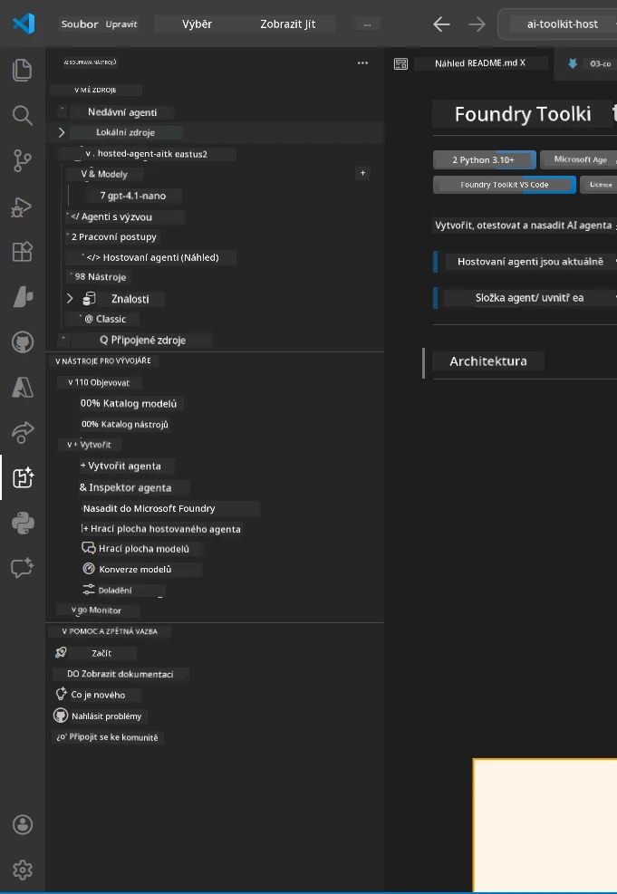
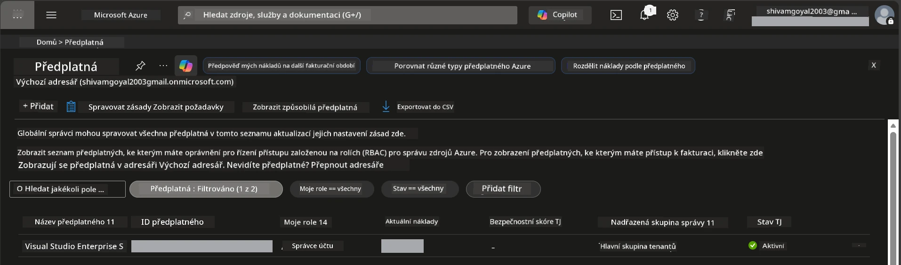
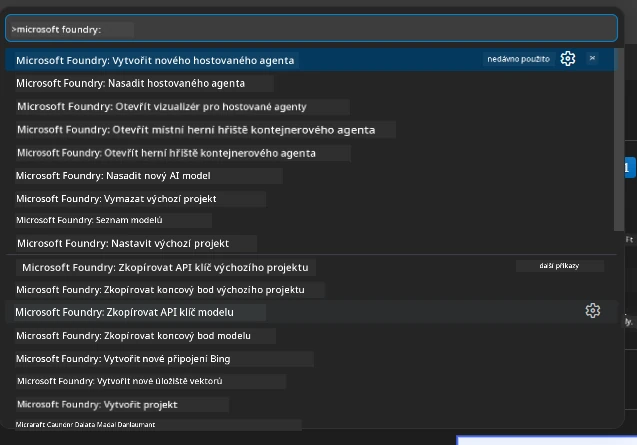
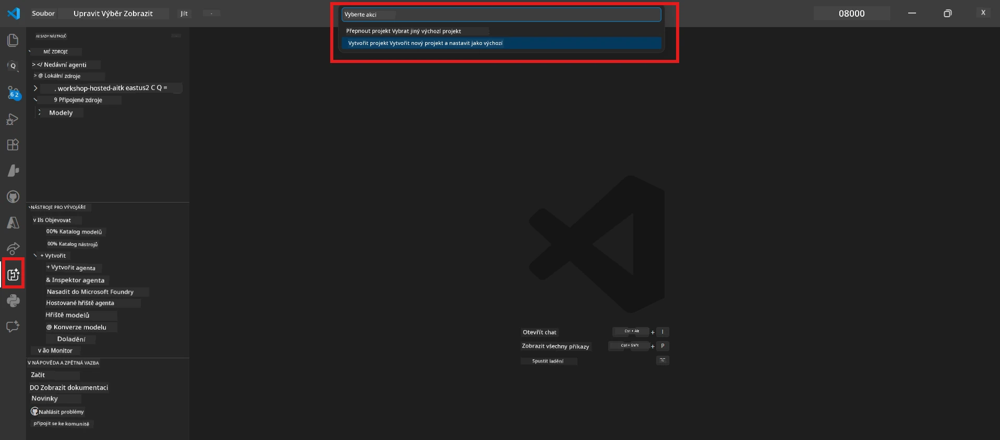
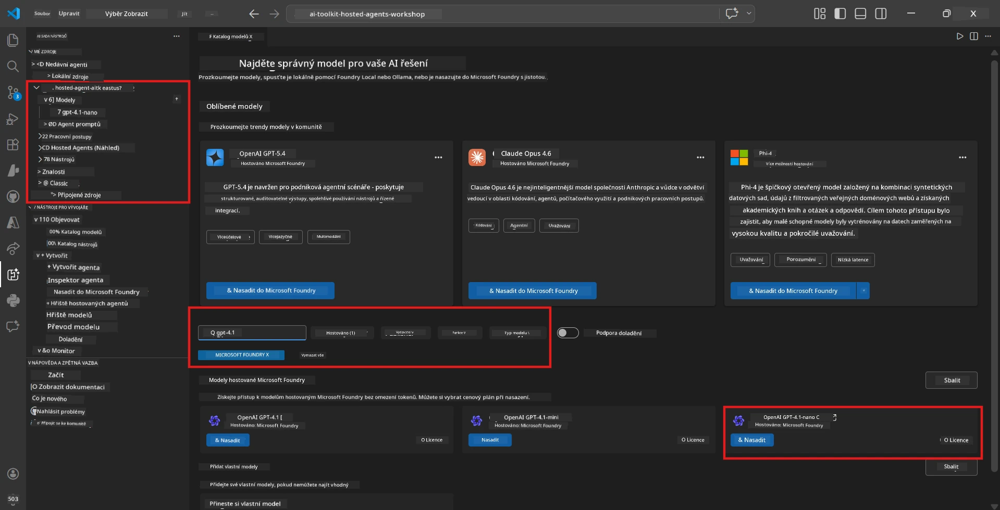
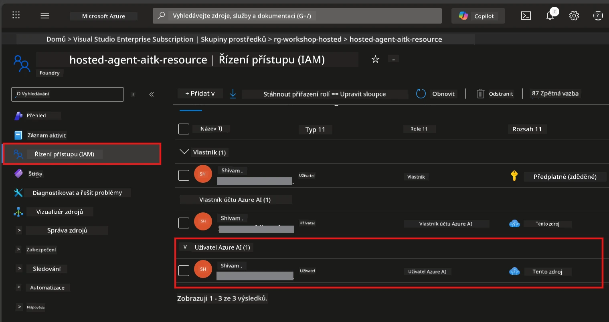

# Nastavení: Rozšíření, Projekt & Model

⏱️ ~15 min

V tomto modulu nainstalujete a ověříte rozšíření Foundry Toolkit, vytvoříte (nebo se připojíte k) Foundry projektu a nasadíte model, který váš agent bude používat.

## Krok 1: Instalace Foundry Toolkit

**Foundry Toolkit pro VS Code** je hlavní rozšíření pro tento workshop. Poskytuje tvorbu projektů, nasazení modelů, scaffolding agentů, lokální testování (Agent Inspector) a nasazení do cloudu – vše z prostředí VS Code.

1. Otevřete VS Code a stiskněte `Ctrl+Shift+X` pro otevření panelu **Extensions**.
2. Vyhledejte **Foundry Toolkit**.
3. Nainstalujte **Foundry Toolkit for VS Code** (Vydavatel: Microsoft, ID: `ms-windows-ai-studio.windows-ai-studio`).
4. Po instalaci se v Aktivitním pruhu (levý boční panel) objeví ikona **Foundry Toolkit**.

> *Poznámka: V starších verzích rozšíření se může v Aktivitním pruhu zobrazovat jako "AI TOOLKIT". Funkčnost je stejná.*



## Krok 2: Nastavení podle vašeho přístupu

> **Vyberte svou cestu:** Rozbalte níže uvedenou sekci, která odpovídá vašemu nastavení. Stačí dokončit pouze **jednu** cestu.

<details>
<summary><strong>🅰️ Cesta A - Azure cloud (vyžaduje předplatné Azure)</strong></summary>

### Azure CLI

1. Instalujte z [learn.microsoft.com/cli/azure/install-azure-cli](https://learn.microsoft.com/cli/azure/install-azure-cli).
2. Ověřte: `az --version` (očekávejte 2.80.0+).
3. Přihlaste se: `az login`

### Možnosti autentizace

[Microsoft Agent Framework](https://learn.microsoft.com/agent-framework/overview/) používá [`DefaultAzureCredential`](https://learn.microsoft.com/azure/developer/python/sdk/authentication/credential-chains#defaultazurecredential-overview), který vyzkouší několik autentizačních metod v pořadí. Vyberte tu, která odpovídá vašemu prostředí:

#### Možnost 1: Účty ve VS Code (doporučeno pro workshopy)
1. Klikněte na ikonu **Účty** (silhouette osoby) v levém dolním rohu VS Code.
2. Vyberte **Přihlásit se k použití Microsoft Foundry** (nebo **Přihlásit se přes Azure**).
3. Otevře se prohlížeč – přihlaste se pomocí Azure účtu s přístupem k vašemu předplatnému.
4. Vraťte se do VS Code. Měli byste vidět vaše jméno účtu v levém dolním rohu.

#### Možnost 2: Azure CLI
```bash
az login
az account set --subscription "<your-subscription-id>"
```

#### Možnost 3: Service Principal (Enterprise/CI)
Pro uzamčená prostředí nebo CI/CD pipeline nastavte tyto proměnné prostředí ve vašem `.env` souboru:
```env
AZURE_TENANT_ID=<your-tenant-id>
AZURE_CLIENT_ID=<your-client-id>
AZURE_CLIENT_SECRET=<your-client-secret>
```

> **Jak funguje `DefaultAzureCredential`:** Nejprve zkouší proměnné prostředí, pak řízenou identitu, poté přihlášení ve VS Code, následně Azure CLI – a použije první, která uspěje. Viz [dokumentace řetězce přihlašovacích údajů](https://learn.microsoft.com/azure/developer/python/sdk/authentication/credential-chains#defaultazurecredential-overview).

### Azure Developer CLI (azd)

1. Instalace: `winget install microsoft.azd` (Windows) nebo viz [dokumentace instalace](https://learn.microsoft.com/azure/developer/azure-developer-cli/install-azd).
2. Ověřte: `azd version`
3. Přihlaste se: `azd auth login`

### Docker Desktop (volitelně)

Docker je potřeba jen pokud chcete lokálně sestavovat kontejnery. Foundry rozšíření automaticky provádí sestavení během nasazení.

1. Instalujte z [docs.docker.com/get-docker](https://docs.docker.com/get-docker/).
2. Ověřte: `docker info`

### Předplatné Azure & RBAC

1. Přihlaste se na [portal.azure.com](https://portal.azure.com).
2. Přejděte do **Předplatná** a ověřte, že alespoň jedno je **Aktivní**.
3. Poznamenejte si své **ID předplatného** – budete ho potřebovat v Modulu 01.



#### Tabulka scénářů RBAC

Nasazení [Hosted Agenta](https://learn.microsoft.com/azure/foundry/agents/concepts/hosted-agents) vyžaduje oprávnění k *datovým akcím*, které standardní role `Owner` a `Contributor` v Azure **nezahrnují**. Použijte tabulku níže k určení nutných rolí:

| Scénář | Požadované role | Kde je přiřadit |
|--------|-----------------|------------------|
| Vytvoření nového Foundry projektu | **Azure AI Owner** na Foundry zdroji | Foundry zdroj v Azure Portálu |
| Nasazení do existujícího projektu (nové zdroje) | **Azure AI Owner** + **Contributor** na předplatném | Předplatné + Foundry zdroj |
| Nasazení do plně nakonfigurovaného projektu | **Reader** na účtu + **Azure AI User** na projektu | Účet + Projekt v Azure Portálu |
| Pouze lokální testování (bez nasazení) | **Azure AI User** na projektu | Projekt v Azure Portálu |

> **Důležité:** Role `Owner` a `Contributor` zahrnují pouze oprávnění pro *správu* (ARM operace). Pro *datové akce* jako `agents/write`, potřebné k vytvoření a nasazení agentů, potřebujete [**Azure AI User**](https://learn.microsoft.com/azure/foundry/concepts/rbac-foundry#built-in-roles) (nebo vyšší).

## Připojte se nebo vytvořte projekt Foundry



1. Stiskněte `Ctrl+Shift+P` → napište **Foundry Toolkit: Create Project** → vyberte tento příkaz.
2. Vyberte své **Azure předplatné** ze seznamu.
3. Vyberte nebo vytvořte **resource group** (např. `rg-hosted-agents-workshop`).
4. Vyberte **region**, který podporuje hosted agenty: `East US`, `West US 2` nebo `Sweden Central`. Viz [dostupnost regionů](https://learn.microsoft.com/azure/foundry/agents/concepts/hosted-agents#region-availability).
5. Zadejte název projektu (např. `workshop-agents`).
6. Počkejte 2–5 minut na provisioning. V VS Code se zobrazí progress notifikace.
7. Po dokončení se váš projekt objeví v postranním panelu **Foundry Toolkit** pod **MY RESOURCES**.



## Nasazení modelu & přiřazení RBAC

Váš hosted agent potřebuje AI model k vytváření odpovědí.

#### Matice výběru modelu
Podle vašich potřeb si můžete vybrat z různých úrovní modelů:

| Model | Nejvhodnější pro | Cena | Poznámky |
|-------|-----------------|-------|----------|
| `gpt-4.1` | Kvalitní a jemné odpovědi | Vyšší | Nejlepší výsledky, doporučeno pro finální testování |
| `gpt-4.1-mini/gpt-5-mini` | Rychlá iterace, nižší cena | Nižší | Dobré pro vývoj workshopu a rychlé testování |
| `gpt-4.1-nano` | Lehká zadání | Nejnižší | Nejvýhodnější, ale jednodušší odpovědi |

1. Stiskněte `Ctrl+Shift+P` → **Foundry Toolkit: Open Model Catalog** (nebo klikněte na **Model Catalog** v postranním panelu pod DEVELOPER TOOLS → Discover).
2. Vyhledejte **gpt-4.1** v katalogu.
3. Najděte **OpenAI GPT-4.1-mini** (nebo `gpt-5-mini` pro lepší kvalitu) a klikněte na **Deploy**.



4. V konfiguraci nasazení:
   - **Název nasazení:** Nechte výchozí nebo zadejte vlastní jméno. **Zapamatujte si toto jméno.**
   - **Cíl:** Vyberte **Deploy to Foundry Toolkit** → zvolte svůj projekt.
5. Klikněte na **Deploy** a počkejte 1–3 minuty.

> **Doporučení:** Pro workshop použijte `gpt-4.1-mini/gpt-5-mini` – rychlé, cenově dostupné a produkuje dobré výsledky.

### Poznamenejte si hodnoty

Po nasazení si poznamenejte tyto dvě hodnoty (budou potřeba v Modulu 03):

| Hodnota | Kde ji najít |
|---------|--------------|
| **Endpoint projektu** | Klikněte na projekt v postranním panelu → detailní zobrazení ukazuje URL (např. `https://<account>.services.ai.azure.com/api/projects/<project>`) |
| **Název nasazení modelu** | Rozbalte projekt → **Models** → jméno vedle nasazeného modelu (např. `gpt-4.1-mini/gpt-5-mini`) |

### Přiřaďte RBAC roli

> ⚠️ **Toto je nejčastěji opomíjený krok.** Bez správné role selže nasazení v Modulu 05.

#### Jakou roli potřebuji?
Podle vašeho scénáře potřebujete následující kombinace rolí:

| Scénář | Požadované role | Kde je přiřadit |
|--------|-----------------|------------------|
| Vytvoření nového Foundry projektu | **Azure AI Owner** na Foundry zdroji | Foundry zdroj v Azure Portálu |
| Nasazení do existujícího projektu (nové zdroje) | **Azure AI Owner** + **Contributor** na předplatném | Předplatné + Foundry zdroj |
| Nasazení do plně nakonfigurovaného projektu | **Reader** na účtu + **Azure AI User** na projektu | Účet + Projekt v Azure Portálu |

**Důležité:** Role `Owner` a `Contributor` pokrývají pouze oprávnění pro *správu*. Pro *datové akce* jako `agents/write`, potřebné pro vytvoření a nasazení agentů, potřebujete **Azure AI User** (nebo vyšší).

1. Otevřete [portal.azure.com](https://portal.azure.com).
2. Vyhledejte název svého **Foundry projektu** → klikněte na výsledek typu **"Foundry Toolkit project"** (NE rodičovský účet).
3. Vlevo v navigaci klikněte na **Řízení přístupu (IAM)**.
4. Klikněte na **+ Přidat** → **Přidat přiřazení role**.
5. **Záložka Role:** Vyhledejte **Azure AI User**, vyberte jej a klikněte na **Další**.
6. **Záložka Členové:** Vyberte **Uživatel, skupina nebo služební hlavní účet** → klikněte na **+ Vybrat členy** → najděte a vyberte sebe → klikněte na **Vybrat**.
7. Klikněte na **Kontrola + přiřazení** → znovu **Kontrola + přiřazení**.
8. **Počkejte 1–2 minuty** na propagaci změn.

> **Proč tato role?** Role `Owner` a `Contributor` zajišťují pouze oprávnění správy. Role **Azure AI User** uděluje datovou akci `agents/write`, potřebnou k vytvoření a nasazení agentů. Viz [dokumentace Foundry RBAC](https://learn.microsoft.com/azure/foundry/concepts/rbac-foundry#built-in-roles).



</details>

<details>
<summary><strong>🅱️ Cesta B - Lokálně / bezplatná vrstva (není potřeba předplatné Azure)</strong></summary>

### Foundry Local

Foundry Local vám umožňuje spouštět AI modely na vlastním počítači – nemusíte mít účet v cloudu. K Foundry Local modelům se můžete přistupovat pomocí Foundry Toolkit přes katalog modelů takto:

1. Přejděte do rozšíření Foundry Toolkit.
2. V navigaci Foundry Toolkit jděte do **Developer Tools** > a vyberte **Model Catalog**
3. V novém okně vyberte z navigačního panelu **local**.
4. Sjeďte dolů k **Phi 4 Mini,** a klikněte na **tlačítko přidat**, objeví se vyskakovací okno indikující stahování modelu.
5. Jakmile je model stažen, můžete pokračovat k dalšímu kroku.

</details>

### ✅ Kontrolní bod


- [ ] `Ctrl+Shift+P` → "Foundry Toolkit" zobrazuje dostupné příkazy
- [ ] Rozšíření Foundry Toolkit je nainstalováno a postranní panel se načítá bez chyb
- [ ] VS Code se otevírá a funguje správně
- [ ] `python --version` ukazuje 3.10+
- [ ] Ikona Foundry Toolkit je viditelná v Aktivitním pruhu VS Code
- [ ] **Cesta A:** `az login` proběhne úspěšně, předplatné je Aktivní
- [ ] **Cesta B:** Foundry Local běží (`foundry local status`)
- [ ] **Cesta A:** Projekt Foundry je vidět v postranním panelu, model je nasazen, role Azure AI User je přiřazena
- [ ] **Cesta B:** Foundry Local běží s modelem
- [ ] Poznamenali jste si **endpoint** a **název nasazení modelu**


**Předchozí:** [00 - Předpoklady](00-prerequisites.md) · **Další:** [02 - Vytvoření Hosted Agenta →](02-create-hosted-agent.md)

---

<!-- CO-OP TRANSLATOR DISCLAIMER START -->
**Prohlášení o omezení odpovědnosti**:
Tento dokument byl přeložen pomocí AI překladatelské služby [Co-op Translator](https://github.com/Azure/co-op-translator). Přestože usilujeme o co největší přesnost, mějte prosím na paměti, že automatizované překlady mohou obsahovat chyby nebo nepřesnosti. Originální dokument v jeho mateřském jazyce by měl být považován za autoritativní zdroj. Pro kritické informace se doporučuje profesionální lidský překlad. Nejsme odpovědní za jakékoli nedorozumění nebo nesprávné interpretace vzniklé použitím tohoto překladu.
<!-- CO-OP TRANSLATOR DISCLAIMER END -->